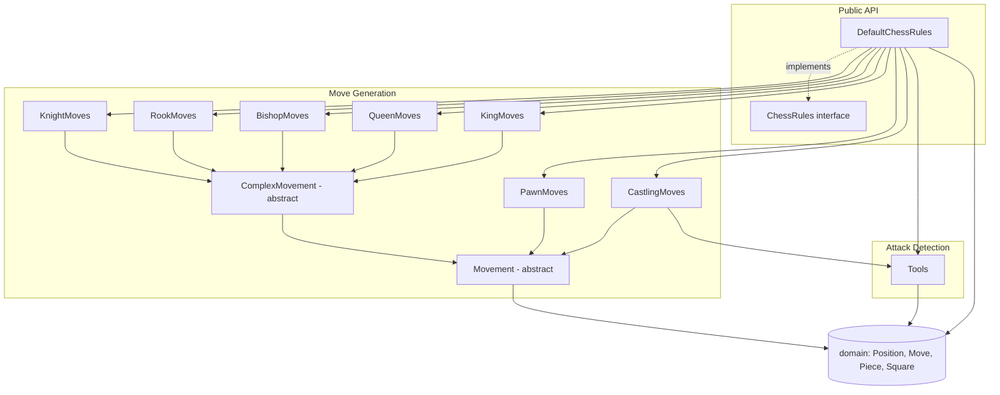
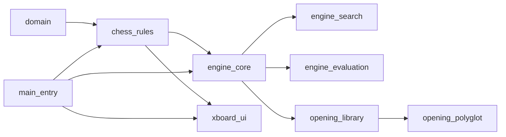
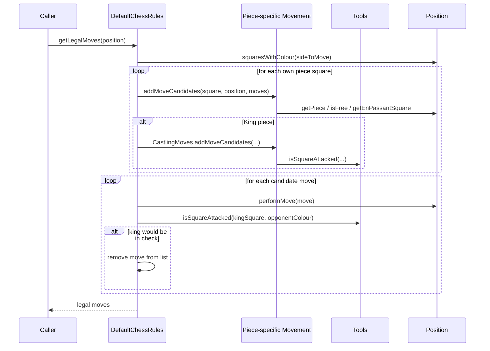

# Chess Rules Module

## Introduction and Purpose

The `chess_rules` module is the **rules engine** of the DokChess system. It is
responsible for answering the fundamental question that every chess-playing
program must be able to answer: *"Given a position, what may legally happen
next?"*

Concretely, this module:

- Generates all **pseudo-legal and legal moves** for every piece type
  (pawn, knight, bishop, rook, queen, king) as well as special moves such as
  **castling**.
- Determines whether a side is currently **in check**, **checkmated**, or
  **stalemated**.
- Provides the canonical **starting position** of a chess game.
- Detects whether a given square is **attacked** by a given colour — the
  core primitive used both for check detection and for validating castling.

The module operates purely on the immutable data types defined in the
[`domain`](domain.md) module (`Position`, `Move`, `Piece`, `Square`, ...). It
has **no knowledge of search, evaluation, or opening books** — it simply
enforces the rules of chess. Higher layers such as the
[`engine_search`](engine_search_minimax_algorithm.md) (via
[`engine_core`](engine_core.md)) depend on `chess_rules` to know which moves
are legal at each node of the search tree, and the
[`xboard_ui`](xboard_ui.md) depends on it to validate moves and detect game
termination (checkmate/stalemate).

## Architecture Overview

The module is organized around a single public entry point, the
`ChessRules` interface, implemented by `DefaultChessRules`. Internally, move
generation is delegated to a family of per-piece-type classes that all share
a common `Movement` abstraction, while attack detection is centralized in a
single utility class (`Tools`) that is reused both by check detection and by
castling legality checks.

### Where `chess_rules` fits in the overall system

See [`domain`](domain.md) for the underlying board/piece/move data model,
[`engine_core`](engine_core.md) for how the engine uses `ChessRules` to drive
move search, and [`xboard_ui`](xboard_ui.md) for how the rules are used to
validate user/opponent moves in the XBoard protocol adapter.

## Sub-modules

The module is split into three cohesive areas, each documented in detail in
its own file:

1. **[Movement Generation](chess_rules_movement_generation.md)** —
   The `Movement`/`ComplexMovement` class hierarchy and the concrete
   per-piece move generators (`KnightMoves`, `RookMoves`, `BishopMoves`,
   `QueenMoves`, `KingMoves`, `PawnMoves`, `CastlingMoves`). These classes
   produce *move candidates* — moves that are legal in terms of piece
   movement patterns and board occupancy, but not yet filtered for leaving
   one's own king in check.

2. **[Attack Detection](chess_rules_attack_detection.md)** —
   The `Tools` utility class, which determines whether a given square is
   attacked by a given colour. This is the shared primitive used for check
   detection (`isCheck`) and for validating that the king does not move
   through or land on an attacked square during castling.

3. **[Rules Engine Facade](chess_rules_engine.md)** —
   The `ChessRules` interface and its `DefaultChessRules` implementation,
   which orchestrate move generation and attack detection to produce the
   final list of **legal** moves, and to answer `isCheck`, `isCheckmate`,
   `isStalemate`, and `getStartingPosition`.

## High-Level Move Generation Flow

The following sequence illustrates how `DefaultChessRules.getLegalMoves`
combines move-candidate generation with legality filtering (removing moves
that would leave the mover's own king in check):

## Summary

| Concern | Component(s) | Documentation |
|---|---|---|
| Public rules API | `ChessRules`, `DefaultChessRules` | [chess_rules_engine.md](chess_rules_engine.md) |
| Per-piece move candidate generation | `Movement`, `ComplexMovement`, `KnightMoves`, `RookMoves`, `BishopMoves`, `QueenMoves`, `KingMoves`, `PawnMoves`, `CastlingMoves` | [chess_rules_movement_generation.md](chess_rules_movement_generation.md) |
| Square-attacked / check detection | `Tools` | [chess_rules_attack_detection.md](chess_rules_attack_detection.md) |
| Underlying data model | `Position`, `Move`, `Piece`, `Square`, ... | [domain.md](domain.md) |
| Consumer: search/engine | `DefaultEngine`, `MinimaxAlgorithm`, ... | [engine_core.md](engine_core.md) |
| Consumer: UI | `XBoard`, `MoveParser` | [xboard_ui.md](xboard_ui.md) |
