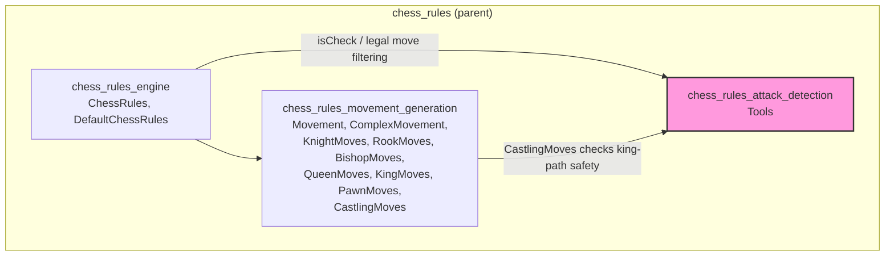
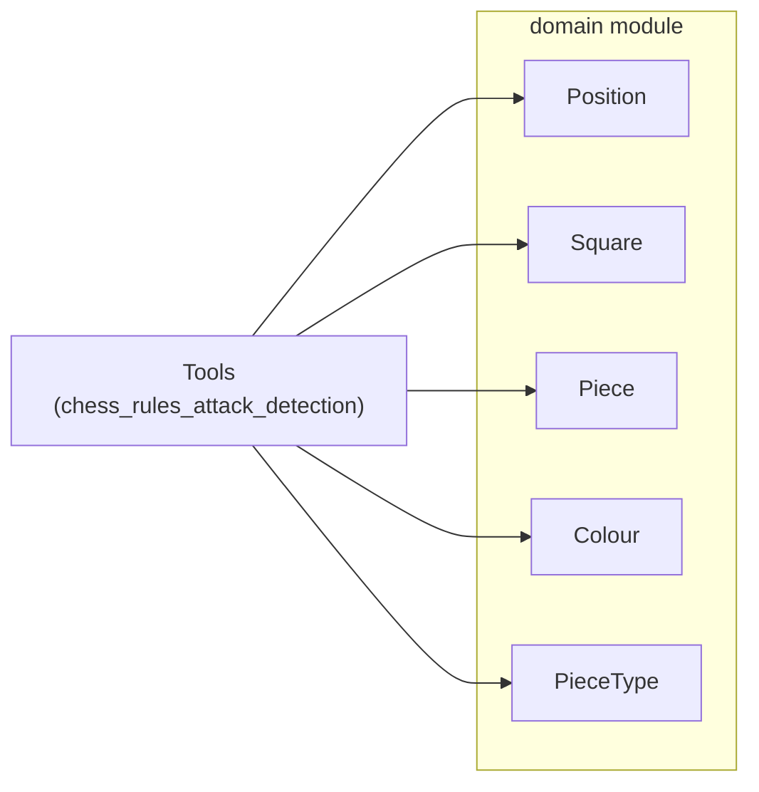
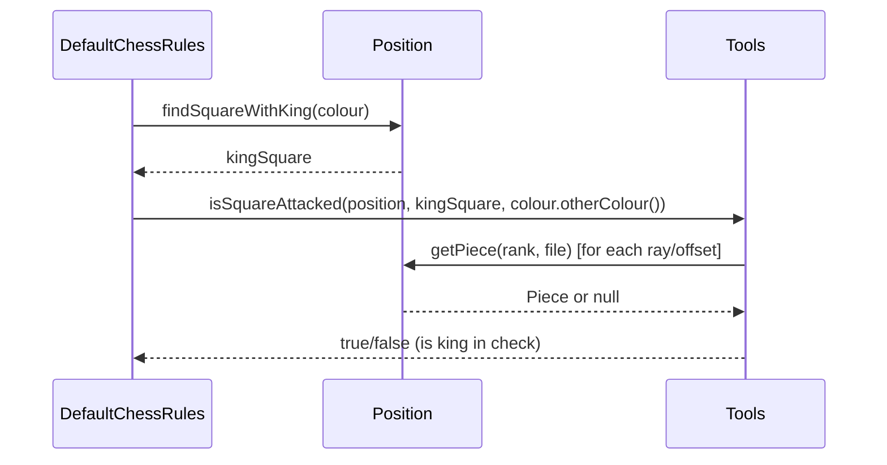
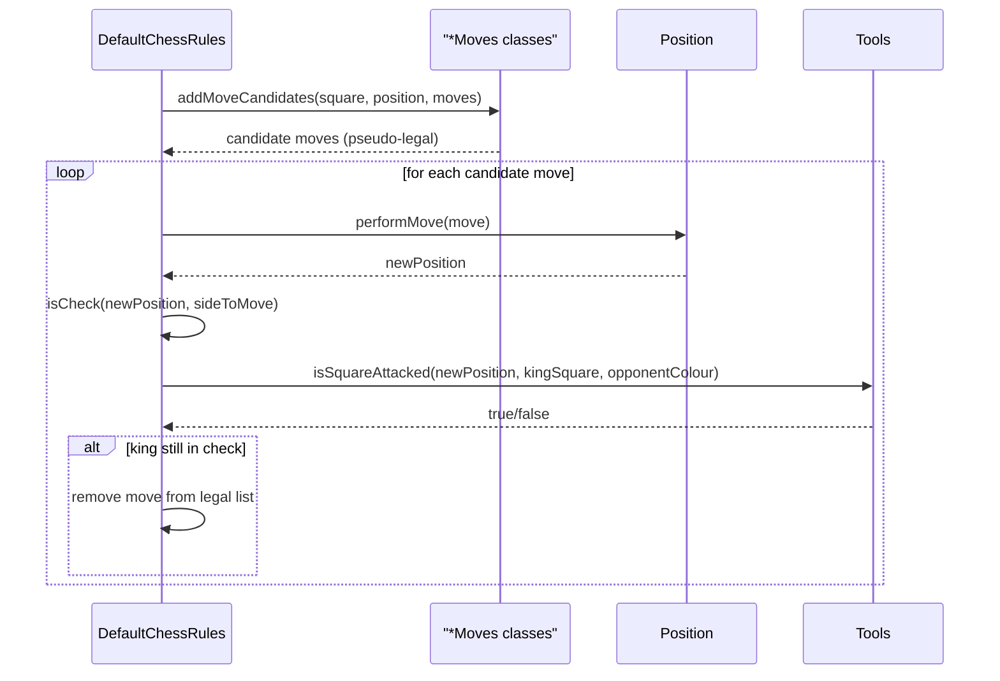
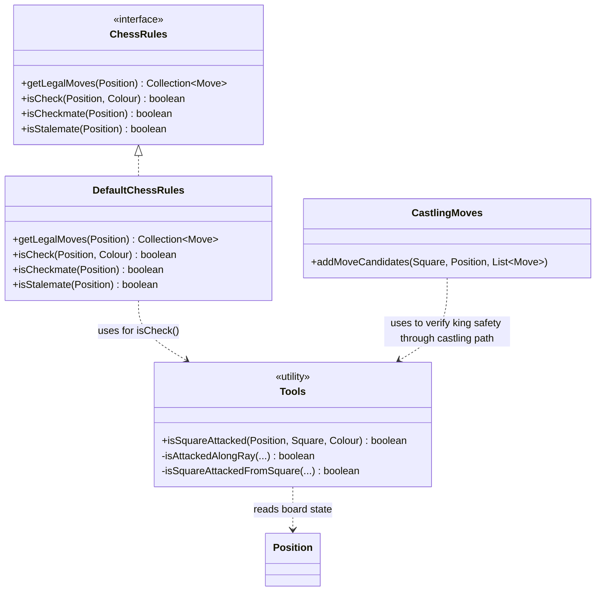

# Chess Rules — Attack Detection

## Introduction

The **chess_rules_attack_detection** module is a small but critical subsystem within the [chess_rules](chess_rules_movement_generation.md) family of modules in DokChess. It provides the fundamental **"is this square attacked?"** capability that is used to implement check detection, checkmate detection, and legal-move filtering (a king cannot be left in check after a move).

The module consists of a single package-private utility class, `Tools`, which exposes one static entry point:

```java
Tools.isSquareAttacked(Position position, Square square, Colour colour)
```

This method answers the question: *"Is the given `square` attacked by any piece of the given `colour` in the given `position`?"*

Because attack detection is a pure, stateless computation over the board representation, this module has no internal state and depends only on the [domain](domain.md) module's board model (`Position`, `Square`, `Piece`, `Colour`, `PieceType`).

---

## Purpose and Core Functionality

Attack detection is the low-level primitive that answers "can piece of colour X reach square Y" — the same question chess engines ask to determine:

- **Check**: Is the king's square attacked by the opponent?
- **Checkmate/Stalemate**: (indirectly) via check detection combined with legal move enumeration.
- **Legal move filtering**: After a candidate move is applied, is the moving side's own king now in check? If so, the move is illegal and must be discarded.
- **Castling legality**: Squares the king passes through (and starts/ends on) must not be attacked (used by `CastlingMoves` in [chess_rules_movement_generation](chess_rules_movement_generation.md)).

The `Tools` class implements this by checking, for each piece type, whether a piece of that type and the given colour could reach the target square:

1. **Sliding attacks (Bishop/Queen diagonal, Rook/Queen straight)** — cast rays in all 8 directions along diagonals and files/ranks; if the first piece encountered along a ray belongs to the attacking colour and is of the correct type (Queen+Bishop for diagonals, Queen+Rook for lines), the square is attacked.
2. **Knight attacks** — check all 8 L-shaped knight offsets for a knight of the given colour.
3. **Pawn attacks** — check the two diagonal squares behind the target square (relative to the *attacking* colour's pawn-capture direction) for a pawn of the given colour.
4. **King attacks** — check all 8 adjacent squares for a king of the given colour.

If any of these checks succeed, the square is considered attacked.

---

## Architecture

### Position within `chess_rules`

`chess_rules_attack_detection` is one of three sibling sub-modules under the parent `chess_rules` module:



See [chess_rules_engine.md](chess_rules_engine.md) for the `ChessRules` interface and `DefaultChessRules` implementation, and [chess_rules_movement_generation.md](chess_rules_movement_generation.md) for move-candidate generation (including `CastlingMoves`, which is the other consumer of attack detection).

### Dependency on the `domain` module

`Tools` operates purely on immutable domain objects and has no dependency on any other rules or engine module:



For details on these domain types, see [domain.md](domain.md).

---

## Component Details

### `Tools` (package-private utility class)

`Tools` is a final, non-instantiable class (private constructor) exposing a single public static method. It is intentionally package-private (no `public` modifier on the class) so that it is only usable within the `org.dokchess.rules` package — i.e., by `DefaultChessRules` and the various `*Moves` classes in movement generation.

| Member | Visibility | Description |
|---|---|---|
| `isSquareAttacked(Position, Square, Colour)` | `public static` | Main entry point. Returns `true` if any piece of `colour` attacks `square`. |
| `isAttackedAlongRay(...)` | `private static` | Walks a ray (dFile, dRank) from the square outward until it hits a piece or leaves the board; returns true if the first piece hit matches colour and is in the allowed `PieceType` set. |
| `isSquareAttackedFromSquare(...)` | `private static` | Checks a single fixed offset square for a piece of the given colour and type (used for knight, pawn, and king attacks, which are not sliding attacks). |

#### Attack categories checked, in order:

1. **Diagonal sliding** (Bishop/Queen) — 4 diagonal rays: `(1,1)`, `(-1,-1)`, `(1,-1)`, `(-1,1)`
2. **Straight sliding** (Rook/Queen) — 4 orthogonal rays: `(1,0)`, `(0,1)`, `(-1,0)`, `(0,-1)`
3. **Knight** — 8 fixed L-shaped offsets
4. **Pawn** — 2 diagonal offsets, direction determined by attacking `colour` (white pawns attack "upward" `+1` rank, black pawns attack "downward" `-1` rank, from the perspective of the target square)
5. **King** — 8 adjacent offsets

The method returns as soon as *any* attack is found (short-circuit `||` evaluation), making it efficient for the common case of an unattacked square requiring full evaluation, and very fast for heavily attacked squares.

#### Ray-Walking Algorithm (`isAttackedAlongRay`)

Starting at the target square, the algorithm repeatedly steps by `(dFile, dRank)` until it either:
- Falls off the board (`file`/`rank` out of `[0, 8)`), or
- Encounters an occupied square — at which point it stops and checks whether that piece is of the attacking `colour` **and** its type is in the allowed set (`{QUEEN, BISHOP}` for diagonals, `{QUEEN, ROOK}` for lines).

This correctly models the fact that sliding pieces are blocked by the *first* piece in their path, regardless of colour.

#### Fixed-Offset Algorithm (`isSquareAttackedFromSquare`)

Used for non-sliding attackers (knight, pawn, king), this simply checks a single square at `(square.file + dFile, square.rank + dRank)` for a piece of the exact given colour and type.

---

## Data Flow

The typical call flow for check detection is:



And for legal-move filtering (used in `getLegalMoves`):



---

## Component Interaction Diagram



---

## Usage in the Wider System

- **[chess_rules_engine](chess_rules_engine.md)**: `DefaultChessRules.isCheck(...)` delegates directly to `Tools.isSquareAttacked(...)`, locating the king's square via `Position.findSquareWithKing(colour)` and checking whether it is attacked by the opposing colour. This underpins `isCheckmate`, `isStalemate`, and the legal-move-filtering step in `getLegalMoves`.
- **[chess_rules_movement_generation](chess_rules_movement_generation.md)**: `CastlingMoves` uses the same attack-detection logic to ensure the king does not move through or land on an attacked square, which is a core legality requirement for castling.
- **[engine_search](engine_search.md)** and **[engine_core](engine_core.md)**: Indirectly rely on attack detection through `ChessRules.getLegalMoves` and `isCheck`/`isCheckmate`/`isStalemate`, which are used throughout the minimax search tree traversal and terminal-position evaluation.

---

## Design Notes

- **Statelessness & Immutability**: `Tools` holds no state; every call is a pure function of `(position, square, colour)`. This makes it trivially thread-safe, which is important since [engine_search_parallel_search](engine_search.md) performs concurrent searches across multiple threads.
- **Package-Private Encapsulation**: The class and its method are only visible within `org.dokchess.rules`, enforcing that attack detection is an internal implementation detail of the rules engine, not a public API. External modules interact with check/checkmate/stalemate only through the `ChessRules` interface.
- **No Move Object Required**: Unlike move generation (which produces `Move` objects), attack detection only needs to answer a boolean question about board geometry, so it works directly against the `Position`'s board array without constructing any `Move` instances — making it efficient for the frequent checks performed during legal move filtering (once per candidate move, per ply, across the entire search tree).
