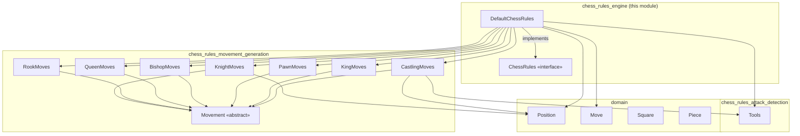
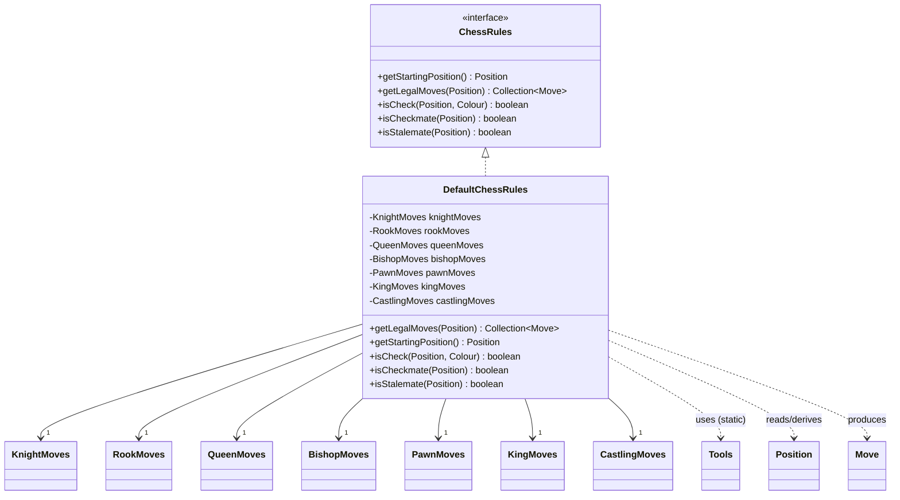
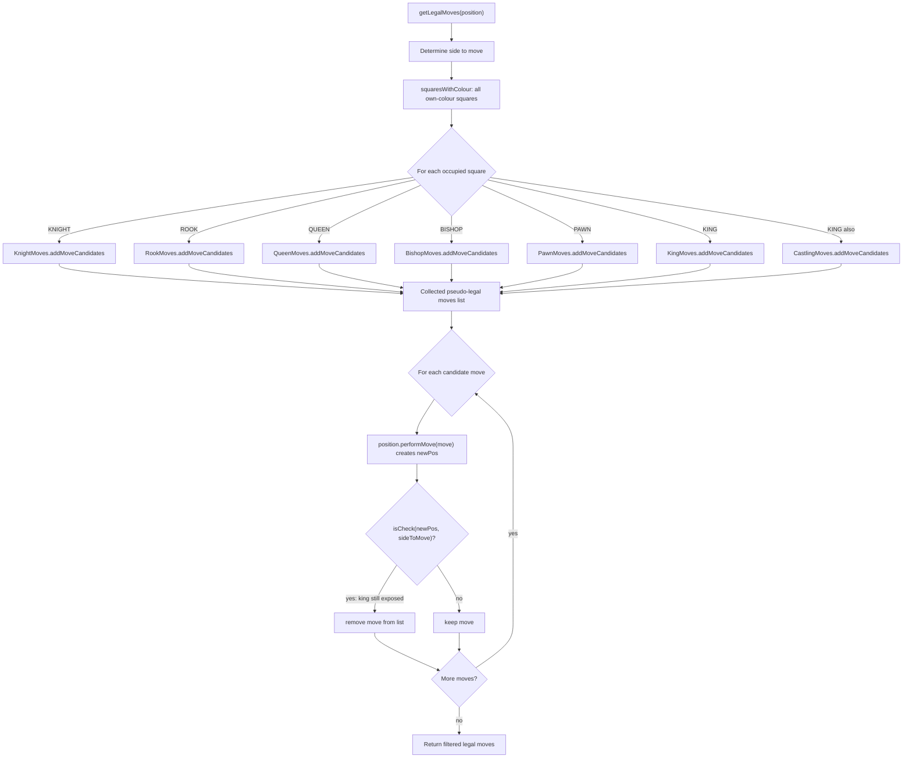
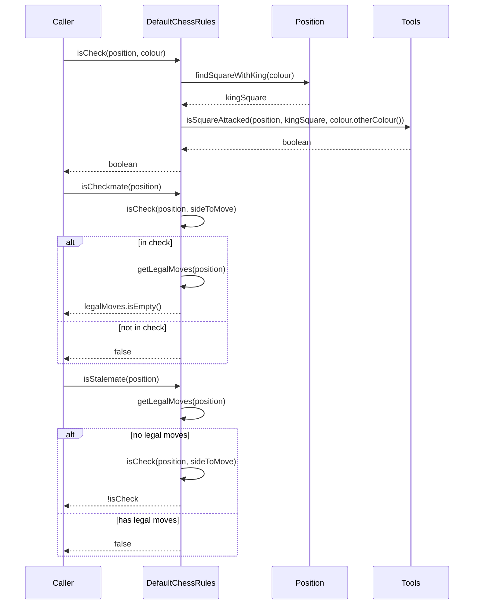
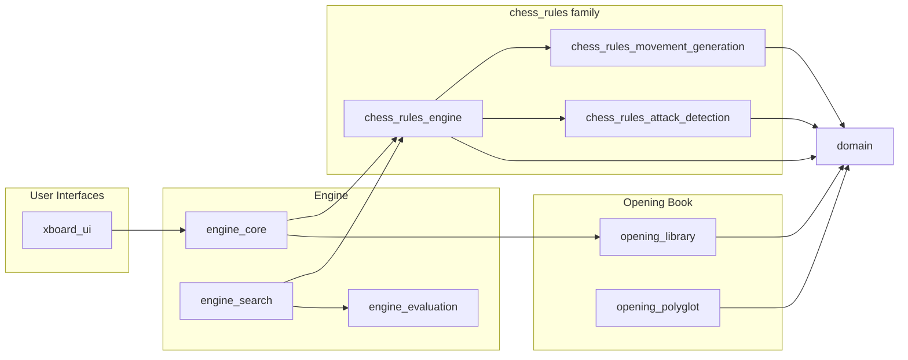

# Chess Rules Engine

## Introduction

The **chess_rules_engine** module is the authoritative rules facade of the DokChess system. It exposes the public
`ChessRules` contract — legal‑move generation, check/checkmate/stalemate detection, and the initial board setup — and
provides its default implementation, `DefaultChessRules`. Every other part of the system that needs to know "what
moves are allowed" or "is the game over" talks to this module rather than to the lower‑level move‑generation or
attack‑detection logic directly.

This module sits at the top of the `chess_rules` component family. It **orchestrates** but does not itself implement
the piece‑specific move generation (delegated to [chess_rules_movement_generation](chess_rules_movement_generation.md))
or the low‑level square‑attack detection (delegated to [chess_rules_attack_detection](chess_rules_attack_detection.md)).
It operates on the immutable board model defined in [domain](domain.md), and it is the single dependency that the
search/evaluation engine ([engine_core](engine_core.md), [engine_search](engine_search.md)) and the text UI
([xboard_ui](xboard_ui.md)) rely on to know what is legal.

---

## 1. Purpose and Core Functionality

`ChessRules` defines the minimal set of operations any chess‑rules implementation must support:

| Method | Responsibility |
|---|---|
| `getStartingPosition()` | Returns the standard initial `Position` (FEN `rnbqkbnr/pppppppp/8/8/8/8/PPPPPPPP/RNBQKBNR w KQkq - 0 1`). |
| `getLegalMoves(Position)` | Returns every fully legal move for the side to move (pseudo‑legal candidates minus moves that leave the mover's own king in check). |
| `isCheck(Position, Colour)` | Determines whether the king of the given colour is currently attacked. |
| `isCheckmate(Position)` | True if the side to move is in check **and** has no legal moves. |
| `isStalemate(Position)` | True if the side to move is **not** in check but has no legal moves. |

`DefaultChessRules` is the reference implementation shipped with DokChess. It is a thin coordinator: it owns one
instance of each piece‑movement generator (`KnightMoves`, `RookMoves`, `QueenMoves`, `BishopMoves`, `PawnMoves`,
`KingMoves`, `CastlingMoves` — all from `chess_rules_movement_generation`) and uses the static helper `Tools`
(`chess_rules_attack_detection`) to answer "is this square attacked?" queries used for check detection and for
filtering illegal (self‑check) moves.

---

## 2. Architecture

### 2.1 Component Diagram

See [chess_rules_movement_generation.md](chess_rules_movement_generation.md) for details on how each piece type
generates its pseudo‑legal candidate moves, and [chess_rules_attack_detection.md](chess_rules_attack_detection.md)
for the ray/knight/pawn/king attack‑scanning algorithm implemented by `Tools`. The `Position`, `Move`, `Square` and
`Piece` value types consumed here are documented in [domain.md](domain.md).

### 2.2 Class Diagram

---

## 3. Data Flow: Legal Move Generation

`getLegalMoves` follows a **generate‑then‑filter** strategy: it first collects *pseudo‑legal* moves (moves that are
geometrically valid for each piece, ignoring whether they expose the mover's own king), then removes any move that
would leave that king in check.

Key points:

* **Candidate generation** is delegated entirely to the `Movement` subclasses; `DefaultChessRules` never inspects
  board geometry itself beyond dispatching by `PieceType`.
* **Self‑check filtering** relies on `Position.performMove` (an immutable, copy‑on‑write operation — see
  [domain.md](domain.md)) to simulate the move, and on `isCheck`, which in turn calls
  `Tools.isSquareAttacked` from `chess_rules_attack_detection`.
* Castling legality already accounts for "king passes through/ends on an attacked square" inside `CastlingMoves`
  itself (it calls `Tools.isSquareAttacked` before ever proposing the move), so the generic post‑filter is what
  additionally guarantees no move ever leaves the king in check after a normal move as well.

---

## 4. Check / Checkmate / Stalemate Detection

`isCheck` is the atomic primitive: it locates the king (`Position.findSquareWithKing`) and asks the attack‑detection
module whether that square is attacked by the opposing colour. `isCheckmate` and `isStalemate` are both expressed in
terms of `isCheck` plus `getLegalMoves`, making `DefaultChessRules` internally self‑consistent — there is exactly one
source of truth for "what counts as a legal position."

---

## 5. Domain Types Used

The engine operates purely on the immutable value objects defined in [domain.md](domain.md):

* **`Position`** — full board snapshot: piece placement, side to move, castling rights, en‑passant square.
  `performMove` returns a *new* `Position` (copy‑on‑write per affected rank), which is what allows the
  filtering step in `getLegalMoves` to safely "try" a move without mutating the original position.
* **`Move`** — describes a from/to square pair plus flags for capture, promotion, castling, and two‑square pawn
  advance. `DefaultChessRules` and the `Movement` subclasses are the primary producers of `Move` instances; the
  flags (`isCastling()`, `isPawnAdvancesTwo()`, etc.) are consumed by `Position.performMove` to correctly update
  castling rights and the en‑passant square.
* **`Colour`, `Square`, `Piece`, `PieceType`** — supporting enums/value types used throughout move generation and
  attack detection.

---

## 6. Position in the Overall System

### Key consumers

* **[engine_core](engine_core.md)** (`DefaultEngine`) is constructed with a `ChessRules` instance and passes it down
  into `MinimaxParallelSearch` (see [engine_search](engine_search.md)), which calls `getLegalMoves` and
  `isCheck`/`isStalemate`‑equivalent logic at every node of the search tree to enumerate moves and detect terminal
  positions.
* **[engine_search](engine_search.md)**'s `MinimaxAlgorithm` and `MinimaxParallelSearch` call `chessRules
  .getLegalMoves(position)` recursively while walking the game tree, and use the emptiness of that collection
  combined with `isCheck` to recognize checkmate/stalemate leaves and score them via
  [engine_evaluation](engine_evaluation.md).
* **[xboard_ui](xboard_ui.md)** and the integration tests (`EngineVsRandomIntegTest`, `XBoardIntegTest`) rely
  indirectly on `ChessRules` (through `Engine`) to validate that moves proposed/received over the protocol are legal.

Because `ChessRules` is expressed as an interface, alternative implementations (e.g. a faster bitboard‑based engine)
could be substituted without changing any consumer code — `DefaultChessRules` is simply the reference
implementation used throughout the current codebase.

---

## 7. Design Notes

* **Separation of concerns**: `DefaultChessRules` intentionally contains **no** board‑geometry logic. All piece
  movement rules live in `chess_rules_movement_generation`, and all attack‑scanning logic lives in
  `chess_rules_attack_detection`. This module's only "logic" is the generate‑then‑filter loop and the
  check/checkmate/stalemate composition rules.
* **Immutability‑driven correctness**: Because `Position.performMove` never mutates its receiver, the
  self‑check filter in `getLegalMoves` can safely simulate every candidate move in isolation, which keeps the
  algorithm simple and free of undo/rollback logic.
* **Package‑private collaborators**: `KnightMoves`, `RookMoves`, `QueenMoves`, `BishopMoves`, `PawnMoves`,
  `KingMoves`, `CastlingMoves`, and `Tools` are all package‑private to `org.dokchess.rules`. `ChessRules` is the only
  public export of the entire `chess_rules` package hierarchy (together with `DefaultChessRules`), enforcing a
  narrow, stable public API for the rest of the system.
