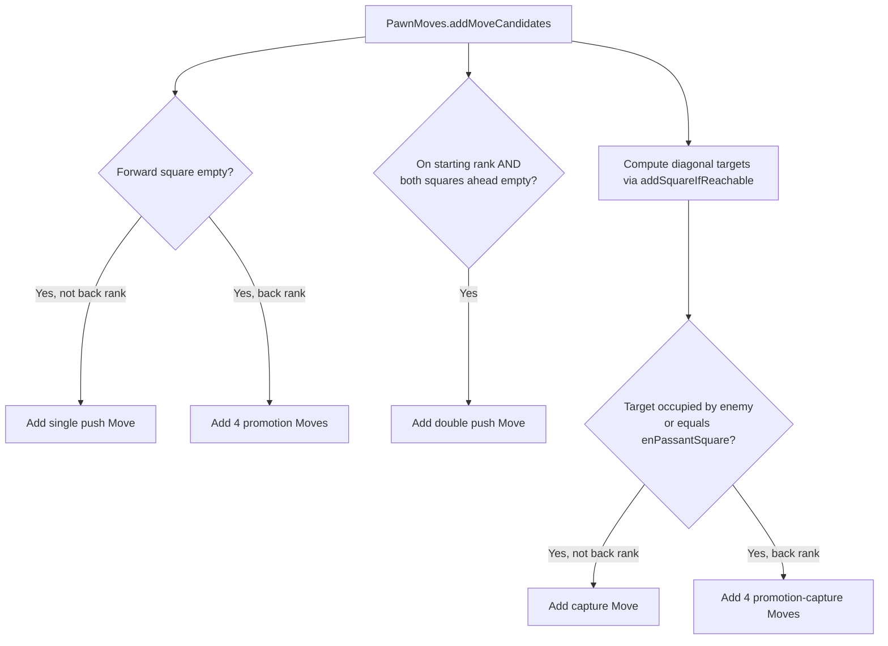
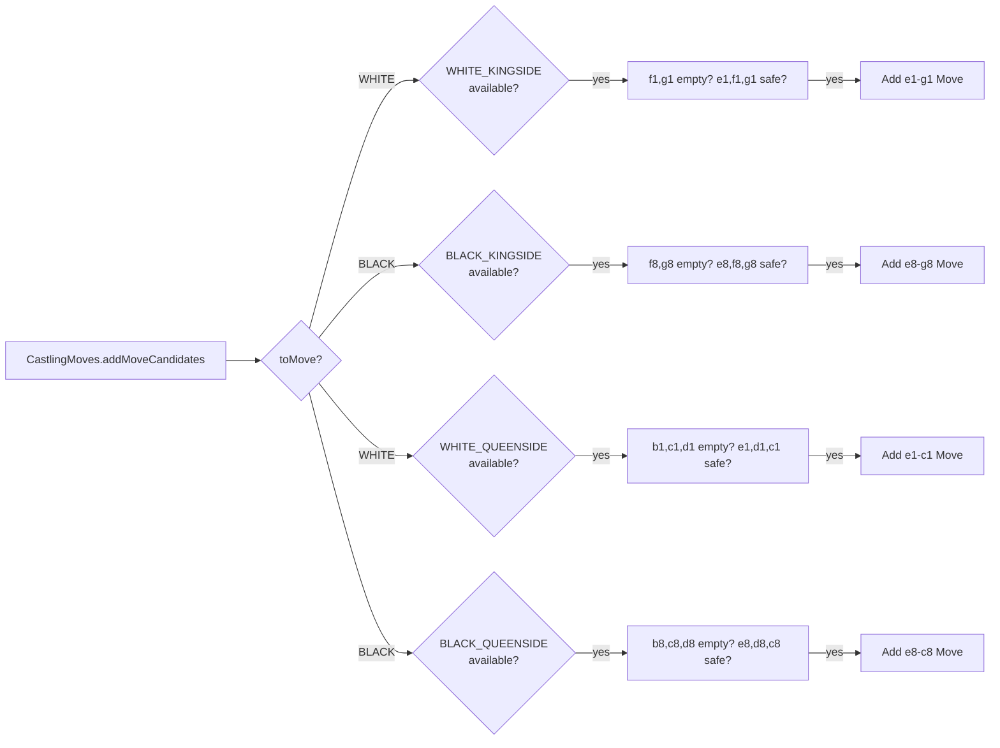
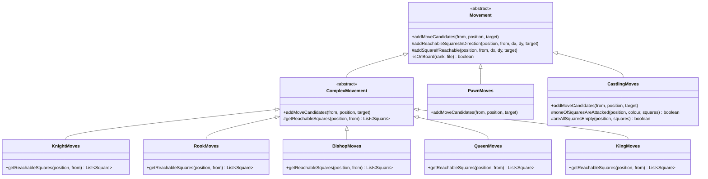
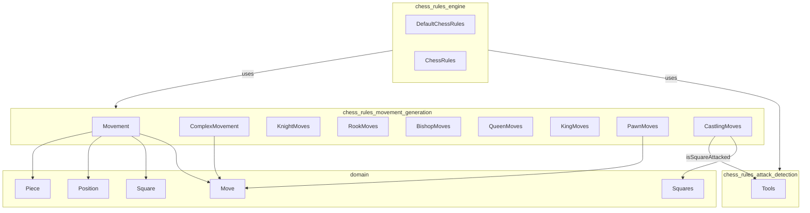
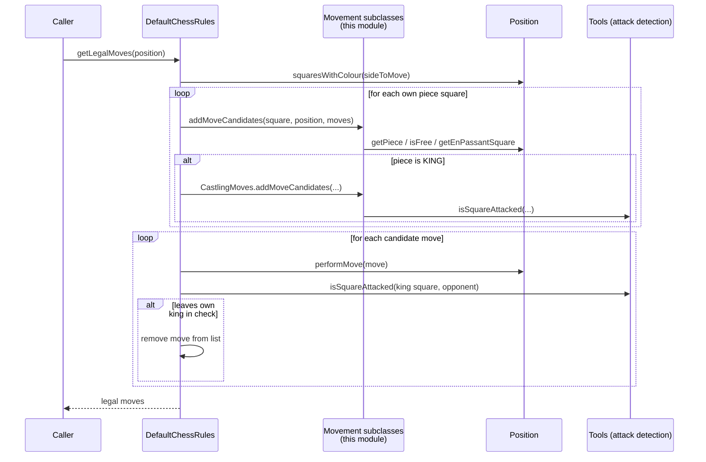

# Chess Rules — Movement Generation

## Introduction

The **Movement Generation** module is the geometric heart of the DokChess rules engine. It answers a single, focused question for every piece type: *"Given a piece on a particular square, which squares can it physically move to, ignoring check considerations?"*

This module implements the per-piece-type movement algorithms (knight, rook, bishop, queen, king, pawn) plus the special case of castling. It deliberately does **not** concern itself with whether a resulting position leaves the mover's own king in check — that responsibility, along with the overall concept of "legality," belongs to the parent [chess_rules](chess_rules_engine.md) module. This separation keeps the geometry logic simple, reusable, and easy to test in isolation.

The module is a child of the broader `chess_rules` package and works hand-in-hand with its sibling child module [chess_rules_attack_detection](chess_rules_attack_detection.md), which supplies square-attack queries used by castling legality checks.

---

## Purpose & Scope

| In Scope | Out of Scope |
|---|---|
| Enumerating geometrically possible destination squares/moves per piece type | Filtering out moves that leave the mover in check |
| Respecting board boundaries | Detecting checkmate/stalemate |
| Respecting blocking pieces and captures of enemy pieces | Position/FEN parsing (see [domain](domain.md)) |
| Handling pawn double-step, en passant, and promotion | Search/evaluation of moves (see [engine_search](engine_search_parallel_search.md), [engine_evaluation](engine_evaluation.md)) |
| Handling castling square-emptiness and attacked-square rules | Overall public API for "legal moves" (that's `ChessRules`/`DefaultChessRules`) |

All classes in this module are non-public (package-private) except `ComplexMovement`, which is `public abstract` to allow it to be referenced from outside the package if needed, though in practice it is only used internally by `chess_rules`.

---

## Core Components

### `Movement` (abstract base class)

The root of the movement generation class hierarchy. It defines the contract:

```java
abstract void addMoveCandidates(Square from, Position position, List<Move> target);
```

and provides two protected helper methods used by piece-specific subclasses:

- **`addReachableSquaresInDirection(position, from, dx, dy, target)`** — walks a ray (direction vector) from a square, adding empty squares to `target` and stopping at the first occupied square (adding it only if it holds an enemy piece — a capture). Used by sliding pieces: rook, bishop, queen.
- **`addSquareIfReachable(position, from, dx, dy, target)`** — checks a single offset square; adds it if empty or if it holds an enemy piece. Used by non-sliding pieces: knight, king, and pawn captures.
- **`isOnBoard(rank, file)`** — private bounds check (0–7 for both rank and file).

### `ComplexMovement` (abstract, extends `Movement`)

An adapter that lets simple "which squares are reachable" logic be reused to build actual `Move` objects. Subclasses only need to implement:

```java
protected abstract List<Square> getReachableSquares(Position position, Square from);
```

`ComplexMovement.addMoveCandidates` then wraps each reachable square into a `Move`, automatically detecting whether it's a capture via `!position.isFree(to)`.

This class is used by every piece type **except** pawns and castling, because those two have move semantics (promotion, en passant, double-step, rook side-effects) that don't fit the simple "reachable squares" model.

### Piece-specific movement classes (all extend `ComplexMovement`)

| Class | Directions/Offsets | Notes |
|---|---|---|
| `KnightMoves` | 8 L-shaped offsets: (±2,±1), (±1,±2) | Non-sliding — uses `addSquareIfReachable` |
| `RookMoves` | 4 orthogonal rays: (0,±1), (±1,0) | Sliding — uses `addReachableSquaresInDirection` |
| `BishopMoves` | 4 diagonal rays: (±1,±1) | Sliding |
| `QueenMoves` | All 8 rays (rook + bishop combined) | Sliding |
| `KingMoves` | 8 adjacent squares (orthogonal + diagonal) | Non-sliding — one square only |

Each of these classes is extremely small because all the real logic lives in `Movement`'s two helper methods — the subclasses simply declare *which* direction vectors or offsets apply to that piece.

### `PawnMoves` (extends `Movement` directly)

Pawns are the most irregular piece and cannot be expressed via the simple "reachable squares" abstraction, so `PawnMoves` overrides `addMoveCandidates` directly and handles four distinct sub-cases:

1. **Single forward push** — one square forward (direction depends on `position.getToMove()`); if the destination rank is the back rank (0 or 7), instead of a single move, one `Move` is generated **per promotion piece type** (QUEEN, ROOK, BISHOP, KNIGHT).
2. **Double forward push** — only from each side's starting rank (rank 6 for White, rank 1 for Black), and only if both the intermediate and destination squares are empty.
3. **Diagonal captures** — using `addSquareIfReachable` for the two diagonal offsets; a move is only added if the destination holds an enemy piece **or** equals `position.getEnPassantSquare()`. Promotion-by-capture also expands into one `Move` per promotion piece type.
4. Non-back-rank diagonal captures and en passant captures are marked with `capture = true`.



### `CastlingMoves` (extends `Movement` directly)

Generates 0–2 castling moves (kingside/queenside) for whichever side is `toMove`. For each side it checks three things, mirrored for White and Black:

1. **Right still available** — `position.getCastlingsAvailable().contains(CastlingType...)`.
2. **Squares between king and rook are empty** — `areAllSquaresEmpty(...)`.
3. **King's start, transit, and destination squares are not attacked** — `noneOfSquaresAreAttacked(...)`, which delegates to `Tools.isSquareAttacked` from the [chess_rules_attack_detection](chess_rules_attack_detection.md) module.

If all three conditions hold, a `Move` is constructed directly with the king's from/to squares (e.g., e1→g1 for White kingside). Note that the **rook's own movement** during castling is not generated here — it's applied later by `Position.performMove()` (see [domain](domain.md)) when the move is actually executed; `CastlingMoves` only needs to produce the *king* move so that `Move.isCastling()` can detect it via the two-file king displacement.



---

## Class Hierarchy Diagram



---

## Dependencies



- **[domain](domain.md)** — supplies the fundamental value types `Move`, `Piece`, `Position`, `Square`, and the `Squares` constant table (named squares like `e1`, `g8`, etc. used by `CastlingMoves`).
- **[chess_rules_attack_detection](chess_rules_attack_detection.md)** — `Tools.isSquareAttacked` is the only external rules dependency, needed by `CastlingMoves` to verify the king does not pass through or land on an attacked square.
- **[chess_rules_engine](chess_rules_engine.md)** — the consumer of this module. `DefaultChessRules` instantiates one instance of each movement class and dispatches to the appropriate one based on `Piece.getType()`, then filters out moves that leave the mover in check (using `isCheck`, which itself uses `Tools.isSquareAttacked`).

---

## How Movement Generation Fits Into Legal Move Generation

The movement classes in this module produce **move candidates** — geometrically valid but not necessarily "legal" in the full chess sense (a candidate could expose the king to check). The orchestration and check-filtering happens one layer up, in `DefaultChessRules.getLegalMoves()`:



Key points of this interaction:

1. **Dispatch by piece type** — `DefaultChessRules` holds one instance per movement class and switches on `PieceType` to call the right `addMoveCandidates`.
2. **King gets two calls** — both `KingMoves` (normal king steps) and `CastlingMoves` (castling) are invoked for king squares, and their results are merged into the same candidate list.
3. **Check filtering is external** — after all candidates are gathered, `DefaultChessRules` simulates each move via `Position.performMove()` and discards any move where `isCheck(newPos, sideToMove)` is true. This is the critical mechanism that turns "candidate moves" (this module's output) into "legal moves."

For the full legal-move algorithm, checkmate/stalemate detection, and the `ChessRules` interface contract, see **[chess_rules_engine](chess_rules_engine.md)**.

---

## Move Object Semantics

Movement generation classes construct `Move` objects (defined in [domain](domain.md)) using different constructors depending on context:

| Scenario | Constructor Used | Example Source |
|---|---|---|
| Simple non-capture slide/step | `Move(piece, from, to)` | `ComplexMovement` (when `position.isFree(to)`) |
| Capture slide/step | `Move(piece, from, to, capture)` | `ComplexMovement` (when target occupied) |
| Pawn single/double push | `Move(piece, from, to)` | `PawnMoves` |
| Pawn promotion (push) | `Move(piece, from, to, promotionType)` | `PawnMoves` — one per piece type |
| Pawn capture (incl. en passant) | `Move(piece, from, to, true)` | `PawnMoves` |
| Pawn capture + promotion | `Move(piece, from, to, true, promotionType)` | `PawnMoves` — one per piece type |
| Castling | `Move(kingPiece, kingFrom, kingTo)` | `CastlingMoves` — detected later via `Move.isCastling()` |

The `Move` class itself derives semantic flags (`isCastling()`, `isPawnAdvancesTwo()`, `isPromotion()`, etc.) purely from the piece type and square deltas, so movement generation code does not need to set explicit flags for these — the two-file king shift and pawn double-rank shift are sufficient markers, later interpreted by `Position.performMove()` when the move is actually applied to produce a new position (handling rook relocation for castling, capturing en passant pawns, promoting pieces, and updating castling rights / en passant square).

---

## Design Notes & Rationale

- **Sliding vs. non-sliding split**: The `addReachableSquaresInDirection` (rays, stops at first obstruction) vs. `addSquareIfReachable` (single offset check) split in `Movement` cleanly captures the geometric distinction between sliding pieces (rook/bishop/queen) and stepping pieces (knight/king), letting each piece subclass be a short list of direction vectors.
- **`ComplexMovement` as a Template Method**: This is a classic Template Method pattern — `ComplexMovement.addMoveCandidates` is the fixed algorithm skeleton (get reachable squares → wrap each into a `Move`), while `getReachableSquares` is the piece-specific variation point.
- **Pawns and castling break the template deliberately**: Both have side effects and conditional logic (promotion piece enumeration, en passant, rook rights, attacked-square checks) that don't reduce to "list of reachable squares," so they override `addMoveCandidates` directly rather than fitting the `ComplexMovement` template.
- **No check-awareness by design**: Keeping `isCheck` filtering out of this module means these classes can be unit-tested purely on board geometry, independent of the more expensive attack-detection sweep across the whole board.
- **Package-private visibility**: All movement classes except `ComplexMovement` are package-private, reinforcing that they are implementation details of the `chess_rules` package, only meant to be orchestrated by `DefaultChessRules`.

---

## Related Documentation

- [domain](domain.md) — `Move`, `Piece`, `Position`, `Square`, `Squares`, and FEN parsing used throughout this module.
- [chess_rules_attack_detection](chess_rules_attack_detection.md) — `Tools.isSquareAttacked`, used by `CastlingMoves` and by the parent engine for check detection.
- [chess_rules_engine](chess_rules_engine.md) — `ChessRules` interface and `DefaultChessRules` implementation that consume this module to produce fully legal moves and detect check/checkmate/stalemate.
- [engine_search_parallel_search](engine_search_parallel_search.md) / [engine_search_minimax_algorithm](engine_search_minimax_algorithm.md) — higher-level consumers that repeatedly call `ChessRules.getLegalMoves()` (and thus, transitively, this module) while searching for the best move.
