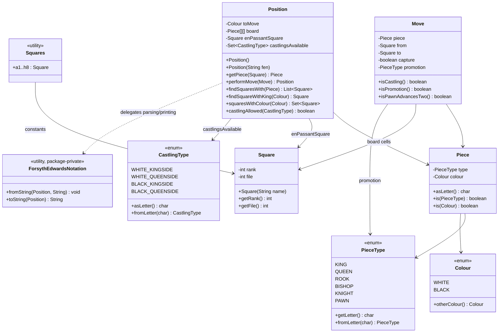
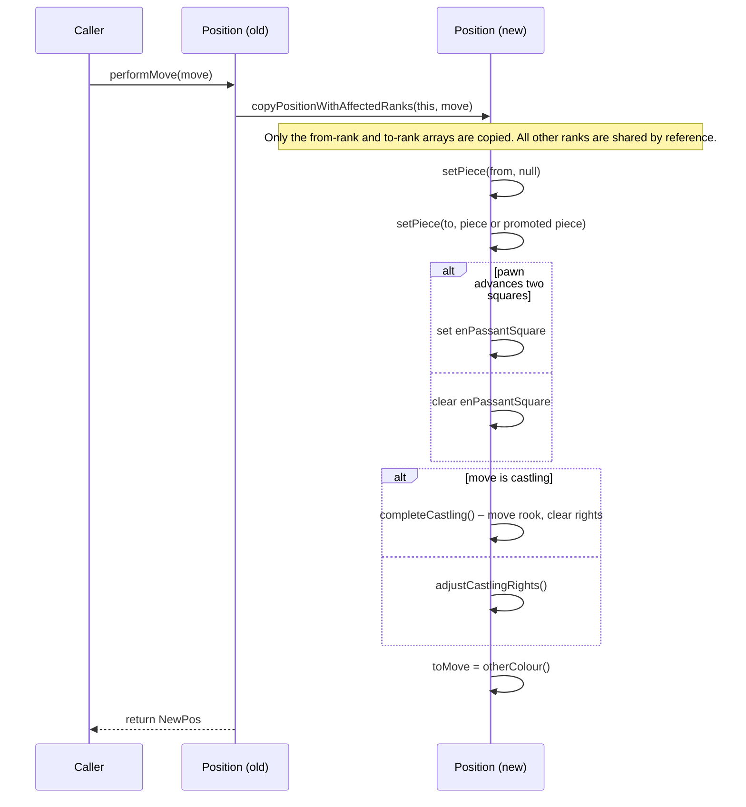
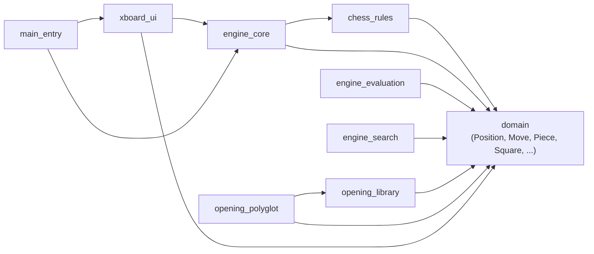

# Domain Module

## Purpose

The `domain` module (package `org.dokchess.domain`) defines the **fundamental data model of a chess game** used throughout the entire DokChess system. It has no dependencies on any other DokChess module — it is the innermost layer of the application — and every other module (rules engine, search/evaluation engine, opening books, and the text UI) is built directly on top of these types.

The module answers three basic questions:

1. **What can be on a chessboard?** — pieces, colours, and squares.
2. **What does a chess position look like?** — the 8×8 board, side to move, castling rights, and en-passant target.
3. **How does a position change?** — the immutable `Move` value object and `Position.performMove()`.

Because the domain types are simple, immutable (or effectively immutable from the outside) value objects, they can be freely shared and compared by every other part of the system without risk of unintended mutation, which is especially important for the parallel search algorithms in [engine_search](engine_search.md).

## Architecture Overview

The module consists of six classes/enums, split conceptually into **piece identity**, **board coordinates**, **the mutable-internally / immutable-externally position**, and **serialization (FEN)**.

> Note: `Colour`, `PieceType`, and `CastlingType` are small enums that live in the same package but were not part of the core component list; they are shown here because every other class depends on them.

### Package-Private Encapsulation

`Position` intentionally exposes **mutator methods (`setPiece`, `setToMove`, ...) as package-private**. Only `ForsythEdwardsNotation` (in the same package) is allowed to mutate a `Position` directly — used exclusively during FEN parsing. All other code, including every other module, must treat `Position` as immutable and obtain new positions via `performMove(Move)`, which internally copies affected board ranks (a lightweight copy-on-write scheme) rather than deep-cloning the whole 8×8 array every time.

## Core Components

### `Colour`, `PieceType`, `CastlingType`
Simple enums describing the two sides, the six piece kinds, and the four castling rights. Each supports FEN-letter conversion (`fromLetter` / `getLetter` / `asLetter`), which is used by `ForsythEdwardsNotation` and `Piece`.

### `Piece`
An immutable value object combining a `PieceType` and a `Colour` (e.g. "white knight"). Provides `asLetter()` for FEN serialization and convenience predicates `is(PieceType)` / `is(Colour)`. Implements `equals`/`hashCode` so pieces can be used as map/set keys and compared by value (used by `Position.findSquaresWith`).

### `Square`
An immutable board coordinate expressed as `(rank, file)` — both zero-based, with rank 0 corresponding to rank 8 of the FEN board (i.e., internal storage is oriented from Black's back rank down to White's). Can be constructed either directly from rank/file integers or parsed from standard algebraic notation (e.g. `"e4"`). `toString()` converts back to algebraic notation, which is heavily relied upon by [xboard_ui](xboard_ui.md) for protocol I/O.

### `Squares`
A non-instantiable utility class holding all 64 named `Square` constants (`a1` … `h8`). It exists purely to make code elsewhere (particularly [chess_rules](chess_rules.md) and `Position`'s castling logic) more readable, avoiding repeated string parsing of square names.

### `Move`
An immutable value object representing a single ply: the moving `Piece`, its `from`/`to` squares, whether it is a capture, and an optional promotion `PieceType`. Derived boolean queries (`isCastling`, `isCastlingKingside/Queenside`, `isPawnAdvancesTwo`, `isPromotion`) encode chess-specific semantics purely from the four stored fields, so callers never need to duplicate this logic. `Move` is the common currency exchanged between [chess_rules](chess_rules.md) (which generates legal moves), [engine_search](engine_search.md) (which searches over moves), and [xboard_ui](xboard_ui.md) (which parses/prints moves for the XBoard protocol).

### `Position`
The central aggregate of the module: an 8×8 board of nullable `Piece` references, the side to move, the set of available `CastlingType`s, and the current en-passant target square (if any). Key responsibilities:

- **Construction** — a no-arg constructor sets up the standard starting position; a `String` constructor parses an arbitrary FEN string via `ForsythEdwardsNotation.fromString`.
- **Querying** — `getPiece`, `findSquaresWith`, `findSquareWithKing`, `squaresWithColour`, `isFree`, `castlingAllowed`.
- **Transition** — `performMove(Move)` returns a **new** `Position` reflecting the move, correctly updating en-passant state and castling rights (including rook relocation for castling moves), while sharing unaffected board ranks with the original instance for efficiency.
- **Serialization** — `toString()` delegates to `ForsythEdwardsNotation.toString` to produce a FEN string, useful for logging, debugging, and interoperability (e.g. with the [opening_polyglot](opening_polyglot.md) book, which needs FEN-derived Zobrist-like hashing).

### `ForsythEdwardsNotation`
A package-private, stateless utility that implements the two directions of FEN conversion:

- `fromString(Position, String)` — parses the six FEN fields into an already-allocated `Position` (piece placement, side to move, castling rights, en-passant square; halfmove/fullmove counters are read positionally but not stored).
- `toString(Position)` — the inverse operation, always emitting `"0 1"` for the halfmove clock and fullmove number fields since `Position` does not track them.

This class is the **only** code outside `Position` itself permitted to call `Position`'s package-private setters, which keeps the mutation surface of the domain model minimal and centralizes FEN-format knowledge in one place.

## How Other Modules Use `domain`

- **[chess_rules](chess_rules.md)** consumes `Position` and `Piece`/`Square` to generate legal `Move`s per piece type and to validate check/checkmate conditions.
- **[engine_core](engine_core.md)** orchestrates move selection using `Position`/`Move`, delegating to the opening library or the search algorithm.
- **[engine_evaluation](engine_evaluation.md)** scores a `Position` (e.g. material balance) using `Piece`/`Colour` data.
- **[engine_search](engine_search.md)** performs minimax search over trees of `Position`s reached via `performMove(Move)`.
- **[opening_library](opening_library.md)** and **[opening_polyglot](opening_polyglot.md)** look up known `Move`s for a given `Position`, using FEN (`Position.toString()`) as part of the lookup key.
- **[xboard_ui](xboard_ui.md)** parses/prints `Move`s and `Square`s to/from the XBoard text protocol.
- **[main_entry](main_entry.md)** wires everything together at application startup.
- **[integration_tests](integration_tests.md)** exercises the domain model end-to-end together with the rules and engine modules.

## Design Notes

- **Value-object semantics**: `Piece`, `Square`, and `Move` all implement `equals`/`hashCode`, allowing them to be safely used in collections (`Set<Square>`, map keys, etc.) throughout dependent modules.
- **Board orientation**: internal `(rank, file)` indices run from `0` (FEN's eighth rank / Black's back rank) to `7` (FEN's first rank / White's back rank), file `0` = `a`, file `7` = `h`. Code outside the module should rely on `Square`'s constructors/`toString()` rather than assuming a particular indexing scheme directly.
- **Efficient immutability**: rather than deep-copying the entire board on every move, `Position.performMove` only duplicates the one or two board ranks actually touched by the move, sharing the rest with the previous `Position` instance. This matters for the performance of tree search in [engine_search](engine_search.md), which creates many successor positions.
- **No rule knowledge**: the domain module deliberately knows nothing about check, checkmate, stalemate, or move legality — that responsibility belongs entirely to [chess_rules](chess_rules.md). `Move.isCastling()` etc. are purely structural/geometric checks (e.g., a king moving two files), not legality checks.
