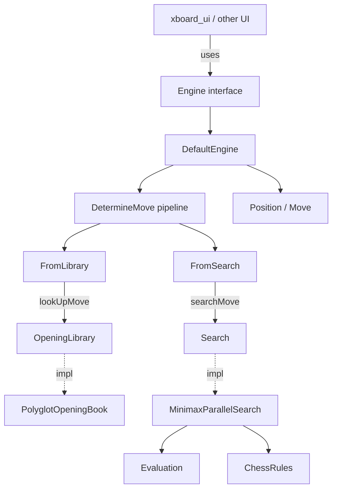
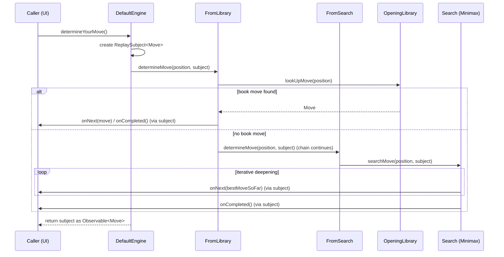
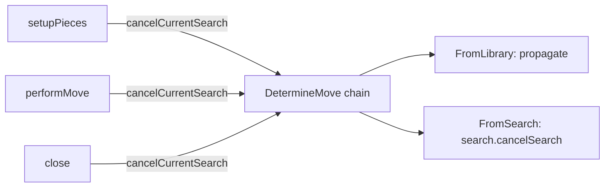

# Engine Core Module

## 1. Purpose

The `engine_core` module (Java package `org.dokchess.engine`) is the **orchestration layer** of the
DokChess chess engine. It does not itself know how to evaluate positions, search the game tree, or
apply chess rules — instead, it wires those specialized subsystems together and exposes a single,
simple, reactive API (`Engine`) that a user interface (such as [xboard_ui](xboard_ui.md)) can drive to
play a game of chess.

Its two responsibilities are:

1. **Public contract** — the `Engine` interface defines the lifecycle a chess engine must support
   (setting up a position, being asked for a move, being told which move was played, and shutting
   down cleanly). `DefaultEngine` is the concrete, production implementation of this contract.
2. **Move-determination pipeline** — an internal **Chain of Responsibility** (`DetermineMove` and its
   subclasses `FromLibrary` and `FromSearch`) decides *how* a move for the current position is
   produced: first by trying an opening book, and — if that fails or in parallel — by running a
   tree search.

## 2. Architecture Overview

`engine_core` sits at the center of the engine-side of the application, composing the
[opening_library](opening_library.md) and [engine_search](engine_search.md) modules (which in turn
depends on [engine_evaluation](engine_evaluation.md) and [chess_rules](chess_rules.md)), and operating
on the immutable board model from [domain](domain.md).



* [opening_library.md](opening_library.md) — abstraction and (Polyglot) implementation of an opening
  book used by `FromLibrary`.
* [engine_search.md](engine_search.md) — abstraction and (parallel minimax) implementation of game
  tree search used by `FromSearch`.
* [engine_evaluation.md](engine_evaluation.md) — static position evaluation consumed by the search.
* [chess_rules.md](chess_rules.md) — legal move generation consumed by the search.
* [domain.md](domain.md) — immutable `Position`/`Move`/`Piece`/`Square` model shared by all of the
  above.

## 3. Core Components

### 3.1 `Engine` (interface)

The public contract exposed to any consumer (typically a UI adapter):

```java
public interface Engine {
    void setupPieces(Position position);
    Observable<Move> determineYourMove();
    void performMove(Move move);
    void close();
}
```

| Method | Responsibility |
|---|---|
| `setupPieces(Position)` | Initializes/replaces the current board position (e.g. at game start, or after "force"/"setboard" commands) and cancels any in-flight search. |
| `determineYourMove()` | Asks the engine to compute its move for the current position. Returns an [RxJava](https://github.com/ReactiveX/RxJava) `Observable<Move>` so the caller can subscribe asynchronously and can receive **more than one** move over time (see §4). |
| `performMove(Move)` | Informs the engine that a move (its own or the opponent's) has been played, advancing the internal position and cancelling any stale search. |
| `close()` | Releases resources (thread pools, etc.) held by the underlying search. |

### 3.2 `DefaultEngine`

The sole production implementation of `Engine`. Its constructor assembles the entire move-computation
pipeline:

```java
MinimaxParallelSearch minimax = new MinimaxParallelSearch();
minimax.setDepth(4);
minimax.setChessRules(chessRules);
minimax.setEvaluation(new StandardMaterialEvaluation());

FromSearch fromSearch = new FromSearch(minimax);

this.movePipeline = (openingLibrary != null)
        ? new FromLibrary(openingLibrary, fromSearch)
        : fromSearch;
```

Key points:

* It hard-codes a **search depth of 4** and `StandardMaterialEvaluation` from
  [engine_evaluation](engine_evaluation.md) as the evaluation strategy.
* `ChessRules` (from [chess_rules](chess_rules.md)) is injected by the caller — `DefaultEngine` does
  not implement rules itself.
* An `OpeningLibrary` (from [opening_library](opening_library.md)) is **optional**. If supplied, moves
  are first attempted via `FromLibrary`; otherwise the pipeline goes straight to `FromSearch`.
* Internal mutable state is a single `Position` field, replaced wholesale on `setupPieces` and advanced
  via `Position.performMove(Move)` (an immutable/functional update from the [domain](domain.md)
  module) on `performMove`.
* `determineYourMove()` creates a fresh RxJava `ReplaySubject<Move>`, hands it to the pipeline as an
  `Observer<Move>`, and returns it as an `Observable<Move>` to the caller. A `ReplaySubject` is used so
  that late subscribers still receive any values already emitted, and multiple emissions (see below)
  are all replayed in order.

### 3.3 `DetermineMove` (package-private abstract class)

Implements the **Chain of Responsibility** pattern that drives move determination:

```java
abstract class DetermineMove {
    private final DetermineMove next;
    public DetermineMove(DetermineMove next) { this.next = next; }

    public void determineMove(Position position, Observer<Move> observer) {
        if (next != null) next.determineMove(position, observer);
    }
    public void cancelCurrentSearch() {
        if (next != null) next.cancelCurrentSearch();
    }
}
```

Subclasses override `determineMove` to add their own behavior and then decide whether/how to delegate
to `next`. `cancelCurrentSearch` simply propagates down the chain so `DefaultEngine` can cancel a search
in progress without knowing the pipeline's internal shape.

### 3.4 `FromLibrary`

```java
class FromLibrary extends DetermineMove {
    public void determineMove(Position position, Observer<Move> observer) {
        Move move = openingLibrary.lookUpMove(position);
        if (move != null) {
            observer.onNext(move);
            observer.onCompleted();
        } else {
            super.determineMove(position, observer);  // delegate to next link
        }
    }
}
```

* Queries the injected `OpeningLibrary.lookUpMove(Position)` (see
  [opening_library.md](opening_library.md)).
* **On a hit**: emits the book move and immediately completes the `Observer` — the search stage is
  never invoked for this move.
* **On a miss**: falls through to the next link in the chain (typically `FromSearch`).

### 3.5 `FromSearch`

```java
class FromSearch extends DetermineMove {
    public void determineMove(Position position, Observer<Move> observer) {
        search.searchMove(position, observer);
        super.determineMove(position, observer);
    }
}
```

* Delegates to a `Search` implementation (see [engine_search.md](engine_search.md)), typically
  `MinimaxParallelSearch`, passing the *same* `Observer`. The search implementation may call
  `observer.onNext(...)` **multiple times** as its best-move estimate improves with iterative
  deepening, and finally `observer.onCompleted()`.
* Being the last link configured by `DefaultEngine`, its call to `super.determineMove(...)` is a no-op
  (`next == null`), but the call keeps the class reusable as a non-terminal link if ever composed
  differently.

## 4. Move Determination Flow

The following sequence illustrates a typical `determineYourMove()` call when both an opening library
and a search are configured:



Notes:

* The `Observable` returned by `determineYourMove()` can emit **zero or more** intermediate moves
  followed by a completion signal — callers that only care about the final answer should take the last
  emitted value before completion (or use the appropriate RxJava operator), while callers that want to
  show "thinking" progress (e.g. an analysis UI) can react to every emission.
* Both `FromLibrary` and `FromSearch` write to the *same* `Observer`, so at most one of them
  contributes moves for a given call: a library hit short-circuits before the search ever runs.

## 5. Cancellation and Lifecycle



`DefaultEngine` calls `movePipeline.cancelCurrentSearch()` whenever the position changes
(`setupPieces`, `performMove`) or the engine is shut down (`close`). This call recurses through the
chain; `FromSearch` is the only link with real work to do here, delegating to
`Search.cancelSearch()`/`close()` on the underlying `MinimaxParallelSearch` (see
[engine_search.md](engine_search.md)) so that stale or long-running background searches do not keep
emitting moves for a position that is no longer current.

## 6. How This Module Is Used

* [main_entry](main_entry.md)'s `Main` class constructs a `DefaultEngine` (wiring in a
  `DefaultChessRules` from [chess_rules](chess_rules.md) and, optionally, a `PolyglotOpeningBook` from
  [opening_library](opening_library.md)) and hands it to an `XBoard` adapter from
  [xboard_ui](xboard_ui.md).
* [xboard_ui](xboard_ui.md) drives the `Engine` interface exclusively — it has no knowledge of search,
  evaluation, or rules internals, which keeps the UI protocol layer decoupled from engine internals.
* Integration tests (`EngineVsRandomIntegTest`, `XBoardIntegTest`) exercise `DefaultEngine`
  end-to-end, verifying that the assembled pipeline produces legal, sensible moves.

## 7. Design Notes

* **Separation of "what" vs "how"**: `Engine` defines *what* a chess engine can do; `DetermineMove` and
  its subclasses define *how* a move is actually produced, allowing the opening-book and search
  strategies to be swapped, reordered, or extended (e.g. adding a tablebase lookup stage) without
  touching `Engine` or its callers.
* **Reactive API**: Using RxJava's `Observable`/`Observer` allows the search stage to stream improving
  move estimates over time while keeping the caller-facing API asynchronous and non-blocking.
* **Package-private pipeline classes**: `DetermineMove`, `FromLibrary`, and `FromSearch` are not part
  of the public API surface — only `Engine` and `DefaultEngine` are `public`, keeping the pipeline an
  implementation detail that can evolve freely.
