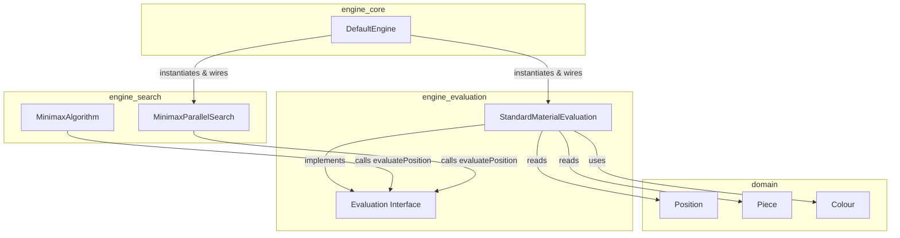
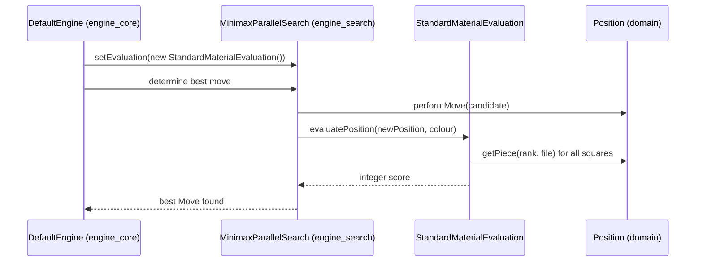

# Engine Evaluation Module

## Purpose

The `engine_evaluation` module provides **position scoring** for the dokchess engine. Given a chess `Position`, it computes an integer score expressing how favorable that position is for a given side (`Colour`). This score is the fundamental building block that the [engine_search](engine_search.md) module (specifically `MinimaxAlgorithm` / `MinimaxParallelSearch`) uses to compare candidate moves and pick the best one.

The module is intentionally small and decoupled from search/rules logic — it only knows how to read a `Position` (from the [domain](domain.md) module) and produce a numeric evaluation. This separation of concerns allows different evaluation strategies (material-only, positional, etc.) to be swapped in without touching the search algorithm.

## Architecture Overview

### Component Relationships

- **`Evaluation`** — the contract. Any evaluation strategy must implement `evaluatePosition(Position, Colour)` and return a score, where higher is better for the given `Colour`. It also defines shared sentinel constants (`BEST`, `WORST`, `BALANCED`) used throughout search logic to represent extreme/neutral scores (e.g., for checkmate detection in `MinimaxAlgorithm`).
- **`StandardMaterialEvaluation`** — the concrete, default implementation. It performs a simple material count: sums standard piece values (Pawn=1, Knight/Bishop=3, Rook=5, Queen=9, King=0) across the board, adding for pieces of the `pointOfView` colour and subtracting for the opponent's pieces.

## How This Module Fits Into the System

1. **[engine_core](engine_core.md)**'s `DefaultEngine` wires a `StandardMaterialEvaluation` instance into a `MinimaxParallelSearch` at construction time. This is the only place the concrete evaluation implementation is chosen, making it easy to substitute an alternative `Evaluation` implementation later.
2. **[engine_search](engine_search.md)**'s minimax algorithms (`MinimaxAlgorithm`, `MinimaxParallelSearch`) recursively simulate moves on the [domain](domain.md) `Position` object tree and call `evaluatePosition` at leaf nodes (or terminal states) to score the resulting board. The `Evaluation.BEST`/`WORST`/`BALANCED` constants are also reused by the search algorithm to represent checkmate and stalemate scores.
3. The scores bubble back up through the minimax tree, ultimately letting the engine choose the move that maximizes the evaluated advantage for the side to move.

## Sub-modules

Given the module's small size (a single interface and single default implementation), it does not warrant further sub-module decomposition. All core logic is documented above.

## Related Modules

| Module | Relationship |
|---|---|
| [domain](domain.md) | Provides `Position`, `Piece`, and `Colour` types read by `StandardMaterialEvaluation`. |
| [engine_search](engine_search.md) | Consumes `Evaluation` to score positions during minimax search. |
| [engine_core](engine_core.md) | Wires the concrete `StandardMaterialEvaluation` into the search pipeline inside `DefaultEngine`. |
