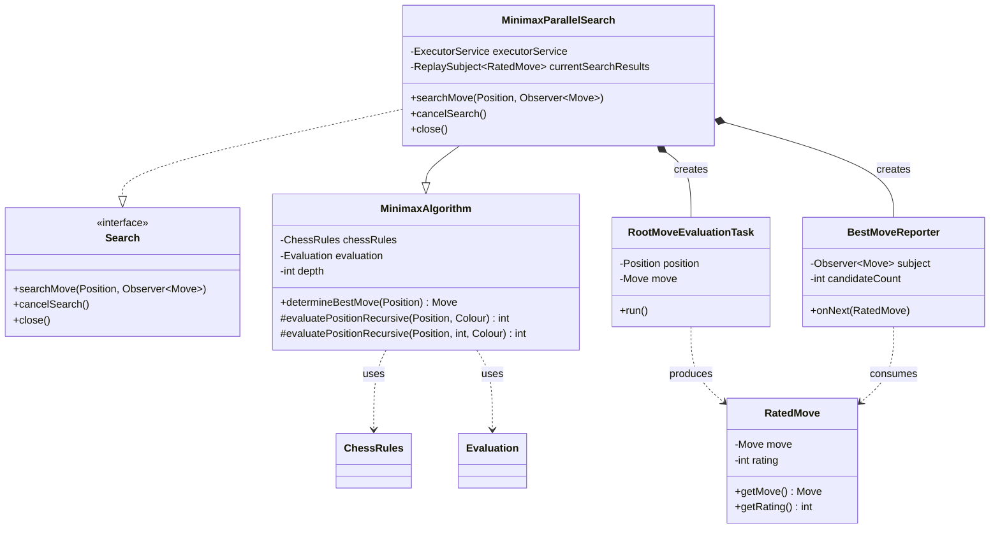
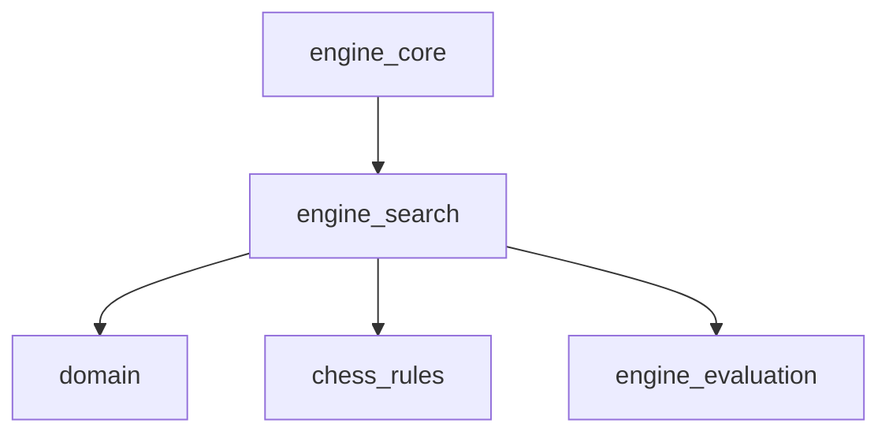
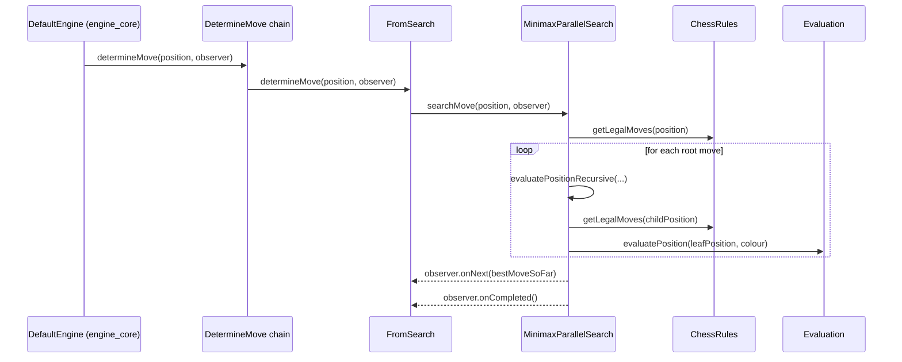

# Engine Search Module

## Introduction

The `engine_search` module is the "thinking" heart of the DokChess engine. It is responsible for
exploring the tree of possible chess positions that follow from a given `Position` and deciding
which `Move` is the best one to play. It implements the classic **Minimax** algorithm and provides
a **parallelized search** strategy that spreads the exploration of root moves across all available
CPU cores, reporting the current best move as an asynchronous stream of results.

This module does not know how to play chess by itself — it relies on:

* [chess_rules](chess_rules.md) for legal move generation and check/checkmate detection
  (via the `ChessRules` interface).
* [engine_evaluation](engine_evaluation.md) for scoring a given position from a player's point
  of view (via the `Evaluation` interface).
* [domain](domain.md) for the core chess data types (`Position`, `Move`, `Colour`, etc.) that
  flow through the search algorithms.

It is consumed by [engine_core](engine_core.md), specifically by the `FromSearch` step of the
`DetermineMove` chain, which is the mechanism the engine uses to decide on a move when no
suitable move is found in an opening library.

## Architecture Overview

The module is organized into two closely related areas:

1. **Search abstraction and sequential algorithm** — defines the `Search` contract and the
   core recursive Minimax tree-walking logic (`MinimaxAlgorithm`).
   See [engine_search_minimax_algorithm.md](engine_search_minimax_algorithm.md) for details.
2. **Parallel search implementation** — extends the sequential algorithm to evaluate root moves
   concurrently on a thread pool, streaming results reactively using RxJava.
   See [engine_search_parallel_search.md](engine_search_parallel_search.md) for details.

### Component Diagram

### Dependency Diagram

## High-Level Functionality

### Search Abstraction & Sequential Minimax

`Search` is the public contract used by the rest of the engine to trigger, cancel, and dispose of
a move search. `MinimaxAlgorithm` implements the classic fixed-depth minimax tree search: for the
side to move, it exhaustively expands legal moves down to a configured `depth`, alternating
maximizing/minimizing at each ply, and returns the move which leads to the best evaluated outcome
for the root player. It also handles checkmate and stalemate leaf conditions, awarding an
extreme (but depth-adjusted) score for forced mates so that faster mates are preferred over
slower ones.

Read the full details in [engine_search_minimax_algorithm.md](engine_search_minimax_algorithm.md).

### Parallel Search

`MinimaxParallelSearch` builds on top of `MinimaxAlgorithm` (reusing its recursive evaluation
logic) but distributes the evaluation of each *root* move to a separate task
(`RootMoveEvaluationTask`) running on a fixed thread pool sized to the number of available CPU
cores. Results (`RatedMove`) are streamed through an RxJava `ReplaySubject`, and a
`BestMoveReporter` observer incrementally reports every new best move found — and signals
completion once all root moves have been evaluated. This lets the caller receive incremental
"current best guess" moves even before the search is fully finished, and supports cancellation
via `cancelSearch()`.

Read the full details in [engine_search_parallel_search.md](engine_search_parallel_search.md).

## How It Fits Into the Overall System

The `engine_core` module wires a `Search` implementation (typically `MinimaxParallelSearch`) into
the `FromSearch` link of its `DetermineMove` chain. When the `opening_library`/`opening_polyglot`
lookup (`FromLibrary`) fails to find a known move, the chain falls through to `FromSearch`, which
delegates directly into this module to compute a move via search. See
[engine_core.md](engine_core.md) for the full move-determination pipeline, and
[engine_evaluation.md](engine_evaluation.md) / [chess_rules.md](chess_rules.md) for the
collaborating strategy interfaces this module depends on.
