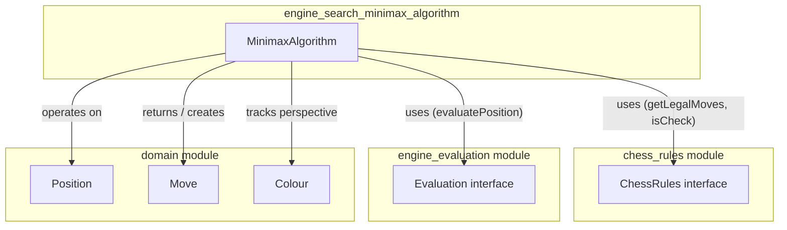
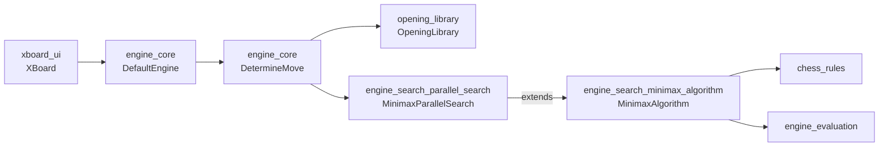
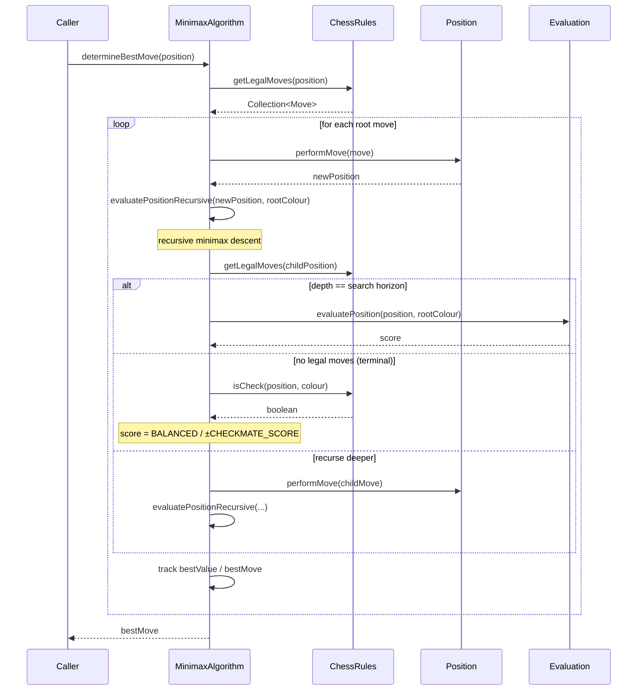
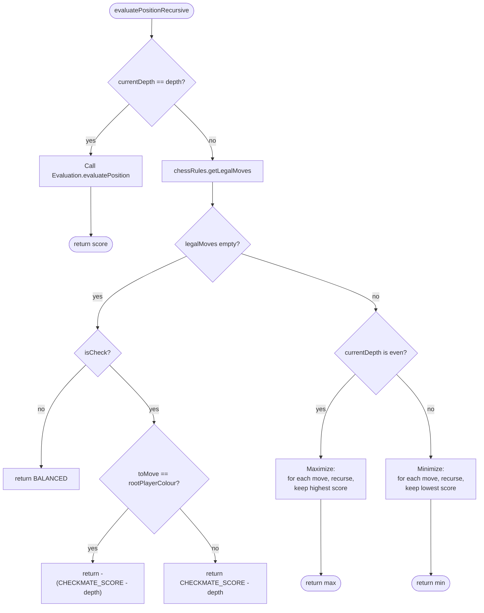

# Engine Search: Minimax Algorithm

## Introduction

The **engine_search_minimax_algorithm** module implements the core game-tree search
logic used by the DokChess engine to determine the best move in a given chess
position. It provides the `MinimaxAlgorithm` class, a classic depth-limited
**Minimax** search that alternates between maximizing and minimizing players to
find the move that leads to the best guaranteed outcome for the player to move.

This module is intentionally kept small and focused: it knows nothing about
threading, parallelism, or opening books. It is a pure, single-threaded
algorithmic building block that higher-level modules — most notably
[engine_search_parallel_search](engine_search_parallel_search.md) — extend and
reuse to build a production-ready search engine.

It depends on two other modules to do its work:

- [chess_rules](chess_rules.md) — supplies legal move generation and check
  detection via the `ChessRules` interface.
- [engine_evaluation](engine_evaluation.md) — supplies static position
  scoring via the `Evaluation` interface.

And it operates on the fundamental chess data types defined in
[domain](domain.md) (`Position`, `Move`, `Colour`).

---

## Module Purpose

`MinimaxAlgorithm` answers a single question: **"Given a chess position, what
is the best legal move for the player to move?"**

It does so by:

1. Enumerating all legal moves from the root position (via `ChessRules`).
2. For each candidate move, simulating the resulting position and recursively
   exploring the game tree up to a fixed `depth`.
3. At each level of recursion, alternating between **maximizing** the
   evaluation score (from the root player's perspective) and **minimizing**
   it (modeling the opponent's optimal play) — the essence of the minimax
   principle.
4. At the search horizon (`depth` reached), calling out to an `Evaluation`
   strategy to score the leaf position statically.
5. Returning the root-level move associated with the highest score found.

Special handling is included for terminal nodes without legal moves
(checkmate and stalemate), ensuring that checkmates are scored more favorably
the sooner they are found, and stalemates are scored as neutral (`BALANCED`).

---

## Core Component

### `MinimaxAlgorithm`

Location: `src/main/java/org/dokchess/engine/search/MinimaxAlgorithm.java`

```java
public class MinimaxAlgorithm {
    protected ChessRules chessRules;
    protected Evaluation evaluation;
    private static final int CHECKMATE_SCORE = Evaluation.BEST / 2;
    private int depth;

    public void setEvaluation(Evaluation evaluation) { ... }
    public void setChessRules(ChessRules chessRules) { ... }
    public void setDepth(int depth) { ... }

    public Move determineBestMove(Position position) { ... }

    protected int evaluatePositionRecursive(Position position, Colour rootPlayerColour) { ... }
    protected int evaluatePositionRecursive(Position position, int currentDepth, Colour rootPlayerColour) { ... }
}
```

#### Collaborators (dependency injection)

The class is designed to be configured via simple setters, making it easy to
wire with different rule sets or evaluation strategies (e.g., in tests or via
a Spring/DI configuration):

| Field | Type | Purpose |
|---|---|---|
| `chessRules` | `ChessRules` | Generates legal moves and detects check for a `Position`. See [chess_rules](chess_rules.md). |
| `evaluation` | `Evaluation` | Scores a leaf `Position` from a given player's point of view. See [engine_evaluation](engine_evaluation.md). |
| `depth` | `int` | The fixed ply-depth of the search tree (search horizon). |

#### Public API

- **`Move determineBestMove(Position position)`**
  Entry point. Iterates over all legal moves at the root, evaluates each
  resulting position recursively, and returns the move with the highest
  score. Uses `Evaluation.WORST` as the initial "best value" sentinel so that
  any real score improves on it.

#### Protected/Internal API

- **`int evaluatePositionRecursive(Position position, Colour rootPlayerColour)`**
  Convenience overload starting recursion at depth `1` (since the root move
  has already been applied before this is called).

- **`int evaluatePositionRecursive(Position position, int currentDepth, Colour rootPlayerColour)`**
  The heart of the minimax recursion:
  - **Horizon check**: if `currentDepth == depth`, delegates to
    `evaluation.evaluatePosition(position, rootPlayerColour)` for a static
    score.
  - **Terminal node check**: if there are no legal moves for the position to
    move:
    - If it's *not* check → **stalemate** → returns `Evaluation.BALANCED` (0).
    - If it *is* check → **checkmate**:
      - If the side that just got mated is the *root player* → strongly
        negative score: `-(CHECKMATE_SCORE - currentDepth)`.
      - Otherwise → strongly positive score: `CHECKMATE_SCORE - currentDepth`.
      - Subtracting `currentDepth` ensures **faster mates are preferred**
        (a mate in 1 scores higher than a mate in 3).
  - **Recursive case**: alternates behavior based on ply parity:
    - **Even `currentDepth`** → **maximizing** node: picks the move with the
      highest score among children (modeling the root player's turn, since
      depth 0 was the root move already applied and depth 1 is the
      opponent's reply — the *even* depths correspond to the root player's
      turn again).
    - **Odd `currentDepth`** → **minimizing** node: picks the move with the
      lowest score among children (modeling the opponent's optimal
      counter-play).

> **Note on ply parity**: Because `determineBestMove` applies the root move
> before entering recursion, `currentDepth == 1` refers to the position after
> the *opponent's* first reply is about to be chosen — hence it is treated as
> a minimizing level. This keeps the algorithm's perspective fixed on
> `rootPlayerColour` throughout the tree (a "single-perspective" or
> "non-negamax" style of minimax, as opposed to negamax's sign-flipping
> convention).

---

## Architecture & Dependencies



### Where it fits in the wider system



`MinimaxAlgorithm` itself is **not used directly** by the engine at runtime.
Instead, [engine_search_parallel_search](engine_search_parallel_search.md)'s
`MinimaxParallelSearch` **extends** it, reusing its protected
`evaluatePositionRecursive` method while adding:

- Parallel evaluation of root moves across multiple threads (one
  `RootMoveEvaluationTask` per legal root move).
- Reactive (`Observer`/`ReplaySubject`) reporting of incrementally improving
  best moves, satisfying the `Search` interface expected by
  [engine_core](engine_core.md)'s `DetermineMove`/`DefaultEngine`.
- Cancellation support (`cancelSearch`), which `MinimaxAlgorithm` alone does
  not need since it runs synchronously to completion.

This inheritance relationship means all documentation for scoring semantics,
checkmate/stalemate handling, and the maximizing/minimizing alternation
described above **also applies identically** inside the parallel search — see
[engine_search_parallel_search](engine_search_parallel_search.md) for the
concurrency-specific behavior layered on top.

---

## Data Flow

The following diagram shows how a single call to `determineBestMove` flows
through the class, its collaborators, and back:



---

## Recursive Search Logic (Flowchart)



---

## Scoring Conventions

| Situation | Score |
|---|---|
| Leaf node at search horizon | `Evaluation.evaluatePosition(position, rootPlayerColour)` (module-defined heuristic, e.g. material count — see [engine_evaluation](engine_evaluation.md)) |
| Stalemate | `Evaluation.BALANCED` (`0`) |
| Root player is checkmated | `-(CHECKMATE_SCORE - currentDepth)` — a large negative number, penalized less severely the deeper (later) the mate occurs |
| Opponent is checkmated | `CHECKMATE_SCORE - currentDepth` — a large positive number, rewarded more the sooner the mate occurs |
| Initial "best value" sentinel at root | `Evaluation.WORST` (`Integer.MIN_VALUE`) |

`CHECKMATE_SCORE` is defined as `Evaluation.BEST / 2`, leaving headroom so
checkmate scores never overflow when combined with `currentDepth` and remain
clearly distinguishable from ordinary material-based evaluation scores
produced by strategies like `StandardMaterialEvaluation`
(see [engine_evaluation](engine_evaluation.md)).

---

## Relationship to Other Modules

| Module | Relationship |
|---|---|
| [domain](domain.md) | Provides `Position`, `Move`, and `Colour` — the fundamental data this algorithm reads and creates. |
| [chess_rules](chess_rules.md) | Supplies `ChessRules.getLegalMoves()` and `ChessRules.isCheck()`, used to expand the game tree and detect terminal nodes. |
| [engine_evaluation](engine_evaluation.md) | Supplies the `Evaluation.evaluatePosition()` static scoring function used at the search horizon. |
| [engine_search_parallel_search](engine_search_parallel_search.md) | Extends `MinimaxAlgorithm`, reusing its recursive evaluation logic while adding multi-threaded root-move dispatch, reactive result reporting, and cancellation — turning it into a full `Search` implementation. |
| [engine_core](engine_core.md) | Consumes `Search` implementations (built on top of this algorithm) via `DetermineMove`/`DefaultEngine` to select engine moves outside of opening theory. |

---

## Design Notes & Limitations

- **No alpha-beta pruning**: This is a plain, exhaustive minimax without
  pruning optimizations. Performance at higher depths relies on
  parallelization at the root (see
  [engine_search_parallel_search](engine_search_parallel_search.md)) rather
  than tree-pruning techniques.
- **Fixed depth only**: There is no iterative deepening or quiescence
  search; `depth` is a hard, uniform ply limit set via `setDepth`.
- **Single-perspective scoring**: All scores are computed from
  `rootPlayerColour`'s point of view throughout the recursion (rather than
  flipping sign each ply as in negamax), which is why the maximize/minimize
  roles are explicitly alternated based on `currentDepth` parity instead of
  simply negating child scores.
- **Stateless-ish, but not thread-safe by default**: The class holds mutable
  configuration fields (`chessRules`, `evaluation`, `depth`) set via setters.
  A single instance is safe to reuse sequentially, but
  `MinimaxParallelSearch` (which subclasses it) relies on these fields being
  set once and treated as effectively immutable before concurrent use.
