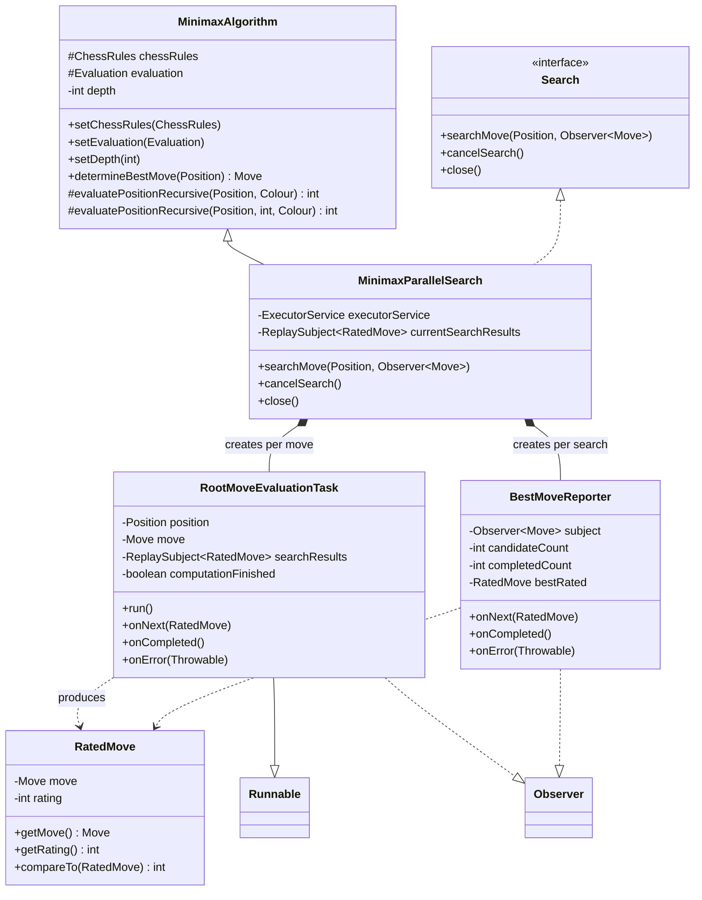
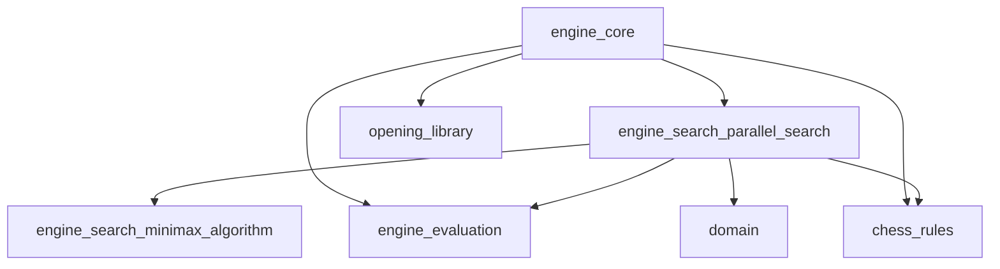
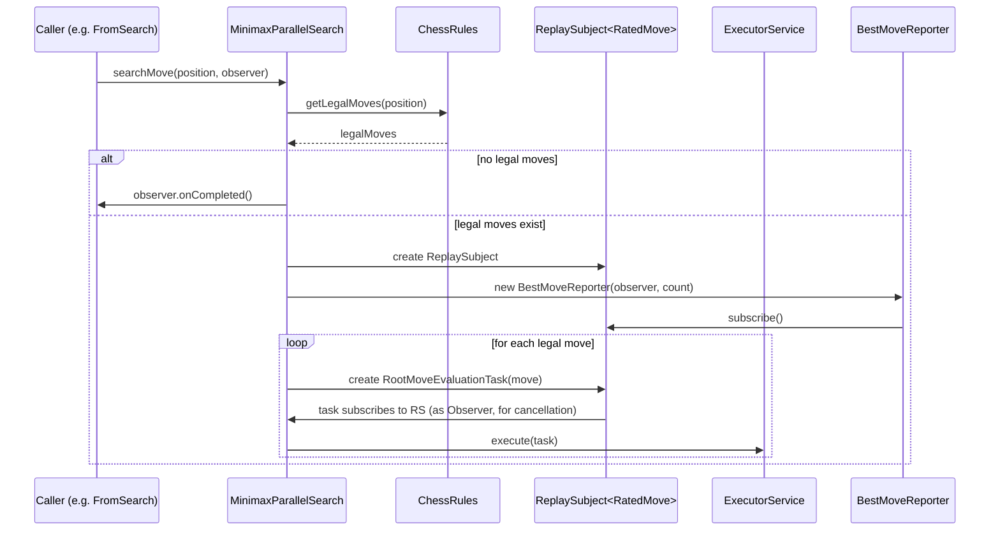
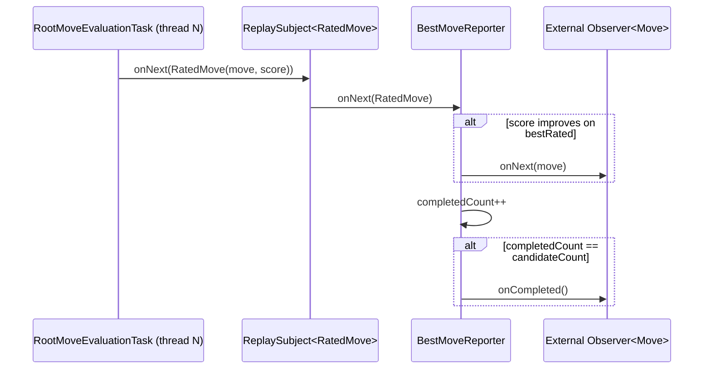
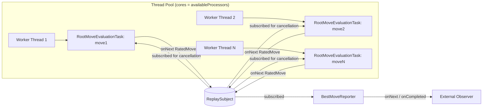
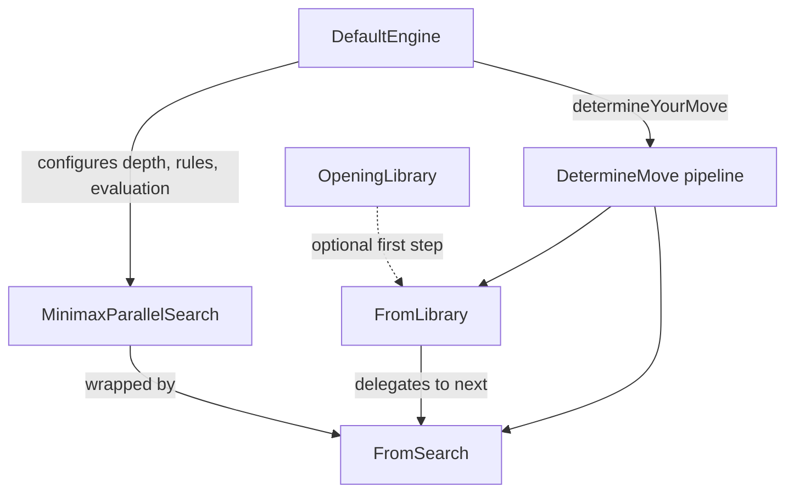

# Engine Search: Parallel Search (`engine_search_parallel_search`)

## Introduction

The **`engine_search_parallel_search`** module provides a concurrent, multi-threaded
implementation of the chess engine's move search. It builds directly on top of the
sequential [Minimax algorithm](engine_search_minimax_algorithm.md) by evaluating every
legal root move in its own worker thread, allowing the engine to make use of all
available CPU cores when looking for the best move in a position.

The module defines the reactive `Search` contract used by the rest of the engine, a
value object (`RatedMove`) that couples a candidate move with its numeric evaluation
score, and the core parallel search engine (`MinimaxParallelSearch`) together with its
two internal helper classes (`RootMoveEvaluationTask` and `BestMoveReporter`) that
implement the fork/join-style evaluation and progressive "best move so far" reporting.

This module is a concrete `Search` implementation plugged into the
[`engine_core`](engine_core.md) move-determination pipeline, and it depends on the
[`engine_evaluation`](engine_evaluation.md) module for static position scoring and on
[`chess_rules`](chess_rules.md) for legal move generation. It operates on the immutable
domain types defined in [`domain`](domain.md) (`Position`, `Move`, `Colour`).

---

## 1. Purpose and Core Functionality

Chess engines must search many possible move sequences to decide which move is best.
The naive [`MinimaxAlgorithm`](engine_search_minimax_algorithm.md) does this search
sequentially on a single thread. `engine_search_parallel_search` parallelizes this at
the **root level**: for a position with *N* legal moves, it dispatches *N* independent
evaluation tasks to a thread pool, each of which recursively searches its subtree using
the (inherited) sequential minimax evaluation logic to a fixed depth.

Key responsibilities of the module:

* **Concurrent root move evaluation** — Every legal move from the root position is
  evaluated in parallel using a fixed-size thread pool sized to the number of available
  processor cores.
* **Reactive result streaming** — Uses RxJava (`rx.Observer`, `rx.subjects.ReplaySubject`)
  to publish move evaluation results asynchronously as they complete, rather than
  blocking until the entire search finishes.
* **Progressive best-move reporting** — As each worker thread finishes evaluating its
  move, the result is compared against the best move found so far; whenever a new best
  move is found, it is immediately emitted to the consuming `Observer<Move>`. This allows
  the caller (e.g. the engine/UI) to know the current best guess even before the full
  search is complete, and guarantees that the very last value emitted is the true best
  move.
* **Cancellation support** — A search in progress can be cancelled at any time (e.g.
  because the opponent moved or a new search was requested), which stops the reporter
  from acting on any further results and marks not-yet-completed tasks as finished.
* **Resource lifecycle management** — The underlying `ExecutorService` thread pool is
  explicitly created on construction and shut down via `close()`.

---

## 2. Component Overview

| Component | Type | Responsibility |
|---|---|---|
| `Search` | Interface | Reactive contract for any move-search strategy: start a search publishing results to an `Observer<Move>`, cancel an in-flight search, and release resources. |
| `RatedMove` | Value class | Immutable pairing of a `Move` with an integer evaluation `rating`; `Comparable` by rating. |
| `MinimaxParallelSearch` | Class (extends `MinimaxAlgorithm`, implements `Search`) | Orchestrates parallel root-move evaluation: creates a thread pool, dispatches one `RootMoveEvaluationTask` per legal move, and wires up a `BestMoveReporter` to emit progressively improving moves to the caller. |
| `RootMoveEvaluationTask` (inner class) | `Runnable` + `Observer<RatedMove>` | Executed on a worker thread; performs the move on a private copy of the position, recursively evaluates the resulting subtree (reusing `MinimaxAlgorithm.evaluatePositionRecursive`), and emits a `RatedMove` result. Listens for cancellation (`onCompleted`/`onError`) to skip execution if the search was already cancelled. |
| `BestMoveReporter` (inner class) | `Observer<RatedMove>` | Subscribed to the stream of `RatedMove` results; tracks the best-rated move seen so far, forwards only *improving* moves to the external `Observer<Move>`, and signals completion once all candidate moves have reported in. |

---

## 3. Architecture

`MinimaxParallelSearch` inherits the tree-evaluation logic (`evaluatePositionRecursive`)
from `MinimaxAlgorithm` but overrides the top-level `determineBestMove` behavior by
implementing the reactive `Search` interface instead. Rather than looping over root
moves sequentially in one method, it fans the work out across a thread pool and uses an
RxJava `ReplaySubject` as a shared, thread-safe event bus connecting the worker tasks to
the reporter.

### 3.1 Dependency Diagram

* **[`engine_search_minimax_algorithm`](engine_search_minimax_algorithm.md)** — Supplies
  the base `MinimaxAlgorithm` class that `MinimaxParallelSearch` extends, including the
  recursive minimax tree evaluation (`evaluatePositionRecursive`) shared by both the
  sequential and parallel implementations, plus checkmate scoring constants.
* **[`engine_evaluation`](engine_evaluation.md)** — Provides the `Evaluation` strategy
  (e.g. `StandardMaterialEvaluation`) used to statically score leaf positions at the
  search's fixed depth.
* **[`chess_rules`](chess_rules.md)** — Supplies `ChessRules.getLegalMoves(Position)`
  used both to enumerate root moves and, indirectly through inherited minimax logic, to
  expand deeper tree levels.
* **[`domain`](domain.md)** — Supplies the immutable `Position`, `Move`, and `Colour`
  types manipulated throughout the search.
* **[`engine_core`](engine_core.md)** — The consumer of this module: `DefaultEngine`
  instantiates and configures `MinimaxParallelSearch` (setting depth, rules, and
  evaluation strategy) and wraps it in a `FromSearch` step of the `DetermineMove`
  pipeline.

---

## 4. Behavior and Process Flow

### 4.1 Starting a Search (`searchMove`)

1. The caller (typically `FromSearch` in `engine_core`) invokes
   `searchMove(position, observer)` with the current `Position` and an `Observer<Move>`
   that wants to be notified of (progressively improving) best moves.
2. `chessRules.getLegalMoves(position)` enumerates all legal moves from the root
   position.
3. If there are no legal moves (checkmate/stalemate), the search immediately signals
   `observer.onCompleted()`.
4. Otherwise, a fresh `ReplaySubject<RatedMove>` (`searchResults`) is created and stored
   as `currentSearchResults` — this is the shared event bus for this particular search,
   enabling later cancellation.
5. A single `BestMoveReporter` is created, configured with the total candidate count,
   and subscribed to `searchResults`.
6. For every legal move, a `RootMoveEvaluationTask` is created (bound to that move and
   to `searchResults`), subscribed as an `Observer` on `searchResults` (so it can be
   told about cancellation), and submitted to the `ExecutorService` for asynchronous
   execution.

### 4.2 Evaluating a Root Move (`RootMoveEvaluationTask.run`)

Executed concurrently on a pool thread:

1. Check `computationFinished` — if the search was already cancelled before this task
   started running, skip evaluation entirely.
2. Capture the root player's `Colour` (`rootPlayerColour`) from the current `toMove`.
3. Apply the candidate move to obtain the resulting `Position` (`position.performMove(move)`).
4. Recursively evaluate the resulting subtree using the inherited
   `evaluatePositionRecursive(positionAfterMove, rootPlayerColour)` from
   [`MinimaxAlgorithm`](engine_search_minimax_algorithm.md) — this performs the
   standard alternating min/max recursive descent to the configured `depth`, using the
   configured `Evaluation` strategy at leaf nodes.
5. Emit the resulting `RatedMove(move, score)` onto the shared `searchResults` subject
   via `onNext`.

Each task also implements `Observer<RatedMove>` so it can be subscribed to the same
`ReplaySubject`: if the subject broadcasts `onCompleted()` or `onError()` (as happens on
cancellation), the task sets `computationFinished = true`, ensuring it will not perform
wasted work if `run()` is invoked afterward (or is already running and about to emit).

### 4.3 Reporting Progress (`BestMoveReporter.onNext`)

Each time any worker task emits a `RatedMove`:

1. `onNext` is invoked (synchronized to guard shared mutable state against concurrent
   invocation from multiple threads).
2. If this is the first result, or its rating exceeds the current `bestRated`, it
   becomes the new best move and is immediately forwarded to the external
   `Observer<Move>` via `subject.onNext(ratedMove.getMove())`. This lets the caller see
   an improving stream of "best move so far" without waiting for the whole search.
3. `completedCount` is incremented regardless of whether the result was an improvement.
4. Once `completedCount` reaches the total number of candidate root moves,
   `subject.onCompleted()` is called — signaling to the caller that the search is fully
   finished and the last emitted move is the definitive best move found.

### 4.4 Cancelling a Search (`cancelSearch`)

`cancelSearch()` is called whenever the engine's position changes externally (a move
was played, or the board was reset) before the current search naturally completes —
see `DefaultEngine.setupPieces` / `DefaultEngine.performMove` in
[`engine_core`](engine_core.md).

1. If a search is currently in flight (`currentSearchResults != null`),
   `currentSearchResults.onCompleted()` is invoked on the shared `ReplaySubject`.
2. Because every `RootMoveEvaluationTask` is itself subscribed as an `Observer` on that
   same subject, each task receives this `onCompleted()` call and sets its own
   `computationFinished = true`, causing any task that has not yet run (or is about to
   emit) to skip further evaluation work.
3. `currentSearchResults` is reset to `null`, allowing a subsequent `searchMove` call to
   start a fresh search cleanly.

Note that already-running tasks are *not forcibly interrupted* — cancellation is
cooperative: a task already deep inside `evaluatePositionRecursive` will run to
completion, but its result will simply not affect the reporter meaningfully because the
`BestMoveReporter` was itself unsubscribed conceptually from further reporting once the
associated search context is discarded (the emitted move may still reach `onNext` on
the reporter object instance, but no new search is started against it, and the calling
code has already moved on to a new one).

### 4.5 Releasing Resources (`close`)

`close()` performs an orderly shutdown:

1. Calls `cancelSearch()` to terminate any in-flight search.
2. Calls `executorService.shutdown()` to release the thread pool. Once closed, this
   `MinimaxParallelSearch` instance can no longer service `searchMove` requests.

---

## 5. Concurrency Model

Key design points:

* **One thread pool per `MinimaxParallelSearch` instance**, sized to
  `Runtime.getRuntime().availableProcessors()`, shared across all searches performed by
  that instance.
* **One `ReplaySubject<RatedMove>` per search invocation** acts both as the result
  channel (workers → reporter) and as the cancellation broadcast channel (search owner →
  workers), since every task subscribes to it as an `Observer`.
* **Thread-safety** is achieved primarily through RxJava's subject semantics and the
  `synchronized` modifier on `BestMoveReporter.onNext`, which serializes updates to
  `bestRated` and `completedCount` even though results can arrive from many threads
  concurrently.
* Because each `RootMoveEvaluationTask` performs `position.performMove(move)`
  independently on the immutable `Position` object from [`domain`](domain.md), there is
  no shared mutable board state between threads — each task works with its own derived
  `Position` copy.

---

## 6. Integration with the Engine

`MinimaxParallelSearch` is the default search strategy wired up by
[`DefaultEngine`](engine_core.md) in the `engine_core` module:

* `DefaultEngine` constructs a `MinimaxParallelSearch`, sets its search `depth` (e.g. 4
  ply), injects a `ChessRules` implementation (see [`chess_rules`](chess_rules.md)), and
  injects an `Evaluation` strategy such as `StandardMaterialEvaluation` (see
  [`engine_evaluation`](engine_evaluation.md)).
* It wraps the search in a `FromSearch` step of the `DetermineMove` chain-of-responsibility
  pipeline, optionally preceded by a `FromLibrary` step that consults an
  [`opening_library`](opening_library.md) before falling back to the search.
* When the UI or engine driver ([`xboard_ui`](xboard_ui.md) via `Main` /
  [`main_entry`](main_entry.md)) requests a move (`determineYourMove`), the pipeline
  ultimately calls `MinimaxParallelSearch.searchMove`, streaming improving move
  suggestions and a final confirmed best move back through the reactive `Observable<Move>`
  exposed by `DefaultEngine`.
* When the opponent's move is applied (`DefaultEngine.performMove`) or the board is
  reset (`setupPieces`), `DetermineMove.cancelCurrentSearch()` propagates down the
  pipeline to `MinimaxParallelSearch.cancelSearch()`, stopping any obsolete in-flight
  search.

---

## 7. Relationship to Sequential Search

`MinimaxParallelSearch` **extends** `MinimaxAlgorithm` (see
[`engine_search_minimax_algorithm`](engine_search_minimax_algorithm.md)) rather than
duplicating the tree-search logic. This means:

* Both implementations share identical leaf-node evaluation and min/max alternation
  logic (`evaluatePositionRecursive`), evaluation strategy injection (`Evaluation`),
  rules injection (`ChessRules`), and depth configuration.
* The only behavioral difference is *how the root moves are iterated and reported*:
  `MinimaxAlgorithm.determineBestMove` iterates root moves sequentially and returns a
  single `Move` synchronously, whereas `MinimaxParallelSearch` implements the reactive
  `Search` interface, iterating root moves **concurrently** and **streaming**
  progressively improving results asynchronously via RxJava.
* This design lets the engine benefit from multi-core hardware without needing to
  reimplement or duplicate the correctness-critical recursive minimax/evaluation code.

---

## 8. Summary

| Aspect | Description |
|---|---|
| **Pattern** | Root-level parallel minimax search with reactive (RxJava) result streaming |
| **Concurrency unit** | One `RootMoveEvaluationTask` per legal root move, executed on a fixed thread pool |
| **Communication** | `ReplaySubject<RatedMove>` used both for result publishing and cooperative cancellation |
| **Extends** | [`MinimaxAlgorithm`](engine_search_minimax_algorithm.md) (reuses recursive tree evaluation) |
| **Implements** | `Search` interface (`searchMove`, `cancelSearch`, `close`) |
| **Depends on** | [`engine_evaluation`](engine_evaluation.md), [`chess_rules`](chess_rules.md), [`domain`](domain.md) |
| **Used by** | [`engine_core`](engine_core.md) (`DefaultEngine`, `FromSearch`) |
