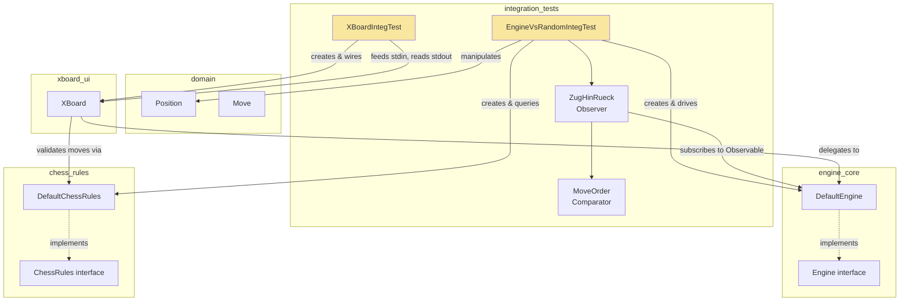
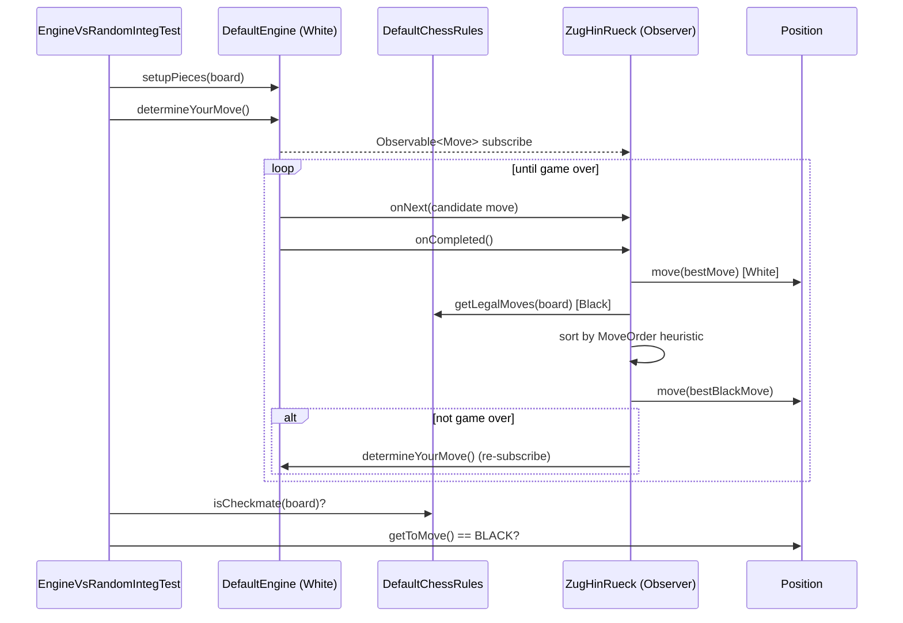
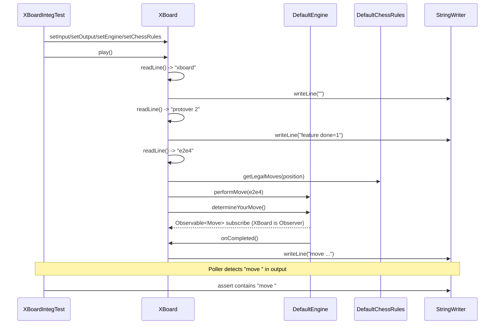
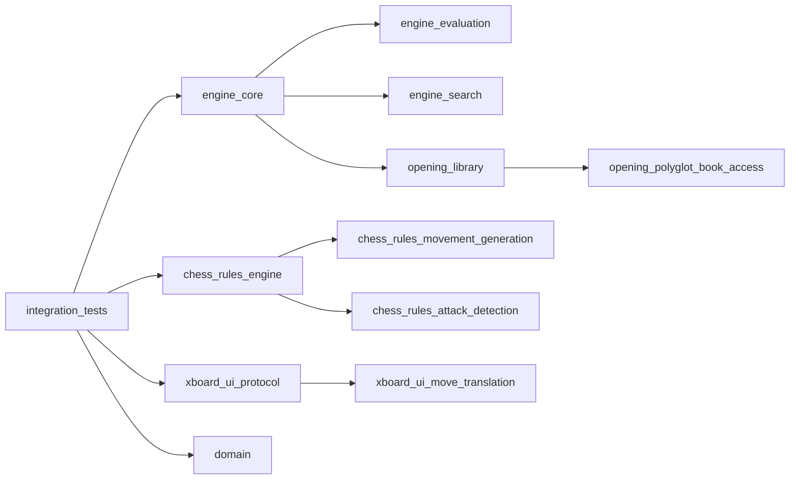

# Integration Tests Module

## 1. Purpose

The `integration_tests` module contains **end-to-end (black-box) tests** that exercise the dokchess system as a whole, rather than testing individual classes in isolation. Where unit tests validate a single component's logic (e.g. "does `RookMoves` generate the correct squares?"), the tests in this module wire together multiple production modules — the [domain model](domain.md), the [chess rules engine](chess_rules_engine.md), the [search-based engine](engine_core.md), and the [XBoard text UI](xboard_ui.md) — and verify that they cooperate correctly to produce a complete, observable chess-playing experience.

Because these tests drive real move-generation, real search algorithms, and real I/O loops, they are inherently **long-running and asynchronous**. Both tests in this module use polling executors and timeouts to wait for asynchronous game state changes (moves computed on background threads) before making assertions.

There are two integration test suites:

| Test Class | What it Verifies |
|---|---|
| `EngineVsRandomIntegTest` | The dokchess [`Engine`](engine_core.md) can play a complete game to checkmate against a simplistic (greedy/heuristic) opponent, using the real [`ChessRules`](chess_rules_engine.md) implementation to validate legality and detect game end. |
| `XBoardIntegTest` | The [`XBoard`](xboard_ui_protocol.md) text-protocol front-end correctly drives the `Engine` through a simulated XBoard/WinBoard session and produces a `move ...` response. |

## 2. Architecture Overview

Both tests act as **test drivers/harnesses** that instantiate real production components (no mocks) and observe the resulting behavior via `rx.Observable<Move>` subscriptions or textual output streams.

Neither test class introduces new production abstractions; instead they are **consumers** of the public APIs of `engine_core`, `chess_rules_engine`, `xboard_ui_protocol`, and `domain`. See those modules' documentation for the underlying implementation details (move generation, minimax search, opening books, etc.).

## 3. Sub-modules / Test Suites

### 3.1 EngineVsRandomIntegTest — Full Game Simulation

**File:** `src/integTest/java/org/dokchess/engine/integration/EngineVsRandomIntegTest.java`

**Goal:** Prove that the dokchess `Engine` (white) can play an entire chess game against a simple opponent (black) and reach checkmate, without ever attempting or accepting an illegal move.

**Setup:**
- A [`DefaultChessRules`](chess_rules_engine.md) instance provides legality checks (`getLegalMoves`, `isCheckmate`, `isStalemate`).
- A [`DefaultEngine`](engine_core.md) instance (wrapping the rules) is asked to `setupPieces` on a fresh `Position`, then to `determineYourMove()` — which returns an `rx.Observable<Move>` that will asynchronously emit White's move once search/opening-library lookup completes.

**Game loop — reactive/asynchronous:**

The test does **not** use a simple synchronous loop. Instead, it chains itself through RxJava callbacks:

1. `dokChess.determineYourMove()` is subscribed to by an inner `Observer<Move>` implementation, `ZugHinRueck` ("move back and forth" in German).
2. `ZugHinRueck.onNext(Move)` stores the latest candidate move (the engine may emit intermediate best-moves before completing search).
3. `ZugHinRueck.onCompleted()` fires once the engine has settled on its final move for this turn:
   - Applies White's `bestMove` to the shared `board` and to the engine (`move(Move)`).
   - If the game isn't over, computes Black's reply via `determineBlackMove()` and applies it.
   - If the game still isn't over, resets `bestMove` and re-subscribes to a new `determineYourMove()` Observable — recursively continuing the game.
4. `ZugHinRueck.onError(Throwable)` fails the test immediately if the engine reports an error.

**Black's "AI" — MoveOrder heuristic:**

Black is not a random player despite the class name; it uses a very simple greedy heuristic implemented by the inner `MoveOrder` comparator:

- Captures are weighted `+1000`
- Castling is weighted `+100`
- Pawn moves are weighted `+10`
- All legal moves are sorted into a `TreeSet<Move>` by descending weight, and the **first** (highest-weighted) move is chosen.

This gives Black a deterministic, aggressive-but-shallow playing style that is enough to eventually run into a forced checkmate against the real engine without needing another full search implementation in the test.

**Termination & assertions:**

- A `ScheduledExecutorService` polls every 5 seconds (after an initial 10-second delay) to check `gameOver()` (`rules.isCheckmate(board) || rules.isStalemate(board)`), shutting down the executor once true.
- The test waits up to 5 minutes (`executor.awaitTermination`) for this to happen.
- Final assertions require that it is **Black's turn** and that the position **is checkmate** — i.e., White (the engine) must have delivered mate, not stalemated or lost.

**Dependencies:** [`domain`](domain.md) (`Move`, `Position`, `Colour`), [`engine_core`](engine_core.md) (`Engine`, `DefaultEngine`), [`chess_rules_engine`](chess_rules_engine.md) (`ChessRules`, `DefaultChessRules`).

---

### 3.2 XBoardIntegTest — Protocol-Level Session Simulation

**File:** `src/integTest/java/org/dokchess/textui/integration/XBoardIntegTest.java`

**Goal:** Verify that the [`XBoard`](xboard_ui_protocol.md) adapter correctly parses an XBoard/WinBoard-style command session from a text stream, drives the underlying `Engine`, and writes a valid move response to its output stream.

**Setup:**
- A scripted input stream is created: `"xboard\nprotover 2\ne2e4\n"` — this simulates a WinBoard GUI announcing the XBoard protocol, negotiating protocol version 2, and then playing the human/opponent move `e2e4`.
- A `StringWriter` captures all output that `XBoard` would otherwise send back to the GUI.
- Real production components are wired in: `DefaultChessRules` for move legality and `DefaultEngine` (using those rules) as the move-calculating opponent.
- `xBoard.play()` is invoked, which runs the XBoard command loop (see [`xboard_ui_protocol`](xboard_ui_protocol.md) for the full protocol handling and move-parsing details) — reading each line and reacting to `xboard`, `protover 2`, and move commands, and finally engaging the engine to compute its response.

**Asynchronous completion detection:**

Because `xBoard.play()` triggers the engine to compute a move on a background thread (via `determineYourMove()`), the test cannot assert immediately after calling `play()`. It instead:
1. Starts a `ScheduledExecutorService` that polls the `StringWriter` buffer every second (after a 3-second delay), checking whether the captured output contains the substring `"move "`.
2. Shuts down the executor once that substring appears.
3. Waits up to 1 minute for termination.

**Assertion:** The final captured output must contain `"move "`, confirming that `XBoard` successfully:
- Parsed the incoming XBoard commands,
- Applied the opponent's move (`e2e4`) after validating it against `ChessRules.getLegalMoves`,
- Triggered engine search for a reply,
- Formatted and wrote the engine's move back out in XBoard's `move <move>` notation (see [`xboard_ui_move_translation`](xboard_ui_move_translation.md) for `MoveParser` details).

**Dependencies:** [`xboard_ui_protocol`](xboard_ui_protocol.md) (`XBoard`), [`xboard_ui_move_translation`](xboard_ui_move_translation.md) (`MoveParser`, used internally by `XBoard`), [`engine_core`](engine_core.md) (`Engine`, `DefaultEngine`), [`chess_rules_engine`](chess_rules_engine.md) (`ChessRules`, `DefaultChessRules`).

## 4. Cross-Module Relationships

This module has no sub-modules of its own — its two test classes are self-contained drivers documented above. For details on the components they exercise, follow the links to:

- [`domain`](domain.md) — `Position`, `Move`, `Colour`, and other core chess data types.
- [`engine_core`](engine_core.md) — the `Engine` interface and `DefaultEngine` implementation, including opening-library lookup vs. search dispatch (`FromLibrary`/`FromSearch`).
- [`engine_search`](engine_search.md) — the minimax search algorithms invoked by `DefaultEngine` when no opening-book move is available.
- [`engine_evaluation`](engine_evaluation.md) — the static position evaluation used by search.
- [`chess_rules_engine`](chess_rules_engine.md) — `ChessRules`/`DefaultChessRules`, the legality/checkmate/stalemate authority both tests rely on.
- [`chess_rules_movement_generation`](chess_rules_movement_generation.md) and [`chess_rules_attack_detection`](chess_rules_attack_detection.md) — supporting rule logic used internally by `DefaultChessRules`.
- [`xboard_ui_protocol`](xboard_ui_protocol.md) — the `XBoard` command loop tested by `XBoardIntegTest`.
- [`xboard_ui_move_translation`](xboard_ui_move_translation.md) — `MoveParser`, converting between XBoard move notation and domain `Move` objects.
