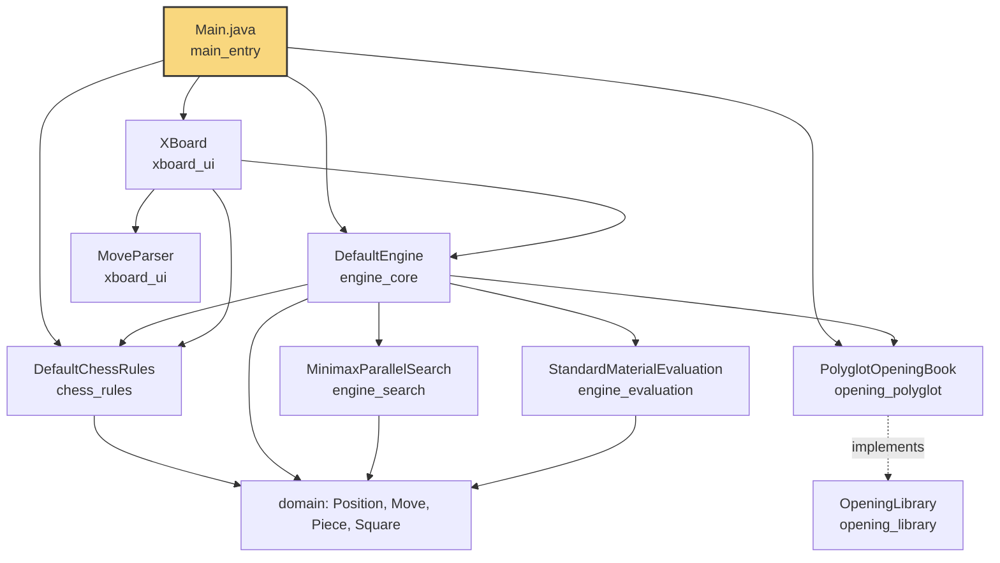
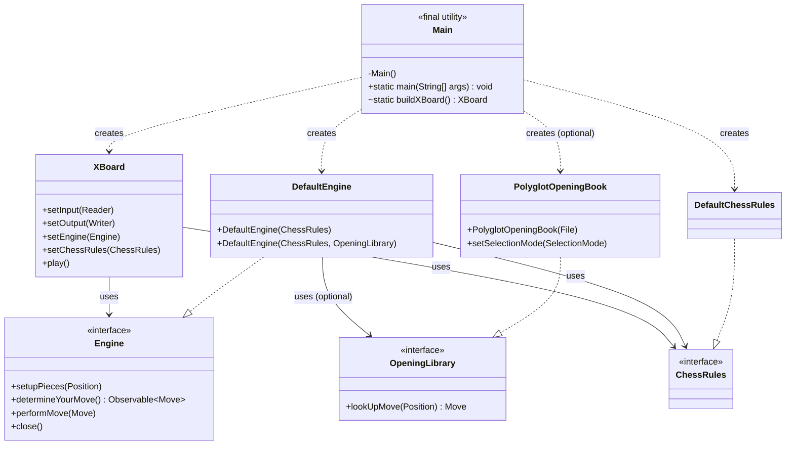
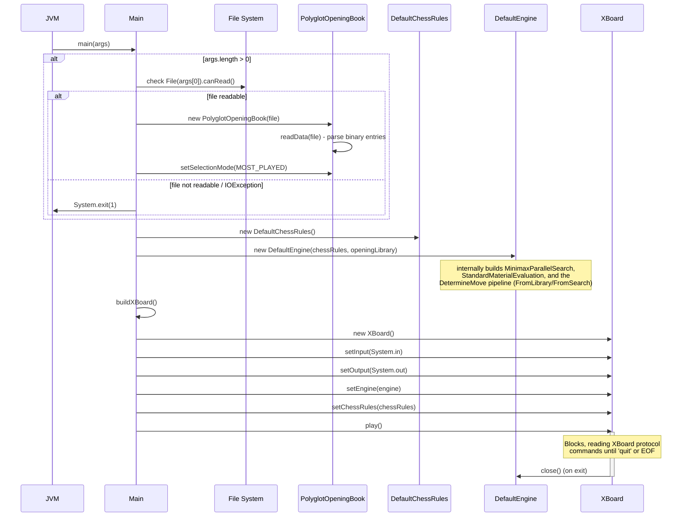
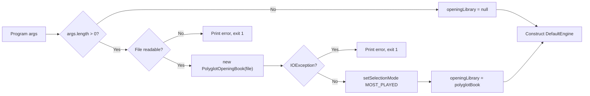
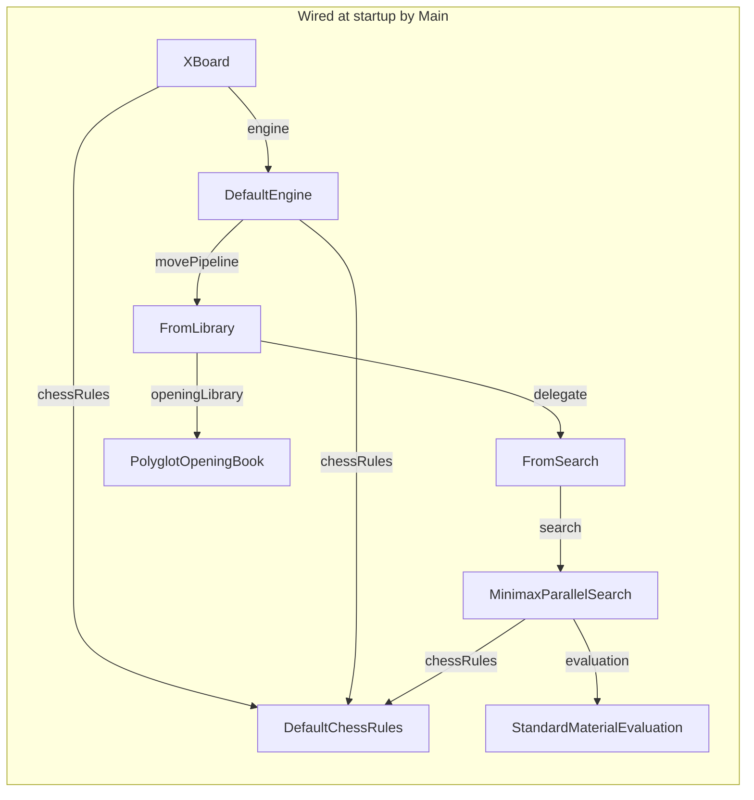
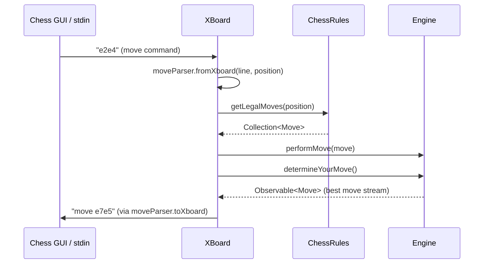

# Main Entry Module

## Introduction

The `main_entry` module is the **application bootstrap point** for DokChess. It contains a single class, `Main`, whose sole responsibility is to wire together the independently developed subsystems of the engine — chess rules, opening book, search/evaluation engine, and the XBoard text-protocol UI — into a runnable chess-playing application.

This module contains no business logic of its own. Instead, it acts as a **composition root**: it reads command-line arguments, constructs concrete implementations of the various interfaces defined elsewhere in the system, injects them into one another, and starts the main interaction loop. Understanding this module is the fastest way to understand how all the other DokChess modules fit together at runtime.

---

## Responsibilities

1. **Command-line argument handling** — optionally accepts the path to a Polyglot opening book file.
2. **Opening book initialization** — if a valid file is provided, loads a [`PolyglotOpeningBook`](opening_polyglot.md) and configures its move-selection strategy.
3. **Chess rules initialization** — creates a [`DefaultChessRules`](chess_rules.md) instance, the canonical rule engine used both by the search engine and by the UI layer for move legality checks.
4. **Engine construction** — creates a [`DefaultEngine`](engine_core.md), injecting the chess rules and (optionally) the opening library.
5. **UI construction** — builds an [`XBoard`](xboard_ui.md) instance wired to standard input/output, and injects the engine and chess rules into it.
6. **Application startup** — invokes `xBoard.play()`, which blocks and drives the entire program until termination (`quit` command or EOF).

---

## Architecture Overview

`Main` sits at the top of the dependency graph. It depends on (and assembles) the following modules:

- [`engine_core`](engine_core.md) — defines `Engine`/`DefaultEngine`, the top-level move-decision pipeline.
- [`chess_rules`](chess_rules.md) — defines `ChessRules`/`DefaultChessRules`, providing legal move generation and check/checkmate detection.
- [`opening_library`](opening_library.md) and [`opening_polyglot`](opening_polyglot.md) — provide the optional opening-book lookup capability (`OpeningLibrary`, `PolyglotOpeningBook`).
- [`xboard_ui`](xboard_ui.md) — defines `XBoard`, the console-based implementation of the [XBoard/CECP protocol](https://www.gnu.org/software/xboard/engine-intf.html) used to communicate moves to a chess GUI or another engine.

Indirectly (through the modules above), `Main` also depends on:

- [`domain`](domain.md) — core value objects (`Position`, `Move`, `Piece`, `Square`, etc.) used throughout.
- [`engine_search`](engine_search.md) and [`engine_evaluation`](engine_evaluation.md) — used internally by `DefaultEngine` to perform move search and position evaluation.

---

## Component: `Main`

`Main` is a `final` utility class with a private constructor — it is never instantiated. Its public surface is limited to:

- `main(String[] args)` — the JVM entry point.
- `buildXBoard()` (package-private, used for testability) — constructs an `XBoard` wired to `System.in`/`System.out`.

### Class Diagram

---

## Startup Sequence

The following sequence diagram illustrates exactly what happens when the JVM invokes `Main.main(args)`.

---

## Configuration: Opening Book Selection

`Main` accepts a single optional command-line argument: the path to a Polyglot-format opening book (`.bin`) file. This flows into the [`opening_polyglot`](opening_polyglot.md) module.

When `openingLibrary` is non-null, `DefaultEngine` prepends a `FromLibrary` move-decision stage that first tries to find a book move via `PolyglotOpeningBook.lookUpMove(Position)`, falling back to full search (`FromSearch`) when no matching book entry exists. See [`engine_core`](engine_core.md) for details of the `DetermineMove` pipeline (`FromLibrary` / `FromSearch`).

Note: `SelectionMode.MOST_PLAYED` is hard-coded in `Main`; other modes (`FIRST`, `RANDOM`) exist in the `opening_polyglot` module but are not currently exposed via command-line configuration.

---

## Runtime Object Graph

Once construction completes, the following object graph exists for the lifetime of the process:

If no opening book file is supplied, the `FromLibrary` stage is omitted and `DefaultEngine`'s move pipeline is simply `FromSearch` directly.

---

## Interaction with the Chess GUI (End-to-End Flow)

At a high level, once `xBoard.play()` is running, `Main`'s wiring enables the following end-to-end flow, fully detailed in [`xboard_ui`](xboard_ui.md):

---

## Testing Considerations

- `Main.buildXBoard()` is package-private specifically to allow test harnesses (see [`integration_tests`](integration_tests.md), e.g. `XBoardIntegTest`) to construct an `XBoard` without going through `System.in`/`System.out`, by substituting `setInput`/`setOutput` with in-memory streams.
- Because `main()` calls `System.exit(1)` on configuration errors, it is generally not unit-tested directly; integration tests instead exercise `XBoard` and `Engine` wiring independently or via the assembled pipeline in `EngineVsRandomIntegTest`.

---

## Summary

| Aspect | Detail |
|---|---|
| Entry point | `org.dokchess.Main.main(String[])` |
| Command-line args | Optional path to a Polyglot opening book file |
| Constructs | `DefaultChessRules`, `PolyglotOpeningBook` (optional), `DefaultEngine`, `XBoard` |
| Delegates execution to | `XBoard.play()` (blocking loop) |
| Exit codes | `0` on normal quit; `1` on unreadable/invalid opening book file |

For details on the systems assembled here, see:
- [`domain`](domain.md) — core chess value types
- [`chess_rules`](chess_rules.md) — legal move generation and game-state rules
- [`engine_core`](engine_core.md) — engine interface and move-decision pipeline
- [`engine_search`](engine_search.md) — minimax search algorithms
- [`engine_evaluation`](engine_evaluation.md) — position evaluation strategies
- [`opening_library`](opening_library.md) / [`opening_polyglot`](opening_polyglot.md) — opening book abstractions and Polyglot format support
- [`xboard_ui`](xboard_ui.md) — XBoard/CECP protocol implementation
- [`integration_tests`](integration_tests.md) — end-to-end tests exercising the assembled application
