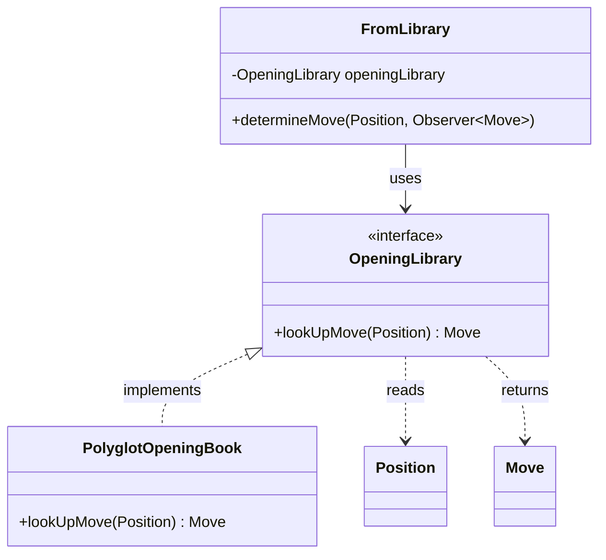
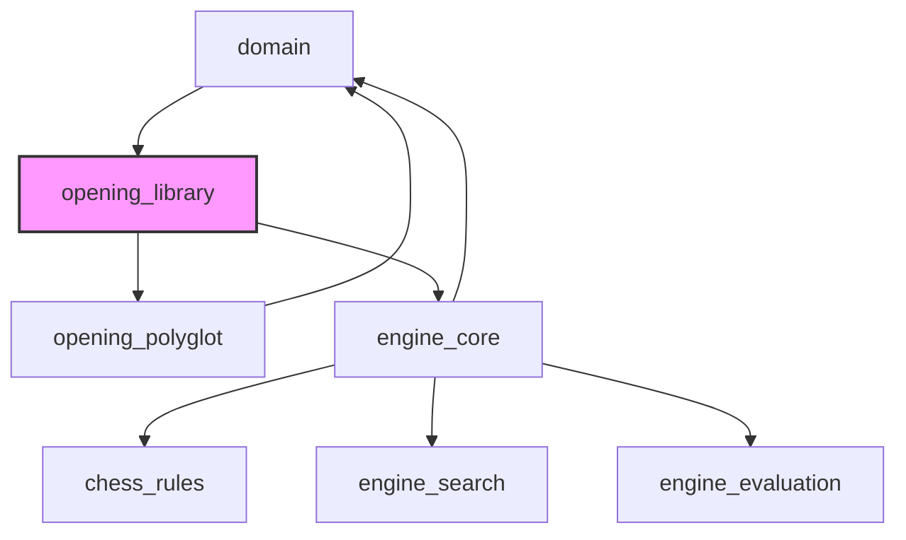
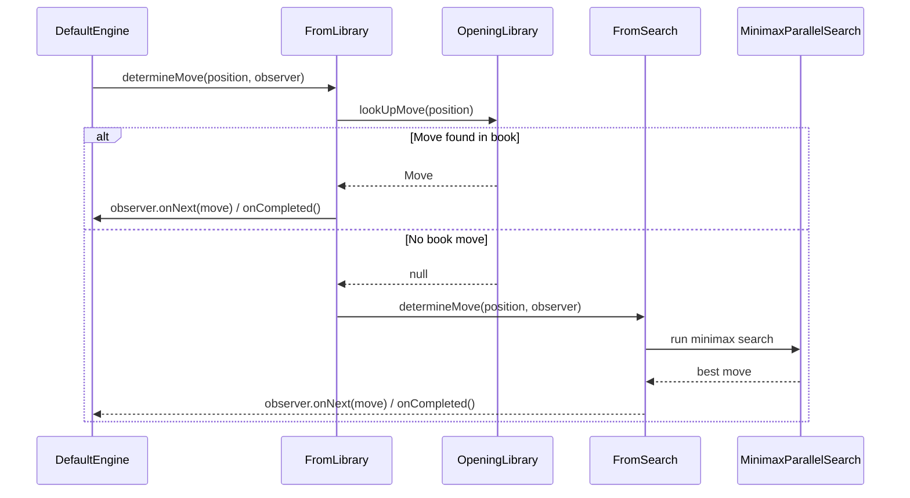
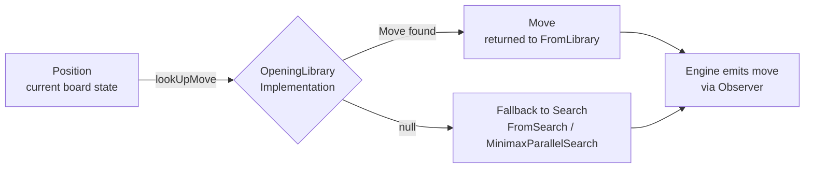

# Opening Library Module

## Introduction

The **opening_library** module defines the core abstraction used by the DokChess engine to consult a pre-computed database of known chess openings before falling back to its own search algorithm. It consists of a single, minimal interface — `OpeningLibrary` — that decouples the engine's move-determination pipeline from any specific opening-book implementation (such as the Polyglot format book provided by the [opening_polyglot](opening_polyglot.md) module).

By programming against this interface, the [engine_core](engine_core.md) module can transparently use any opening book implementation without needing to know the details of file formats, lookup algorithms, or storage structures.

---

## Purpose and Core Functionality

Chess engines typically avoid expensive search computations during the opening phase of a game by consulting a library of well-known, strong opening moves compiled by human experts or historical game databases. The `opening_library` module formalizes this concept as a single-method contract:

```java
public interface OpeningLibrary {
    Move lookUpMove(Position position);
}
```

### Contract semantics

| Aspect | Description |
|---|---|
| **Input** | A [`Position`](domain.md) object representing the current state of the chess board (piece placement, side to move, castling rights, en passant square). |
| **Output** | A [`Move`](domain.md) object representing a known/recommended move for that position, or `null` if the position is not found in the library (i.e., the game has left "book"). |
| **Side effects** | None — implementations are expected to be read-only lookups against a pre-loaded data source. |

This module intentionally contains **no implementation logic**. It exists purely to establish a clean extension point (following the Dependency Inversion Principle) so that:

1. The engine's move pipeline (`FromLibrary`, see below) can depend on an abstraction rather than a concrete opening-book format.
2. New opening book formats/sources can be added in the future (e.g., PGN-derived books, ECO-classified books) simply by implementing this interface — without any changes to `engine_core`.

---

## Architecture

### Component Overview



- **`OpeningLibrary`** (this module) — the abstraction.
- **`PolyglotOpeningBook`** — the concrete implementation provided by [opening_polyglot](opening_polyglot.md), which parses the industry-standard Polyglot `.bin` opening book format.
- **`FromLibrary`** — a link in the engine's move-determination chain (part of [engine_core](engine_core.md)) that consumes an `OpeningLibrary` instance.

### Module Dependency Diagram



`opening_library` sits between the low-level [domain](domain.md) model (which supplies `Position` and `Move`) and the higher-level [engine_core](engine_core.md) and [opening_polyglot](opening_polyglot.md) modules, which respectively *consume* and *implement* the interface.

---

## Integration with the Engine

The `OpeningLibrary` interface is consumed exclusively through the `FromLibrary` class in [engine_core](engine_core.md). `FromLibrary` is one link in a chain-of-responsibility style pipeline (`DetermineMove`) used by `DefaultEngine` to decide on a move:



### Pipeline construction

`DefaultEngine` wires the pipeline conditionally, based on whether an `OpeningLibrary` instance was supplied at construction time:

```java
FromSearch fromSearch = new FromSearch(minimax);

if (openingLibrary != null) {
    this.movePipeline = new FromLibrary(openingLibrary, fromSearch);
} else {
    this.movePipeline = fromSearch;
}
```

This design means:
- If no `OpeningLibrary` is provided, the engine always searches (via [engine_search](engine_search.md) and [engine_evaluation](engine_evaluation.md)).
- If an `OpeningLibrary` **is** provided (typically a `PolyglotOpeningBook`), the engine first attempts a book lookup, only falling back to search when the position is unknown to the book (i.e., `lookUpMove` returns `null`).

For full details of the move-determination pipeline (`DetermineMove`, `FromSearch`, `Engine`), see the [engine_core](engine_core.md) documentation.

---

## Data Flow



1. The engine passes the current `Position` (from [domain](domain.md)) to `lookUpMove`.
2. A concrete `OpeningLibrary` implementation (e.g. `PolyglotOpeningBook`) encodes the position (e.g., to FEN, then to a Zobrist-style hash key) and searches its internal data structure.
3. If a matching entry is found, a `Move` is constructed and returned.
4. If no entry is found, `null` is returned, signaling the caller (`FromLibrary`) to defer to the search-based move pipeline.

---

## Relationship to Other Modules

| Module | Relationship |
|---|---|
| [domain](domain.md) | Supplies the `Position` and `Move` types used in the interface signature. `OpeningLibrary` has no dependency beyond these core domain types. |
| [opening_polyglot](opening_polyglot.md) | Provides `PolyglotOpeningBook`, the primary production implementation of `OpeningLibrary`, based on the binary Polyglot opening book format. It converts `Position` to FEN/Zobrist keys via `FenTools`/`PolyglotTools` and parses `BookEntry` records. |
| [engine_core](engine_core.md) | Consumes `OpeningLibrary` through the `FromLibrary` pipeline stage, integrating book lookups into the overall move-determination process (`DefaultEngine`). |
| [engine_search](engine_search.md) / [engine_evaluation](engine_evaluation.md) | Represent the fallback path used when the opening library has no data for the current position. |

---

## Extensibility

Because `OpeningLibrary` is a minimal, single-method interface, developers can easily create alternative implementations, for example:

- An in-memory book built from a curated list of `Position` → `Move` mappings for testing purposes.
- A book backed by a different serialized format (e.g., CTG, ABK) by implementing custom parsing logic while still honoring the `lookUpMove(Position): Move` contract.
- A composite/aggregate library that queries multiple underlying books and merges/prioritizes results.

Any such implementation can be injected into `DefaultEngine` (via its constructor, see [engine_core](engine_core.md)) without requiring modifications to the engine's pipeline logic.

---

## Summary

The `opening_library` module is deliberately small in scope — a single interface — but it plays an important architectural role: it isolates the engine's opening-book behavior behind a clean abstraction, enabling separation of concerns between:

- **What** the engine needs (a move recommendation for a given position, or an indication that none exists), and
- **How** that recommendation is produced (file format, storage, lookup algorithm — implemented in [opening_polyglot](opening_polyglot.md) or other future providers).

This mirrors the broader system design philosophy seen across DokChess, where core engine behavior ([engine_core](engine_core.md)) is composed of pluggable strategies for move search ([engine_search](engine_search.md)), position evaluation ([engine_evaluation](engine_evaluation.md)), and — as documented here — opening book lookups.
