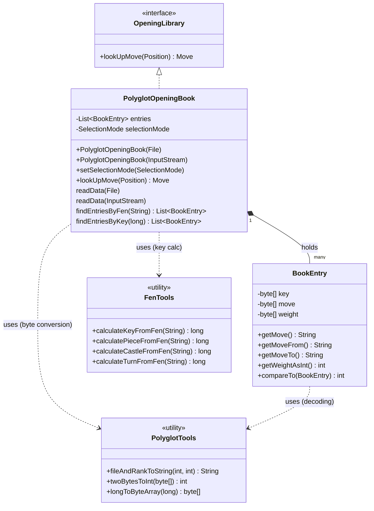
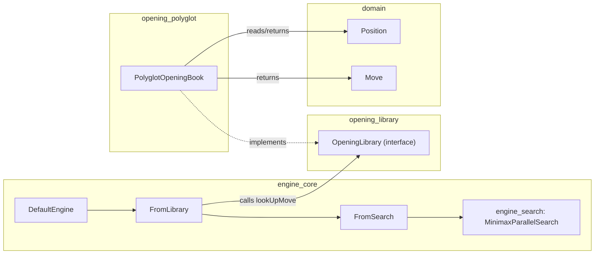
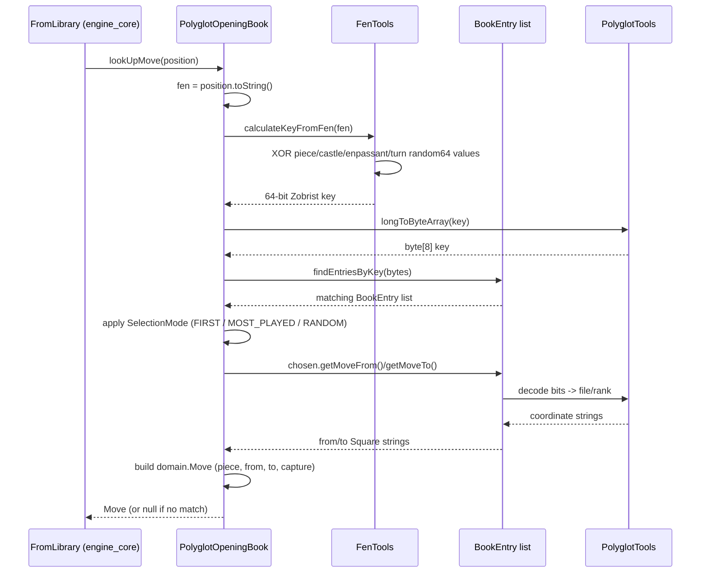

# Opening Polyglot Module

## Introduction

The `opening_polyglot` module provides a concrete implementation of the [`OpeningLibrary`](opening_library.md) interface that reads and queries chess opening books in the **Polyglot binary format** — a widely-used, compact, hash-indexed format for storing precomputed opening moves.

Instead of calculating opening moves through search, the DokChess [`engine_core`](engine_core.md) can consult a Polyglot opening book to instantly retrieve strong, well-known moves for the early part of a game. This module is the bridge between a `.bin` Polyglot book file and the domain-level (`Move`, `Position`) types used throughout the rest of the engine.

### Responsibilities

* Parse raw Polyglot book files (or input streams) into structured in-memory entries.
* Compute a **Zobrist-style hash key** from a given chess position (expressed as [FEN](domain.md)) so that book entries can be looked up efficiently.
* Decode compact 2-byte move encodings into standard board coordinates.
* Expose a single public entry point, `PolyglotOpeningBook`, implementing the `OpeningLibrary` contract so it can be plugged transparently into the engine's move-determination pipeline.

## Architecture Overview

The module is intentionally small and self-contained, consisting of four classes, only one of which (`PolyglotOpeningBook`) is public:

### How it Fits Into the System

The module depends on:

* [`domain`](domain.md) — for the `Position`, `Move`, `Square`, and `Piece` types that represent chess state and moves in the engine.
* [`opening_library`](opening_library.md) — for the `OpeningLibrary` interface contract that this module implements.

It is consumed by:

* [`engine_core`](engine_core.md) — specifically the `DefaultEngine` and `FromLibrary` classes, which use an `OpeningLibrary` (optionally a `PolyglotOpeningBook`) as the first stage of the move-determination pipeline, falling back to [`engine_search`](engine_search.md) when no book move is found.

## Data Flow: Looking Up a Move

When the engine asks the opening book for a move, the following sequence occurs:

## Sub-modules

Because this module is compact but has clearly separable concerns (public API/orchestration vs. low-level binary/hash decoding), its documentation is split as follows:

| Sub-module | Description | Documentation |
|---|---|---|
| **Book Access** | The public `PolyglotOpeningBook` class: file/stream loading, move selection strategy, and integration with the `OpeningLibrary` contract. | [opening_polyglot_book_access.md](opening_polyglot_book_access.md) |
| **Binary & Hashing Utilities** | The internal `BookEntry`, `FenTools`, and `PolyglotTools` classes: Polyglot binary record parsing, Zobrist hash key computation from FEN, and low-level byte/bit conversions. | [opening_polyglot_binary_utils.md](opening_polyglot_binary_utils.md) |

## Key Concepts

### The Polyglot Format

A Polyglot opening book is a flat binary file consisting of consecutive 16-byte records, each containing:

| Bytes | Field | Meaning |
|---|---|---|
| 0–7 | `key` | 64-bit Zobrist hash of the board position |
| 8–9 | `move` | Bit-packed encoding of from/to square and promotion/castling flags |
| 10–11 | `weight` | Relative popularity/strength weight, used to pick among several moves for the same position |

Records for the same position (same key) may appear multiple times with different candidate moves and weights; a lookup therefore scans for **all** entries whose key matches and then selects one according to a chosen strategy.

### Selection Modes

`PolyglotOpeningBook` supports selecting among several matching book moves via `SelectionMode`:

* **FIRST** – always the first entry found for the position (default).
* **MOST_PLAYED** – entries sorted descending by weight, picking the most common/strongest continuation.
* **RANDOM** – entries shuffled, adding variety to engine play.

## Related Documentation

* [domain](domain.md) — Core chess domain model (`Position`, `Move`, `Square`, `Piece`, FEN parsing).
* [opening_library](opening_library.md) — The `OpeningLibrary` interface implemented by this module.
* [engine_core](engine_core.md) — Consumes `OpeningLibrary` implementations (including this one) as the first stage of move determination, before falling back to search.
* [engine_search](engine_search.md) — The fallback search strategy used once the opening book has no more moves for the current position.
