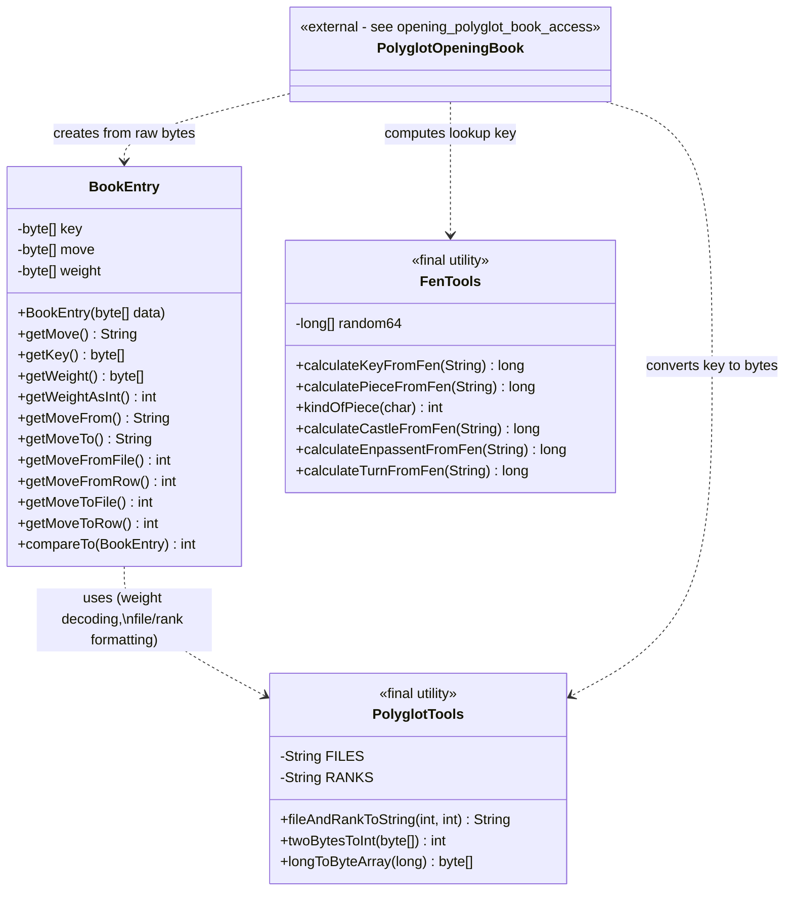
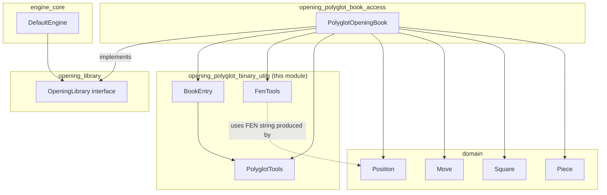
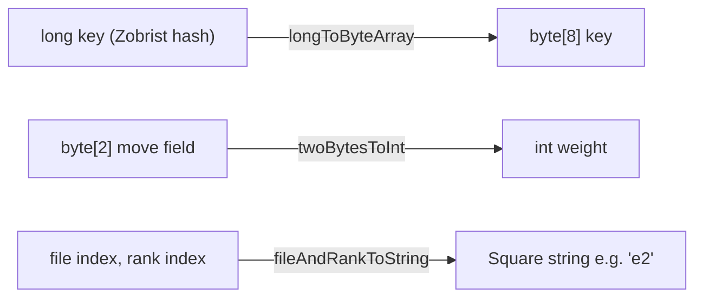
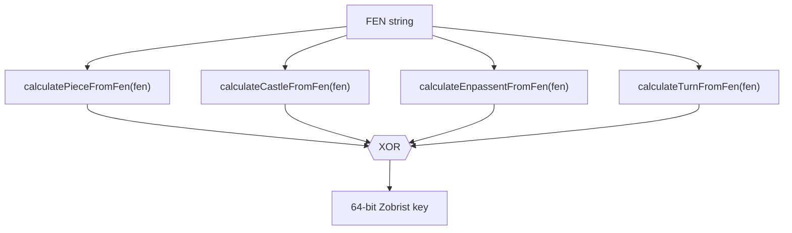
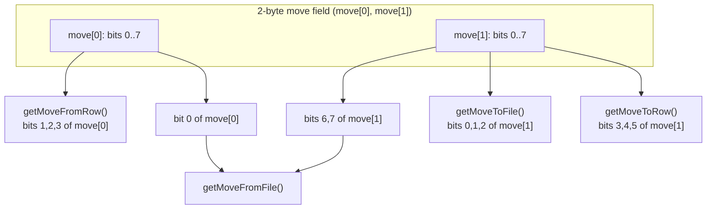
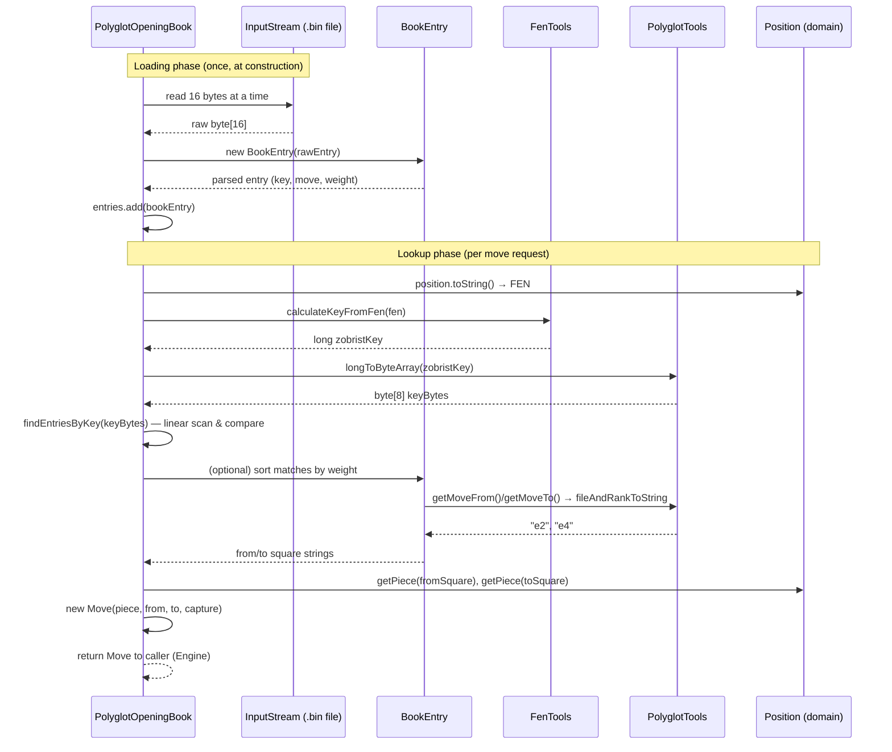
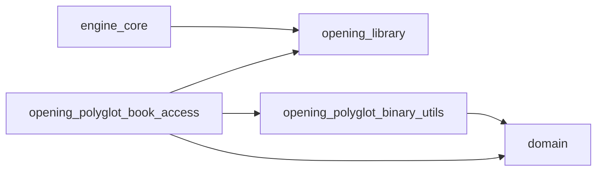

# Opening Polyglot Binary Utils

## Introduction

The **opening_polyglot_binary_utils** module provides the low-level binary and
encoding utilities required to read and interpret **Polyglot opening book**
files (`.bin`). Polyglot is a widely-used, compact, binary format for storing
chess opening moves indexed by a 64-bit Zobrist-style hash of the board
position.

This module is a support layer for [opening_polyglot_book_access](opening_polyglot_book_access.md)
(specifically the `PolyglotOpeningBook` class), which implements the
[opening_library](opening_library.md) `OpeningLibrary` interface used by the
chess engine to pick "book" moves before falling back to search. The
binary-utils module itself contains **no public API** — it is a package-private
toolbox consumed exclusively by `PolyglotOpeningBook` within the same Java
package (`org.dokchess.opening.polyglot`).

It consists of three package-private classes:

| Class | Responsibility |
|---|---|
| `BookEntry` | Parses a single 16-byte Polyglot record into a hash key, a move, and a "weight" (popularity/priority). |
| `FenTools` | Computes the 64-bit Polyglot Zobrist hash key for a position expressed in FEN notation. |
| `PolyglotTools` | Low-level bit/byte conversion helpers shared by `BookEntry` and `FenTools` (and used directly by `PolyglotOpeningBook`). |

---

## Module Purpose

Polyglot book files are a sequence of fixed-size 16-byte binary entries, sorted
by hash key. Each entry encodes:

* an 8-byte **Zobrist hash key** representing a board position,
* a 2-byte **move** (from-square, to-square, and promotion bits packed into 16 bits),
* a 2-byte **weight** (an unsigned integer indicating how often/likely this move should be played).

To make use of such a file, an opening book reader needs to:

1. **Compute the same 64-bit Zobrist hash** for the *current* game position
   that was used when the book was generated (`FenTools`).
2. **Decode raw 16-byte binary records** into structured Java objects
   (`BookEntry`).
3. **Convert between primitive binary representations** (bytes ↔ ints ↔
   longs, and square coordinates ↔ file/rank indices) consistently across
   both of the above (`PolyglotTools`).

This module implements exactly those three concerns, keeping all
Polyglot-format-specific bit manipulation isolated from the rest of the
domain and engine code.

---

## Architecture

### Component Overview



All three classes are **package-private** (`BookEntry`, `FenTools`,
`PolyglotTools` have no `public` modifier), reflecting their role as internal
implementation detail of the `org.dokchess.opening.polyglot` package. Only
`PolyglotOpeningBook` (documented in
[opening_polyglot_book_access](opening_polyglot_book_access.md)) exposes a
public API to the rest of the system.

### Module Placement in the System



See [engine_core](engine_core.md) for how `DefaultEngine` consults the
`OpeningLibrary` before invoking search, and [domain](domain.md) for the
`Position`, `Move`, `Square`, and `Piece` types referenced here.

---

## Component Details

### `PolyglotTools` — Bit/Byte Conversion Primitives

`PolyglotTools` is a stateless, non-instantiable (`private` constructor)
utility class providing three conversions used throughout the Polyglot
format:

* **`fileAndRankToString(int file, int rank)`** — Converts zero-based file
  (0–7 → `a`–`h`) and rank (0–7 → `1`–`8`) indices into a two-character
  algebraic square name (e.g. `(4, 1)` → `"e2"`). Used by `BookEntry` to turn
  decoded from/to-square indices into strings that can be converted into
  `Square` objects from the [domain](domain.md) module.

* **`twoBytesToInt(byte[] source)`** — Interprets a 2-byte big-endian array
  as an unsigned 16-bit integer. Used by `BookEntry.getWeightAsInt()` to
  decode the move's popularity weight.

* **`longToByteArray(long source)`** — Converts a 64-bit Java `long` into
  an 8-byte array via a binary-string round-trip. This is the inverse
  operation needed to turn a computed Zobrist key (a `long`, from
  `FenTools`) into the byte-array form used for binary comparison against
  the 8-byte keys stored in each `BookEntry`.



### `FenTools` — Polyglot Zobrist Key Calculation

`FenTools` computes the standard **Polyglot 64-bit Zobrist hash** for a given
position expressed as a FEN string (as produced by
[`Position.toString()`](domain.md) / [`ForsythEdwardsNotation`](domain.md)).

It uses a fixed, publicly-documented **table of 781 pre-generated random
64-bit constants** (`random64`) — this is the canonical Polyglot random
table, ensuring hash compatibility with any standard Polyglot `.bin` book
regardless of which tool generated it.

The key is computed as the **XOR** of four independently-derived components:



Details of each component:

| Method | Description |
|---|---|
| `calculatePieceFromFen` | Iterates each rank/file of the FEN board layout; for every piece found, XORs in `random64[64 * kindOfPiece + 8 * rank + file]`. |
| `kindOfPiece` | Maps a FEN piece character (`pPnNbBrRqQkK`) to its index (0–11) in the Polyglot piece-kind ordering. |
| `calculateCastleFromFen` | XORs in one of `random64[768..771]` for each of the four castling rights (`K`, `Q`, `k`, `q`) present in the FEN castling field. |
| `calculateEnpassentFromFen` | **Not implemented** — always returns `0`. This is a known simplification: en passant target square hashing (as per the full Polyglot spec) is not currently supported, which may cause hash mismatches immediately after a double pawn push is possible. |
| `calculateTurnFromFen` | XORs in `random64[780]` if it is White's turn to move (`w`), otherwise contributes `0`. |

> **Note:** Because `calculateEnpassentFromFen` is a stub, book lookups will
> not exactly match reference Polyglot implementations in en-passant-eligible
> positions. This is an implementation detail maintainers should be aware of
> when debugging book-move mismatches.

### `BookEntry` — Decoding a Single Binary Record

Each Polyglot book entry is a fixed **16-byte** binary blob:

```
byte offset:  0        7 8    9 10   11
              +--------+ +----+ +----+
              |  key   | |move| |wgt |
              +--------+ +----+ +----+
              (8 bytes)  (2 B)  (2 B)
```

`BookEntry`'s constructor slices this raw byte array into three fields:

* `key` (8 bytes) — the Zobrist hash of the position this move applies to.
* `move` (2 bytes) — packed bit-fields for from/to file & rank (and,
  per the Polyglot spec, promotion piece — not decoded by this
  implementation).
* `weight` (2 bytes) — a relative popularity/priority score.

**Move bit-decoding.** The 16-bit `move` field packs six 3-bit coordinates
(from-file, from-rank, to-file, to-rank, promotion-piece, plus an unused bit)
into 2 bytes. `BookEntry` decodes only what's needed for basic move
representation:



These decoded file/rank pairs are converted to human-readable square strings
(`"e2"`, `"e4"`, …) via `PolyglotTools.fileAndRankToString`, and concatenated
by `getMove()` to produce a UCI-like move string (e.g. `"e2e4"`).

**Ordering.** `BookEntry implements Comparable<BookEntry>`, sorting
**descending by weight** (`compareTo` returns `other.weight - this.weight`).
This lets `PolyglotOpeningBook` easily pick the *most-played* move when
multiple book entries share the same position key (see `SelectionMode` in
[opening_polyglot_book_access](opening_polyglot_book_access.md)).

---

## Data Flow: From Book File to Chess Move

The following sequence illustrates how the classes in this module
collaborate — driven by `PolyglotOpeningBook` — to turn a raw `.bin` file and
a live `Position` into a `Move`.



---

## Relationship to Other Modules

* **[opening_polyglot_book_access](opening_polyglot_book_access.md)** — the
  sole consumer of this module. `PolyglotOpeningBook` reads the binary book
  file, delegates hash calculation to `FenTools`, delegates byte/int/square
  conversions to `PolyglotTools`, and wraps raw records via `BookEntry`.
* **[opening_library](opening_library.md)** — defines the `OpeningLibrary`
  interface (`lookUpMove(Position): Move`) that `PolyglotOpeningBook`
  implements; this module has no direct dependency on it but exists to
  support that implementation.
* **[domain](domain.md)** — supplies `Position`, `Move`, `Square`, and
  `Piece`, which the FEN string (input to `FenTools`) is derived from, and
  which the decoded `BookEntry` data is ultimately converted into.
* **[engine_core](engine_core.md)** — `DefaultEngine` calls `OpeningLibrary.lookUpMove`
  before falling back to [engine_search](engine_search.md), making this
  module part of the "book move" fast-path of move determination
  (`FromLibrary` vs. `FromSearch` results, see `DetermineMove`).



---

## Design Notes & Constraints

* **Package-private visibility**: None of `BookEntry`, `FenTools`, or
  `PolyglotTools` are `public`. They are implementation details that
  intentionally cannot be used outside `org.dokchess.opening.polyglot`. Any
  future public API for Polyglot binary parsing would need to be exposed
  through `PolyglotOpeningBook` or a new public wrapper.
* **Immutability & statelessness**: `FenTools` and `PolyglotTools` are
  `final` classes with only `static` methods and `private` constructors —
  they hold no mutable state (aside from the constant `random64` table) and
  are inherently thread-safe.
* **`BookEntry` is a simple immutable value holder** wrapping three `byte[]`
  fields, exposing only accessor/decoding methods and a natural ordering by
  weight.
* **Known limitation**: en passant is not factored into the Zobrist key
  (`calculateEnpassentFromFen` always returns `0`), a deviation from the
  official Polyglot specification that may affect lookup accuracy in rare
  positions.
* **Promotion moves are not decoded**: `BookEntry` does not currently expose
  promotion-piece information encoded in the move field's higher bits,
  meaning promotion moves from the book may be incompletely represented.
