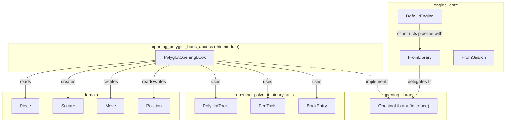
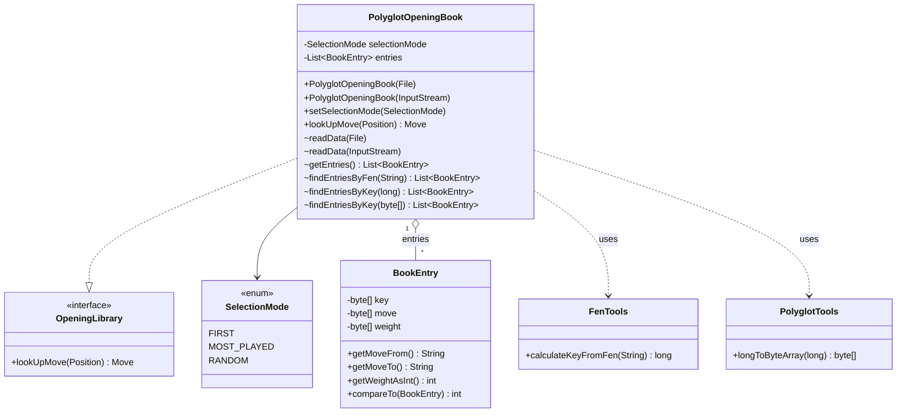
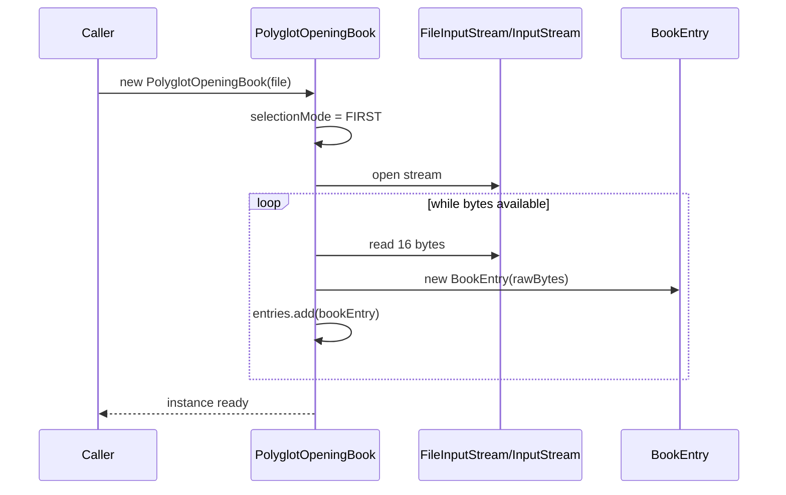
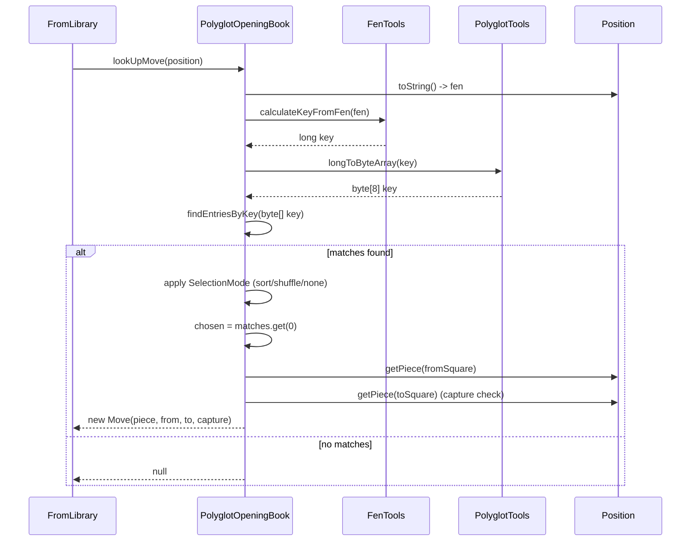
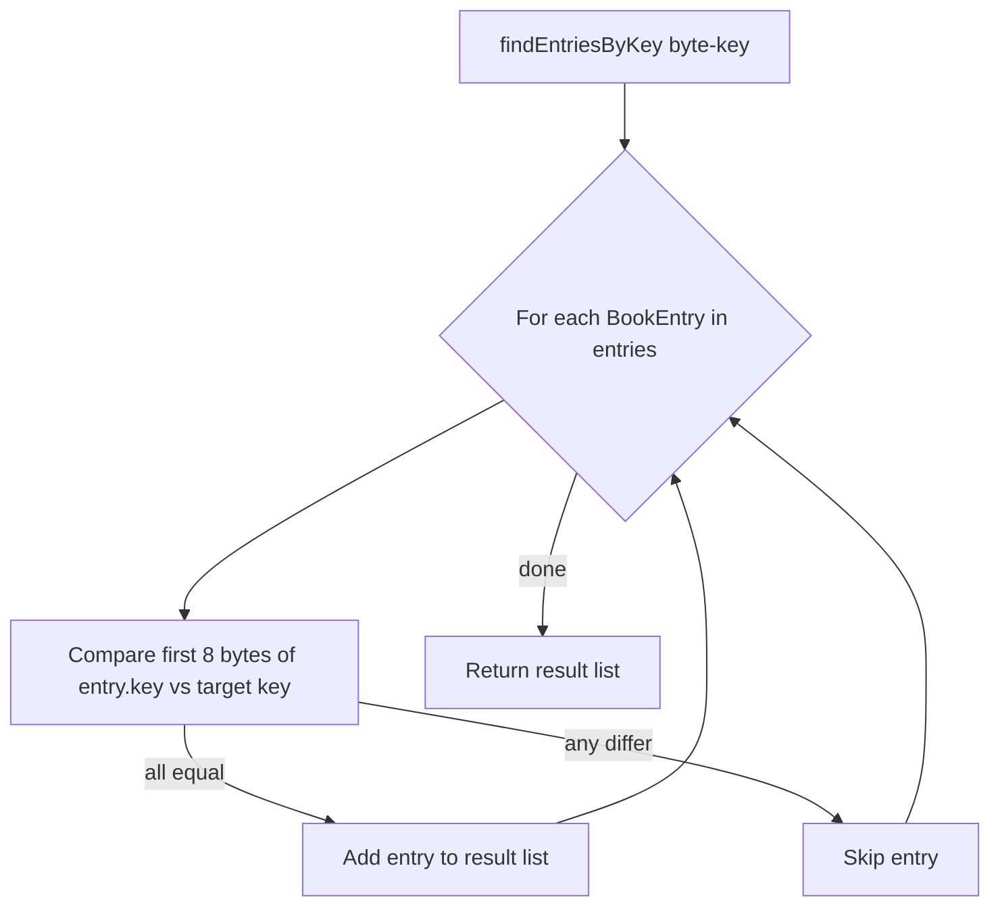
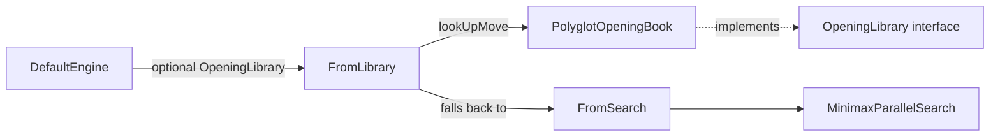

# Opening Polyglot Book Access

## Introduction

The **opening_polyglot_book_access** module provides the concrete implementation of the [`OpeningLibrary`](opening_library.md) contract for the widely-used **Polyglot** opening book binary format. Its single core component, `PolyglotOpeningBook`, loads a `.bin` opening book file into memory and answers "what move should I play in this position?" queries by translating a chess `Position` into a Polyglot Zobrist hash key, searching the loaded entries for matches, and converting the winning binary entry back into a domain-level `Move`.

This module is the bridge between the low-level binary decoding utilities in [opening_polyglot_binary_utils](opening_polyglot_binary_utils.md) and the rest of the DokChess engine, most notably the [engine_core](engine_core.md) move-determination pipeline (`FromLibrary`), which consults an opening book before falling back to tree search.

---

## 1. Purpose & Responsibilities

| Responsibility | Description |
|---|---|
| **Book loading** | Reads a Polyglot `.bin` file (or `InputStream`) fully into memory as a list of 16-byte `BookEntry` records. |
| **Position lookup** | Implements `OpeningLibrary.lookUpMove(Position)` — converts a `Position` to its FEN string, computes the corresponding Polyglot Zobrist key, and finds all matching book entries. |
| **Move selection strategy** | Supports pluggable selection among multiple matching entries via `SelectionMode` (`FIRST`, `MOST_PLAYED`, `RANDOM`). |
| **Domain translation** | Converts the raw from/to square encoding stored in a `BookEntry` into a domain `Move` object, including capture detection. |

The module intentionally keeps all binary-format knowledge (Zobrist hashing, bit-packed move encoding) delegated to the sibling module `opening_polyglot_binary_utils`, keeping `PolyglotOpeningBook` focused purely on orchestration: I/O, matching, and domain object construction.

---

## 2. Position in the Overall System



Related documentation:
- [opening_library.md](opening_library.md) — the `OpeningLibrary` interface this module implements.
- [opening_polyglot_binary_utils.md](opening_polyglot_binary_utils.md) — binary parsing/hashing utilities consumed by this module.
- [engine_core.md](engine_core.md) — the consumer of this module (`FromLibrary` / `DefaultEngine`).
- [domain.md](domain.md) — the chess domain model (`Position`, `Move`, `Square`, `Piece`).

---

## 3. Core Component: `PolyglotOpeningBook`

### 3.1 Class Structure



### 3.2 Key Fields

- `selectionMode: SelectionMode` — determines which entry to pick when multiple book moves match the current position. Defaults to `FIRST` (order as stored in the file, which per the Polyglot format is typically sorted by key).
- `entries: List<BookEntry>` — in-memory representation of every 16-byte record in the book file, populated once at construction time.

### 3.3 Construction & Loading

`PolyglotOpeningBook` offers two constructors:

- `PolyglotOpeningBook(File file)`
- `PolyglotOpeningBook(InputStream inputStream)`

Both eagerly call `readData(...)`, which wraps the stream in a `BufferedInputStream` and reads the entire book 16 bytes at a time, wrapping each chunk in a `BookEntry` (see [opening_polyglot_binary_utils](opening_polyglot_binary_utils.md)).



Because the whole file is buffered into `entries` up-front, lookups are pure in-memory operations after construction — there is no per-query disk I/O.

### 3.4 Move Lookup Flow

`lookUpMove(Position position)` is the single method required by `OpeningLibrary`. Its algorithm:

1. Convert the `Position` to its FEN string (`position.toString()`, delegating to `ForsythEdwardsNotation` in [domain](domain.md)).
2. Compute the Polyglot Zobrist key for that FEN via `FenTools.calculateKeyFromFen(fen)`.
3. Find all `BookEntry` records whose stored 8-byte key matches the computed key (byte-by-byte comparison via `findEntriesByKey`).
4. If matches exist, order them per `selectionMode`:
   - `MOST_PLAYED` → sort entries (BookEntry's natural ordering is by descending weight).
   - `RANDOM` → shuffle entries.
   - `FIRST` → leave order untouched (first entry as stored/loaded).
5. Take the first entry from the (possibly reordered) list.
6. Decode `moveFrom` / `moveTo` squares from the entry, look up the moving piece on the current `Position`, detect whether the destination square is occupied (capture), and build a `Move`.
7. If no entries match, return `null` (signaling "book has no move here").



### 3.5 Entry Matching (`findEntriesByKey`)



This is a linear scan (`O(n)` in the number of book entries) — acceptable given book sizes are loaded once and reused, and typical opening books, while large, are still scanned quickly in memory for this per-move lookup use case.

---

## 4. Selection Modes

| Mode | Behavior | Typical Use |
|---|---|---|
| `FIRST` (default) | Takes the first matching entry as encountered/loaded, without reordering. | Deterministic behavior, useful for testing/reproducibility. |
| `MOST_PLAYED` | Sorts matches by descending weight (`BookEntry.compareTo`) and picks the top one — the historically most-played/most-recommended move. | Strongest/most "book-standard" play. |
| `RANDOM` | Shuffles matches and picks one at random. | Adds variety to the engine's opening repertoire across games. |

Selection mode is configured via `setSelectionMode(SelectionMode)` and can be changed at any time after construction (affects all subsequent lookups).

---

## 5. Dependencies

### 5.1 Upstream Dependencies (what this module relies on)

- **[opening_library](opening_library.md)** — provides the `OpeningLibrary` interface that `PolyglotOpeningBook` implements, decoupling the engine's move pipeline from any specific opening-book format.
- **[opening_polyglot_binary_utils](opening_polyglot_binary_utils.md)**:
  - `BookEntry` — parses a raw 16-byte Polyglot record into key/move/weight fields and decodes move squares.
  - `FenTools` — computes the Polyglot Zobrist hash key from a FEN string (piece placement, castling rights, side to move).
  - `PolyglotTools` — low-level bit/byte conversion helpers (long↔byte array, file/rank string formatting, 2-byte weight decoding).
- **[domain](domain.md)**:
  - `Position` — supplies FEN serialization and piece lookups by square.
  - `Move`, `Square`, `Piece` — domain types used to represent the decoded book move.

### 5.2 Downstream Consumers (what relies on this module)

- **[engine_core](engine_core.md)**:
  - `FromLibrary` holds an `OpeningLibrary` reference (commonly a `PolyglotOpeningBook` instance) and consults it first in the move-determination chain, before falling back to `FromSearch` (minimax-based search from [engine_search](engine_search.md)).
  - `DefaultEngine` wires an optional `OpeningLibrary` into its `movePipeline`, prepending a `FromLibrary` step when one is supplied.



---

## 6. Usage Example

```java
// Load a Polyglot book from disk
PolyglotOpeningBook book = new PolyglotOpeningBook(new File("books/gm2600.bin"));
book.setSelectionMode(PolyglotOpeningBook.SelectionMode.MOST_PLAYED);

// Wire it into the engine so book moves are preferred over search
ChessRules rules = new DefaultChessRules();
Engine engine = new DefaultEngine(rules, book);

// The engine will now consult the book first via FromLibrary
Observable<Move> moveObservable = engine.determineYourMove();
```

---

## 7. Design Notes & Considerations

- **Immutability of loaded data**: Once constructed, the `entries` list is not modified except during initial loading — `PolyglotOpeningBook` instances are effectively read-only book handles safe to share/query repeatedly (though not necessarily thread-synchronized for concurrent mutation of `selectionMode`).
- **No en passant / halfmove/fullmove consideration**: `FenTools.calculateEnpassentFromFen` is a stub always returning `0`, meaning the Zobrist key computed here does not factor in en-passant availability the way the full Polyglot specification does. This is a known simplification — lookups may occasionally miss or over-match entries in positions where en passant is relevant.
- **Linear scan matching**: For very large opening books, `findEntriesByKey` is `O(n)`. Given the module loads the whole book once and only performs a handful of lookups per game (one per ply while still "in book"), this trade-off favors implementation simplicity over indexing structures (e.g., a `Map<Long, List<BookEntry>>`) that could offer `O(1)` average lookup.
- **Separation of concerns**: All binary/bit-level decoding is deliberately isolated in `opening_polyglot_binary_utils`, so this module's logic reads cleanly as "load file → hash position → filter → pick → convert to domain Move" without any bit-twiddling.
