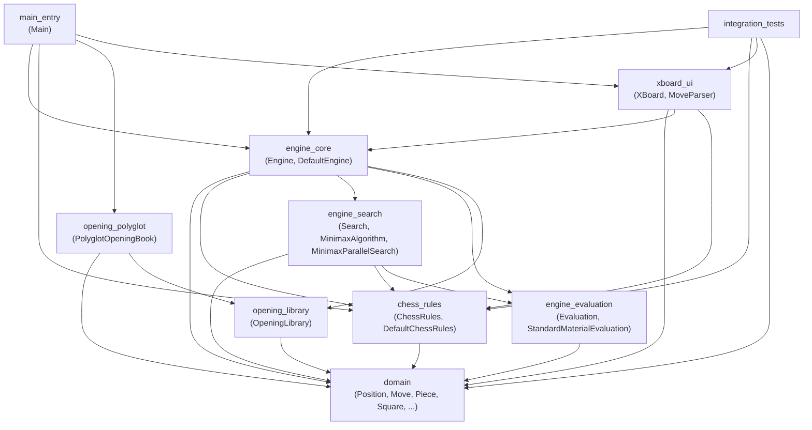
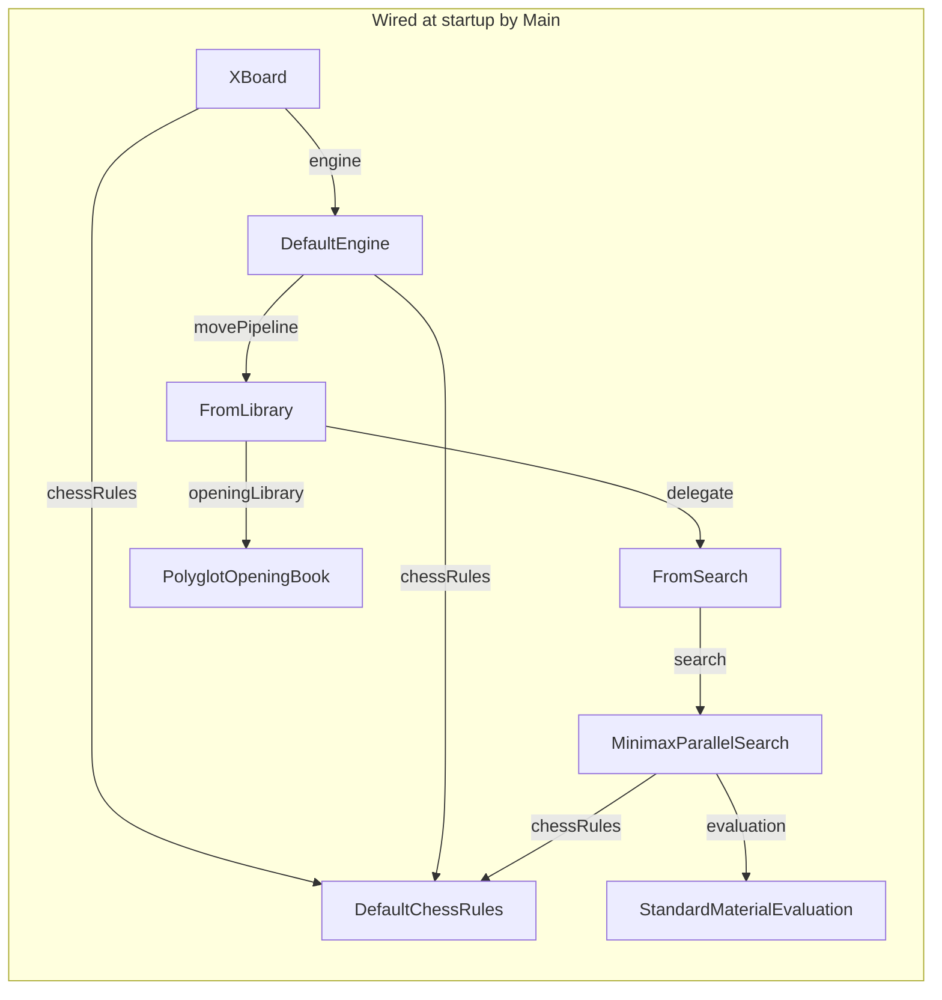
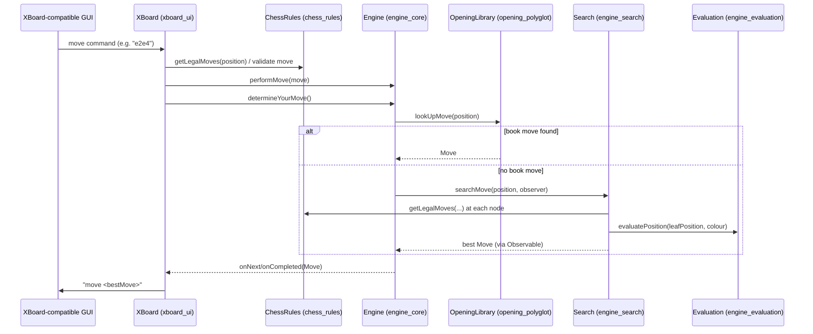

# dokchess-en-nocom Repository Overview

## Purpose

`dokchess-en-nocom` is a **Java-based chess engine** that implements the full stack required to play a game of chess programmatically: an immutable board/move data model, a complete rules engine (legal move generation, check/checkmate/stalemate detection), a search-based decision engine (minimax with parallel search and material evaluation), an optional opening-book lookup (Polyglot format), and a text-based UI adapter implementing the XBoard/WinBoard protocol so the engine can be driven by any XBoard-compatible chess GUI.

The system is designed with strong separation of concerns: each module owns a single responsibility (data modeling, rule enforcement, search, evaluation, opening books, protocol I/O), and higher-level modules compose lower-level ones through narrow interfaces (`Engine`, `ChessRules`, `Evaluation`, `Search`, `OpeningLibrary`). This makes it possible to swap implementations (e.g., a different evaluation function or opening book) without touching the rest of the system. A single composition root (`Main`) wires all of this together into a runnable application, and an integration test suite exercises the assembled system end-to-end.

## End-to-End Architecture

### Module Dependency Graph

### Runtime Composition (startup wiring performed by `main_entry`)

### End-to-End Move Flow (GUI → Engine → GUI)

## Core Modules Documentation

| Module | Description | Reference |
|---|---|---|
| **domain** | Immutable core chess data model: `Position`, `Move`, `Piece`, `Square`, `Squares`, and FEN (de)serialization via `ForsythEdwardsNotation`. The foundation every other module builds on. | [domain.md](domain.md) |
| **chess_rules** | The rules engine: legal move generation per piece type, castling, attack/check detection, checkmate/stalemate, and the starting position, exposed via `ChessRules`/`DefaultChessRules`. | [chess_rules.md](chess_rules.md) — sub-modules: [movement generation](chess_rules_movement_generation.md), [attack detection](chess_rules_attack_detection.md), [rules engine facade](chess_rules_engine.md) |
| **engine_evaluation** | Static position scoring strategy (`Evaluation` interface, `StandardMaterialEvaluation` implementation) used by search to compare candidate positions. | [engine_evaluation.md](engine_evaluation.md) |
| **engine_search** | Minimax game-tree search: sequential `MinimaxAlgorithm` and a CPU-parallelized, reactive `MinimaxParallelSearch` that streams improving best-move estimates. | [engine_search.md](engine_search.md) — sub-modules: [minimax algorithm](engine_search_minimax_algorithm.md), [parallel search](engine_search_parallel_search.md) |
| **opening_library** | Minimal `OpeningLibrary` abstraction for opening-book move lookup, decoupling the engine from any specific book format. | [opening_library.md](opening_library.md) |
| **opening_polyglot** | Concrete `OpeningLibrary` implementation reading the binary Polyglot opening book format (`PolyglotOpeningBook`, `BookEntry`, `FenTools`, `PolyglotTools`). | [opening_polyglot.md](opening_polyglot.md) — sub-modules: [book access](opening_polyglot_book_access.md), [binary/hash utilities](opening_polyglot_binary_utils.md) |
| **engine_core** | Orchestration layer exposing the public `Engine`/`DefaultEngine` API and the `DetermineMove` chain-of-responsibility (`FromLibrary` → `FromSearch`) that decides how each move is produced. | [engine_core.md](engine_core.md) |
| **xboard_ui** | Text UI adapter implementing the XBoard/WinBoard protocol (`XBoard` command loop, `MoveParser` for move notation), driving the `Engine` and `ChessRules` from an external GUI. | [xboard_ui.md](xboard_ui.md) — sub-modules: [protocol](xboard_ui_protocol.md), [move translation](xboard_ui_move_translation.md) |
| **main_entry** | Application composition root (`Main`): parses CLI args, wires `DefaultChessRules`, optional `PolyglotOpeningBook`, `DefaultEngine`, and `XBoard`, then starts the protocol loop. | [main_entry.md](main_entry.md) |
| **integration_tests** | End-to-end tests validating the assembled system: a full engine-vs-heuristic-opponent game to checkmate, and an XBoard protocol session simulation. | [integration_tests.md](integration_tests.md) |