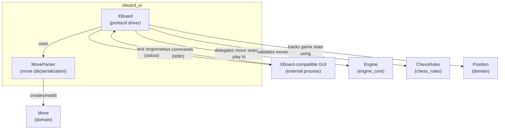
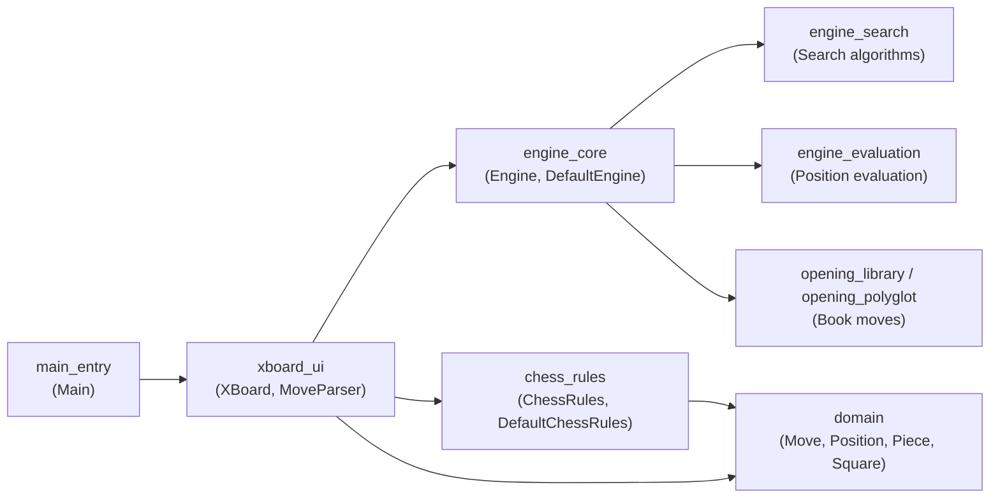
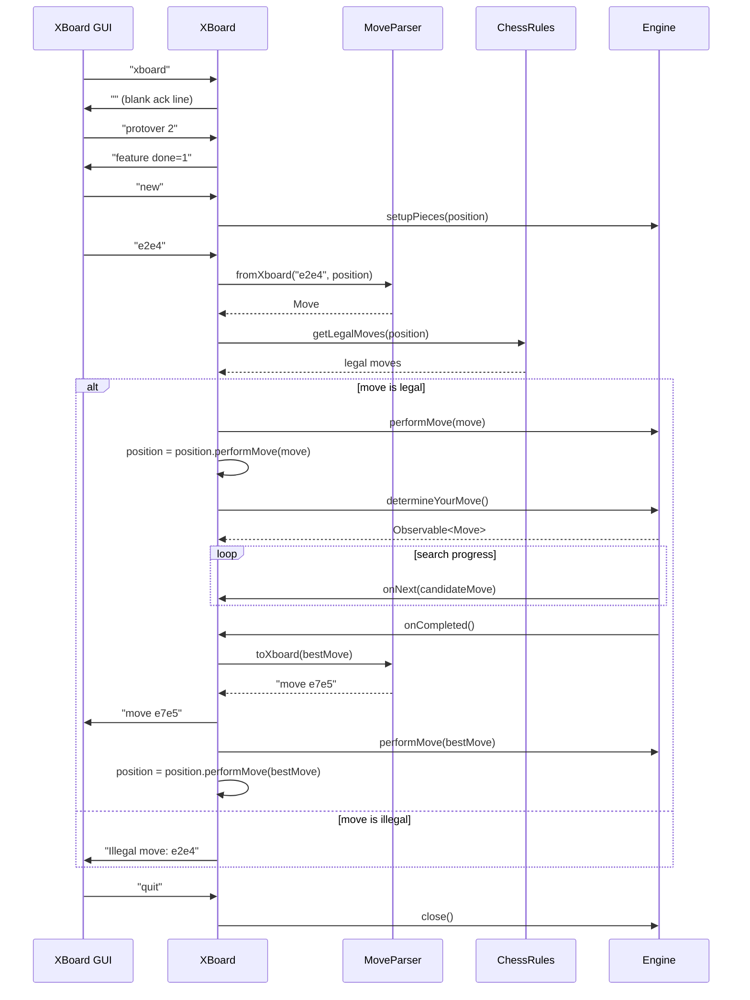

# XBoard UI Module

## 1. Purpose

The `xboard_ui` module implements a text-based user interface for the DokChess engine
based on the [XBoard/WinBoard protocol](https://www.gnu.org/software/xboard/engine-intf.html).
It allows the DokChess chess engine to be driven by any XBoard-compatible chess GUI
(such as XBoard, WinBoard, or various chess GUIs that support this legacy protocol) through
simple text commands exchanged over standard input/output streams.

The module is intentionally small and focused: it is a thin **protocol adapter** that
translates between the line-based XBoard text protocol and the strongly-typed domain
objects (`Move`, `Position`) used by the rest of the DokChess system. All chess logic
(move legality, checkmate detection, move search, evaluation, opening book lookup) is
delegated to other modules — this module contains no chess intelligence itself.

## 2. Architecture Overview

The module consists of two collaborating classes:

- **`XBoard`** — the protocol driver. It reads command lines from an input stream,
  interprets them according to the XBoard protocol, updates internal game state, and
  writes protocol responses to an output stream. It coordinates with the `Engine`
  abstraction (from the [`engine_core`](engine_core.md) module) to compute engine moves
  and with `ChessRules` (from the [`chess_rules`](chess_rules_engine.md) module) to
  validate moves sent by the GUI/opponent.
- **`MoveParser`** — a stateless helper that converts between the XBoard textual move
  notation (e.g. `e2e4`, `e7e8q`) and the engine's domain `Move` objects (from the
  [`domain`](domain.md) module), in both directions.

### Component Relationships

- `XBoard` implements RxJava's `Observer<Move>`, subscribing to the `Observable<Move>`
  returned by `Engine.determineYourMove()`. This lets the engine stream intermediate
  "better move found" updates (`onNext`) while it searches, and report the final choice
  when the search completes (`onCompleted`).
- `XBoard` holds a mutable `Position` representing the current board state, which it
  updates locally after every move (both the opponent's and the engine's), keeping it in
  sync with the `Engine`'s own internal state.
- `MoveParser` has no dependencies besides the `domain` module's `Move`, `Square`,
  `Piece`, and `PieceType` types.

See [`xboard_ui_protocol`](xboard_ui_protocol.md) and
[`xboard_ui_move_translation`](xboard_ui_move_translation.md) for detailed sub-module
documentation.

## 3. Sub-modules

| Sub-module | Description |
|---|---|
| [`xboard_ui_protocol`](xboard_ui_protocol.md) | The `XBoard` class: the main command loop, protocol command handling, and integration with the `Engine` and `ChessRules`. |
| [`xboard_ui_move_translation`](xboard_ui_move_translation.md) | The `MoveParser` class: bidirectional conversion between XBoard's plain-text move notation and the domain `Move` type. |

## 4. How This Module Fits Into the Overall System

`xboard_ui` sits at the outermost layer of the application, acting as one possible
entry point/front-end for playing against the DokChess engine (see
[`main_entry`](main_entry.md) for how the application is wired together and started).

- The `Main` class (in [`main_entry`](main_entry.md)) constructs an `XBoard` instance,
  wires it with a concrete `Engine` implementation (typically `DefaultEngine` from
  [`engine_core`](engine_core.md)) and a `ChessRules` implementation (typically
  `DefaultChessRules` from [`chess_rules`](chess_rules_engine.md)), connects the process's
  standard input/output, and calls `play()` to start the protocol loop.
- The `Engine`, in turn, may rely on [`engine_search`](engine_search_parallel_search.md),
  [`engine_evaluation`](engine_evaluation.md), and the opening book modules
  ([`opening_library`](opening_library.md), [`opening_polyglot`](opening_polyglot_book_access.md))
  to compute its moves — none of which `xboard_ui` needs to know about directly, since it
  only interacts with the `Engine` interface.
- Correctness of the interaction between `XBoard`, `Engine`, and `ChessRules` is
  exercised end-to-end by the [`integration_tests`](integration_tests.md) module
  (notably `XBoardIntegTest`).

## 5. Process Flow: A Typical XBoard Session

## 6. Key Design Notes

- **Protocol simplicity**: `XBoard.play()` implements only a minimal subset of the full
  XBoard protocol sufficient to play a game (`xboard`, `protover 2`, `new`, `go`, `quit`,
  and coordinate move strings). Unrecognized commands produce an
  `Error (unknown command): ...` response rather than causing a failure.
- **Asynchronous engine moves**: Because `Engine.determineYourMove()` returns an RxJava
  `Observable<Move>`, the engine's search can run without blocking the read loop's thread
  model conceptually, and can emit provisional best-move updates (useful for logging /
  progress, emitted here as `# better move found: ...` comments) before finalizing.
- **Local vs. engine state duplication**: `XBoard` maintains its own `Position` purely to
  validate incoming moves against `ChessRules` before forwarding them to the `Engine`;
  the `Engine` is expected to maintain its own authoritative state via `setupPieces` and
  `performMove`.
- **Thread-safe output**: Writes to the output stream are synchronized to avoid
  interleaved output when multiple `onNext` notifications race with other writes.
