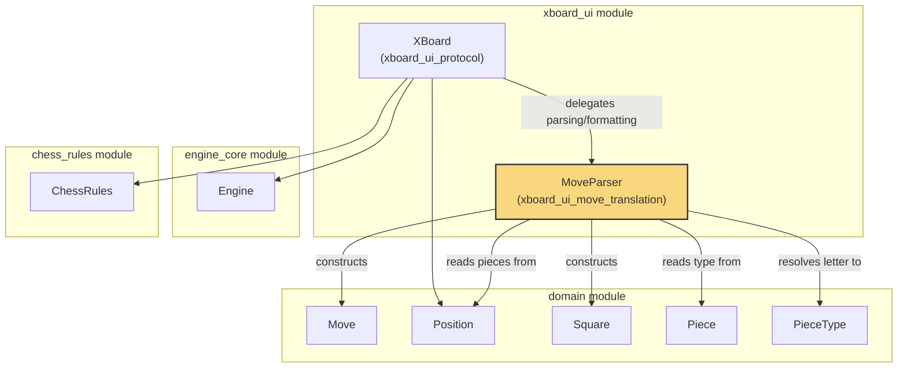
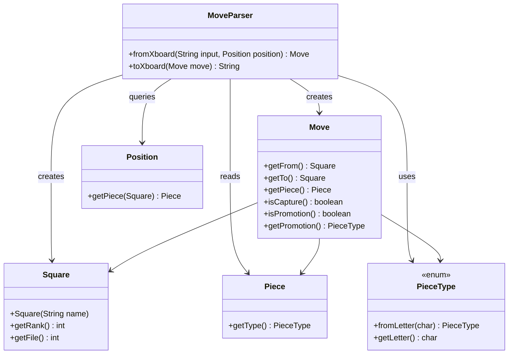
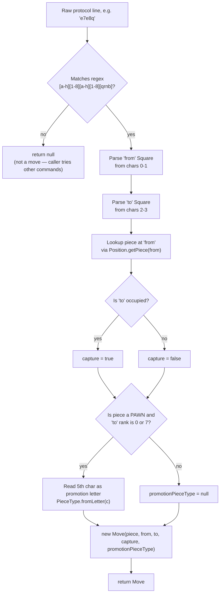
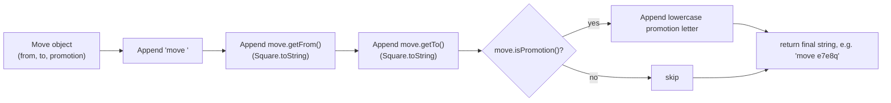
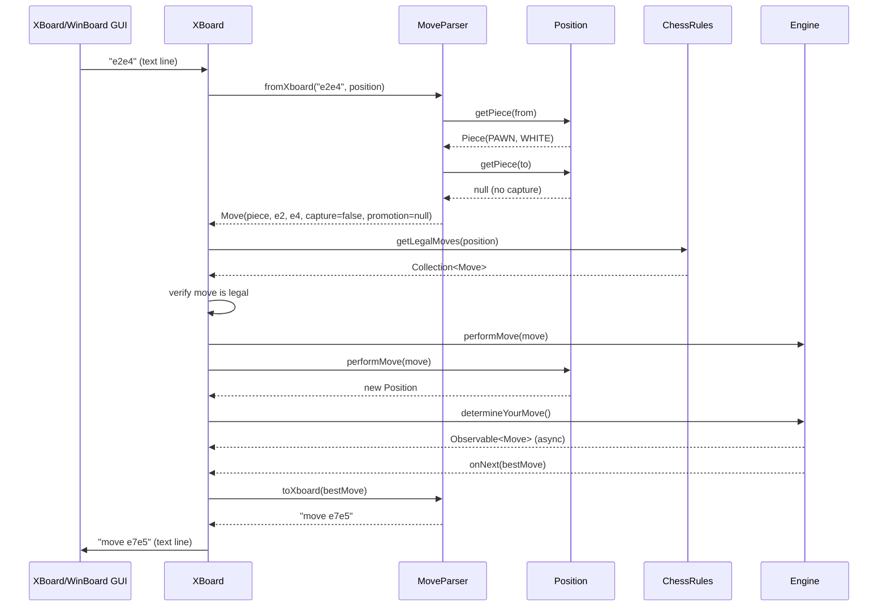

# XBoard UI – Move Translation

## Introduction

The **xboard_ui_move_translation** module is a small but critical translation
layer inside the [xboard_ui](xboard_ui_protocol.md) subsystem. It converts
chess moves between two representations:

* the plain-text move notation used by the **XBoard/WinBoard chess engine
  communication protocol** (e.g. `e2e4`, `e7e8q`), and
* the strongly-typed [`Move`](domain.md) object used internally throughout
  the DokChess engine.

It is the single component responsible for parsing incoming protocol
commands into domain moves, and for serializing domain moves back into
protocol-compliant strings when the engine reports its choice. This makes it
the boundary between "text protocol" and "internal chess domain" — every
other component in the engine works exclusively with `Move`, `Position`,
`Square`, and `Piece` objects from the [`domain`](domain.md) module.

The module consists of a single class:

| Component | Responsibility |
|---|---|
| `MoveParser` | Bidirectional translation between XBoard move strings and `Move` objects |

---

## 1. Purpose and Core Functionality

`MoveParser` provides exactly two operations:

1. **`fromXboard(String input, Position position)`** — Parses a raw line of
   text received from an XBoard-compatible GUI/controller and, if it matches
   the coordinate-move pattern, converts it into a fully-populated `Move`
   instance (including piece identity, capture flag, and promotion piece
   type). If the input does not look like a move, `null` is returned so that
   the caller ([`XBoard`](xboard_ui_protocol.md)) can try to interpret it as
   a different protocol command.

2. **`toXboard(Move move)`** — Serializes an internal `Move` object into the
   XBoard `move <from><to>[promotion]` wire format that the protocol expects
   the engine to emit after it decides on a move.

Because parsing requires knowledge of *what piece is on the board*, whether a
capture is occurring, and whether a pawn is promoting, `MoveParser` needs
read-only access to the current [`Position`](domain.md) — it does not itself
mutate any game state. All state mutation (applying the move to the board)
happens later, driven by [`Position.performMove`](domain.md) and the
[`Engine`](engine_core.md).

### Move String Format

XBoard's coordinate notation is a fixed-width string:

```
<fromFile><fromRank><toFile><toRank>[<promotionLetter>]
```

Examples:
* `e2e4` — pawn from e2 to e4
* `e7e8q` — pawn promotes to queen on e8
* `g1f3` — knight move

The class validates input against the regular expression:

```
[a-h][1-8][a-h][1-8][qrnb]?
```

Any string not matching this pattern yields `null` from `fromXboard`,
signaling "this is not a move".

---

## 2. Architecture

### 2.1 Component Position in the System

`MoveParser` sits directly beneath [`XBoard`](xboard_ui_protocol.md), which
owns the read/process/respond loop of the XBoard protocol. `XBoard` delegates
*all* move-string handling to `MoveParser`, keeping protocol control flow
separate from notation parsing/formatting concerns.



### 2.2 Class Diagram



---

## 3. Data Flow

### 3.1 Parsing an Incoming Move (`fromXboard`)



### 3.2 Serializing an Outgoing Move (`toXboard`)



---

## 4. Sequence: End-to-End Move Exchange in XBoard

The diagram below shows how `MoveParser` is invoked within the broader
protocol loop implemented by [`XBoard`](xboard_ui_protocol.md), illustrating
both directions of translation in a single game turn.



---

## 5. Design Notes and Rationale

* **Stateless translator.** `MoveParser` holds no internal state between
  calls; each `fromXboard`/`toXboard` invocation is self-contained. This
  keeps it trivially reusable and testable — a single instance is created
  once by `XBoard` and reused for the entire game session.

* **Position is required only for parsing.** Determining whether a move is
  a capture, and whether a pawn move is a promotion, requires knowing the
  board state — this is why `fromXboard` takes a `Position` parameter while
  `toXboard` does not (the `Move` object already encodes capture/promotion
  flags once constructed).

* **Graceful non-move handling.** Returning `null` for non-matching input
  (rather than throwing an exception) allows `XBoard` to treat unrecognized
  lines as candidate protocol commands (`quit`, `new`, `go`, etc.) rather
  than immediately failing, keeping the protocol loop resilient to the wide
  variety of commands XBoard/WinBoard may send.

* **Deferred rule validation.** `MoveParser` performs only *syntactic*
  parsing. It does not check chess legality — that responsibility belongs to
  [`ChessRules`](chess_rules_engine.md), which `XBoard` consults separately
  after parsing succeeds. This separation keeps `MoveParser` simple and
  free of rules-engine dependencies.

* **Symmetry with `Move.toString()`.** Note that `Move` already provides a
  human-readable `toString()` (e.g. `"P e2-e4"`) used for logging/debugging.
  `MoveParser.toXboard` is a distinct, protocol-specific serialization
  (`"move e2e4"`) and must not be confused with `Move.toString()`.

---

## 6. Related Modules

| Module | Relationship |
|---|---|
| [domain.md](domain.md) | Supplies `Move`, `Piece`, `PieceType`, `Square`, and `Position` — the core types `MoveParser` consumes and produces. |
| [xboard_ui_protocol.md](xboard_ui_protocol.md) | `XBoard` is the sole consumer of `MoveParser`, driving the read-eval-respond loop of the XBoard protocol. |
| [engine_core.md](engine_core.md) | Consumes translated `Move` objects via `Engine.performMove` and produces `Move` results via `Engine.determineYourMove`, which `XBoard` then passes to `MoveParser.toXboard`. |
| [chess_rules_engine.md](chess_rules_engine.md) | Provides legality checks (`ChessRules.getLegalMoves`) applied to moves *after* they have been parsed by `MoveParser`. |
