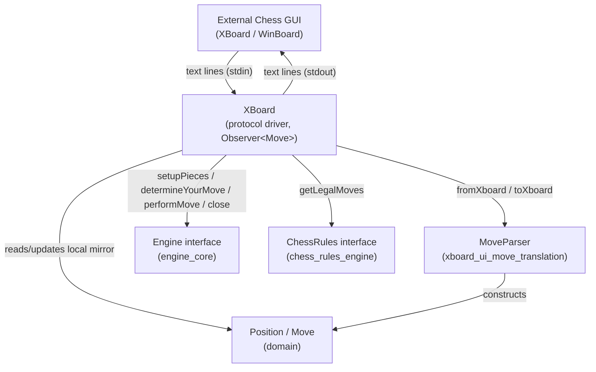
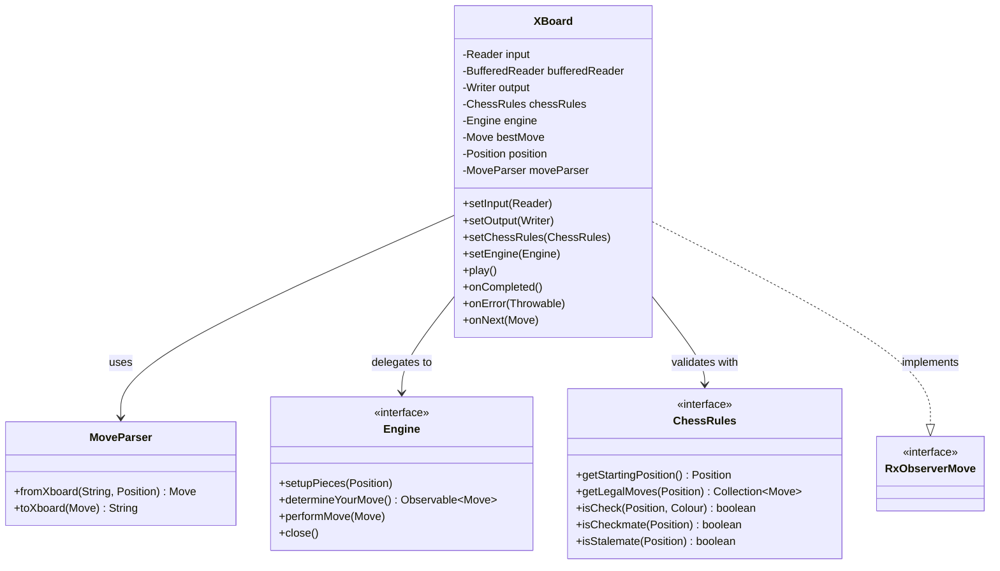
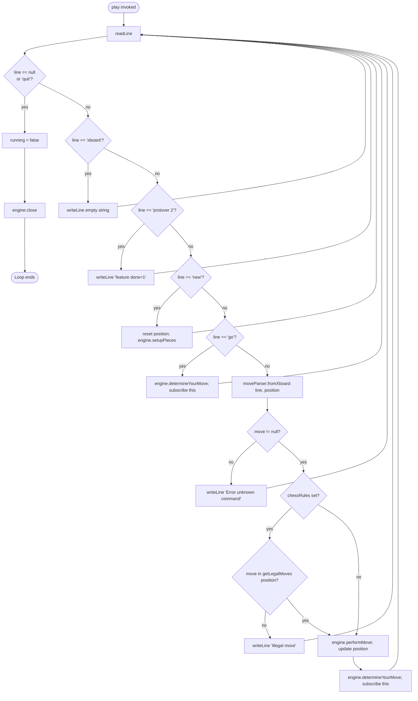
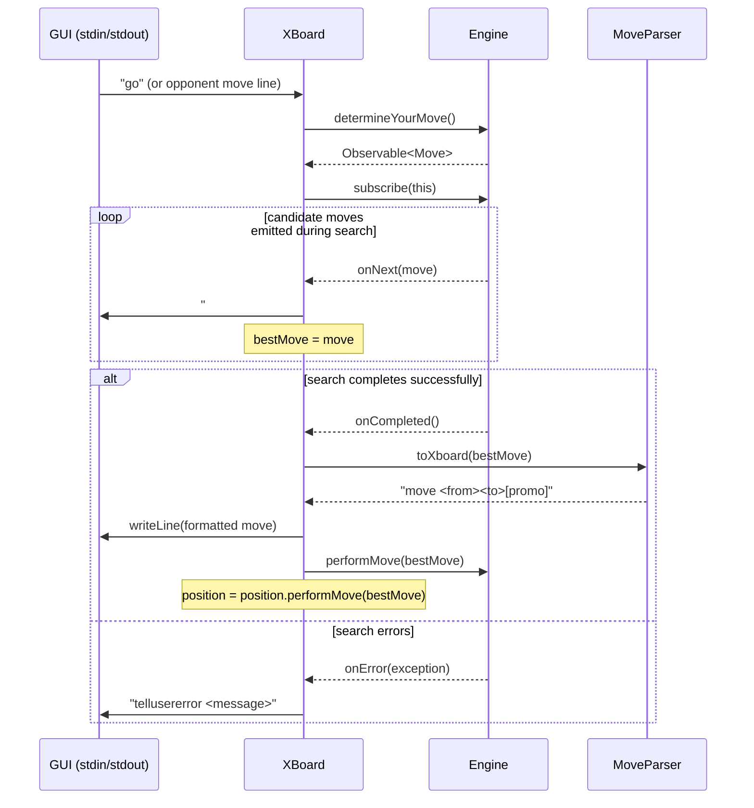
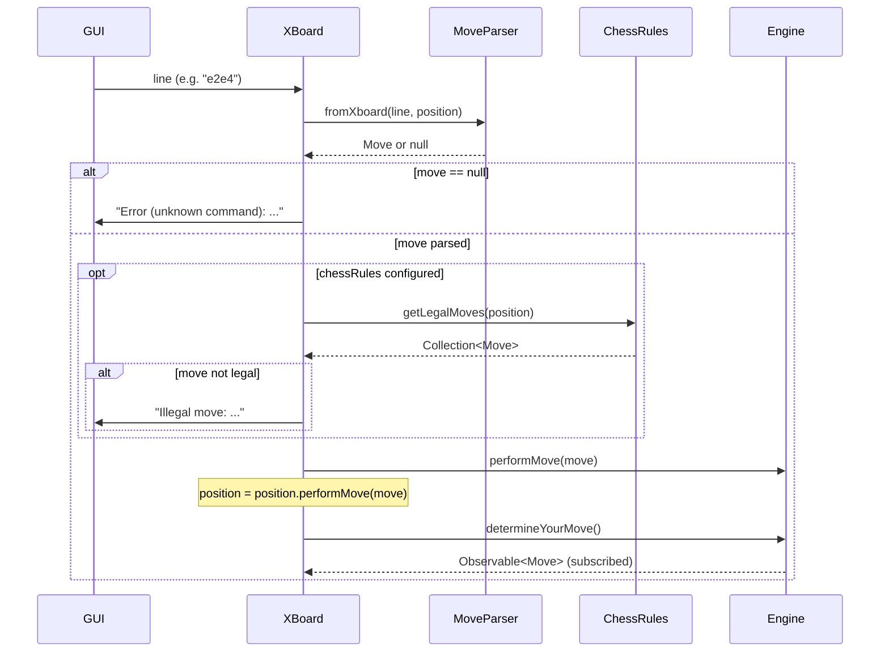
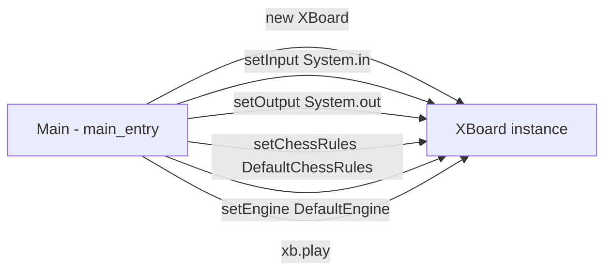

# XBoard UI Protocol Module

## Introduction

The **xboard_ui_protocol** module implements the [XBoard/WinBoard chess engine communication protocol](https://www.gnu.org/software/xboard/engine-intf.html) for the DokChess engine. It acts as the outermost adapter layer that allows DokChess to be plugged into any standard chess GUI that speaks the xboard protocol (e.g. XBoard, WinBoard, or various chess frontends).

The module is centered around a single class, `XBoard`, which owns a text-based, blocking read/write loop over an arbitrary `Reader`/`Writer` pair (typically standard input/output). It translates simple text commands from the GUI into calls against the engine's [`Engine`](engine_core.md) interface and [`ChessRules`](chess_rules.md) contract, and translates engine results back into xboard-formatted text output.

This module is a **child** of the broader [xboard_ui](xboard_ui.md) module and works hand-in-hand with its sibling [xboard_ui_move_translation](xboard_ui_move_translation.md), which provides the `MoveParser` component responsible for converting between xboard's plain-text move notation (e.g. `e2e4`, `a7a8q`) and DokChess's internal `Move` domain object.

---

## Purpose and Core Functionality

`XBoard` is the **protocol driver**: it does not know how to play chess, evaluate positions, or generate legal moves itself. Instead, it:

1. Reads one line of text at a time from the input stream.
2. Recognizes a small set of xboard protocol commands (`xboard`, `protover 2`, `new`, `go`, `quit`) plus raw move strings.
3. Delegates actual chess logic to injected collaborators:
   - `Engine` — to set up pieces, request the engine's next move (asynchronously, via an RxJava `Observable<Move>`), apply moves to the engine's internal state, and shut the engine down.
   - `ChessRules` (optional) — to validate that an opponent's move is legal before forwarding it to the engine.
4. Maintains its own local `Position` mirror so that incoming moves can be parsed/interpreted correctly (e.g., detecting captures, promotions) and validated against the rules engine.
5. Subscribes to the `Engine`'s move `Observable` as an RxJava `Observer<Move>`, allowing it to react asynchronously when the engine reports candidate moves (`onNext`) and its final decision (`onCompleted`), or an error (`onError`).
6. Writes properly formatted xboard responses back out (e.g. `move e2e4`, `Illegal move: ...`, `tellusererror ...`).

### Supported Commands

| Input Line | Behavior |
|---|---|
| `xboard` | Acknowledges xboard mode; writes an empty line. |
| `protover 2` | Declares feature negotiation complete (`feature done=1`). |
| `new` | Resets local `Position` to the starting position and calls `engine.setupPieces(position)`. |
| `go` | Asks the engine to determine its own move via `engine.determineYourMove()`, subscribing to the result. |
| `<move string>` (e.g. `e2e4`) | Parsed via `MoveParser.fromXboard`. If legal (per optional `ChessRules` check), applied to both the engine and the local `Position`, then the engine is asked to respond with `determineYourMove()`. |
| `quit` or end-of-stream (`null`) | Terminates the read loop and calls `engine.close()`. |
| anything else | Writes `Error (unknown command): <line>`. |

---

## Architecture

### Component Diagram

### Class Relationships

---

## Data Flow / Process Diagrams

### Main Read-Eval-Respond Loop

### Engine Move Subscription Lifecycle (Observer callbacks)

### Opponent Move Handling and Legality Check

---

## Key Design Points

- **Thin, stateless-ish protocol shell**: `XBoard` intentionally contains no chess logic (move generation, evaluation, search). All actual decision-making is delegated to the [`Engine`](engine_core.md) abstraction, keeping this module focused purely on protocol parsing/formatting and I/O.
- **Local `Position` mirror**: Although the `Engine` maintains its own authoritative internal state, `XBoard` keeps a parallel `Position` object. This is required because `MoveParser.fromXboard` needs a `Position` to resolve ambiguous xboard move strings into fully-qualified `Move` objects (identifying the piece being moved, detecting captures, and detecting pawn promotions).
- **Optional legality enforcement**: The `ChessRules` collaborator is optional (`setChessRules` may be left unset). When provided, incoming opponent moves are checked against `getLegalMoves(position)` before being forwarded to the engine, allowing the module to reject illegal input from the GUI/opponent with an `Illegal move:` message.
- **Asynchronous move determination via RxJava**: `Engine.determineYourMove()` returns an `Observable<Move>` rather than a single synchronous value. This allows the underlying search algorithm (see [engine_search](engine_search.md)) to report improving candidate moves as they are found (`onNext`), with `XBoard` only committing to and reporting the final choice once the `Observable` completes (`onCompleted`). This directly supports iterative/parallel search strategies such as those in [engine_search_parallel_search](engine_search_parallel_search.md), where intermediate best-move updates are streamed before a final result is settled.
- **Synchronized output**: `writeLine` synchronizes on the shared `output` writer, ensuring that engine-driven asynchronous notifications (from `onNext`/`onCompleted`, potentially triggered on a different thread by the underlying `Observable`) don't interleave corrupted text with the main loop's output.
- **Blocking read loop**: The main `play()` method runs on a single thread and blocks on `bufferedReader.readLine()`, which is standard for xboard's synchronous, line-oriented protocol.

---

## Dependencies on Other Modules

| Dependency | Role |
|---|---|
| [xboard_ui_move_translation](xboard_ui_move_translation.md) (`MoveParser`) | Converts between xboard plain-text move notation and the domain `Move` type. |
| [engine_core](engine_core.md) (`Engine`) | Provides the actual move-determination, move-application, and lifecycle (setup/close) behavior that `XBoard` orchestrates. |
| [chess_rules_engine](chess_rules.md) (`ChessRules`) | Optionally supplies legal-move validation for opponent input. |
| [domain](domain.md) (`Position`, `Move`) | Core value types representing board state and moves, used throughout the parsing/validation/application flow. |

`XBoard` itself is composed and wired together (its `Reader`/`Writer`/`Engine`/`ChessRules` dependencies injected) by the application's entry point — see [main_entry](main_entry.md) — and is exercised end-to-end by [integration_tests](integration_tests.md) (`XBoardIntegTest`), which drives the protocol loop with scripted input/output to verify correct behavior against a real engine and rules implementation.

---

## Usage Example (Wiring Sketch)

This mirrors how [main_entry](main_entry.md) bootstraps the application: constructing a `ChessRules` implementation (e.g. `DefaultChessRules` from [chess_rules_engine](chess_rules.md)) and an `Engine` implementation (e.g. `DefaultEngine` from [engine_core](engine_core.md), itself backed by [engine_search](engine_search.md), [engine_evaluation](engine_evaluation.md), and optionally an [opening_library](opening_library.md)/[opening_polyglot](opening_polyglot.md) book), then handing both to an `XBoard` instance bound to standard input/output before invoking `play()`.
