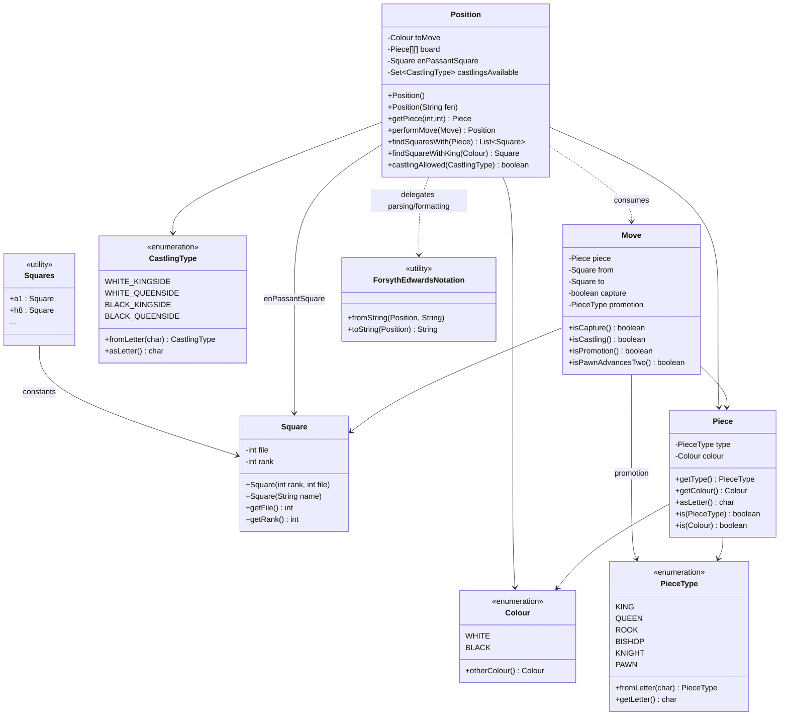
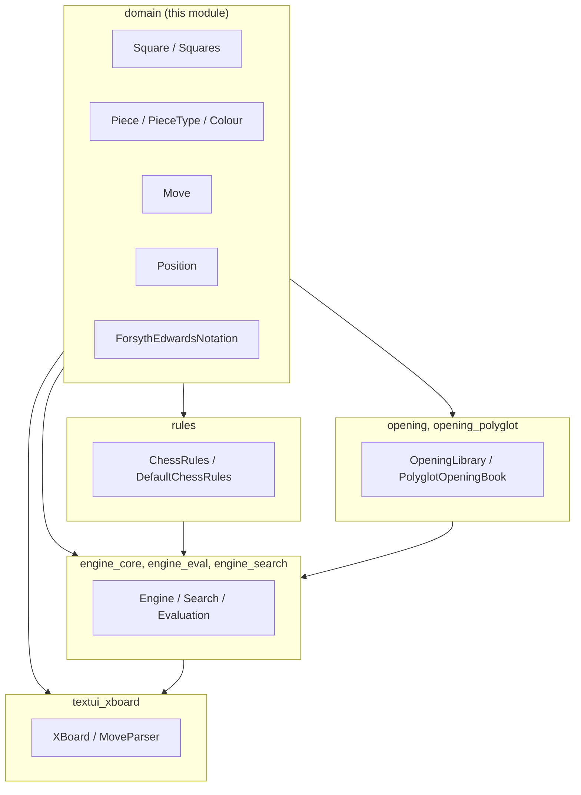

# Domain Module

## Purpose

The **domain** module defines the fundamental data model of DokChess: the vocabulary of
squares, pieces, moves and positions that every other part of the system is built upon.
It has **no dependency on any other DokChess module** — it is the bedrock of the
application. All higher-level modules (move generation, search, evaluation, opening
books, and the text UI) operate on the types defined here.

The module is intentionally minimal and immutable wherever possible: `Piece`, `Square`
and `Move` are value objects, while `Position` exposes a `performMove()` method that
returns a brand-new `Position` rather than mutating the board in place. This makes the
model safe to share across threads — an important property since the
[engine_search](engine_search.md) module explores many positions in parallel.

## Architecture Overview

## Sub-modules

The domain module is documented in two focused parts:

| Sub-module | Description |
|---|---|
| [domain_model](domain_model.md) | The core chess vocabulary: `Square`, `Squares`, `Piece`, `Colour`, `PieceType`, `CastlingType`, `Move`, and the `Position` aggregate that ties them together, including move application (`performMove`) and castling-rights bookkeeping. |
| [domain_fen](domain_fen.md) | The `ForsythEdwardsNotation` helper that converts between a `Position` object and its textual [FEN](https://en.wikipedia.org/wiki/Forsyth%E2%80%93Edwards_Notation) representation, used for setting up positions and for external interoperability (e.g. opening books, XBoard protocol). |

## How the Domain Module Fits into the System

* **[rules](rules.md)** uses `Position`, `Move`, `Piece` and `Square` to enumerate legal
  moves for each piece type and to validate castling and check conditions.
* **[engine_core](engine_core.md)**, **[engine_eval](engine_eval.md)** and
  **[engine_search](engine_search.md)** (search algorithms and material evaluation)
  operate purely on `Position` objects produced via `performMove()`, and return/rank
  `Move` objects.
* **[opening](opening.md)** and **[opening_polyglot](opening_polyglot.md)** map
  `Position` (via FEN/Zobrist-like hashing) to known book moves.
* **[textui_xboard](textui_xboard.md)** parses moves typed by a user or GUI into `Move`
  objects (via `Square` coordinates) and renders `Position`/`Move` back to the user, and
  also relies on `ForsythEdwardsNotation`-style FEN strings for the XBoard protocol.

Because none of the domain classes depend on rules, engine, opening or UI code, the
domain module can be understood, tested and reused in complete isolation — it is the
recommended starting point for any developer new to the DokChess codebase.
