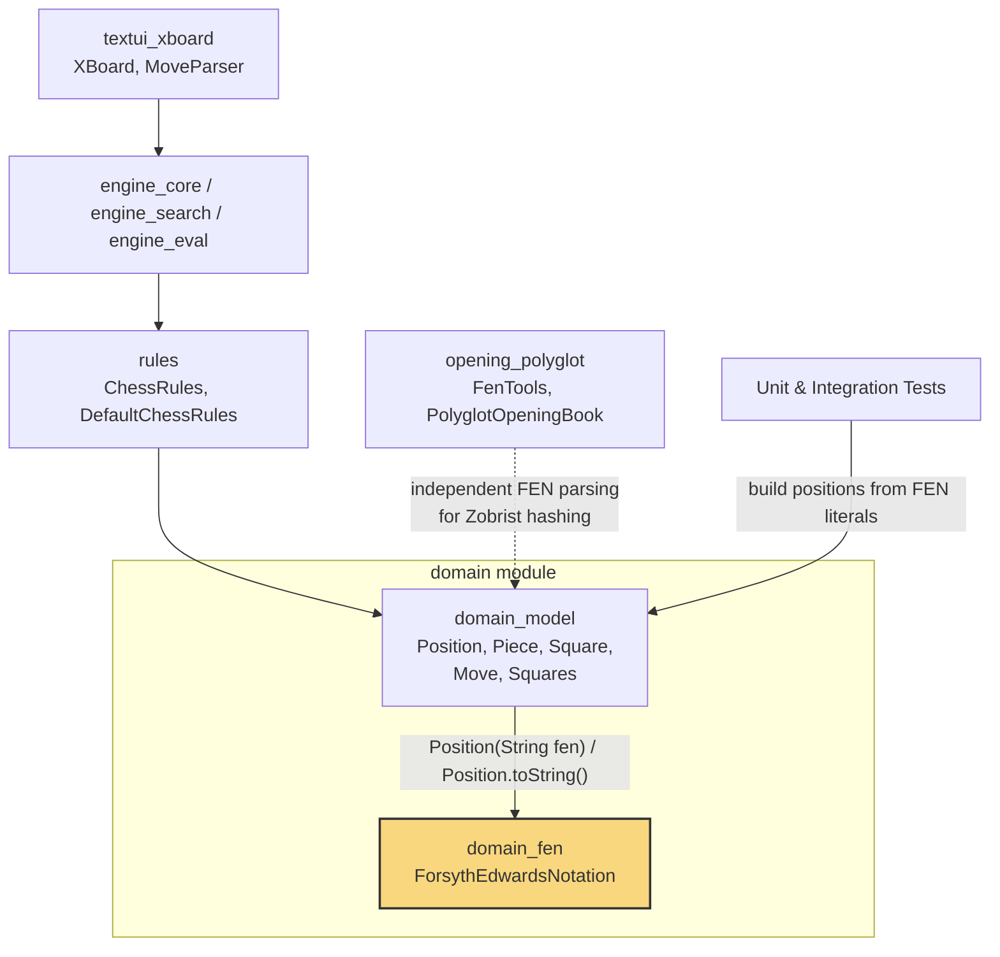
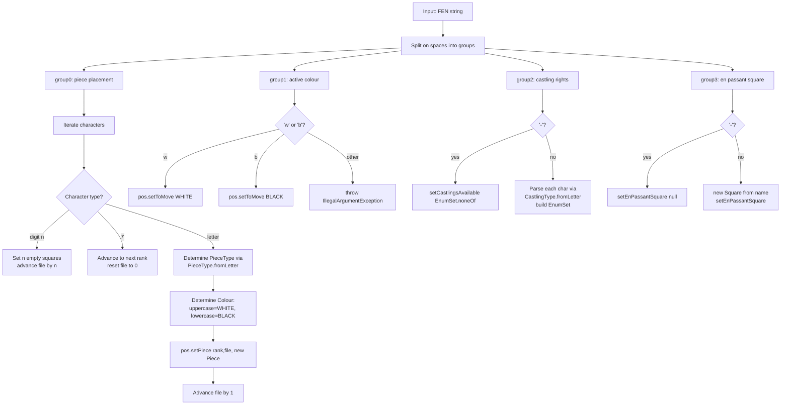
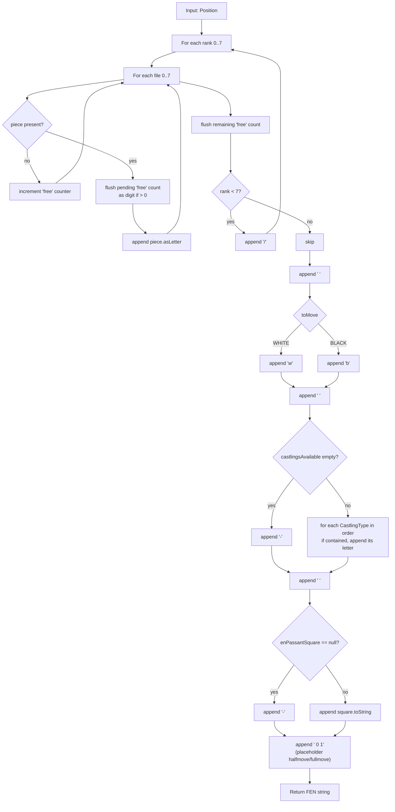
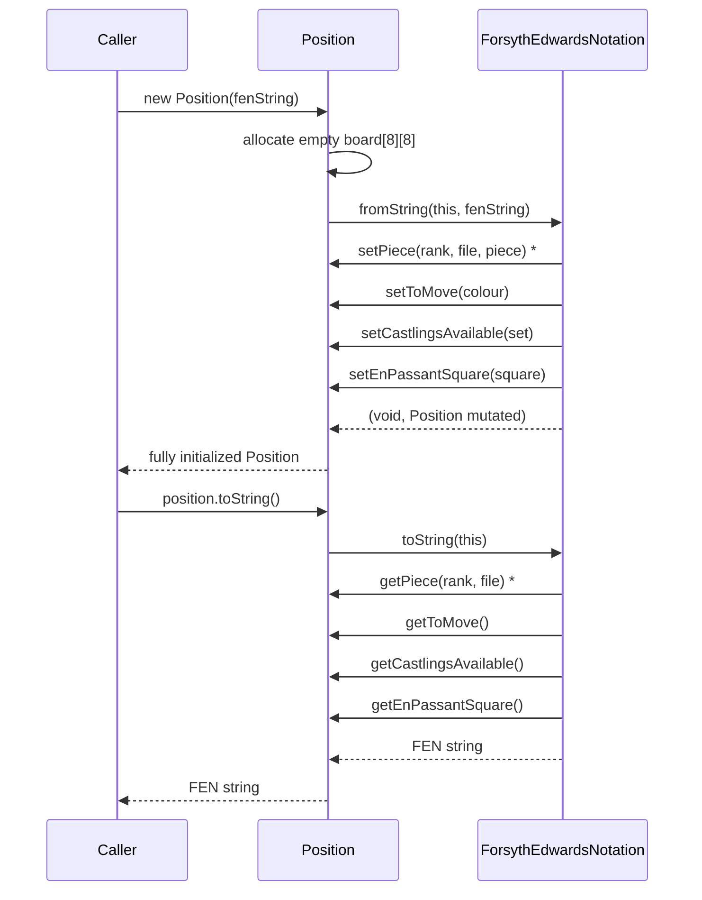
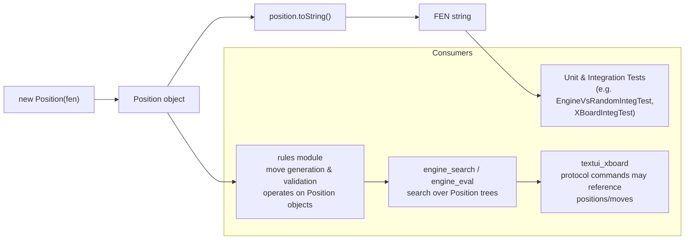

# Domain FEN Module

## Introduction

The **domain_fen** module provides the `ForsythEdwardsNotation` utility class,
which converts between a chess [`Position`](domain_model.md) object and its
textual representation in **Forsyth–Edwards Notation (FEN)**. FEN is the
de-facto industry standard for encoding a complete chess board position
(piece placement, side to move, castling rights, en passant target square)
as a single, compact, human-readable string, e.g.:

```
rnbqkbnr/pppppppp/8/8/8/8/PPPPPPPP/RNBQKBNR w KQkq - 0 1
```

This module sits at the boundary between DokChess's internal, strongly
typed domain model and any external representation of a position based on
plain text. It is used by:

- The [`domain_model`](domain_model.md) module itself — `Position`'s
  string-based constructor and `toString()` method delegate directly to
  `ForsythEdwardsNotation`.
- Unit and integration tests throughout the codebase, which set up
  test positions from FEN strings for readability and interoperability with
  external chess tools.
- The [`opening_polyglot`](opening_polyglot.md) module, which has its own
  independent, low-level FEN parsing (`FenTools`) used to compute Polyglot
  Zobrist hash keys for opening-book lookups (see [Relationship to
  opening_polyglot](#relationship-to-opening_polyglot) below).

## Module Position in the System



`ForsythEdwardsNotation` is package-private (default visibility) within
`org.dokchess.domain`. External code never calls it directly — instead,
callers use `new Position(fenString)` to parse a FEN string, or
`position.toString()` to serialize a `Position` back to FEN. This keeps FEN
handling as an internal implementation detail of the domain model.

## Core Component

### `ForsythEdwardsNotation`

A stateless utility (tool) class with a private constructor — it is never
instantiated. It exposes two static methods:

| Method | Direction | Description |
|---|---|---|
| `fromString(Position pos, String fen)` | FEN → Position | Parses a FEN string and mutates the given `Position` object's internal state (board, side to move, castling rights, en passant square). |
| `toString(Position position)` | Position → FEN | Builds a FEN string from a `Position` object's current state. |

Both methods operate on the package-private setters of
[`Position`](domain_model.md) (`setPiece`, `setToMove`,
`setCastlingsAvailable`, `setEnPassantSquare`), which is why
`ForsythEdwardsNotation` must live in the same package (`org.dokchess.domain`)
as `Position`.

#### FEN Format Recap

A FEN string consists of six space-separated fields, of which this class
fully supports the first four and produces static placeholder values for
the last two:

1. **Piece placement** — 8 ranks separated by `/`, from rank 8 down to rank
   1. Each rank lists pieces left-to-right (file a to h); digits represent
      consecutive empty squares; uppercase = White, lowercase = Black
      (e.g. `K` = white king, `q` = black queen).
2. **Active colour** — `w` or `b`.
3. **Castling availability** — a subset of `KQkq`, or `-` if none.
4. **En passant target square** — algebraic square (e.g. `e3`), or `-`.
5. **Halfmove clock** — *(not read; always written as `0`)*.
6. **Fullmove number** — *(not read; always written as `1`)*.

> **Known limitation:** As noted by a `TODO` in the source, the halfmove
> clock and fullmove counters are not tracked by `Position` and are always
> emitted as fixed values (`0 1`) by `toString()`. Parsing of these two
> trailing fields is likewise not implemented in `fromString()` (only the
> first four space-separated groups are consumed).

## `fromString`: Parsing FEN into a Position



Key implementation details:

- **Piece placement parsing** walks the string character by character,
  maintaining explicit `rank`/`file` counters (rather than delegating to
  `String.split("/")`), incrementing `rank` on `/` and `file` on every
  square consumed (empty or occupied).
- Piece letters are resolved to a `PieceType` via
  `PieceType.fromLetter(char)`; the letter's case determines the `Colour`
  (`Character.isUpperCase` → `WHITE`).
- Castling rights are parsed into a `java.util.EnumSet<CastlingType>` using
  `CastlingType.fromLetter(char)` for each character.
- The en passant field, if present, is turned directly into a
  [`Square`](domain_model.md) via its string-based constructor (e.g.
  `new Square("e3")`).
- Fields 5 and 6 (halfmove clock, fullmove number) are **not parsed**.

## `toString`: Serializing a Position into FEN



Key implementation details:

- Piece placement is built rank by rank (0 = rank 8, 7 = rank 1, matching
  `Position`'s internal indexing), accumulating consecutive empty squares
  into a `free` counter that is flushed as a digit whenever a piece is
  encountered or the rank ends.
- `Piece.asLetter()` supplies the correct case/letter combination directly.
- Castling rights are emitted in the fixed enum declaration order of
  `CastlingType` (typically `K`, `Q`, `k`, `q`), only including types
  present in `position.getCastlingsAvailable()`.
- The en passant square, if set, uses `Square.toString()` (e.g. `"e3"`).
- The halfmove clock and fullmove number are **hardcoded** to `"0 1"` since
  `Position` does not track them (see the `TODO` in the source).

## Relationship to Domain Model

`ForsythEdwardsNotation` is tightly coupled to
[`Position`](domain_model.md) and is only invoked from within that class:



Notes:

- `Position`'s no-argument constructor calls the FEN constructor internally
  with the standard starting position string, meaning the *default* chess
  starting setup is itself defined and validated via this module.
- Because `fromString`/`toString` invoke `Position`'s package-private
  setters/getters, `ForsythEdwardsNotation` must reside in the
  `org.dokchess.domain` package. It has default (package-private) access
  and cannot be used outside that package — all interaction with FEN happens
  indirectly through `Position`.
- See [`domain_model`](domain_model.md) for full details on `Position`,
  `Piece`, `Square`, `Move`, and the `Squares` constant holder, all of which
  this module depends on (`PieceType`, `Colour`, and `CastlingType` are
  enums defined alongside `Position` in the domain model).

## Usage Across the System

While `ForsythEdwardsNotation` itself is internal, FEN strings surface
throughout DokChess wherever a `Position` needs to be expressed compactly:



- The [`rules`](rules.md) module (`ChessRules`, `DefaultChessRules`, and the
  per-piece movement classes) consumes `Position` objects produced from FEN
  strings to generate and validate legal moves.
- The [`engine_search`](engine_search.md) and [`engine_eval`](engine_eval.md)
  modules traverse trees of `Position` objects (via `Position.performMove`)
  during search; test fixtures for these components are frequently
  bootstrapped from FEN literals for conciseness.
- The [`opening_polyglot`](opening_polyglot.md) module's `FenTools` class
  independently re-parses FEN strings (piece placement, castling, side to
  move) purely to compute Zobrist hash keys compatible with the Polyglot
  opening-book binary format. It does **not** reuse
  `ForsythEdwardsNotation`/`Position`; it works directly on raw FEN strings
  for performance and to avoid a dependency on the mutable `Position` API.
  This is a deliberate duplication — see
  [`opening_polyglot`](opening_polyglot.md) for details.

## Relationship to opening_polyglot

It's worth calling out explicitly that **two independent FEN parsers**
exist in the codebase:

| Aspect | `domain_fen` (`ForsythEdwardsNotation`) | `opening_polyglot` (`FenTools`) |
|---|---|---|
| Purpose | Build/serialize a full `Position` domain object | Compute a 64-bit Zobrist hash key for opening-book lookups |
| Output | `Position` object / FEN string | `long` hash key |
| Scope of fields parsed | Piece placement, side to move, castling, en passant | Piece placement, side to move, castling only (en passant hashing unimplemented) |
| Access | Package-private, used only via `Position` | Package-private, used only via `PolyglotOpeningBook` |

This separation keeps the performance-sensitive opening-book hashing free
of dependencies on the full `Position` object graph, at the cost of some
logic duplication between the two FEN parsers.

## Design Notes & Limitations

- **Package-private, tool-class design**: `ForsythEdwardsNotation` follows
  the "utility class" pattern — `final` class, private constructor, only
  static methods — signaling it holds no state and is not meant to be
  subclassed or instantiated.
- **Tight coupling to `Position`**: the class directly manipulates
  `Position`'s internal board array via package-private accessors rather
  than through a public API, which is why it must live in the same package.
- **Incomplete metadata support**: halfmove clock and fullmove number
  (fields 5 and 6 of FEN) are not modeled by `Position` at all; `toString()`
  always appends the fixed suffix `" 0 1"`, and `fromString()` never reads
  these fields. Any round-trip through `Position` will therefore lose
  original move-counter information from an input FEN string.
- **No validation of board consistency**: `fromString` does not verify that
  the resulting position is a legal chess position (e.g. correct number of
  kings, valid en passant square) — such validation, if performed, is the
  responsibility of the [`rules`](rules.md) module.
