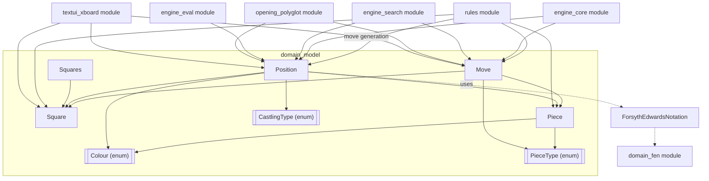
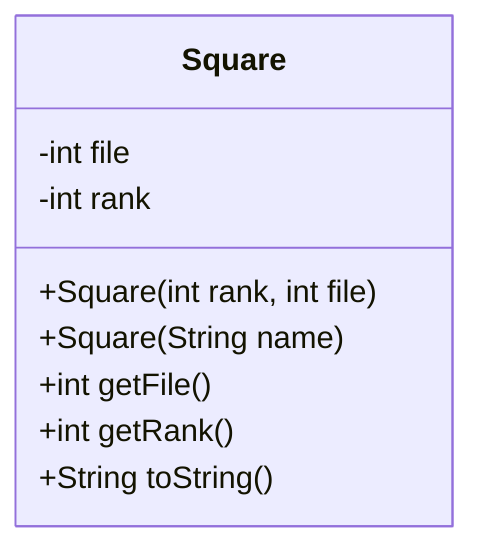
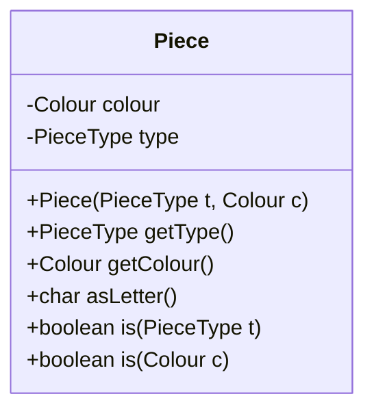
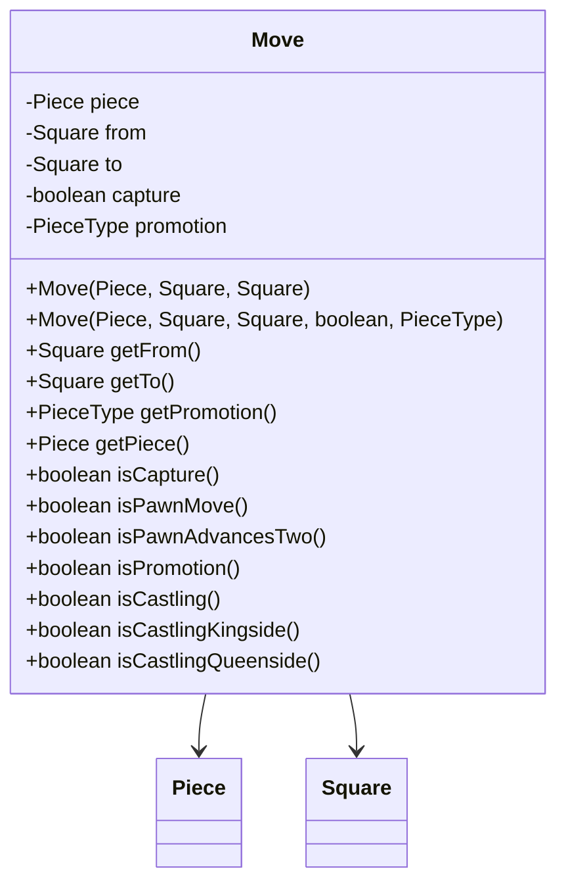
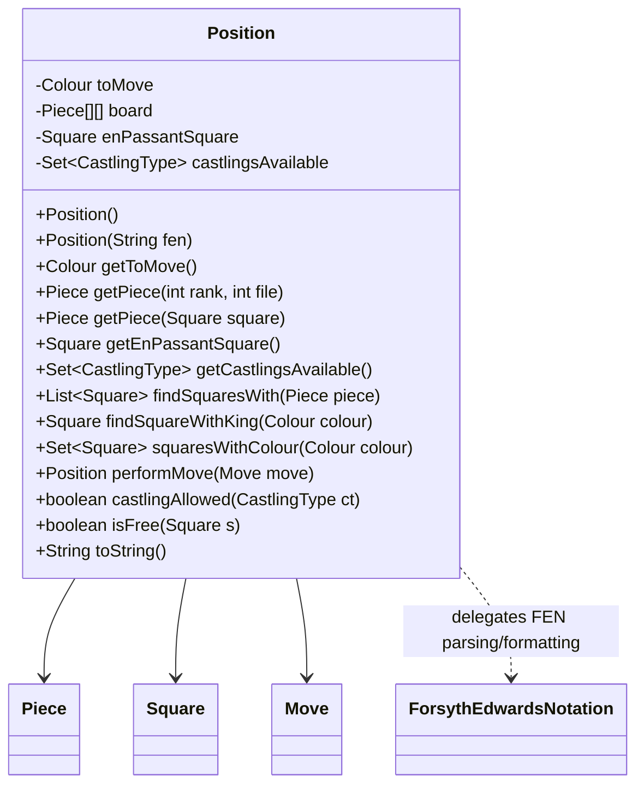
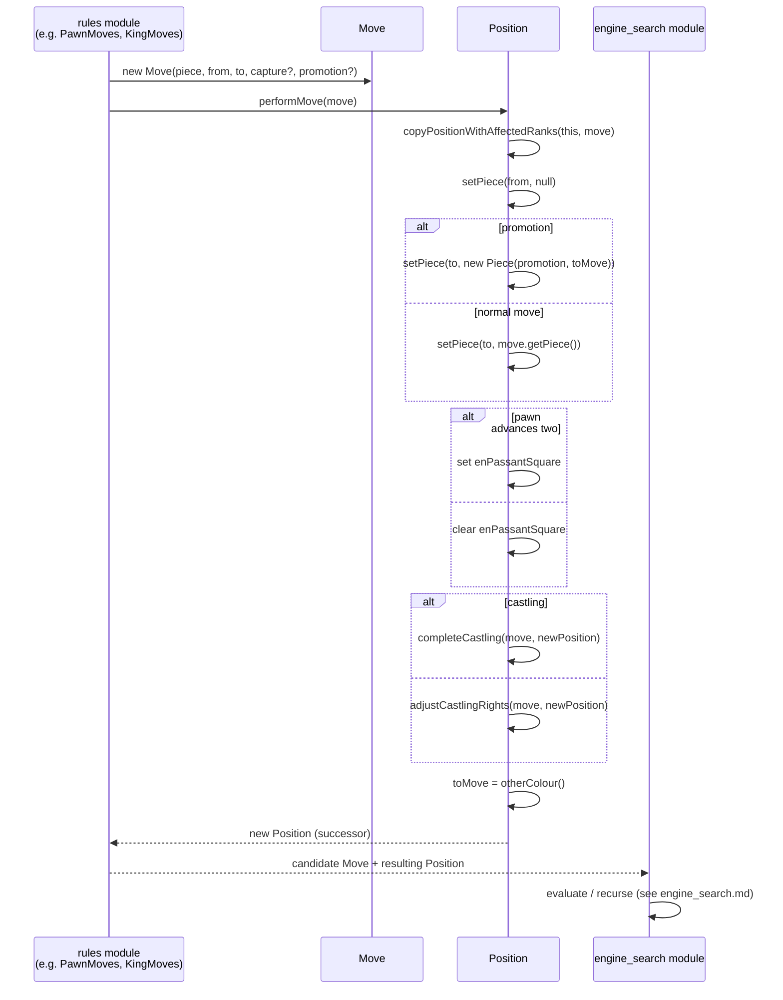
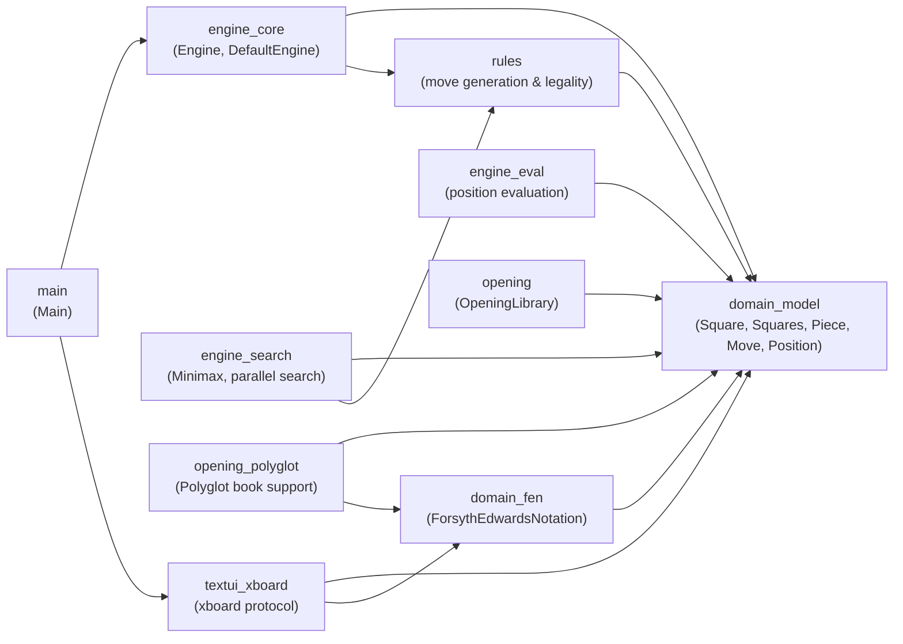

# Domain Model Module

## Introduction

The **domain_model** module is the foundational layer of the DokChess engine.
It defines the core vocabulary and data structures that represent a game of
chess: squares on the board, pieces, moves, and the overall board position.
Every other module in the system — move generation ([rules](rules.md)),
search and evaluation ([engine_core](engine_core.md),
[engine_search](engine_search.md), [engine_eval](engine_eval.md)), opening
book lookup ([opening](opening.md), [opening_polyglot](opening_polyglot.md))
and the text-based user interface ([textui_xboard](textui_xboard.md)) —
is built on top of these types. Because the classes in this module are
almost entirely **immutable value objects**, they can be freely shared and
passed between threads (a property exploited heavily by the parallel search
in `engine_search`), which greatly simplifies reasoning about correctness
in the rest of the codebase.

This document covers the five classes that make up the domain model proper:

| Class | Responsibility |
|-------|----------------|
| `Square` | A single square of the 8×8 chessboard, identified by rank/file or algebraic name |
| `Squares` | A convenience container of all 64 named `Square` constants (mainly for tests) |
| `Piece` | An immutable chess piece: a `PieceType` combined with a `Colour` |
| `Move` | An immutable description of a single ply: source/target square, captured piece flag, promotion, etc. |
| `Position` | The full state of a chess game at one point in time: piece placement, side to move, castling rights and the en-passant square |

The closely related `ForsythEdwardsNotation` class, which converts a
`Position` to and from a FEN string, lives in the sibling
[domain_fen](domain_fen.md) module and is not covered here, although
`Position` depends on it for construction and serialization.

---

## 1. Architecture Overview

The domain model is intentionally small and dependency-free: it depends on
no other module in the system, and other modules depend on it. This makes
it the root of the dependency graph.

`Colour`, `PieceType` and `CastlingType` are small supporting enums that
live in the same package (`org.dokchess.domain`) but are not listed as core
components of this module; they are shown above only to clarify how the
core classes fit together.

---

## 2. Component Details

### 2.1 `Square`

Represents one of the 64 squares of the board using zero-based `rank`
(0 = rank 8, 7 = rank 1) and `file` (0 = file *a*, 7 = file *h*) coordinates.
It can be constructed either directly from coordinates or by parsing an
algebraic square name such as `"e4"`.

Key characteristics:
- **Immutable** – `rank` and `file` are `final`.
- Implements `equals()`/`hashCode()` based on rank and file, so squares can
  be safely used as keys in sets/maps (e.g. `Position.squaresWithColour`).
- `toString()` reproduces the algebraic notation (e.g. `"e4"`), which is
  used throughout logging, FEN generation, and the xboard protocol.

### 2.2 `Squares`

A utility holder class exposing all 64 squares (`a1` … `h8`) as `public
static final Square` constants. It has a private constructor and exists
purely to avoid repeatedly constructing `new Square("e4")` in test code and
elsewhere; production code paths generally rely on `Position`'s coordinate
based API instead.

### 2.3 `Piece`

Combines a `PieceType` (KING, QUEEN, ROOK, BISHOP, KNIGHT, PAWN) and a
`Colour` (WHITE, BLACK) into a single immutable value.

Notable behavior:
- `asLetter()` returns the single-character FEN representation (uppercase
  for White, lowercase for Black), used by `ForsythEdwardsNotation` in
  [domain_fen](domain_fen.md) and by `Move.toString()`.
- `is(PieceType)` / `is(Colour)` provide convenient type/colour checks used
  extensively by move-generation code in the [rules](rules.md) module
  (e.g. `PawnMoves`, `KingMoves`) and by evaluation code in
  [engine_eval](engine_eval.md).
- `equals()`/`hashCode()` compare on type and colour, allowing pieces to be
  compared by value (e.g. `Position.findSquaresWith(Piece)`).

### 2.4 `Move`

Describes a single half-move (ply): which `Piece` moves, from which
`Square` to which `Square`, whether it captures a piece, and — for pawn
promotion — which new `PieceType` the pawn becomes.

Derived query methods encapsulate chess-specific move classification logic
so that callers (particularly the [rules](rules.md) module, which applies
these moves to a `Position`, and [engine_search](engine_search.md), which
evaluates and ranks them) don't need to re-implement the same checks:

| Method | Meaning |
|--------|---------|
| `isPawnMove()` | moving piece is a pawn |
| `isPawnAdvancesTwo()` | pawn's initial two-square advance (relevant for setting the en-passant square) |
| `isPromotion()` | a promotion piece type was specified |
| `isCastling()` | king moved two files (either direction) |
| `isCastlingKingside()` / `isCastlingQueenside()` | refine `isCastling()` by target file |

`Move` is a pure data holder; it does **not** validate legality — that is
the responsibility of the [rules](rules.md) module (see `ChessRules`,
`DefaultChessRules`, and the per-piece `*Moves` classes such as
`PawnMoves`, `KingMoves`, `RookMoves`, etc., which build `Move` instances).

### 2.5 `Position`

`Position` is the central aggregate of the module: it represents a complete
chess position — the 8×8 board array of `Piece` references (or `null` for
empty squares), whose side is `toMove`, which `CastlingType`s are still
available, and the current en-passant target `Square` (if any).

**Construction**

- The no-arg constructor builds the standard starting position via the
  starting FEN string.
- The `Position(String fen)` constructor parses an arbitrary FEN string,
  delegating to `ForsythEdwardsNotation.fromString` (see
  [domain_fen](domain_fen.md)).
- A package-private copy constructor `Position(Position source)` supports
  efficient, structure-sharing copies used internally by `performMove`.

**Querying**

- `getPiece(rank, file)` / `getPiece(Square)` — read board contents.
- `findSquaresWith(Piece)` — locate all squares holding an equal piece
  (type + colour); used by move generators in [rules](rules.md) to find,
  e.g., all knights of the side to move.
- `findSquareWithKing(Colour)` — locate a king, used for check detection.
- `squaresWithColour(Colour)` — all occupied squares of one side, used to
  build the set of possible target squares to attack/avoid.
- `isFree(Square)` — emptiness check.
- `castlingAllowed(CastlingType)` — whether a given castling right still
  holds.

**Mutation model — `performMove`**

`Position` objects are treated as immutable by external callers: rather
than mutating in place, `performMove(Move)` returns a **new** `Position`
representing the state after the move, while sharing unaffected board rows
with the original object for efficiency (`copyPositionWithAffectedRanks`
only clones the one or two ranks touched by the move). This makes
`Position` safe to reuse across the parallel search branches in
[engine_search](engine_search.md) without any synchronization: each search
thread can call `performMove` on a shared starting `Position` and receive
its own independent successor position.

`performMove` handles all chess special cases:
1. Removing the piece from its source square.
2. Placing either the original piece, or (if `move.isPromotion()`) a newly
   created `Piece` of the promoted type, on the target square.
3. Updating the en-passant target square when a pawn advances two ranks,
   or clearing it otherwise.
4. For castling moves, delegating to `completeCastling` which additionally
   relocates the rook and revokes both castling rights for that colour.
5. For non-castling moves, delegating to `adjustCastlingRights`, which
   revokes rights when a king or a rook on its original square moves.
6. Flipping `toMove` to the other colour.

---

## 3. Data Flow: Applying a Move

The following sequence illustrates how a move flows from generation
(in [rules](rules.md)) through application on a `Position`, to consumption
by the search layer.

---

## 4. Relationship to Other Modules

- **[domain_fen](domain_fen.md)** — provides `ForsythEdwardsNotation`,
  used by `Position`'s FEN-based constructor and `toString()`, and by
  `opening_polyglot`'s `FenTools` for book lookups.
- **[rules](rules.md)** — the primary consumer of this module. Classes
  such as `PawnMoves`, `KnightMoves`, `BishopMoves`, `RookMoves`,
  `QueenMoves`, `KingMoves`, and `CastlingMoves` inspect a `Position` and
  produce candidate `Move` objects; `ChessRules`/`DefaultChessRules`
  determine legality (e.g., filtering out moves that leave the king in
  check) and `Position.performMove` is the mechanism by which a
  hypothetical move is actually tried out.
- **[engine_search](engine_search.md)** — the Minimax-based search
  (`MinimaxAlgorithm`, `MinimaxParallelSearch`) recursively calls
  `performMove` to walk the game tree; because `Position` copies share
  unaffected data and are otherwise immutable, they are safely handed off
  to worker threads/tasks (`RootMoveEvaluationTask`) without extra locking.
- **[engine_eval](engine_eval.md)** — evaluation functions such as
  `StandardMaterialEvaluation` read piece placement directly via
  `Position.getPiece(...)`/`squaresWithColour(...)` to score a position.
- **[engine_core](engine_core.md)** — `Engine`/`DefaultEngine` orchestrate
  turning a `Position` into a chosen `Move`, either from an opening book
  ([opening](opening.md), [opening_polyglot](opening_polyglot.md)) or from
  search.
- **[textui_xboard](textui_xboard.md)** — `MoveParser` and `XBoard`
  translate between the xboard/CECP text protocol and domain `Move`/
  `Square`/`Position` objects for interactive play.

---

## 5. Design Notes

- **Immutability by convention.** None of `Square`, `Piece`, or `Move` expose
  setters, and their fields are `final`. `Position` mutators
  (`setPiece`, `setToMove`, etc.) are package-private and only used
  internally by `ForsythEdwardsNotation` (during parsing) and by
  `performMove`'s copy-then-mutate pattern; from the perspective of any
  other module, a `Position` instance never changes after construction.
- **Value semantics.** `Square`, `Piece`, and `Move` all implement
  `equals()`/`hashCode()` based on their content, enabling their use in
  collections (`Set<Square>`, deduplication of moves, etc.) throughout the
  [rules](rules.md) and [engine_search](engine_search.md) modules.
- **Coordinate system.** Ranks are stored 0–7 with **0 representing rank 8**
  (top of the board from White's perspective) and files 0–7 with 0
  representing file *a*. All modules that iterate over the board (move
  generators, evaluators, FEN converters) rely on this consistent
  convention.
- **Separation of concerns.** `Move` records *what* happened/is proposed,
  while `Position.performMove` encapsulates *how* the board state changes
  as a result — including secondary effects like rook relocation during
  castling and updates to castling rights/en-passant square. This keeps
  move-generation code in [rules](rules.md) focused on producing correct
  `Move` candidates without duplicating board-update logic.
