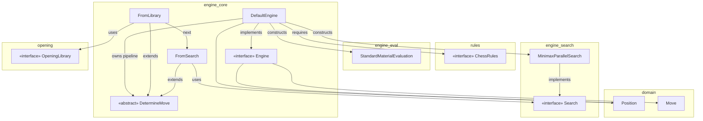
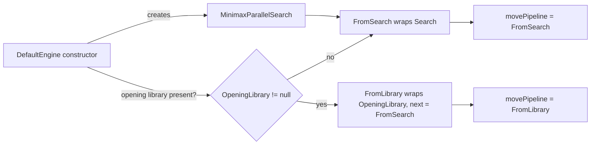
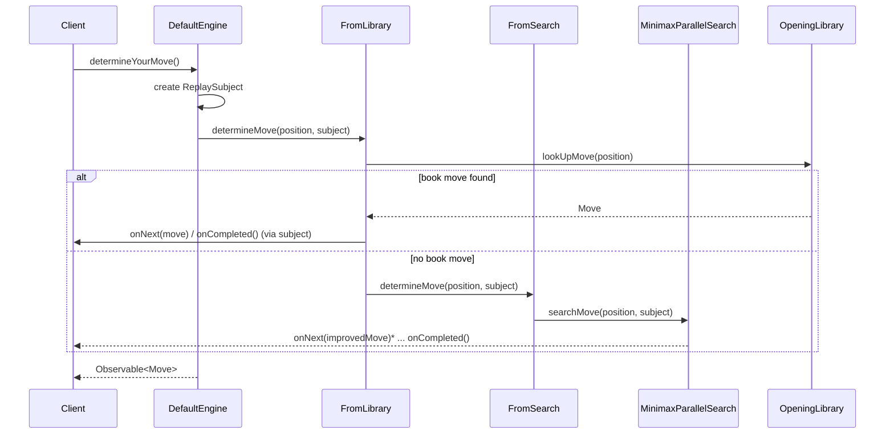
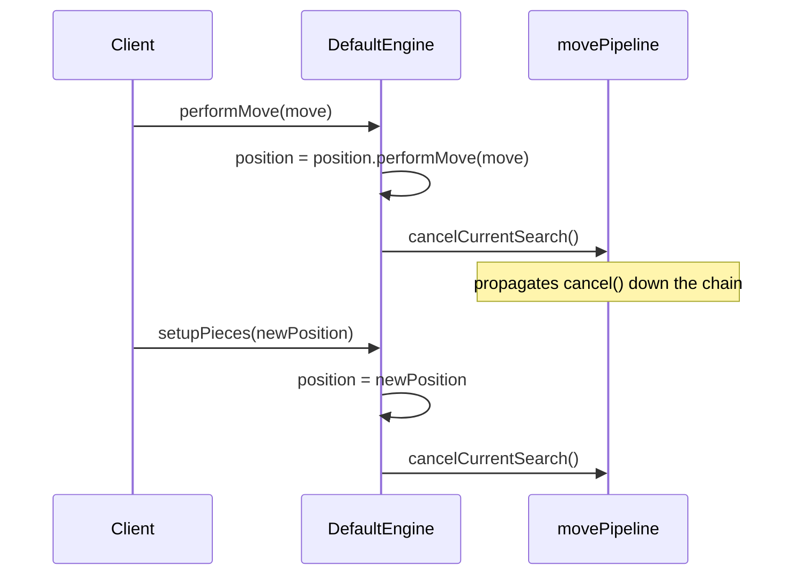

# Engine Core Module

## 1. Purpose

The **engine_core** module is the beating heart of the dokchess playing engine. It defines the
public contract for "an entity that plays chess" (the `Engine` interface) and provides the
default, production implementation `DefaultEngine`. Its main responsibility is **move
determination orchestration**: given the current `Position`, decide which move to play, using
a *chain-of-responsibility* pipeline that first consults an opening book (if available) and
otherwise falls back to a tree search.

Engine Core does not implement chess rules, evaluation heuristics or search algorithms itself.
Instead, it composes and coordinates other modules:

| Concern                         | Delegated to module |
|----------------------------------|----------------------|
| Board/position/move representation | [domain](domain.md) |
| Legal move generation & rule validation | [rules](rules.md) |
| Position evaluation (scoring)   | [engine_eval](engine_eval.md) |
| Move search (minimax, parallel search) | [engine_search](engine_search.md) |
| Opening book lookups            | [opening](opening.md) / [opening_polyglot](opening_polyglot.md) |

Consumers of engine_core include the [textui_xboard](textui_xboard.md) protocol adapter and the
application entry point [main](main.md), as well as the [integration_tests](integration_tests.md)
that exercise the engine end-to-end.

## 2. Package Layout

```
org.dokchess.engine
├── Engine.java            (public interface)
├── DefaultEngine.java      (public default implementation)
├── DetermineMove.java      (package-private, abstract chain link/handler)
├── FromLibrary.java        (package-private, chain link: opening book)
└── FromSearch.java         (package-private, chain link: tree search)
```

Only `Engine` and `DefaultEngine` are part of the public API; the `DetermineMove` hierarchy is an
internal implementation detail of `DefaultEngine` and is intentionally package-private.

## 3. Architecture Overview

### 3.1 Component Diagram



### 3.2 The Chain of Responsibility (`DetermineMove`)

`DetermineMove` is an abstract handler with a reference to the `next` handler in the chain. Two
concrete links currently exist:

* **`FromLibrary`** — wraps an `OpeningLibrary`. If a book move exists for the given
  `Position`, it is emitted immediately and the search chain is *not* invoked.
* **`FromSearch`** — wraps a `Search` implementation (typically
  `MinimaxParallelSearch` from [engine_search](engine_search.md)). It always starts the search
  and also forwards the call to any further handler down the chain (there is currently none
  after it).

`DefaultEngine` wires the chain at construction time:



If no `OpeningLibrary` is supplied, the pipeline degenerates to a single `FromSearch` link.

### 3.3 Sequence: Determining a Move



Because `determineYourMove()` returns immediately with an `Observable`, the actual search can run
asynchronously in the background (this is exactly how `MinimaxParallelSearch` operates — see
[engine_search](engine_search.md)). Callers subscribe to the observable to receive move
suggestions and eventually the search's completion signal.

### 3.4 Sequence: Applying a Move / Resetting Position



Both `performMove` and `setupPieces` cancel any search in progress, since the position the
search was computing against is now stale. Cancellation propagates through every link in the
chain via `DetermineMove.cancelCurrentSearch()`, ultimately reaching
`MinimaxParallelSearch.cancelSearch()`.

## 4. Core Components

### 4.1 `Engine` (interface)

The public contract of the module. An `Engine`:

* Is **stateful** — it holds the current `Position` internally and plays one game at a time.
* Exposes four operations:
  * `setupPieces(Position)` — (re)initializes the internal state, cancelling any running search.
  * `determineYourMove()` — non-blocking; returns an `Observable<Move>` streaming progressively
    better move suggestions, completing when the search is done.
  * `performMove(Move)` — commits a move to the internal position (does **not** apply moves
    suggested by `determineYourMove()` automatically — that's the caller's job).
  * `close()` — releases resources; no further move calculations allowed afterwards.

### 4.2 `DefaultEngine`

The standard, production-ready `Engine` implementation.

* **Construction** requires a `ChessRules` implementation (from [rules](rules.md)); an
  `OpeningLibrary` (from [opening](opening.md)) is optional.
* Internally builds:
  * A `MinimaxParallelSearch` (from [engine_search](engine_search.md)) configured with:
    * search depth `4`
    * the supplied `ChessRules`
    * a `StandardMaterialEvaluation` (from [engine_eval](engine_eval.md))
  * A `FromSearch` wrapper around that search.
  * If an opening library is present, a `FromLibrary` wrapper chained in front of `FromSearch`;
    otherwise `FromSearch` itself is used directly as the pipeline head.
* Starts with a fresh `Position` (initial chess setup) until `setupPieces` is called.

### 4.3 `DetermineMove` (abstract, package-private)

Base class implementing the **Chain of Responsibility** pattern for move selection:

* Holds a reference to the `next` handler.
* `determineMove(Position, Observer<Move>)` — default behavior simply forwards to `next` (a
  no-op if there is no next handler); subclasses override to provide actual logic and decide
  whether/when to forward.
* `cancelCurrentSearch()` — propagates a cancellation request down the chain; subclasses that
  own a cancellable resource (like `FromSearch`'s `Search`) should override this to cancel that
  resource — note that in the current implementation this is delegated entirely to `Search`'s own
  lifecycle inside `FromSearch`/`MinimaxParallelSearch` (see below for exact wiring).

### 4.4 `FromLibrary` (package-private)

* Wraps an `OpeningLibrary`.
* On `determineMove`, looks up a move for the given position:
  * If found: emits it via `observer.onNext(move)` followed by `observer.onCompleted()` and
    **stops** the chain (does not forward to `next`).
  * If not found: delegates entirely to `super.determineMove(...)`, i.e. forwards to `next`
    (typically a `FromSearch`).

### 4.5 `FromSearch` (package-private)

* Wraps a `Search` (see [engine_search](engine_search.md) for `MinimaxParallelSearch` and other
  implementations).
* On `determineMove`, always calls `search.searchMove(position, observer)` to kick off the
  search, then also calls `super.determineMove(...)` to forward to any further handler in the
  chain (currently a no-op, since `FromSearch` is the tail of the default pipeline).

## 5. Design Notes & Extension Points

* **Reactive API.** The module uses RxJava (`Observable`/`Observer`/`ReplaySubject`) to model
  move determination as an asynchronous stream. This allows the search to report intermediate
  (improving) move candidates before finally settling, without blocking the caller.
* **Pluggable rules/evaluation/search.** `DefaultEngine` depends only on the `ChessRules` and
  `Search`/`Evaluation` *interfaces*; the concrete `MinimaxParallelSearch` +
  `StandardMaterialEvaluation` combination is a default wiring choice, but nothing prevents an
  alternative `Engine` implementation (or a modified `DefaultEngine`) from using different
  search/evaluation strategies.
* **Extending the chain.** New `DetermineMove` links (e.g. tablebase lookups, transposition
  caching) can be inserted into the pipeline by writing a new subclass and adjusting the wiring
  in `DefaultEngine`'s constructor, without touching `Engine`'s public contract.
* **Cancellation is best-effort.** Since search may run on separate threads (see
  `MinimaxParallelSearch` in [engine_search](engine_search.md)), `cancelCurrentSearch()` merely
  requests cancellation; callers should not assume an immediate, synchronous halt.

## 6. Related Modules

* [domain](domain.md) — `Position`, `Move`, and other board representation types consumed
  throughout this module's API.
* [rules](rules.md) — `ChessRules`, required by `DefaultEngine` to validate/generate legal moves
  during search.
* [engine_eval](engine_eval.md) — `Evaluation`/`StandardMaterialEvaluation`, used to score
  positions during search.
* [engine_search](engine_search.md) — `Search`/`MinimaxParallelSearch`, the actual move-finding
  algorithm invoked by `FromSearch`.
* [opening](opening.md) — `OpeningLibrary` interface, consulted by `FromLibrary`.
* [opening_polyglot](opening_polyglot.md) — a concrete Polyglot-format `OpeningLibrary`
  implementation that can be plugged into `DefaultEngine`.
* [textui_xboard](textui_xboard.md) — a text-protocol adapter that drives an `Engine` instance
  from XBoard/WinBoard commands.
* [main](main.md) — application entry point that assembles `ChessRules`, `OpeningLibrary` and
  `Engine` implementations into a runnable program.
* [integration_tests](integration_tests.md) — end-to-end tests exercising `Engine` behavior
  (e.g. playing against random moves, XBoard protocol conformance).
