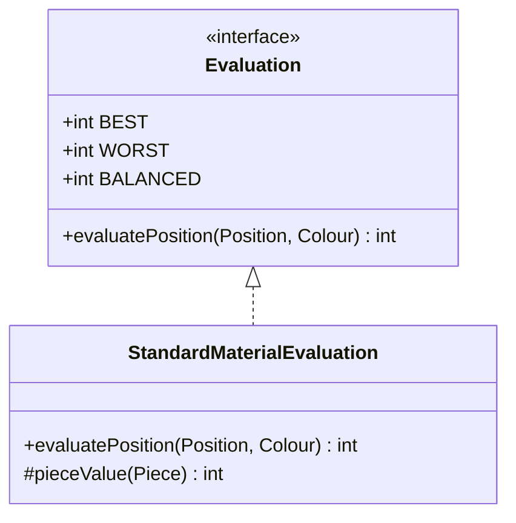
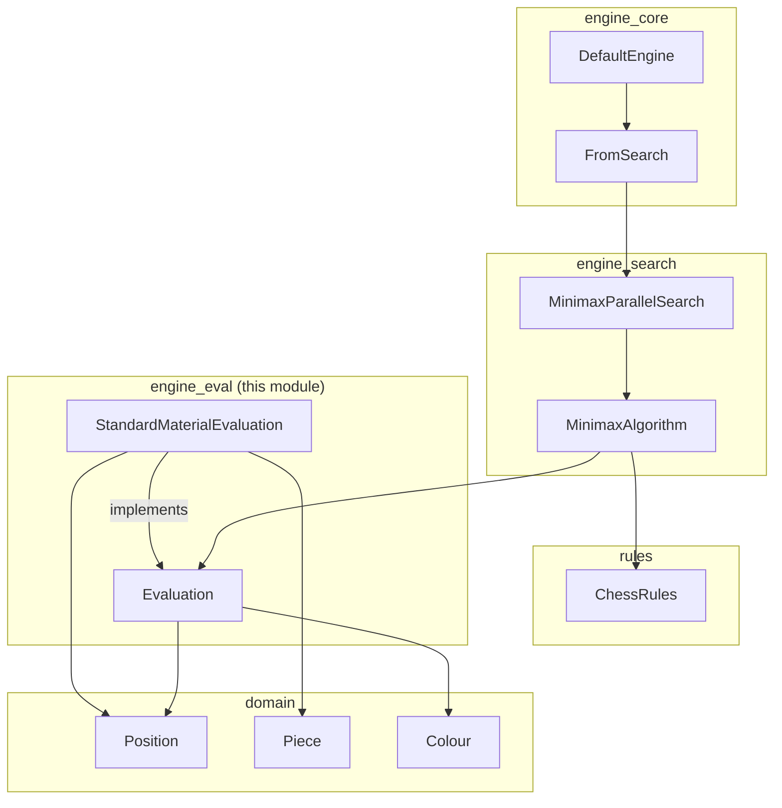
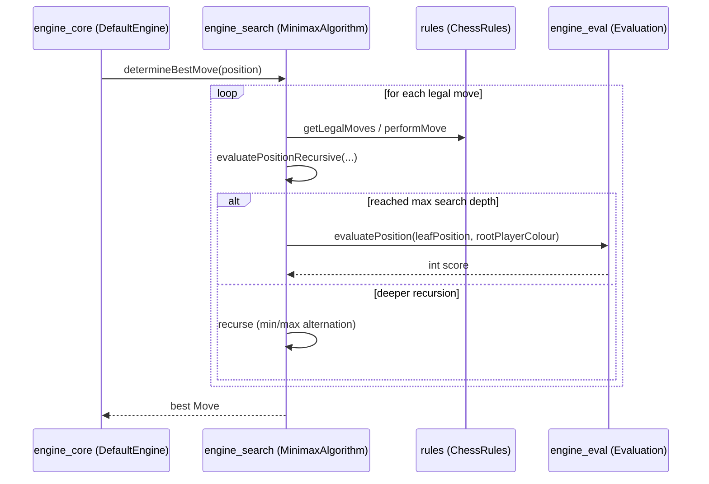

# Module: `engine_eval`

## 1. Purpose

The `engine_eval` module is responsible for **static position evaluation** in the DokChess engine. It answers a single, focused question:

> "Given a chess position, how good is it for a particular player, expressed as a single numeric score?"

This score is the fundamental building block that the search algorithms in [`engine_search`](engine_search.md) use to compare candidate moves and decide which one is "best" without needing to see all the way to the end of the game. The module intentionally contains **no search or move-generation logic** — it only judges positions that are handed to it.

Two artifacts make up the module:

| Component | Role |
|---|---|
| `Evaluation` | The interface (contract) that all evaluation strategies must implement. |
| `StandardMaterialEvaluation` | A concrete, simple implementation that scores a position purely by counting material (piece values). |

Because evaluation is expressed behind an interface, the rest of the engine (search, engine core) is decoupled from *how* a position is judged. New evaluation strategies (e.g. positional heuristics, piece-square tables, king-safety bonuses) can be added later by implementing `Evaluation` without touching the search code.

## 2. Architecture Overview



### Where `engine_eval` sits in the system



`engine_eval` depends only on the [`domain`](domain.md) module (for `Position`, `Piece`, `Colour`). It is, in turn, a dependency of [`engine_search`](engine_search.md), which drives the minimax tree search and calls `Evaluation.evaluatePosition(...)` at leaf nodes. The search result flows up through [`engine_core`](engine_core.md) to produce the engine's chosen move.

## 3. Core Components

### 3.1 `Evaluation` (interface)

```java
public interface Evaluation {
    int BEST = Integer.MAX_VALUE;
    int WORST = Integer.MIN_VALUE;
    int BALANCED = 0;

    int evaluatePosition(Position position, Colour pointOfView);
}
```

- **Contract**: Given a [`Position`](domain.md) and a `Colour` (`pointOfView`), return an `int` score.
  - Higher is better for `pointOfView`.
  - `0` (`BALANCED`) represents an even position.
  - `BEST` / `WORST` are sentinel extremes used by search algorithms (e.g. as initial "so far the best/worst" values, or to represent theoretical win/loss bounds before adjusting for mate distance).
- **Design intent**: This is a pure strategy interface — stateless with respect to search; each call is independent and only depends on the given position. This makes implementations easy to test in isolation and safe to reuse across multiple threads (relevant for [`MinimaxParallelSearch`](engine_search.md) in `engine_search`, which evaluates several root moves concurrently).

### 3.2 `StandardMaterialEvaluation` (implementation)

```java
public class StandardMaterialEvaluation implements Evaluation {

    @Override
    public int evaluatePosition(Position position, Colour pointOfView) { ... }

    protected int pieceValue(final Piece piece) { ... }
}
```

- **Algorithm**: Iterates over all 64 squares (`rank` 0–7, `file` 0–7) of the given [`Position`](domain.md). For every occupied square:
  - Looks up the piece's material value via `pieceValue(Piece)`.
  - Adds the value to the running total if the piece's colour matches `pointOfView`.
  - Subtracts the value if it belongs to the opponent.
- **Material values** (classic chess heuristic weights):

  | Piece | Value |
  |---|---|
  | Pawn | 1 |
  | Knight | 3 |
  | Bishop | 3 |
  | Rook | 5 |
  | Queen | 9 |
  | King | 0 (not counted — the king's presence is implicit/handled via checkmate detection elsewhere) |

- **Properties**:
  - Symmetric: swapping `pointOfView` negates the result (aside from the king's null contribution).
  - No positional awareness — a knight on the rim scores the same as a knight in the center. This is a deliberate simplicity trade-off; the class is written to be easily subclassed or replaced.
  - `pieceValue` is `protected`, explicitly enabling subclasses to override individual piece weights while reusing the summation logic — a simple extension point for tuning material values without duplicating the board-scanning code.

## 4. Data Flow: How Evaluation is Used

The typical call flow during move search is:



Key points visible from [`MinimaxAlgorithm`](engine_search.md) (in `engine_search`):

1. `Evaluation` is only invoked at the **leaf nodes** of the search tree (`currentDepth == depth`), i.e. it provides the static score once the search has looked as far ahead as configured.
2. The **same `rootPlayerColour`** is passed at every leaf regardless of whose turn it actually is at that depth — this lets the minimax algorithm consistently interpret "higher is better for the root player" while alternating min/max layers.
3. Checkmate and stalemate are **not** the responsibility of `Evaluation` — those terminal conditions are detected by [`ChessRules`](rules.md) and scored directly by `MinimaxAlgorithm` using `Evaluation.BEST`/`WORST`-derived constants (e.g. `CHECKMATE_SCORE`). `Evaluation` implementations only need to judge "normal" (non-terminal) positions.

## 5. Extensibility

Because `engine_search` depends only on the `Evaluation` interface (via dependency injection — see `MinimaxAlgorithm.setEvaluation(...)`), new evaluation strategies can be plugged in without modifying search code:

- A **positional evaluation** could add piece-square tables, king safety, pawn structure, mobility, etc.
- A **composite evaluation** could combine `StandardMaterialEvaluation` with other heuristics using weighted sums.
- A **learned evaluation** (e.g. neural network-based) could be substituted entirely.

Any such implementation must satisfy the same contract: pure function of `(Position, Colour) -> int`, with `0` balanced and higher favoring `pointOfView`.

## 6. Related Modules

- [`domain`](domain.md) — Provides `Position`, `Piece`, `Colour`, and related board representation types consumed by evaluation logic.
- [`rules`](rules.md) — Supplies legal move generation and check/checkmate/stalemate detection used by the search layer around evaluation calls.
- [`engine_search`](engine_search.md) — Consumes `Evaluation` at the leaves of its minimax search tree (sequential `MinimaxAlgorithm` and parallel `MinimaxParallelSearch`).
- [`engine_core`](engine_core.md) — Orchestrates the overall engine (opening book lookups via `FromLibrary`, falling back to search via `FromSearch`), ultimately depending transitively on `engine_eval` through `engine_search`.
