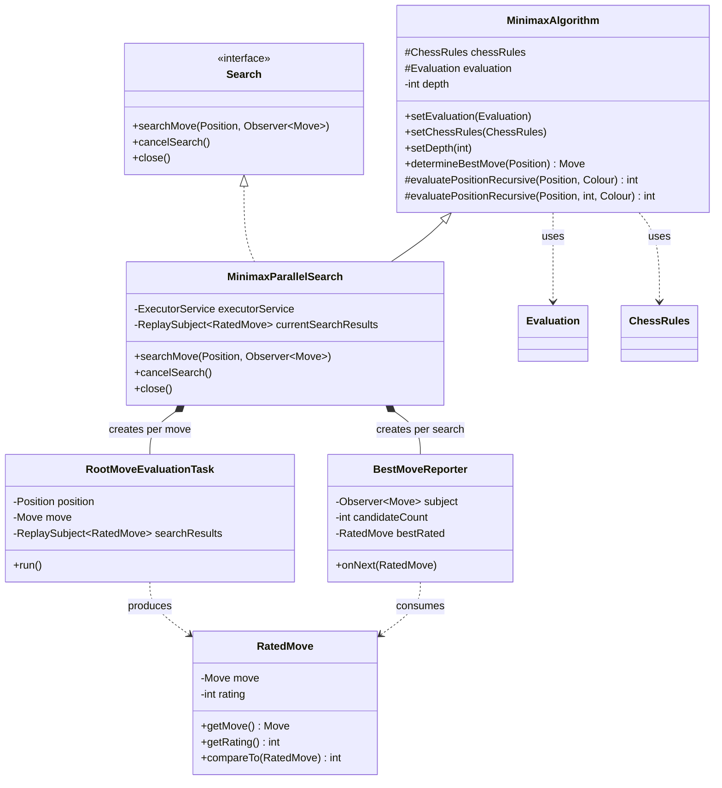
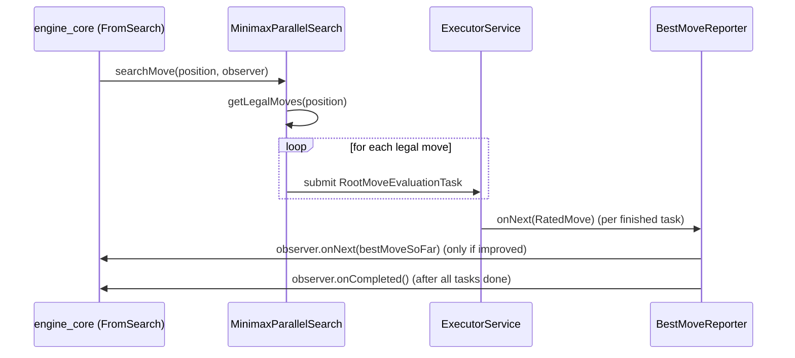
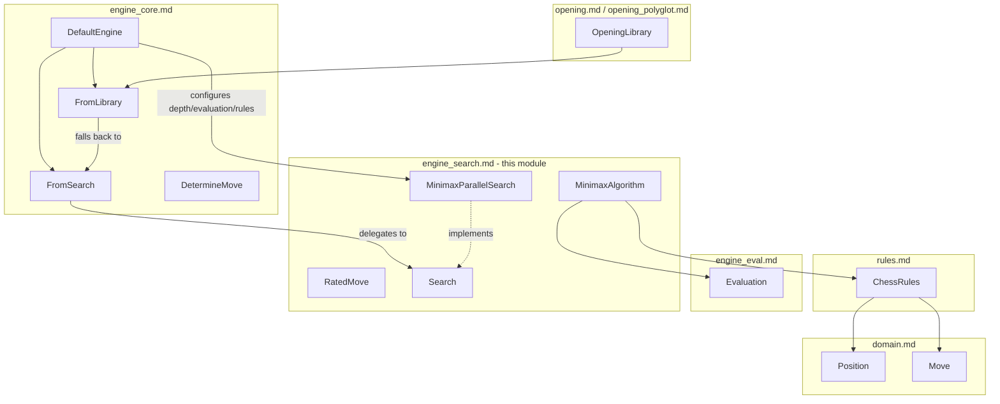

# Engine Search Module

## Introduction

The `engine_search` module implements the **move-searching brain** of the dokchess
chess engine. Given a `Position` and a set of `ChessRules`, it explores the tree of
possible future positions and returns the move judged to be best according to a
pluggable [`Evaluation`](engine_eval.md) function.

The module provides two complementary implementations of the classic **minimax**
algorithm:

- A simple, synchronous, single-threaded version (`MinimaxAlgorithm`) that blocks
  until it has computed the best move.
- A parallel, asynchronous version (`MinimaxParallelSearch`) that evaluates each
  root move concurrently on a thread pool and streams progressively better moves
  to an observer, implementing the [`Search`](#search-abstraction) interface used
  by the rest of the engine.

This module sits at the heart of [`engine_core`](engine_core.md), which wires a
`Search` implementation into its move-determination pipeline together with the
opening book (see [`opening`](opening.md) / [`opening_polyglot`](opening_polyglot.md)).

## Purpose and Core Functionality

- **Move enumeration**: relies on [`rules`](rules.md) (`ChessRules.getLegalMoves`)
  to generate the legal moves at every node of the search tree.
- **Position advancement**: uses `Position.performMove` from
  [`domain`](domain.md) to derive child positions.
- **Leaf evaluation**: delegates position scoring to a pluggable
  `Evaluation` implementation (see [`engine_eval`](engine_eval.md)), such as
  `StandardMaterialEvaluation`.
- **Terminal detection**: explicitly detects checkmate and stalemate at leaves
  where no legal moves exist, scoring them appropriately (mate scores favor
  shorter mates; stalemate is scored as balanced).
- **Depth-limited search**: search depth (in plies/half-moves) is configurable.
- **Asynchronous streaming of results**: `MinimaxParallelSearch` reports
  improving moves via RxJava `Observer<Move>` as they are discovered, and
  signals completion once all root moves have been evaluated.
- **Cancellation**: an in-progress parallel search can be cancelled, which
  completes the observer stream and discards any pending results.

## Architecture Overview

### Search Abstraction

`Search` (see [`Search.java`](#)) is the contract the rest of the engine depends
on. It decouples the search algorithm from the calling code
(`engine_core`'s `FromSearch` handler) and allows asynchronous, incremental
delivery of results instead of a single blocking call:

## Sub-modules

The module is small enough to be documented as a single cohesive unit, but its
responsibilities naturally split into two areas:

| Area | Description | Documentation |
|------|-------------|----------------|
| **Minimax Core** | The recursive minimax evaluation logic shared by both the synchronous and parallel searches, including terminal-node (checkmate/stalemate) scoring. | [engine_search_minimax.md](engine_search_minimax.md) |
| **Parallel Search & Result Streaming** | The `Search` interface implementation, task/observer wiring (`RootMoveEvaluationTask`, `BestMoveReporter`), `RatedMove` value type, thread-pool management, and cancellation semantics. | [engine_search_parallel.md](engine_search_parallel.md) |

## How This Module Fits Into the Overall System

- [`engine_core`](engine_core.md) is the primary consumer of this module. Its
  `DefaultEngine` constructs and configures a `MinimaxParallelSearch` (setting
  depth, rules, and evaluation), wraps it in a `FromSearch` handler, and chains
  it after an optional `FromLibrary` opening-book lookup.
- [`rules`](rules.md) supplies the `ChessRules` implementation used to generate
  legal moves and detect check/checkmate/stalemate at every search node.
- [`engine_eval`](engine_eval.md) supplies the `Evaluation` implementation used
  to score leaf positions.
- [`domain`](domain.md) provides the fundamental `Position` and `Move` types
  manipulated throughout the search.
- The [`textui_xboard`](textui_xboard.md) and [`main`](main.md) modules
  ultimately trigger engine moves that flow down into this search module via
  `engine_core`.

## Key Design Notes

- **Depth semantics**: `depth` is expressed in plies (half-moves). At
  `currentDepth == depth`, the recursive evaluator stops recursing and calls
  the configured `Evaluation` directly.
- **Alternating min/max layers**: odd ply depths correspond to a "min" layer,
  even ply depths to a "max" layer, relative to the root call starting at
  depth 1.
- **Mate scoring**: `CHECKMATE_SCORE` is derived from `Evaluation.BEST / 2`,
  and the current ply is subtracted so that faster mates are preferred over
  slower ones during move ordering/selection.
- **Parallelism**: `MinimaxParallelSearch` reuses `MinimaxAlgorithm`'s
  recursive evaluation logic (via inheritance) but parallelizes only at the
  root: each legal root move is dispatched to its own
  `RootMoveEvaluationTask`, run on a fixed thread pool sized to the number of
  available processor cores.
- **Streaming best move**: `BestMoveReporter` only forwards a move to the
  external observer when it strictly improves upon the best rating seen so
  far, and signals completion once every root move's task has reported in.
- **Cancellation**: calling `cancelSearch()` completes the internal
  `ReplaySubject`, which in turn marks all subscribed
  `RootMoveEvaluationTask`s as finished so they skip their evaluation if not
  yet started/completed.
