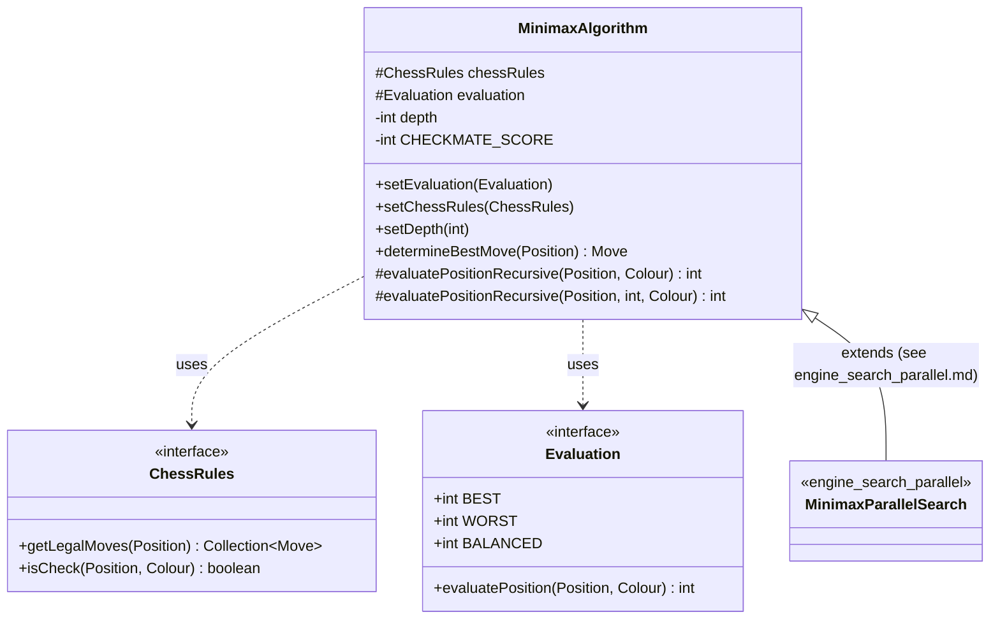
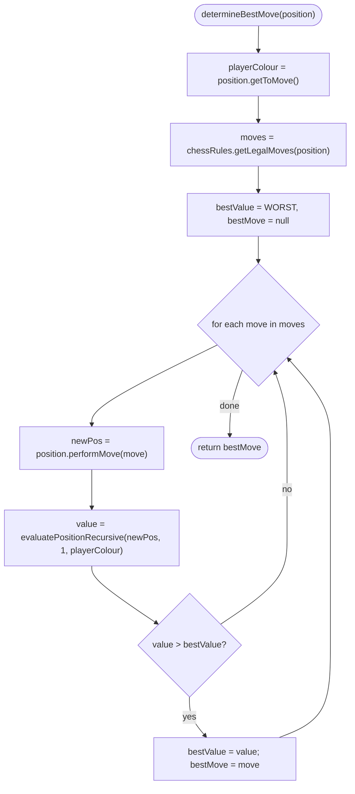
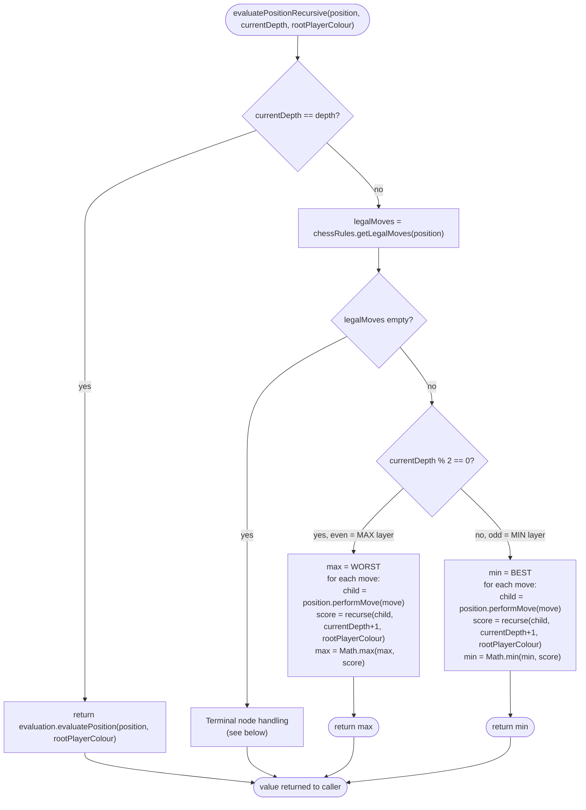
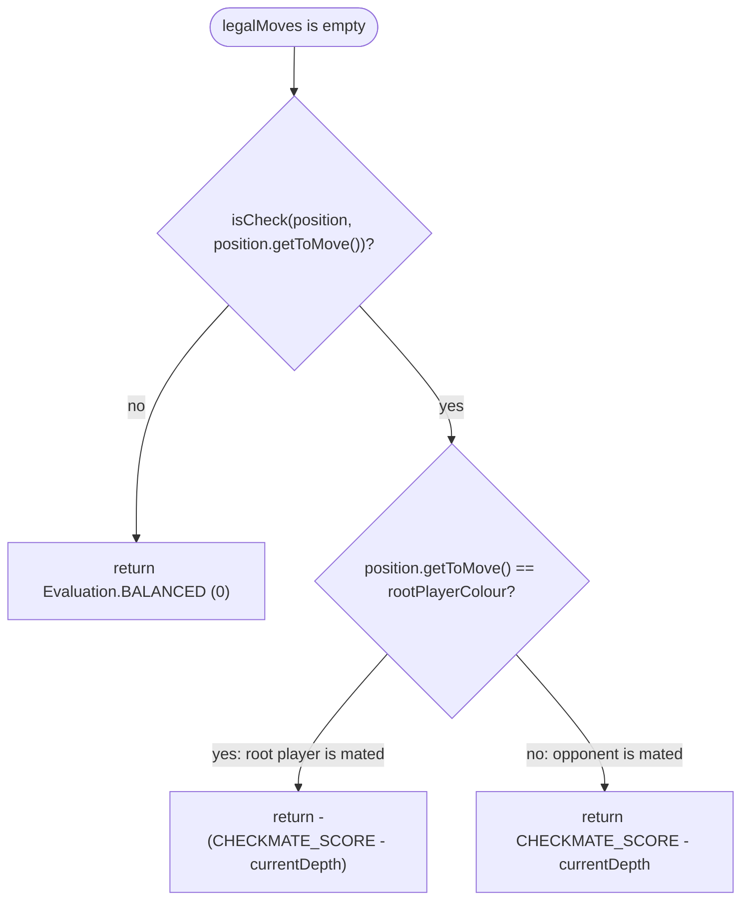
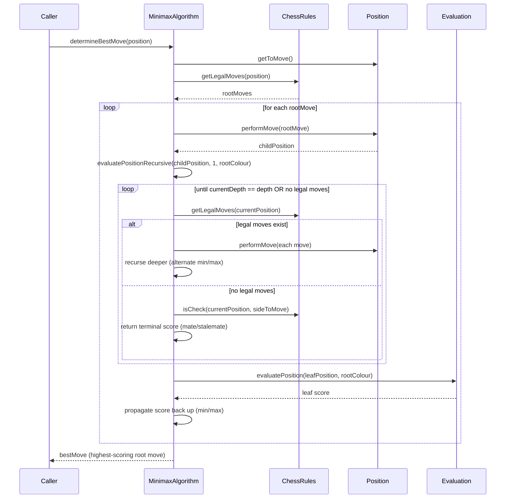
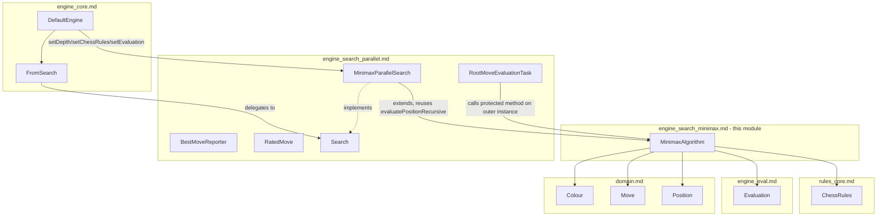

# engine_search_minimax

## Introduction

`engine_search_minimax` is the **algorithmic core** of dokchess's move search. It contains a
single class, [`MinimaxAlgorithm`](../src/main/java/org/dokchess/engine/search/MinimaxAlgorithm.java),
which implements a classic depth-limited **minimax** tree search over legal chess moves.

This module is a child of the broader [`engine_search`](engine_search.md) module. Where
`engine_search` as a whole is concerned with *how the engine finds and reports a move*
(including threading, streaming, and cancellation — see
[`engine_search_parallel`](engine_search_parallel.md)), `engine_search_minimax` is concerned
purely with *the tree-search algorithm itself*: given a position, how deep do we look, how do
we score what we see, and how do we combine child scores into a decision at each node?

`MinimaxAlgorithm` is deliberately kept simple and synchronous. It is used in two ways:

1. **Directly**, via `determineBestMove(Position)`, as a single-threaded, blocking minimax
   search — useful for tests, simple tools, or any caller that does not need asynchronous
   reporting.
2. **As a base class**, extended by
   [`MinimaxParallelSearch`](engine_search_parallel.md#minimaxparallelsearch) in
   `engine_search_parallel`, which reuses the protected `evaluatePositionRecursive` methods to
   parallelize evaluation of root moves across a thread pool while keeping the recursive
   minimax logic itself untouched.

## Purpose and Core Functionality

`MinimaxAlgorithm` answers one question: *"Given a position, a set of chess rules, an
evaluation function, and a fixed search depth, which legal move is best for the side to
move?"* It does so with the textbook minimax procedure:

- **Move generation** at every node comes from [`ChessRules.getLegalMoves`](rules_core.md),
  supplied via `setChessRules(ChessRules)`.
- **Position advancement** uses [`Position.performMove`](domain_model.md) to derive each child
  position from a candidate move.
- **Leaf scoring** is delegated to a pluggable [`Evaluation`](engine_eval.md) implementation,
  supplied via `setEvaluation(Evaluation)`. The evaluation is only consulted once the configured
  `depth` (in plies) has been reached.
- **Terminal-node handling** (checkmate/stalemate) is detected explicitly whenever a node has no
  legal moves, *without* calling into `Evaluation` — see [Terminal Node Scoring](#terminal-node-scoring)
  below.
- **Alternating min/max layers** implement the adversarial nature of chess: the root player's
  moves are maximised, the opponent's replies are minimised, alternating at every ply.

Two configuration setters and one depth setter make up the object's mutable state:

| Setter | Purpose |
|---|---|
| `setChessRules(ChessRules)` | Supplies legal-move generation and check detection (see [rules_core](rules_core.md)) |
| `setEvaluation(Evaluation)` | Supplies the leaf-node scoring function (see [engine_eval](engine_eval.md)) |
| `setDepth(int)` | Sets the maximum search depth in **plies** (half-moves) |

Because these are plain setters (not constructor parameters), `MinimaxAlgorithm` — and by
extension `MinimaxParallelSearch` — is configured imperatively after construction, as seen in
`DefaultEngine`'s wiring (see [engine_core](engine_core.md)).

## Architecture Overview

`MinimaxAlgorithm` itself has no dependency on threading, RxJava, or the `Search` interface —
those concerns live entirely in [`engine_search_parallel`](engine_search_parallel.md). This
module's only external dependencies are:

- [`domain`](domain.md) (specifically [`domain_model`](domain_model.md)) — for `Position`,
  `Move`, `Colour`.
- [`rules`](rules.md) (specifically [`rules_core`](rules_core.md)) — for the `ChessRules`
  interface used to generate moves and detect check.
- [`engine_eval`](engine_eval.md) — for the `Evaluation` interface used to score leaves.

## The Minimax Algorithm in Detail

### Entry Point: `determineBestMove`

`determineBestMove` is effectively the **root max layer** unrolled explicitly (rather than
recursing one extra level): it evaluates every legal root move at ply 1 relative to the mover,
and keeps the move with the strictly highest score. If there are no legal moves (the root
position is itself checkmate or stalemate), it returns `null`.

Note that the recursive helper is entered at `currentDepth = 1` for every root move's resulting
position — i.e. after the root move has already been applied, ply counting starts at 1 for the
*opponent's* reply.

### Recursive Evaluation: `evaluatePositionRecursive`

This is the heart of the algorithm — a standard depth-limited minimax recursion with two
overloads:

- `evaluatePositionRecursive(Position, Colour)` — convenience entry point, starts at ply 1.
- `evaluatePositionRecursive(Position, int currentDepth, Colour rootPlayerColour)` — the actual
  recursive worker.

#### Ply Parity and Min/Max Layers

The recursion is entered with `currentDepth = 1` right after the **root move** has been applied
by the caller (`determineBestMove` or, in the parallel variant, `RootMoveEvaluationTask` — see
[`engine_search_parallel`](engine_search_parallel.md)). At that point, it is the **opponent's**
turn to move in `position`. The parity rule is:

| `currentDepth` | Parity | Layer | Whose reply is being modeled |
|---|---|---|---|
| 1 | odd | **MIN** | Opponent's first reply — minimised because the opponent will pick what's worst for the root player |
| 2 | even | **MAX** | Root player's second move — maximised |
| 3 | odd | **MIN** | Opponent's second reply — minimised |
| ... | ... | ... | ... |

This alternation correctly models adversarial play: the root player (whose colour is fixed as
`rootPlayerColour` for the entire recursion) always tries to maximise the score, while the
opponent — whichever ply they move on — always tries to minimise it. Because `rootPlayerColour`
never changes during the recursion, `Evaluation.evaluatePosition(position, rootPlayerColour)` at
the leaf always scores the position from the *same* fixed point of view, regardless of who is
actually on move at that leaf.

#### Terminal Node Scoring

When `chessRules.getLegalMoves(position)` returns an empty collection, the side to move at that
node has no legal move — this is either **checkmate** or **stalemate**, detected via
`chessRules.isCheck(position, position.getToMove())`:

- **Stalemate** is scored as exactly `Evaluation.BALANCED` (`0`) — a draw, neither good nor bad
  for either side.
- **Checkmate** is scored using `CHECKMATE_SCORE = Evaluation.BEST / 2`, a large constant chosen
  to dominate any ordinary material/positional evaluation score, but to leave headroom on both
  sides of zero so subtracting `currentDepth` never overflows or crosses into "worse than a
  stalemate" territory for a losing side.
  - If the **root player** is the one with no moves while in check, the root player has been
    mated: the score is **very negative**, `-(CHECKMATE_SCORE - currentDepth)`.
  - If the **opponent** has been mated, the score is **very positive**,
    `CHECKMATE_SCORE - currentDepth`.
  - Subtracting `currentDepth` means **shallower (faster) mates score higher in magnitude**
    than deeper (slower) ones. This gives the search a built-in preference: among several
    winning lines, prefer the one that mates soonest; among several losing lines (if all moves
    eventually lose), prefer the one that delays the mate longest.

This mate-scoring scheme means checkmate/stalemate detection and scoring is **entirely the
responsibility of `MinimaxAlgorithm`**, not of `Evaluation` — see the note in
[engine_eval.md, §4](engine_eval.md#4-data-flow-how-evaluation-is-used) confirming that
`Evaluation` implementations only need to judge "normal" (non-terminal) positions.

## Sequence: A Full `determineBestMove` Call

## Complexity and Depth Semantics

- **Depth is measured in plies (half-moves)**, not full moves. `setDepth(4)` — the value used by
  [`DefaultEngine`](engine_core.md) — means the search looks two full moves ahead (engine
  move → opponent reply → engine move → opponent reply), with the second engine move and
  final reply evaluated statically at the leaf.
- **Branching factor**: at every non-terminal node, `getLegalMoves` is called and every resulting
  move is explored — there is **no pruning** (no alpha-beta cutoff, no move ordering
  heuristics). The algorithm is a plain, exhaustive minimax up to `depth`. This keeps the logic
  easy to reason about and test, at the cost of exploring the full breadth of the tree.
- **Cost driver**: as noted in [rules_core.md, §4.2](rules_core.md#42-ischeckmateposition-and-isstalemateposition),
  `getLegalMoves` itself is not free (it simulates every pseudo-legal move to filter out
  self-check). Since this module calls `getLegalMoves` once per node, the total number of calls
  grows roughly with the branching factor raised to the depth — this is precisely why
  [`engine_search_parallel`](engine_search_parallel.md) exists: to parallelize the otherwise
  expensive full-depth recursive walk of the tree across root moves.

## How This Module Fits Into `engine_search` and Beyond

Within [`engine_search`](engine_search.md), this module (`engine_search_minimax`) provides the
*algorithm*, while [`engine_search_parallel`](engine_search_parallel.md) provides the
*execution strategy* (threading, streaming results, cancellation) and the public `Search`
contract consumed by [`engine_core`](engine_core.md). `MinimaxParallelSearch` is a subclass of
`MinimaxAlgorithm`: it inherits `chessRules`, `evaluation`, and `depth` as protected state, and
calls the inherited `evaluatePositionRecursive(Position, Colour)` method once per root move,
from within its own `RootMoveEvaluationTask.run()` — each task running independently on a
thread-pool thread. No change to the minimax logic itself is required to make it run in
parallel; only the *iteration over root moves* is parallelized, one thread per root move's
subtree.

Because [`ChessRules`](rules_core.md) implementations (like `DefaultChessRules`) are stateless
(see [rules_core.md, §7](rules_core.md#7-design-notes)) and
[`Position`](domain_model.md) is effectively immutable, a single shared `MinimaxAlgorithm`
instance's `chessRules` and `evaluation` fields can safely be read concurrently by multiple
`RootMoveEvaluationTask`s without synchronization — each task only ever touches its own,
independent `Position` objects derived via `performMove`.

## Key Design Notes

- **Single Responsibility**: `MinimaxAlgorithm` knows nothing about threads, observers, or the
  `Search` interface. It is a pure, synchronous, recursive tree-search algorithm — easy to unit
  test in isolation by injecting fake `ChessRules`/`Evaluation` implementations.
- **Protected extension points**: both `evaluatePositionRecursive` overloads are `protected`,
  explicitly designed to be called from a subclass (`MinimaxParallelSearch`) rather than only
  internally — this is the seam that enables parallelization without duplicating minimax logic.
- **No alpha-beta pruning**: the algorithm always explores the full tree up to `depth`; this is a
  deliberate simplicity choice documented here so maintainers don't mistake the lack of pruning
  for a bug. Adding alpha-beta (or other pruning/move-ordering techniques) would be a natural,
  localized enhancement to `evaluatePositionRecursive`.
- **Deterministic**: for a fixed position, `ChessRules` implementation, `Evaluation`
  implementation, and `depth`, `determineBestMove` always returns the same move — moves are
  visited in the iteration order of the collection returned by `getLegalMoves`, and only a
  *strictly greater* value replaces `bestValue`/`max` (ties keep the first move found).
- **Mate-in-N awareness**: the `CHECKMATE_SCORE - currentDepth` scheme (see
  [Terminal Node Scoring](#terminal-node-scoring)) gives the algorithm a basic, built-in
  preference for faster mates and slower losses, without needing a separate "mate distance"
  data structure.

## Related Modules

- [`engine_search`](engine_search.md) — parent module; overview of the whole search subsystem
  and the split between this module and `engine_search_parallel`.
- [`engine_search_parallel`](engine_search_parallel.md) — sibling module; wraps this algorithm
  in a parallel, asynchronous `Search` implementation (`MinimaxParallelSearch`) with result
  streaming and cancellation.
- [`engine_eval`](engine_eval.md) — supplies the `Evaluation` strategy consulted at leaf nodes.
- [`rules`](rules.md) / [`rules_core`](rules_core.md) — supplies the `ChessRules` used for move
  generation and check detection at every node.
- [`domain`](domain.md) / [`domain_model`](domain_model.md) — supplies `Position`, `Move`, and
  `Colour`, the fundamental types manipulated by the recursion.
- [`engine_core`](engine_core.md) — the primary consumer; `DefaultEngine` configures a
  `MinimaxParallelSearch` (subclass of `MinimaxAlgorithm`) with depth `4`, a `ChessRules`
  instance, and a `StandardMaterialEvaluation`.
