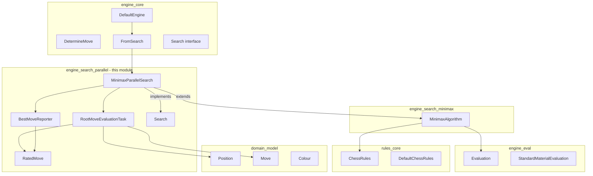
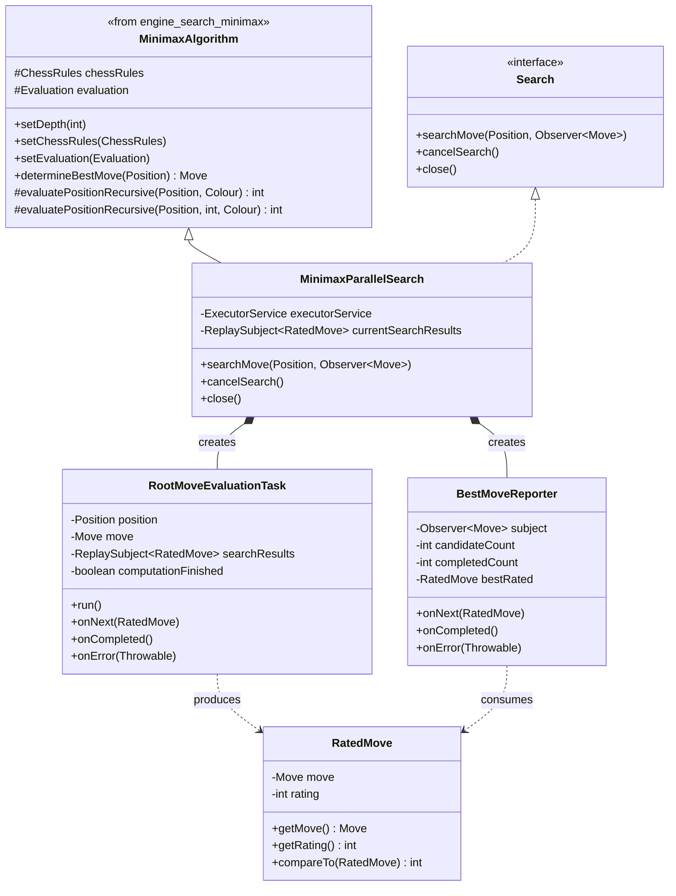
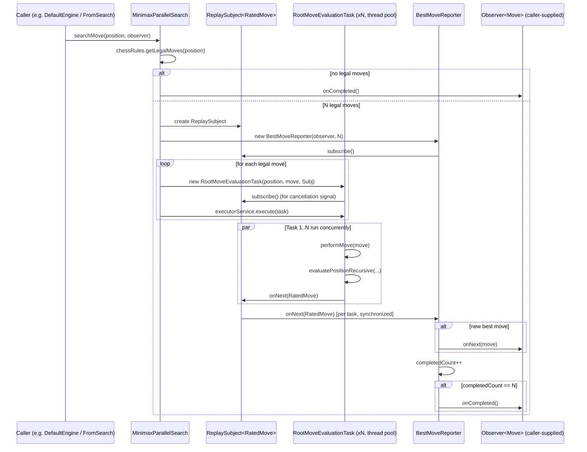
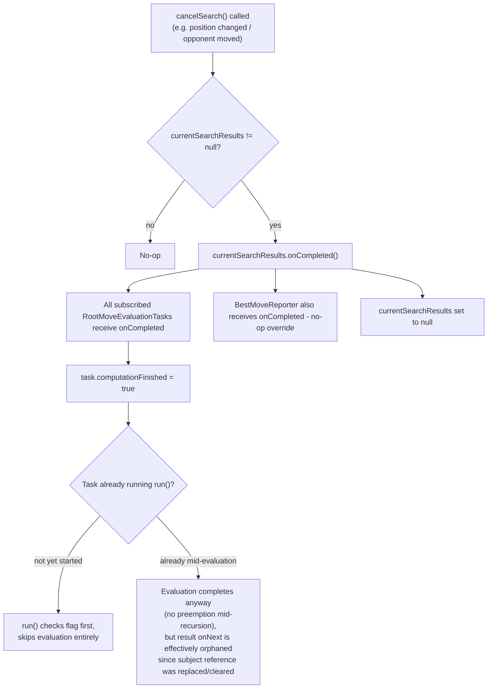
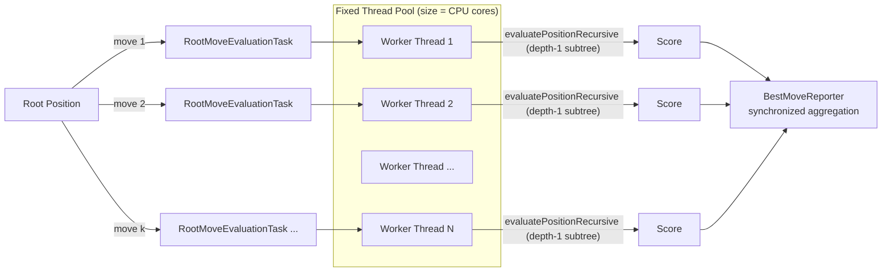
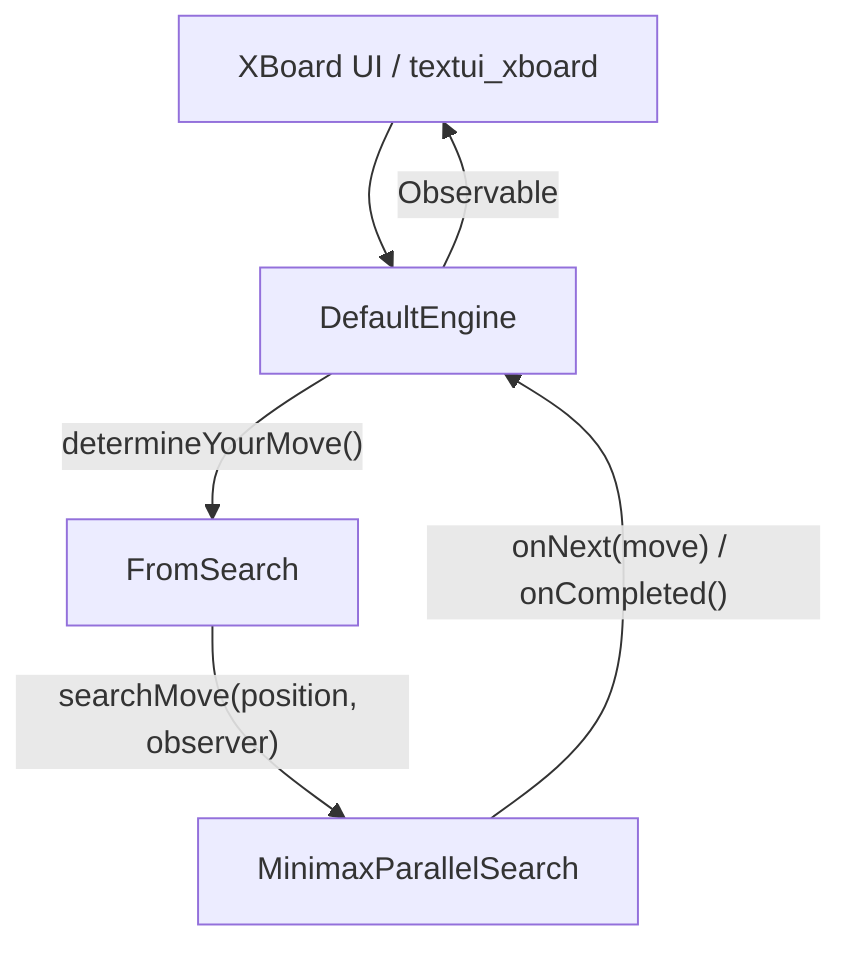

# Engine Search Parallel

## Introduction

`engine_search_parallel` provides a **multi-threaded, root-level parallelization** of the minimax
search algorithm used by the Dokchess engine. Instead of evaluating every legal move at the root
sequentially (as done by the plain [`engine_search_minimax`](engine_search_minimax.md) module), this
module distributes the evaluation of each root move across a fixed thread pool sized to the number
of available CPU cores. Results are streamed asynchronously using RxJava `Observer`/`Subject`
primitives, allowing the engine to report improving moves to its caller as soon as they are found,
and to react immediately to cancellation requests (e.g. when the opponent moves or the position
changes).

This module is the **default search strategy** wired into [`engine_core`](engine_core.md)'s
`DefaultEngine`, and it builds directly on top of the sequential minimax implementation in
`engine_search_minimax`, reusing its recursive evaluation logic while replacing only the root-level
move iteration with parallel tasks.

## Module Position in the System



See also:
- [`engine_core`](engine_core.md) — the engine facade (`DefaultEngine`) and the `DetermineMove`
  chain-of-responsibility (`FromLibrary`, `FromSearch`) that invokes this module's `Search`
  implementation.
- [`engine_search_minimax`](engine_search_minimax.md) — the sequential minimax algorithm that this
  module extends and reuses for per-move sub-tree evaluation.
- [`engine_eval`](engine_eval.md) — the static position evaluation function used at the search's
  maximum depth.
- [`rules`](rules.md) — legal move generation, check/checkmate/stalemate detection consumed by the
  minimax recursion.
- [`domain`](domain.md) — the `Position` and `Move` value types operated on during search.

## Core Components

| Component | Type | Responsibility |
|---|---|---|
| `Search` | Interface | Defines the asynchronous move-search contract: `searchMove`, `cancelSearch`, `close`. |
| `MinimaxParallelSearch` | Class (`extends MinimaxAlgorithm implements Search`) | Orchestrates parallel evaluation of all root moves on a fixed thread pool; publishes results via RxJava. |
| `RootMoveEvaluationTask` | Inner class (`Runnable`, `Observer<RatedMove>`) | Evaluates a single root move's resulting sub-tree using the inherited minimax recursion; runs in a worker thread. |
| `BestMoveReporter` | Inner class (`Observer<RatedMove>`) | Consumes rated moves as they complete, tracks the best one seen so far, and forwards improvements to the caller's `Observer<Move>`. |
| `RatedMove` | Class (`Comparable<RatedMove>`) | Immutable pairing of a `Move` and its integer evaluation score. |

### `Search` Interface

```java
public interface Search {
    void searchMove(Position position, Observer<Move> observer);
    void cancelSearch();
    void close();
}
```

This is the abstraction that the `engine_core` chain (`FromSearch`) depends on. It decouples the
engine facade from any particular search algorithm implementation — `MinimaxParallelSearch` is one
implementation; a purely sequential one could be substituted without changing `engine_core`.

### `RatedMove`

A simple immutable value object combining a candidate `Move` with its numeric score (higher is
better, per the [`Evaluation`](engine_eval.md) convention). It implements `Comparable` so that
rated moves could be sorted or compared directly, although in this module comparisons are done
manually inside `BestMoveReporter` for streaming updates.

### `MinimaxParallelSearch`

The central class of this module. It:

1. **Extends** `MinimaxAlgorithm` (from `engine_search_minimax`) to reuse:
   - `chessRules` / `evaluation` / `depth` configuration setters.
   - The protected `evaluatePositionRecursive(Position, Colour)` method, which performs the actual
     minimax recursion below the root ply.
2. **Implements** `Search`, exposing `searchMove`, `cancelSearch`, and `close`.
3. Owns a fixed-size `ExecutorService` (`Executors.newFixedThreadPool(cores)`), sized to
   `Runtime.getRuntime().availableProcessors()`, created once per `MinimaxParallelSearch` instance
   and reused across searches.
4. Uses an RxJava `ReplaySubject<RatedMove>` (`currentSearchResults`) as the shared communication
   channel for the currently running search, enabling both:
   - Multiple worker tasks to publish results asynchronously (`onNext`).
   - Late subscribers to replay previously emitted values.
   - A single cancellation point: calling `onCompleted()` on this subject signals every subscribed
     task and the reporter to stop.

#### Key Methods

- **`searchMove(Position position, Observer<Move> subject)`**
  Retrieves all legal moves via `chessRules.getLegalMoves(position)`. If there are none (checkmate
  or stalemate), it immediately calls `subject.onCompleted()`. Otherwise it:
  - Creates a new `ReplaySubject<RatedMove>` and stores it as `currentSearchResults` (replacing any
    previous search's subject reference, effectively orphaning old tasks so their results become
    no-ops on completion).
  - Creates one `BestMoveReporter`, subscribing it to the results subject.
  - For each legal move, creates a `RootMoveEvaluationTask`, subscribes it to the results subject
    (so it can be told when to stop via `onCompleted`/`onError`), and submits it to the executor.

- **`cancelSearch()`**
  Calls `onCompleted()` on the current `ReplaySubject`, which propagates the completion signal to
  every subscriber (all outstanding `RootMoveEvaluationTask`s and the `BestMoveReporter`), then
  clears the reference. Tasks still queued or running check their `computationFinished` flag before
  doing further work.

- **`close()`**
  Calls `cancelSearch()` and then shuts down the `ExecutorService`. After this call the instance
  cannot be used for further searches.

### `RootMoveEvaluationTask` (inner class)

Represents the unit of work executed by a single thread in the pool: evaluate one root move.

```java
class RootMoveEvaluationTask implements Runnable, Observer<RatedMove> {
    private final Position position;
    private final Move move;
    private final ReplaySubject<RatedMove> searchResults;
    private boolean computationFinished = false;

    public void run() {
        if (!computationFinished) {
            Colour rootPlayerColour = position.getToMove();
            Position positionAfterMove = position.performMove(move);
            int score = evaluatePositionRecursive(positionAfterMove, rootPlayerColour);
            searchResults.onNext(new RatedMove(move, score));
        }
    }
    // onCompleted/onError set computationFinished = true
    // onNext is a no-op (this class doesn't consume other tasks' results)
}
```

- It plays a **dual role**: it is both the `Runnable` submitted to the executor, and an
  `Observer<RatedMove>` subscribed to the shared results subject purely to receive the
  **cancellation signal** (`onCompleted`/`onError`). This lets a long-queued task avoid doing
  wasted work if the search was cancelled before it started executing.
- The actual score computation delegates to `evaluatePositionRecursive`, inherited from
  `MinimaxAlgorithm`, starting at ply depth 1 from the position that results after playing `move`.
  See [`engine_search_minimax`](engine_search_minimax.md) for the full recursive minimax details
  (alternating min/max layers, checkmate/stalemate scoring, and the configured maximum `depth`).

### `BestMoveReporter` (inner class)

Aggregates results from all `RootMoveEvaluationTask`s for one search and forwards improvements to
the original caller-supplied `Observer<Move>`.

```java
class BestMoveReporter implements Observer<RatedMove> {
    private final Observer<Move> subject;
    private final int candidateCount;
    private int completedCount;
    private RatedMove bestRated = null;

    public synchronized void onNext(RatedMove ratedMove) {
        if (bestRated == null || bestRated.getRating() < ratedMove.getRating()) {
            bestRated = ratedMove;
            subject.onNext(ratedMove.getMove());
        }
        completedCount += 1;
        if (completedCount == candidateCount) {
            subject.onCompleted();
        }
    }
}
```

- `onNext` is `synchronized` because it is invoked concurrently by multiple worker threads (once
  per completed `RootMoveEvaluationTask`); this guards the `bestRated`/`completedCount` state.
- Every time a **new best** move is found, it is immediately forwarded via `subject.onNext(...)` —
  this is what allows the caller (ultimately an XBoard-facing UI or test harness, see
  [`textui_xboard`](textui_xboard.md)) to receive incrementally improving move suggestions before
  the full search completes.
- Once every root move's task has reported (`completedCount == candidateCount`), the reporter calls
  `subject.onCompleted()`, signaling the definitive end of this search.
- Note that unlike `RatedMove.compareTo` (subtraction-based), the reporter uses direct field
  comparison — behaviorally equivalent for typical evaluation ranges but avoiding a call through the
  `Comparable` interface.

## Architecture: Class Diagram



## Data / Control Flow: Searching for a Move



## Cancellation Flow



Note the important nuance: cancellation is **cooperative, not preemptive**. A worker thread that
has already entered `evaluatePositionRecursive` for its assigned move will run to completion (the
minimax recursion itself has no cancellation checks); only tasks that have not yet started their
`run()` body skip evaluation. This favors simplicity and correctness of the RxJava event ordering
over immediate CPU reclamation.

## Concurrency Model



- One `MinimaxParallelSearch` instance owns exactly **one** thread pool for its whole lifetime
  (created in the constructor, shut down in `close()`).
- Root moves may exceed the number of pool threads; excess tasks queue in the executor's internal
  work queue (`Executors.newFixedThreadPool` uses an unbounded `LinkedBlockingQueue`), and are
  picked up as threads free.
- Each task independently calls the **inherited, stateless-per-call** `evaluatePositionRecursive`
  method from `MinimaxAlgorithm`. Because each task builds and mutates its own `Position` chain via
  `Position.performMove` (which returns new immutable `Position` instances — see
  [`domain`](domain.md)), there is no shared mutable game-state to guard; the only shared mutable
  state across threads is the `ReplaySubject` (thread-safe by RxJava's contract) and the
  `BestMoveReporter`'s counters (explicitly `synchronized`).

## Integration with `engine_core`

`DefaultEngine` (in `engine_core`) is the primary consumer of this module:

```java
MinimaxParallelSearch minimax = new MinimaxParallelSearch();
minimax.setDepth(4);
minimax.setChessRules(chessRules);
minimax.setEvaluation(new StandardMaterialEvaluation());

FromSearch fromSearch = new FromSearch(minimax);
```

- `minimax.setDepth(4)` configures a 4-ply (two full moves) lookahead, inherited from
  `MinimaxAlgorithm`.
- `FromSearch` (part of the `DetermineMove` chain-of-responsibility in `engine_core`) simply
  delegates to `search.searchMove(position, observer)`; it is the direct bridge between the generic
  engine pipeline and this module's `Search` implementation.
- `DefaultEngine.setupPieces(...)` and `performMove(...)` both call
  `movePipeline.cancelCurrentSearch()`, which propagates down to `MinimaxParallelSearch.cancelSearch()`,
  ensuring any in-flight parallel search for a now-stale position is abandoned as soon as possible.
- `DefaultEngine.close()` calls `cancelCurrentSearch()` as well; note that `MinimaxParallelSearch`
  additionally exposes `close()` (which shuts down the executor), used when the engine itself is
  being disposed of — see `Search.close()` in the interface contract.



## Design Rationale

- **Why root-level parallelism (and not deeper)?** Parallelizing at the root avoids the complexity
  of shared alpha-beta bounds across threads (this codebase's minimax has no alpha-beta pruning at
  all — see `engine_search_minimax`), and naturally partitions work into independent, side-effect
  free sub-searches, one per legal move. Each `RootMoveEvaluationTask` computes its subtree score in
  isolation.
- **Why RxJava `Observer`/`Subject`?** It provides a uniform, non-blocking notification mechanism
  that fits the engine's asynchronous API contract (`Engine.determineYourMove()` returns an
  `Observable<Move>`), and elegantly implements the "stream of ever-improving moves, then complete"
  semantics required by both live game play and cancellation.
- **Trade-off — no true preemption:** As noted in the cancellation flow above, in-progress
  evaluations are not interrupted; only not-yet-started tasks are skipped. For the configured
  default depth (4 plies) this is an acceptable trade-off given typical branching factors and search
  latency, but is a relevant consideration if the depth is significantly increased.

## Testing

Runtime behavior of this module (in combination with `engine_core` and `rules`) is exercised by the
integration tests in [`integration_tests`](integration_tests.md), notably
`EngineVsRandomIntegTest`, which plays full games using `DefaultEngine` (and therefore
`MinimaxParallelSearch`) against a random-move opponent, and `XBoardIntegTest`, which drives the
engine through the [`textui_xboard`](textui_xboard.md) protocol handler.
