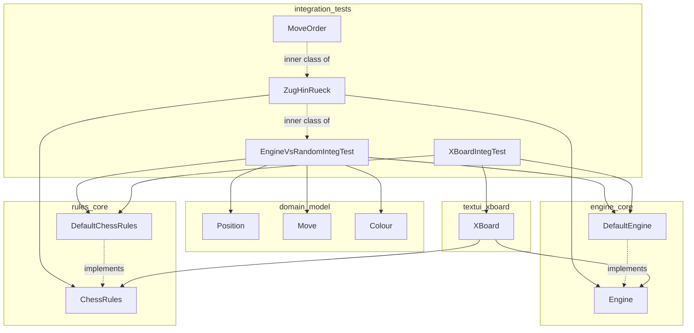
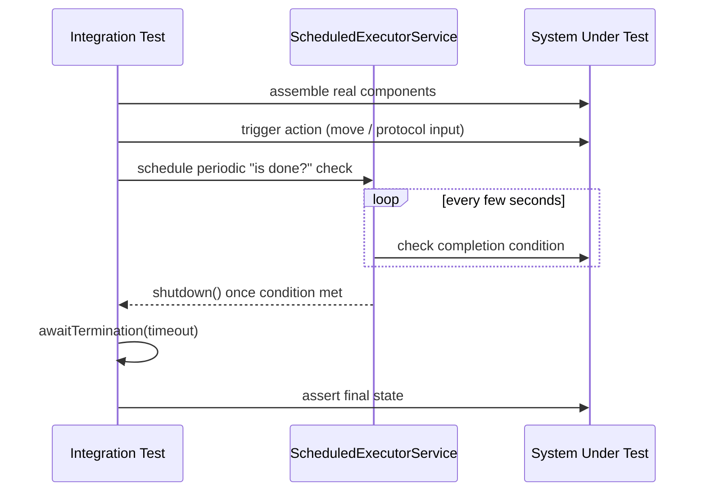
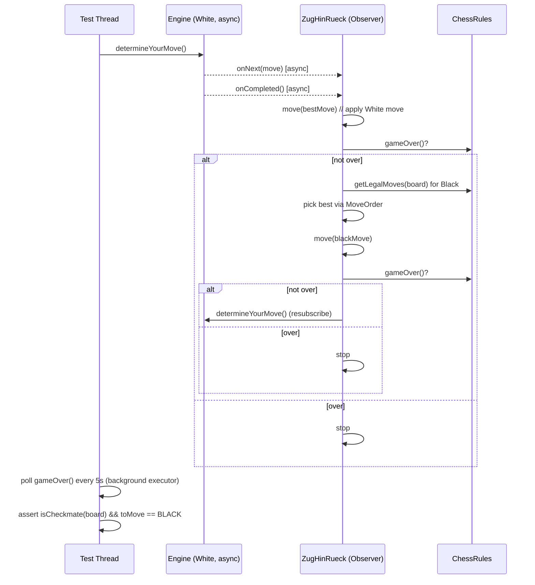
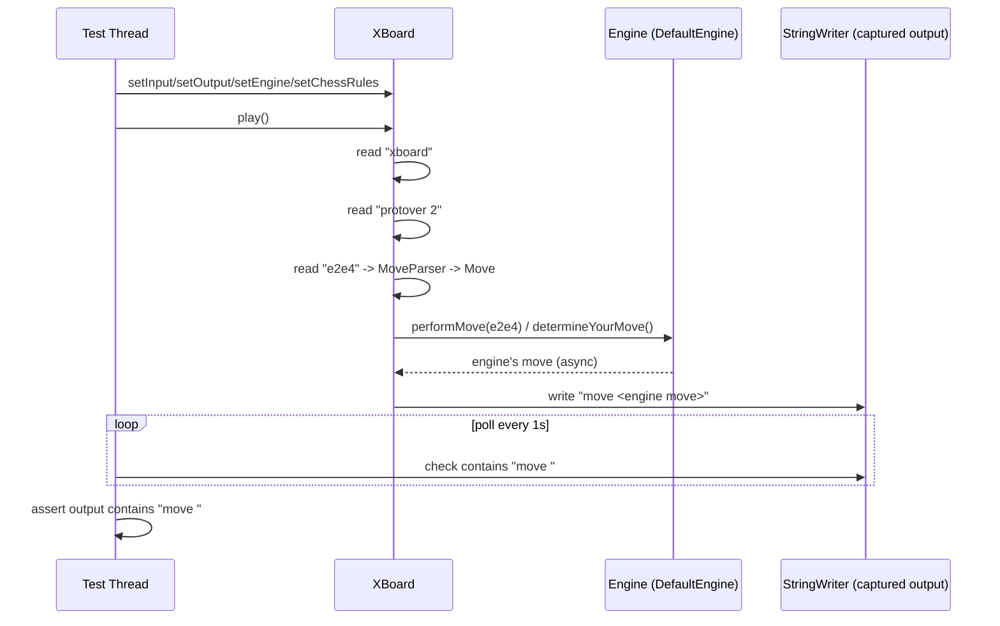

# Integration Tests Module

## 1. Purpose

The `integration_tests` module contains **end-to-end (black-box) tests** for the
dokChess system. Unlike unit tests that exercise a single class in isolation,
these tests wire together multiple real subsystems — the [domain model](domain_model.md),
the [chess rules engine](rules_core.md), the [move-search engine](engine_core.md), and the
[XBoard protocol front-end](textui_xboard.md) — and verify that the system behaves
correctly when it plays a **complete, real chess game** or when it is driven through
a **real communication protocol**.

There is no production code in this module; it exists purely under
`src/integTest/java` and is intended to be run as a separate Gradle/Maven
`integTest` task, distinct from fast unit tests, because each test here
actually plays out a game or waits for asynchronous engine responses and can
take from several seconds up to minutes to complete.

Two test suites make up the module:

| Test Class | What it verifies |
|---|---|
| [`EngineVsRandomIntegTest`](#2-enginevsrandominteg-test) | The dokChess [`Engine`](engine_core.md) can play (and win) a full game against a simplistic random/heuristic opponent, exercising [`ChessRules`](rules_core.md) end-to-end (legal move generation, checkmate/stalemate detection). |
| [`XBoardIntegTest`](#3-xboardinteg-test) | The [`XBoard`](textui_xboard.md) protocol adapter correctly starts up, accepts a human move via stdin-like input, and produces a `move ` response from the engine via stdout-like output. |

## 2. Architecture Overview

The integration tests do not introduce new production abstractions; instead,
they **compose** existing components from other modules into a runnable
scenario. The diagram below shows how the test classes depend on the rest of
the system.



Both test classes follow the same general pattern:

1. **Assemble** the real production objects (`ChessRules`, `Engine`, optionally
   `XBoard`) — no mocks are used.
2. **Drive** the system with real or simulated input (moves, protocol
   commands).
3. **Poll asynchronously** with a `ScheduledExecutorService`, since the engine
   computes moves on a background thread and communicates results via
   RxJava `Observable`s (see [`engine_core`](engine_core.md) and
   [`engine_search`](engine_search.md)).
4. **Assert** on the final observable state (checkmate reached, or a `move `
   response text produced).



## 3. EngineVsRandomIntegTest

**File:** `src/integTest/java/org/dokchess/engine/integration/EngineVsRandomIntegTest.java`

### 3.1 Scenario

This test lets the dokChess [`Engine`](engine_core.md) (configured with the
default [`DefaultChessRules`](rules_core.md), and therefore also using the
default [search](engine_search.md) and [evaluation](engine_eval.md)
implementations under the hood) play **White** in a complete chess game
against a very simple, deterministic-preference "opponent" implemented
directly inside the test. The opponent is not a real engine — it merely picks
a legal move using a fixed preference order — but it is strong enough to keep
the game moving to a real conclusion.

The test's overall goal is to prove that:
- The engine can repeatedly compute moves and report them asynchronously.
- The rules engine (`ChessRules`) correctly and consistently identifies legal
  moves, checkmate, and stalemate over the course of dozens of plies.
- The game reliably terminates with **White (the engine) delivering
  checkmate** against the naive Black opponent.

### 3.2 Components

#### `EngineVsRandomIntegTest`
The outer test class. It owns the mutable game state shared between the two
"players":

- `board: Position` — the current [`Position`](domain_model.md) of the game.
- `dokChess: Engine` — the [`DefaultEngine`](engine_core.md) instance under
  test, playing White.
- `rules: ChessRules` — the [`DefaultChessRules`](rules_core.md) instance
  used for legality/termination checks by both sides.

Its single `@Test` method `playWholeGame()`:

1. Creates the rules, engine, and a fresh starting `Position`
   (`dokChess.setupPieces(board)`).
2. Subscribes a `ZugHinRueck` observer to `dokChess.determineYourMove()` —
   this kicks off the asynchronous engine search for White's first move.
3. Starts a `ScheduledExecutorService` that polls `gameOver()` every 5
   seconds (after an initial 10-second delay) and shuts the executor down
   once the game has ended.
4. Blocks on `executor.awaitTermination(5, TimeUnit.MINUTES)` — a hard
   safety timeout for the whole test.
5. Asserts that it is Black's turn (`board.getToMove() == Colour.BLACK`) and
   that `rules.isCheckmate(board)` is true, i.e. White has won.

Helper methods:
- `gameOver()` — synchronized check combining `isCheckmate` /
  `isStalemate` from `ChessRules`.
- `move(Move)` — synchronized method that advances both the local `board`
  (`board.performMove(move)`) and informs the engine
  (`dokChess.performMove(move)`) so its internal state stays in sync.

#### `ZugHinRueck` (inner class, implements `rx.Observer<Move>`)
The name is German for *"move there and back"*, capturing its role: it
alternates White's engine move with Black's synthetic move, one full
round-trip per activation.

- `onNext(Move zug)` — stores the latest move proposed by the engine as
  `bestMove`. Since the engine emits its final answer as the completion of a
  (possibly single-value) observable stream, this simply captures the value.
- `onCompleted()` — invoked once the engine's move computation stream
  completes:
  1. Applies White's `bestMove` to the board via `move(...)`.
  2. If the game is not over, computes Black's reply with
     `determineBlackMove()` and applies it.
  3. If the game is still not over, resets `bestMove` and re-subscribes
     itself to a new `dokChess.determineYourMove()` call — this recursive
     re-subscription is what drives the game forward ply after ply.
- `onError(Throwable e)` — fails the test immediately (`Assert.fail`) if the
  engine's observable errors out.
- `determineBlackMove()` — asks `rules.getLegalMoves(board)` for all legal
  moves for Black, then picks the "best" one according to the nested
  `MoveOrder` comparator.

#### `MoveOrder` (inner class of `ZugHinRueck`, implements `Comparator<Move>`)
Implements the simplistic heuristic used to make the "random" opponent
slightly more decisive and game-terminating rather than a pure random walk:

```java
zugWert(move):
    +1000 if move.isCapture()
    +100  if move.isCastling()
    +10   if move.isPawnMove()
```

Moves are sorted descending by this score (`z2 - z1` in `compare`), and the
highest-scoring move (`sortedMoves.first()`) is chosen. This biases Black
towards captures, castling, and pawn pushes — moves that tend to open up the
position and avoid repetitive/drawish behavior, making it more likely the
game reaches a decisive (checkmate) conclusion within the test's timeout.

### 3.3 Control Flow



### 3.4 Dependencies on Other Modules

- [`domain_model`](domain_model.md): `Position`, `Move`, `Colour` — the core
  board representation manipulated throughout the test.
- [`rules_core`](rules_core.md): `ChessRules` / `DefaultChessRules` — legal
  move generation and game-termination detection.
- [`engine_core`](engine_core.md): `Engine` / `DefaultEngine` — the
  asynchronous move-search facade used for White; transitively exercises
  [`engine_search`](engine_search.md), [`engine_eval`](engine_eval.md), and
  [`opening_polyglot`](opening_polyglot.md) (via the [`opening`](opening.md)
  library lookup) as part of `determineYourMove()`.

## 4. XBoardIntegTest

**File:** `src/integTest/java/org/dokchess/textui/integration/XBoardIntegTest.java`

### 4.1 Scenario

This test validates the [`XBoard`](textui_xboard.md) text-protocol adapter
end-to-end: it feeds a small script of XBoard protocol commands through a
`Reader` (simulating stdin) and inspects a `Writer` (simulating stdout) for
the expected engine response, without any mocking of the engine or rules.

The scripted input is:

```
xboard
protover 2
e2e4
```

i.e. switch into XBoard mode, negotiate protocol version 2, then submit the
opening move `e2e4` (White's king's pawn advance) using coordinate notation,
which is parsed by [`MoveParser`](textui_xboard.md).

### 4.2 Test Flow

1. Build a `StringWriter` to capture all output produced by `XBoard`.
2. Construct a real `XBoard` instance and wire it with:
   - `setOutput(writer)` — output sink.
   - A real `ChessRules` (`DefaultChessRules`) via `setChessRules(rulez)`.
   - A real `Engine` (`DefaultEngine` built on top of `rulez`) via
     `setEngine(engine)`.
   - The scripted `input` as a `StringReader` via `setInput(eingabe)`.
3. Call `xBoard.play()` to start processing the protocol session (this
   presumably starts an internal loop/thread reading commands and dispatching
   to the engine — see [`textui_xboard`](textui_xboard.md) for details of
   `XBoard`'s internal command loop).
4. Poll every second (after an initial 3-second delay) whether the captured
   output already contains the substring `"move "` — the expected prefix of
   XBoard's move-reporting response once the engine has answered `e2e4` with
   its own move.
5. Shut down the polling executor once found, or time out after 1 minute.
6. Assert that the output indeed contains `"move "`.



### 4.3 Dependencies on Other Modules

- [`textui_xboard`](textui_xboard.md): `XBoard` (and transitively
  `MoveParser`) — the protocol adapter under test.
- [`engine_core`](engine_core.md): `Engine` / `DefaultEngine` — supplies the
  computer's reply move.
- [`rules_core`](rules_core.md): `ChessRules` / `DefaultChessRules` — used by
  `XBoard`/`Engine` to validate the incoming `e2e4` move and to determine
  legal replies.

## 5. Design Notes & Testing Considerations

- **No mocking, real timing.** Both tests exercise real asynchronous
  computation (RxJava observables backed by background threads in
  [`engine_search`](engine_search.md), notably
  [`MinimaxParallelSearch`](engine_search.md)) and therefore use polling with
  `ScheduledExecutorService` plus generous timeouts (up to 5 minutes for a
  full game) instead of direct synchronous assertions.
- **Deterministic-enough opponent.** `EngineVsRandomIntegTest`'s "random"
  opponent is intentionally biased (via `MoveOrder`) toward decisive moves so
  that the test terminates in reasonable time and reliably reaches checkmate
  rather than looping indefinitely or stalemating.
- **Separation from unit tests.** Because these tests are slow and rely on
  wall-clock polling, they belong in a distinct `integTest` source set/task,
  run separately from fast unit tests of individual modules such as
  [`rules_piece_moves`](rules_piece_moves.md) or
  [`engine_search_minimax`](engine_search_minimax.md).
- **Whole-system smoke tests.** Together, the two tests act as smoke tests
  for the two primary ways dokChess is used: (a) as an embedded `Engine`
  played programmatically, and (b) as a full application driven through the
  XBoard protocol via [`Main`](main.md).

## 6. Related Modules

| Module | Role in these tests |
|---|---|
| [domain_model](domain_model.md) | Board/move/position/colour representation |
| [domain_fen](domain_fen.md) | (Indirectly) FEN parsing used by `Position` setup / opening book lookups |
| [rules_core](rules_core.md) | Legal move generation, checkmate/stalemate detection |
| [rules_movement_framework](rules_movement_framework.md) / [rules_piece_moves](rules_piece_moves.md) | Underlying move-generation logic invoked transitively through `ChessRules` |
| [engine_core](engine_core.md) | `Engine` facade (`determineYourMove`, `performMove`, `setupPieces`) |
| [engine_search](engine_search.md), [engine_search_minimax](engine_search_minimax.md), [engine_search_parallel](engine_search_parallel.md) | Asynchronous move search backing the engine's decisions |
| [engine_eval](engine_eval.md) | Position evaluation used by the search |
| [opening](opening.md) / [opening_polyglot](opening_polyglot.md) | Opening book lookups the engine may use before falling back to search |
| [textui_xboard](textui_xboard.md) | XBoard protocol adapter tested by `XBoardIntegTest` |
| [main](main.md) | Application entry point that wires `XBoard` + `Engine` + `ChessRules` together in production, mirrored by `XBoardIntegTest`'s manual wiring |
