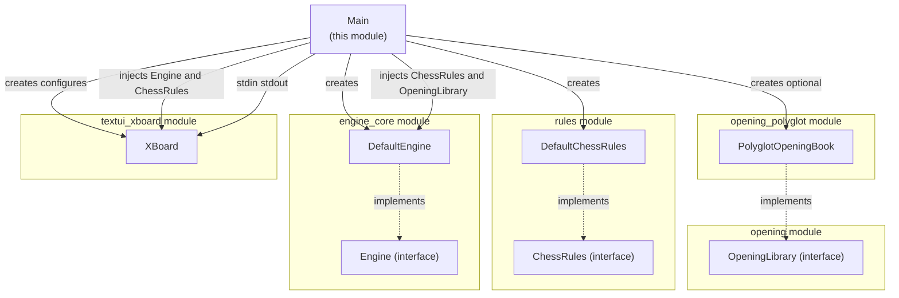
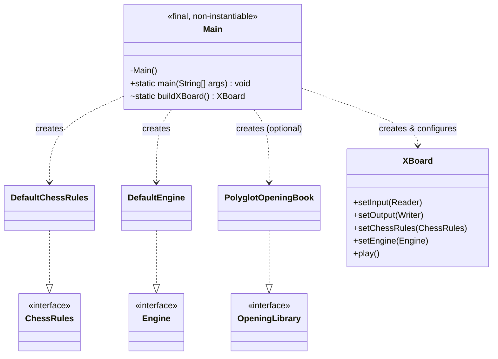
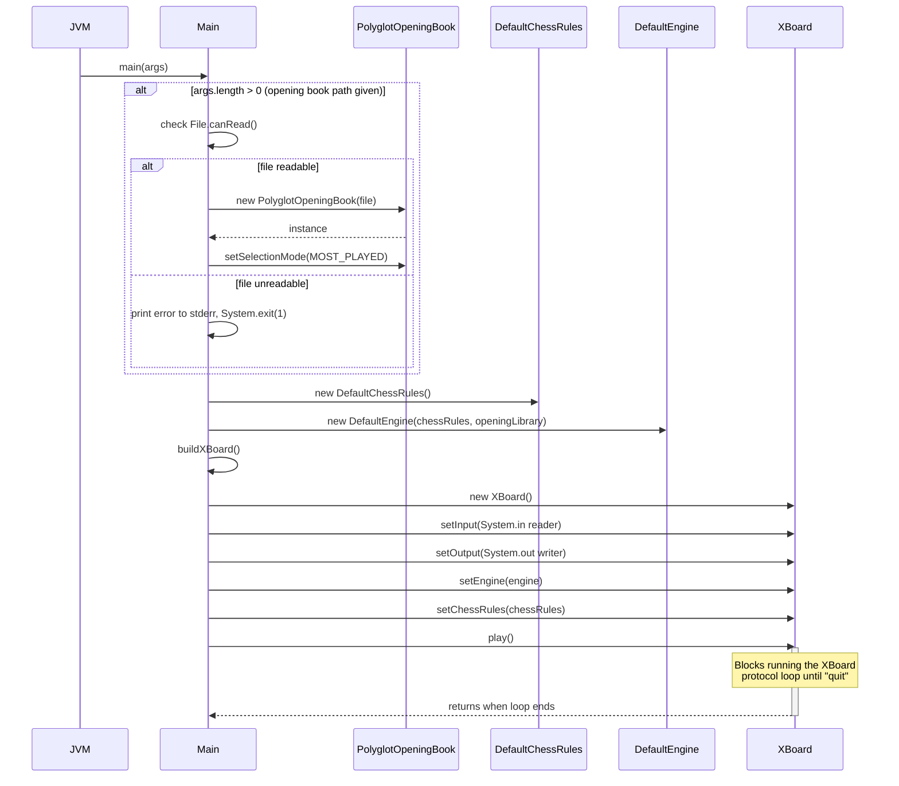
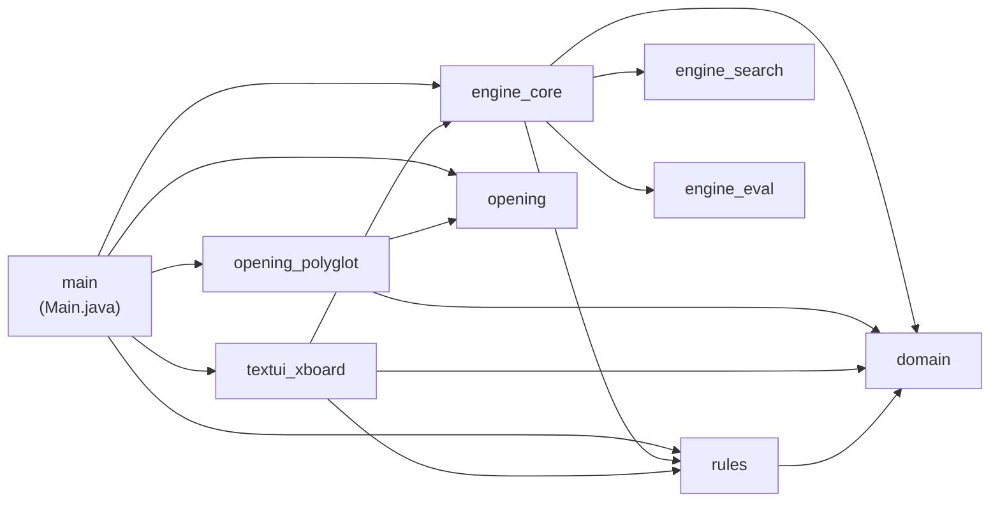

# Main Module

## Introduction

The **main** module is the application's composition root and command-line
entry point for DokChess. It contains a single class, `Main`, whose sole
responsibility is to **wire together** the independently developed
subsystems of the engine — chess rules, the search/evaluation engine, an
optional opening book, and the XBoard text protocol adapter — and then hand
control over to the [XBoard](textui_xboard.md) protocol loop.

This module contains no domain logic itself. It is intentionally thin: a
single `public static void main(String[] args)` method that performs
dependency construction and injection, following a simple manual
Dependency-Injection ("poor man's DI") pattern instead of a framework.

## Purpose and Responsibilities

1. **Process bootstrap** — provide the JVM entry point (`public static void main`).
2. **Component wiring** — construct concrete implementations of the core
   abstractions used elsewhere in the codebase:
   - [`ChessRules`](rules.md) → `DefaultChessRules`
   - [`Engine`](engine_core.md) → `DefaultEngine`
   - [`OpeningLibrary`](opening.md) → `PolyglotOpeningBook` (optional, from
     [opening_polyglot](opening_polyglot.md))
   - [`XBoard`](textui_xboard.md) protocol handler, connected to
     `System.in` / `System.out`
3. **Optional opening book loading** — if a command-line argument is
   supplied, it is treated as a path to a Polyglot opening book file; the
   book is loaded and configured with a selection strategy
   (`SelectionMode.MOST_PLAYED`).
4. **Error handling for startup** — if the opening book file cannot be
   read or fails to parse, the program prints an error to `stderr` and
   exits with a non-zero status code.
5. **Delegation** — once wiring is complete, `Main` calls `xBoard.play()`
   which blocks and runs the interactive protocol loop until the client
   sends `quit` or closes the input stream.

## Position in the Overall System

`Main` sits at the top of the dependency graph. It depends on (and only on)
the public interfaces/entry classes of the other modules; none of those
modules depend back on `Main`. This keeps the module a pure "glue" layer.



## Class Diagram



## Startup / Bootstrap Flow



## Component Details

### `Main`

| Aspect | Description |
|---|---|
| Visibility | `public final class`, private constructor — cannot be instantiated |
| Entry point | `public static void main(String[] args)` |
| Helper | `static XBoard buildXBoard()` — package-visible for testability; constructs an `XBoard` wired to `System.in`/`System.out` |
| Command-line argument | Optional single argument: filesystem path to a Polyglot `.bin` opening book |
| Exit codes | `1` if the opening-book file is unreadable or fails to load; otherwise the process exits normally when the XBoard loop ends |

**Construction sequence performed in `main`:**

1. Parse `args` for an optional opening book path.
2. If present, validate readability (`File.canRead()`); on failure, print to
   `stderr` and call `System.exit(1)`.
3. If readable, construct a `PolyglotOpeningBook` (see
   [opening_polyglot](opening_polyglot.md)) and set its selection mode to
   `SelectionMode.MOST_PLAYED` — meaning that when multiple book moves
   exist for the same position, the most frequently played move (per the
   book's internal statistics) is preferred. Any `IOException` during
   parsing is reported and also leads to `System.exit(1)`.
4. Instantiate `DefaultChessRules` (see [rules](rules.md)) as the concrete
   `ChessRules` implementation used throughout the run.
5. Instantiate `DefaultEngine` (see [engine_core](engine_core.md)),
   injecting the `ChessRules` and the optional `OpeningLibrary`. Internally,
   `DefaultEngine` builds a search pipeline combining opening-book lookups
   (if available) with a `MinimaxParallelSearch` powered by
   `StandardMaterialEvaluation` — see [engine_search](engine_search.md) and
   [engine_eval](engine_eval.md).
6. Build and configure an `XBoard` instance via `buildXBoard()`, then inject
   the `Engine` and `ChessRules` into it.
7. Call `xBoard.play()`, which runs the blocking read-evaluate-write loop
   implementing the XBoard text protocol (see
   [textui_xboard](textui_xboard.md) for full protocol details).

## Dependency Summary

The `main` module depends on the public interfaces/implementations from
these modules, but is not depended upon by them:

| Module | What `Main` uses |
|---|---|
| [rules](rules.md) | `ChessRules` interface, `DefaultChessRules` implementation |
| [engine_core](engine_core.md) | `Engine` interface, `DefaultEngine` implementation |
| [opening](opening.md) | `OpeningLibrary` interface |
| [opening_polyglot](opening_polyglot.md) | `PolyglotOpeningBook`, `SelectionMode` |
| [textui_xboard](textui_xboard.md) | `XBoard` protocol handler |
| [domain](domain.md) | Indirectly, via `Position`/`Move` types passed through the wired components |



## Usage

Running the application without arguments starts the engine with no
opening book (all moves are computed by search from the very first ply):

```
java -jar dokchess.jar
```

Running with an opening book path enables book-move lookups until the book
no longer has an entry for the current position, after which the engine
falls back to search:

```
java -jar dokchess.jar /path/to/book.bin
```

In both cases the process communicates via **stdin/stdout** using the
XBoard protocol; it is intended to be launched by an XBoard-compatible GUI
or driver (see [textui_xboard](textui_xboard.md) and the
[integration_tests](integration_tests.md) module, which exercises this
exact startup path end-to-end, e.g. `XBoardIntegTest` and
`EngineVsRandomIntegTest`).

## Related Documentation

- [domain](domain.md) — core chess data types (`Position`, `Move`, `Piece`, `Square`, FEN support)
- [rules](rules.md) — legal move generation, check/mate/stalemate detection
- [engine_core](engine_core.md) — the `Engine` abstraction and `DefaultEngine` pipeline
- [engine_search](engine_search.md) — Minimax search algorithms (sequential and parallel)
- [engine_eval](engine_eval.md) — position evaluation functions
- [opening](opening.md) — `OpeningLibrary` abstraction
- [opening_polyglot](opening_polyglot.md) — Polyglot-format opening book reader
- [textui_xboard](textui_xboard.md) — XBoard/WinBoard text protocol implementation
- [integration_tests](integration_tests.md) — end-to-end tests exercising the full wiring performed by `Main`
