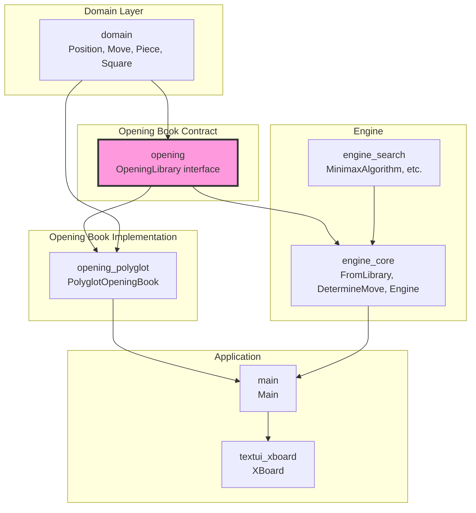
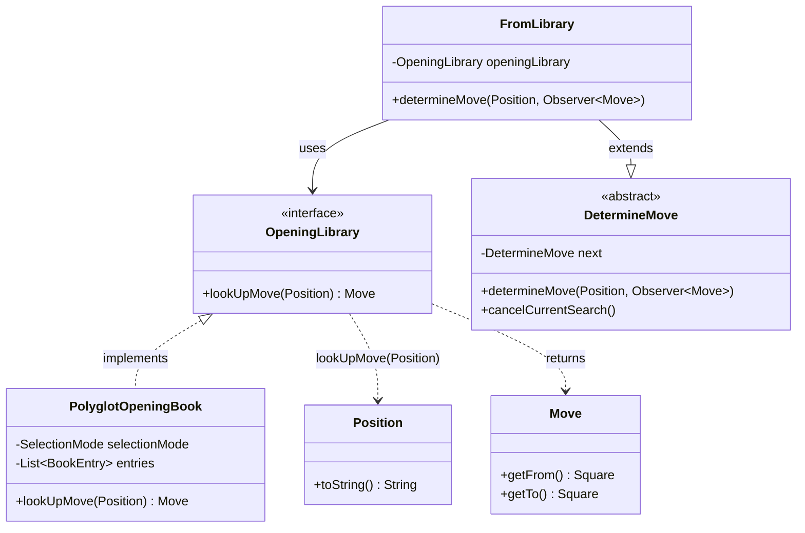
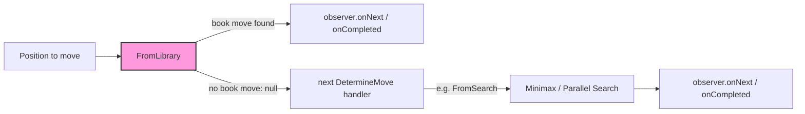
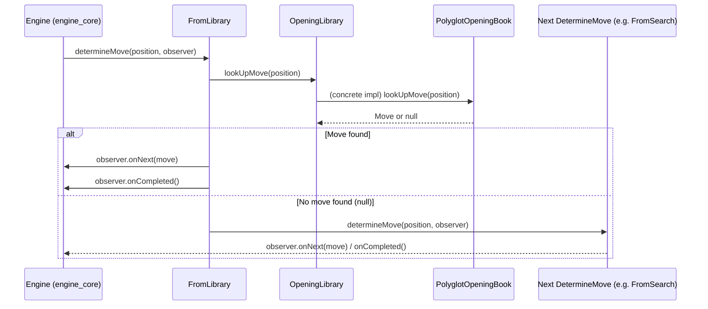

# Opening Module

## Introduction

The `opening` module defines the **contract** for opening-book lookups in the DokChess engine. It contains a single, minimal interface — [`OpeningLibrary`](#openinglibrary-interface) — that decouples the engine's move-determination pipeline from any concrete opening-book implementation (such as the Polyglot format book found in [`opening_polyglot`](opening_polyglot.md)).

By isolating this contract in its own module, DokChess can:

- Swap opening-book implementations (Polyglot, PGN-derived books, hard-coded lines, etc.) without touching the engine.
- Test the engine's opening-book integration using simple mocks/stubs of `OpeningLibrary`.
- Keep the [`domain`](domain.md) model as the only hard dependency for opening-related code, avoiding coupling to search/evaluation internals.

This module is intentionally tiny — it is a **port** in the hexagonal-architecture sense, with [`opening_polyglot`](opening_polyglot.md) providing the concrete adapter, and [`engine_core`](engine_core.md) acting as the consumer.

---

## Purpose and Core Functionality

Chess engines typically avoid expensive search in the early part of a game by consulting a pre-computed **opening book**: a database mapping known positions to strong, well-studied moves. The `opening` module standardizes how the rest of the engine asks "is there a known move for this position?" without needing to know how that answer is produced.

### `OpeningLibrary` Interface

```java
public interface OpeningLibrary {
    Move lookUpMove(Position position);
}
```

| Member | Description |
|---|---|
| `lookUpMove(Position position)` | Given a game `Position` (see [`domain`](domain.md)), returns a known `Move` from the library, or `null` if the position is not found in the book. |

**Design notes:**

- **Single responsibility**: the interface exposes exactly one method, keeping implementations simple and interchangeable.
- **Nullable return, not `Optional`**: consistent with the rest of the codebase's move-determination chain (see [`engine_core`](engine_core.md)'s `DetermineMove`), a `null` result signals "no book move available", allowing the caller to fall through to search-based move determination.
- **No side effects / no state exposed**: implementations are free to be stateless, cache entries in memory, memory-map a file, or query a database — the interface says nothing about *how* the lookup is performed.
- **Depends only on `domain`**: the method signature uses only `Position` and `Move` from the [`domain`](domain.md) module, so this module has effectively zero coupling to rules, search, or evaluation logic.

---

## Architecture

### Module Position in the System



### Class Diagram



---

## How This Module Fits Into the Overall System

The `OpeningLibrary` interface is consumed by [`FromLibrary`](engine_core.md), one link in a **Chain of Responsibility** used by the engine to determine the best move for a position. Before falling back to expensive tree search (see [`engine_search`](engine_search.md)), the engine first checks whether a known book move exists.

### Move Determination Chain (Chain of Responsibility)



`FromLibrary` (in [`engine_core`](engine_core.md)) wraps an `OpeningLibrary` instance and implements `DetermineMove`:

1. Calls `openingLibrary.lookUpMove(position)`.
2. If a move is returned, it is immediately emitted to the `Observer<Move>` and the chain terminates.
3. If `null` is returned, control is passed to the next handler in the chain (typically [`FromSearch`](engine_core.md), which delegates to [`engine_search`](engine_search.md)).

This design means that **as long as a class implements `OpeningLibrary`, it can be plugged into `FromLibrary` and thus into the engine's move-determination pipeline** — regardless of the underlying book format or data source.

### Sequence: Engine Requesting a Move



---

## Implementations

| Implementation | Module | Description |
|---|---|---|
| `PolyglotOpeningBook` | [`opening_polyglot`](opening_polyglot.md) | Reads a binary Polyglot-format `.bin` opening book file, computes a Zobrist-style hash key from the position's FEN, and looks up matching entries. Supports several move-selection strategies (`FIRST`, `MOST_PLAYED`, `RANDOM`) when multiple book moves match the same position. |

To implement a custom opening book, simply implement `OpeningLibrary.lookUpMove(Position)` and pass an instance to `FromLibrary` when constructing the engine's move-determination chain (see [`engine_core`](engine_core.md) and [`main`](main.md) for wiring details).

---

## Related Modules

- [`domain`](domain.md) — Provides `Position` and `Move`, the only types this module depends on.
- [`opening_polyglot`](opening_polyglot.md) — Concrete `OpeningLibrary` implementation reading Polyglot-format opening books.
- [`engine_core`](engine_core.md) — Consumes `OpeningLibrary` via `FromLibrary` as part of the `DetermineMove` chain of responsibility.
- [`engine_search`](engine_search.md) — The fallback move-determination strategy used when no opening-book move is available.
- [`main`](main.md) — Wires together the concrete `OpeningLibrary` implementation with the engine at application startup.

