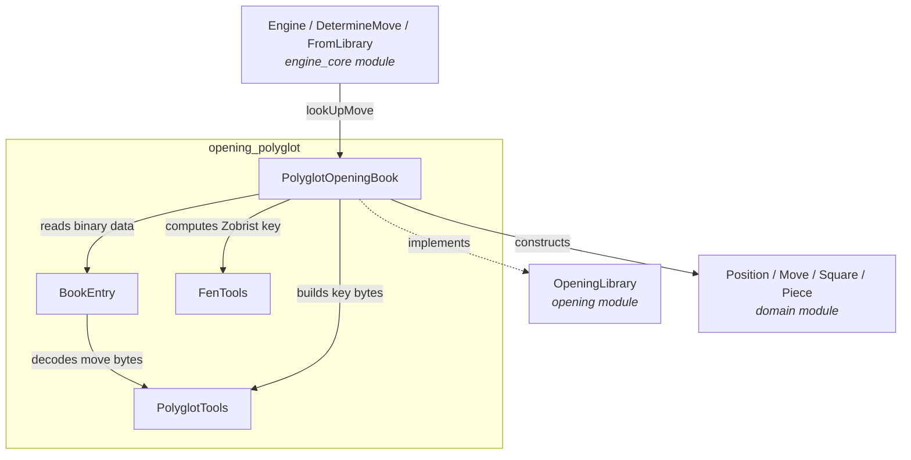
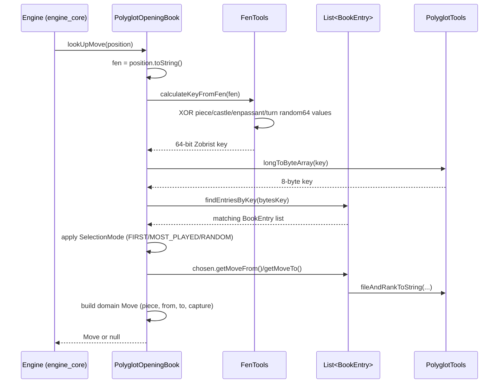
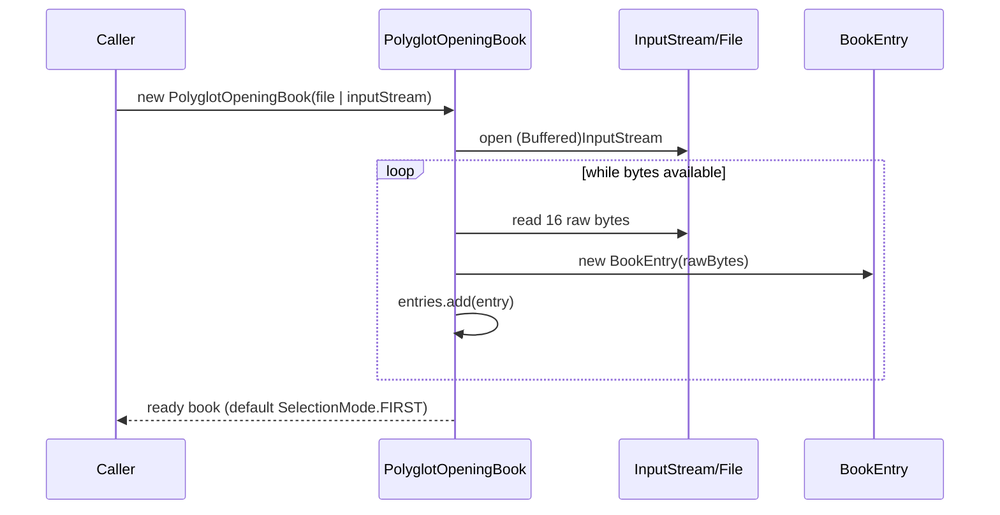

# Opening Polyglot Module

## Introduction

The `opening_polyglot` module is a concrete implementation of the [`opening`](opening.md) module's
`OpeningLibrary` interface. It allows the DokChess engine to consult a standard **Polyglot** (`.bin`)
opening book — a widely-used binary format for chess opening books shared by many chess engines
(e.g. Fritz, Crafty, Stockfish tools) — and return a known "book move" for a given position instead
of relying on the (comparatively slow and shallow) search-based engine logic.

By plugging a `PolyglotOpeningBook` instance into the engine (see [`engine_core`](engine_core.md),
specifically `FromLibrary` / `DetermineMove`), the engine can play well-known opening theory
instantly and skip the [`engine_search`](engine_search.md) tree search for as long as the current
game continues to match entries recorded in the book.

## Purpose

* Parse a Polyglot binary opening book file/stream into in-memory records (`BookEntry`).
* Compute the Polyglot **Zobrist hash key** for a given chess position (expressed as FEN, see
  [`domain`](domain.md) module's `ForsythEdwardsNotation`) so that book entries can be matched
  against the current position.
* Decode the compact 16-bit move encoding used by the Polyglot format into `Square`/`Move` objects
  from the [`domain`](domain.md) module.
* Offer configurable strategies (`SelectionMode`) for choosing among several book moves that match
  the same position.

## Architecture Overview

The module is split into two closely related sub-modules:

1. **[opening_polyglot_format](opening_polyglot_format.md)** — the low-level binary record format:
   `BookEntry` (a single 16-byte Polyglot record) and `PolyglotTools` (bit-manipulation helpers
   shared across the module for encoding/decoding squares, weights and keys).
2. **[opening_polyglot_book](opening_polyglot_book.md)** — the higher-level book logic:
   `PolyglotOpeningBook` (the public `OpeningLibrary` implementation, entry point used by the
   engine) and `FenTools` (Zobrist hash computation from a FEN string, used to look up matching
   entries).

## High-Level Data Flow

## Loading a Book

## Module Relationships

* **Depends on** [`domain`](domain.md): uses `Position`, `Move`, `Piece`, `Square` to translate
  book records into engine-usable chess moves, and relies on `Position.toString()` (backed by
  `ForsythEdwardsNotation`) to obtain a FEN representation of the current position.
* **Implements** [`opening`](opening.md): `PolyglotOpeningBook` is a concrete `OpeningLibrary`.
* **Consumed by** [`engine_core`](engine_core.md): the engine's `FromLibrary` result path and
  `DetermineMove` decision logic use an `OpeningLibrary` (potentially a `PolyglotOpeningBook`) to
  short-circuit search via [`engine_search`](engine_search.md) when a book move is available.

## Sub-module Documentation

| Sub-module | Description |
|---|---|
| [opening_polyglot_format](opening_polyglot_format.md) | Binary record parsing (`BookEntry`) and low-level bit/byte utilities (`PolyglotTools`) that decode Polyglot's compact move and weight encoding. |
| [opening_polyglot_book](opening_polyglot_book.md) | Zobrist hash key computation from FEN (`FenTools`) and the public opening-book API (`PolyglotOpeningBook`) that ties parsing, hashing, and move selection together. |
