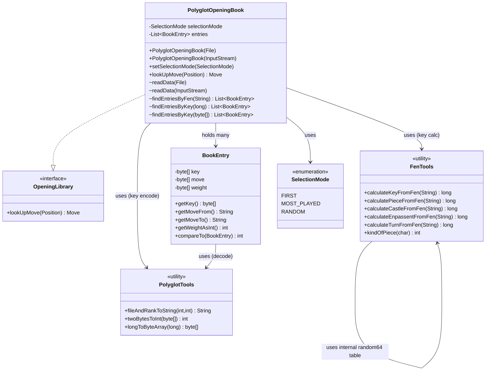
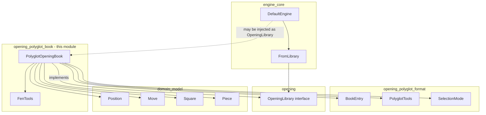
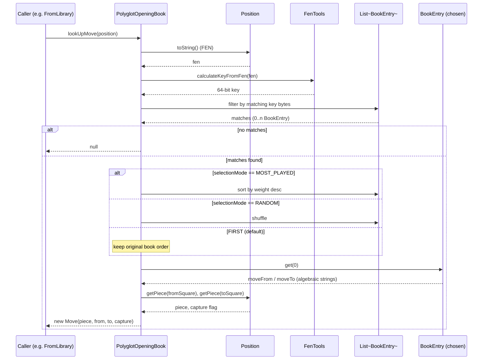
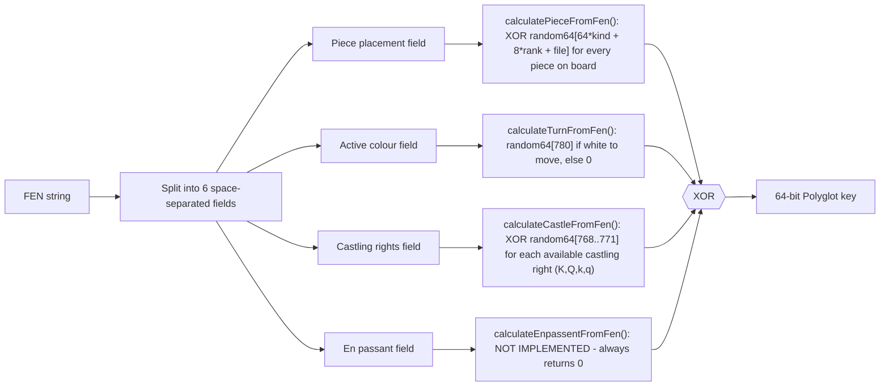
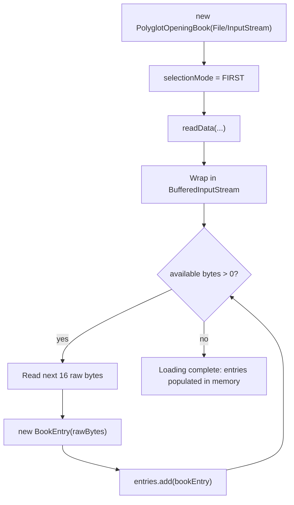
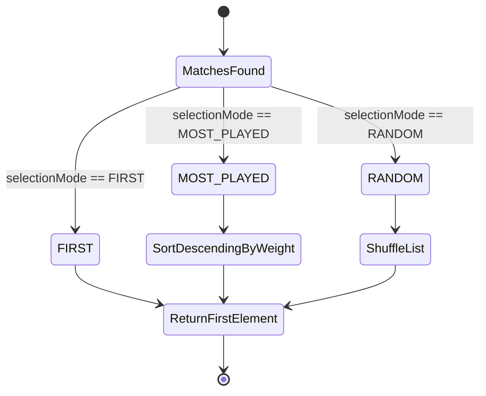
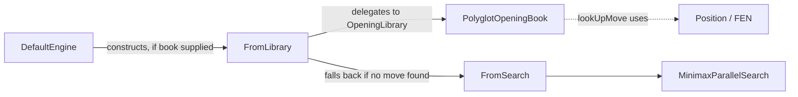

# Opening Polyglot Book

## Introduction

The **opening_polyglot_book** module provides the concrete, ready-to-use implementation of an opening book for the dokchess engine: `PolyglotOpeningBook`. It loads industry-standard Polyglot (`.bin`) opening book files, indexes their entries in memory, and — given any `Position` — looks up a matching, book-recommended `Move`.

This module is the "book" half of the [opening_polyglot](opening_polyglot.md) module family. While the sibling module [opening_polyglot_format](opening_polyglot_format.md) is concerned with the low-level binary *format* of a Polyglot file (parsing raw 16-byte records and bit-level move encoding), `opening_polyglot_book` is concerned with *using* that data: computing lookup keys from a chess position (via FEN) and selecting a move among possibly several book candidates.

The module implements the generic [`OpeningLibrary`](opening.md) contract, so it can be plugged into the chess [`engine_core`](engine_core.md) as an optional, fast "book move" source that is consulted before the engine falls back to tree search.

---

## Purpose and Core Functionality

A Polyglot opening book is a binary file consisting of a sequence of fixed-size (16 byte) entries. Each entry associates a **Zobrist-style 64-bit position key** with a **move** and a **weight** (popularity/strength indicator). Chess GUIs and engines use such files to play known, well-tested opening moves instead of spending computation time calculating them from scratch.

This module's responsibilities are:

1. **Loading** a `.bin` file or `InputStream` into memory as a list of `BookEntry` records (delegating the byte-level decoding to `BookEntry`/`PolyglotTools` from `opening_polyglot_format`).
2. **Computing the Polyglot Zobrist key** for an arbitrary chess `Position` — via its FEN string — so it can be compared against the keys stored in the loaded book. This is the job of the package-private `FenTools` class.
3. **Matching** entries whose key equals the position's key (several entries can share a key because multiple book moves may be known for the same position).
4. **Selecting** one move among the matches, according to a configurable `SelectionMode` (`FIRST`, `MOST_PLAYED`, `RANDOM`).
5. **Translating** the chosen `BookEntry` (raw square coordinates) into a domain-level `Move` object, ready to be applied to the game via the [`domain_model`](domain_model.md) types (`Square`, `Piece`, `Move`).

---

## Components

| Component | Visibility | Responsibility |
|---|---|---|
| `PolyglotOpeningBook` | `public` | Implements `OpeningLibrary`; loads book data, performs lookups, applies selection mode, produces `Move` objects. |
| `FenTools` | package-private | Computes the 64-bit Polyglot Zobrist key for a position, given its FEN string (piece placement, castling rights, side to move; en passant is a known unimplemented gap — see below). |

Related components from the sibling module `opening_polyglot_format` that this module depends on:

| Component | Module | Responsibility |
|---|---|---|
| `BookEntry` | [opening_polyglot_format](opening_polyglot_format.md) | Decodes a single raw 16-byte Polyglot record into key/move/weight fields. |
| `PolyglotTools` | [opening_polyglot_format](opening_polyglot_format.md) | Low level bit/byte helpers: `long`↔byte[] conversion, file/rank string encoding, weight decoding. |
| `SelectionMode` | opening_polyglot (parent) | Enum describing how to pick a move among several matching book entries. |

---

## Architecture

### Class relationships

### Module dependency overview

See [domain](domain.md) for `Position`, `Move`, `Square`, `Piece`, and [engine_core](engine_core.md) for how `OpeningLibrary` implementations (like this one) are consumed via `FromLibrary`/`DefaultEngine`.

---

## Data Flow: Looking Up a Move

`lookUpMove(Position)` is the single public operation exposed to callers (through the `OpeningLibrary` interface). Internally it proceeds through several steps:

### Key computation detail (`FenTools`)

The Polyglot key is a XOR combination of several Zobrist-style sub-keys, each derived from a lookup into a fixed 781-entry `random64[]` table (standard Polyglot random numbers):

> **Known limitation:** `calculateEnpassentFromFen` is a stub (`TODO: Missing Implementation`) and always returns `0`. This means positions that differ only by en passant availability will compute the *same* key, potentially causing missed or slightly inaccurate book lookups in en-passant-eligible positions. This is a documented gap in the current implementation, not accidental behavior.

---

## Loading the Book

The book can be constructed either from a `File` or directly from an `InputStream`, which is convenient for loading a book bundled as a classpath resource.

Each 16-byte raw record is decoded by `BookEntry` (see [opening_polyglot_format](opening_polyglot_format.md)) into:
- an 8-byte **key** (compared against the position's computed key),
- a 2-byte **move** (packed from/to file & rank bits, decoded via `PolyglotTools`),
- a 2-byte **weight** (used for `MOST_PLAYED` selection, decoded via `PolyglotTools.twoBytesToInt`).

---

## Selection Strategies

`SelectionMode` governs which move is returned when multiple `BookEntry` records share the same key (i.e., multiple known continuations exist for the same position):

| Mode | Behavior |
|---|---|
| `FIRST` (default) | Returns the first match in the order entries were read from the file. |
| `MOST_PLAYED` | Sorts matches by weight, descending (`BookEntry.compareTo` inverts natural order), and returns the top one — i.e., the statistically most popular move. |
| `RANDOM` | Shuffles the matches and returns one at random, adding opening variety across games. |

---

## Integration with the Engine

`PolyglotOpeningBook` implements [`OpeningLibrary`](opening.md), the single-method contract expected by the engine's move pipeline. Within [engine_core](engine_core.md), `FromLibrary` is a `DetermineMove` pipeline stage that queries an `OpeningLibrary` first; if a book move is found, it is emitted immediately without falling through to tree search (`FromSearch` / `MinimaxParallelSearch`, see [engine_search](engine_search.md)). `DefaultEngine` wires this up:

This means a `PolyglotOpeningBook` instance is typically created once at engine start-up (loading a `.bin` file) and handed to `DefaultEngine`'s constructor as the `openingLibrary` argument, so early-game moves are served instantly from the book while later, unfamiliar positions fall through to the minimax search engine.

---

## Design Notes & Limitations

- **Immutability of loaded data**: entries are loaded once at construction; the class exposes no API to add/remove entries afterward, keeping the book read-only and thread-safe for concurrent lookups (aside from the `Collections.sort`/`shuffle` calls mutating the *local* `matches` list, not the shared `entries` list).
- **Package-private helper methods** (`findEntriesByFen`, `findEntriesByKey`, `getEntries`) are intentionally not part of the public API — they exist primarily to support the class's own logic and its unit tests within the same package.
- **En passant key gap**: as noted above, `FenTools.calculateEnpassentFromFen` is unimplemented; consumers relying on exact Polyglot-key compatibility in en-passant-eligible positions should be aware book lookups might not perfectly match reference Polyglot implementations in that edge case.
- **Byte-level encoding details** (bit-packing of move squares, big/little-endian handling of weights and keys) are entirely delegated to `BookEntry`/`PolyglotTools` in [opening_polyglot_format](opening_polyglot_format.md), keeping this module focused purely on lookup/selection logic rather than binary parsing.

---

## Related Documentation

- [opening.md](opening.md) — the generic `OpeningLibrary` interface this module implements.
- [opening_polyglot_format.md](opening_polyglot_format.md) — binary record decoding (`BookEntry`, `PolyglotTools`) that this module depends on.
- [domain.md](domain.md) / [domain_model.md](domain_model.md) — `Position`, `Move`, `Square`, `Piece` value types used to represent chess state and moves.
- [domain_fen.md](domain_fen.md) — FEN (de)serialization used by `Position.toString()` to produce the FEN string this module parses.
- [engine_core.md](engine_core.md) — `Engine`, `DefaultEngine`, `FromLibrary`, `DetermineMove` pipeline that consumes this module as an optional opening book source.
- [engine_search.md](engine_search.md) — the search-based fallback (`MinimaxParallelSearch`) used when no book move is available.
