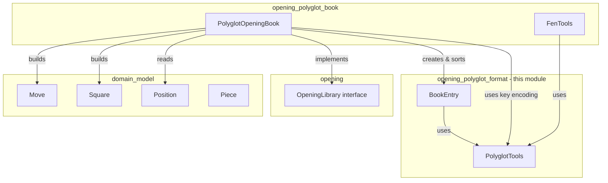
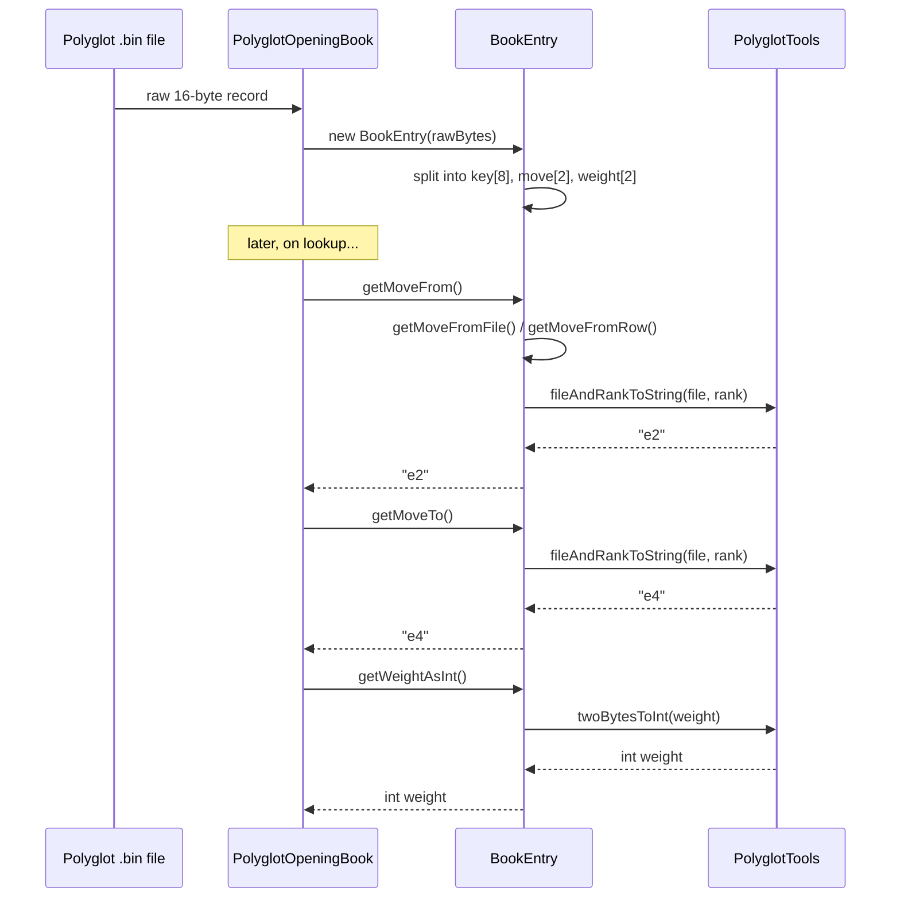
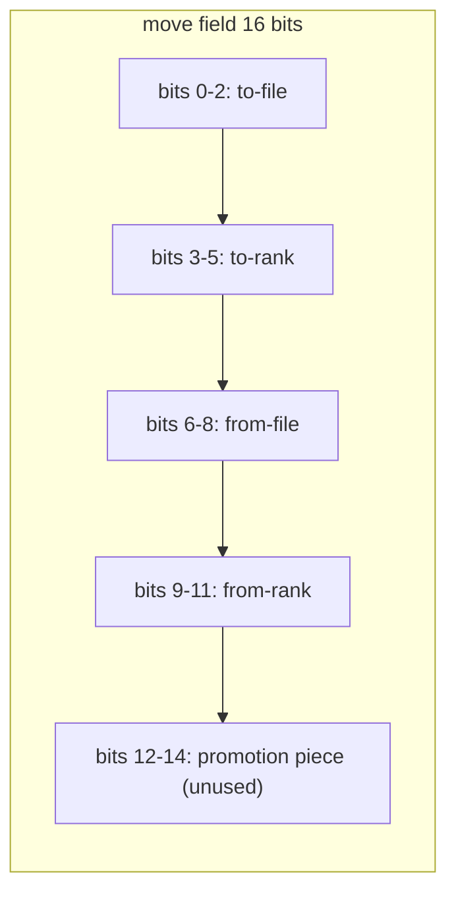
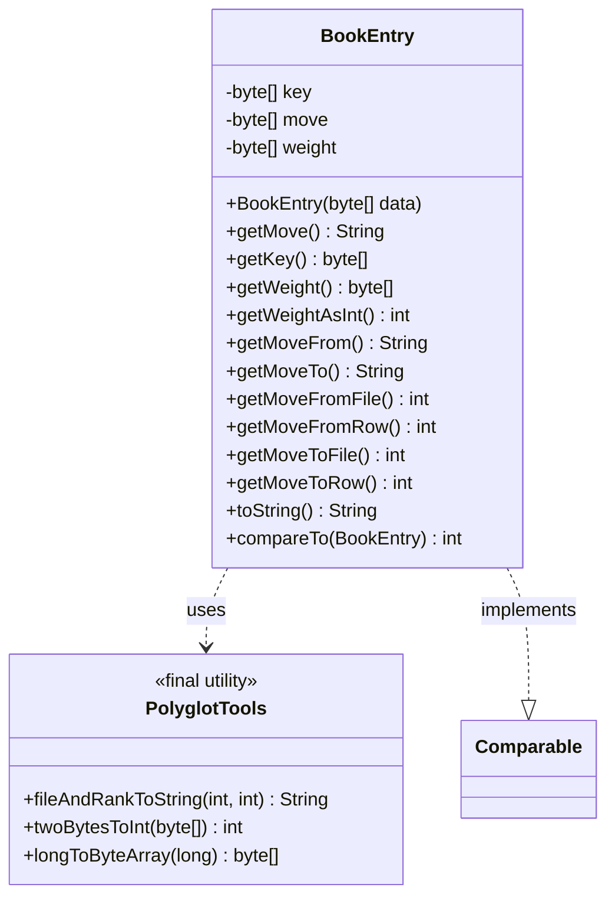

# Opening Polyglot Format Module

## Introduction

The **opening_polyglot_format** module implements the low-level binary encoding/decoding logic for the
[Polyglot opening book format](https://www.chessprogramming.org/PolyGlot_Book_Format) — a compact,
widely-used binary file format for storing chess opening moves indexed by a 64-bit Zobrist-style hash key.

This module provides the two foundational building blocks used by the rest of the
[opening_polyglot](opening_polyglot_book.md) package:

- **`BookEntry`** — represents a single 16-byte record from a Polyglot `.bin` file, decoding the packed
  move and weight fields into usable values.
- **`PolyglotTools`** — a stateless utility class providing bit-manipulation and encoding helper functions
  shared across the Polyglot format implementation (byte/int conversions, board coordinate formatting).

Together, these two classes encapsulate *all* knowledge of the raw Polyglot binary layout. Higher-level
components (such as `PolyglotOpeningBook` and `FenTools`, documented in
[opening_polyglot_book.md](opening_polyglot_book.md)) build on top of this module to implement the actual
opening-book lookup logic exposed through the [opening](opening.md) module's `OpeningLibrary` interface.

---

## Module Purpose

A Polyglot opening book file is simply a sequence of fixed-size 16-byte binary records, sorted by key.
Each record ("entry") encodes:

| Bytes | Field  | Description                                            |
|-------|--------|---------------------------------------------------------|
| 0–7   | key    | 64-bit Zobrist hash of the board position               |
| 8–9   | move   | Packed move (from-square, to-square, promotion, flags)  |
| 10–11 | weight | Relative frequency/preference weight of this move       |
| 12–15 | learn  | (unused by this module) engine-specific learning value  |

The **opening_polyglot_format** module is responsible for:

1. Parsing a raw 16-byte record into a structured `BookEntry` object.
2. Decoding the packed 16-bit `move` field into algebraic from/to square coordinates
   (e.g. `"e2"`, `"e4"`).
3. Decoding the packed 16-bit `weight` field into a plain `int`.
4. Providing low-level bit/byte conversion utilities (`twoBytesToInt`, `longToByteArray`) that are also
   reused by the sibling `FenTools` class when computing Zobrist keys from FEN positions.
5. Ordering entries by weight (via `Comparable`), so that the "most played" move can be selected when
   multiple book entries share the same position key.

This module does **not** perform file I/O, Zobrist key calculation from a chess position, or move
selection strategy — those responsibilities live one level up, in the `opening_polyglot_book` submodule
(see [opening_polyglot_book.md](opening_polyglot_book.md)).

---

## Component Overview

### `BookEntry`

A package-private class modeling one raw 16-byte Polyglot record (only the first 12 bytes — key, move,
weight — are retained; the trailing 4-byte "learn" field is ignored).

Responsibilities:
- Store the raw `key`, `move`, and `weight` byte arrays extracted from the 16-byte input.
- Decode the packed move field into **from-file**, **from-rank**, **to-file**, **to-rank** integers using
  bitmasking (following the Polyglot move-encoding bit layout: bits 0–2 = to-file, bits 3–5 = to-rank,
  bits 6–8 = from-file, bits 9–11 = from-rank, bits 12–14 = promotion piece — promotion decoding is not
  implemented in this class).
- Expose the decoded move as algebraic square strings via `getMoveFrom()` / `getMoveTo()` / `getMove()`.
- Expose the decoded weight as an `int` via `getWeightAsInt()`.
- Implement `Comparable<BookEntry>` so a list of entries can be sorted **descending by weight** — entries
  with a higher weight (more frequently played in the source game database) sort first.

### `PolyglotTools`

A `final` utility class with a private constructor (non-instantiable), providing static helper methods:

| Method | Purpose |
|---|---|
| `fileAndRankToString(int file, int rank)` | Converts zero-based file/rank indices (0–7) into standard algebraic square notation, e.g. `(4, 4)` → `"e5"`. |
| `twoBytesToInt(byte[] source)` | Reassembles a little-endian-ish 2-byte pair into a plain Java `int`, bit-by-bit. Used to decode the `weight` field in `BookEntry`. |
| `longToByteArray(long source)` | Converts a 64-bit Zobrist key (`long`) into its 8-byte big-endian binary representation, so it can be compared against the raw `key` bytes stored in a `BookEntry`. Used by `PolyglotOpeningBook` when matching a computed FEN-derived key against book entries. |

---

## Architecture & Relationships

Key points:
- `BookEntry` and `PolyglotTools` have **no dependency** on domain or engine types — they operate purely
  on raw bytes/ints/strings. This keeps the binary format parsing logic isolated and easily testable.
- `PolyglotOpeningBook` (in the sibling `opening_polyglot_book` submodule) is the sole consumer of both
  classes in this module: it constructs `BookEntry` instances while reading a `.bin` file, and calls
  `PolyglotTools.longToByteArray` to convert a computed Zobrist key into bytes for comparison against
  entry keys.
- `FenTools` (also in `opening_polyglot_book`) independently reuses `PolyglotTools.twoBytesToInt`... 
  actually it computes keys directly, but shares the general low-level utility role with `PolyglotTools`.
- See [opening.md](opening.md) for the `OpeningLibrary` interface contract that `PolyglotOpeningBook`
  fulfills, and [engine_core.md](engine_core.md) for how `Engine` implementations consult the opening
  library before falling back to search (`FromLibrary` / `FromSearch`).

---

## Data Flow: Decoding a Raw Book Record

---

## Bit Layout Reference

The Polyglot `move` field (2 bytes / 16 bits) packs a move as follows (bit 0 = least significant bit of
the first byte):

`BookEntry` extracts each 3-bit group using explicit bitmask checks (`& 1`, `& 2`, `& 4`, etc.) across the
two raw bytes (`move[0]`, `move[1]`), then combines them with `PolyglotTools.fileAndRankToString` to
produce human-readable algebraic coordinates. Promotion-piece bits (12–14) are present in the format but
**not decoded** by this implementation — promotion moves from a book will resolve only their base
from/to squares.

The `weight` field (2 bytes) is a plain big-endian-like unsigned integer, reconstructed bit-by-bit by
`PolyglotTools.twoBytesToInt`.

---

## Ordering Semantics

`BookEntry.compareTo` returns `o.getWeightAsInt() - this.getWeightAsInt()`, producing a **descending**
sort order by weight. This is exploited by `PolyglotOpeningBook` when its `SelectionMode.MOST_PLAYED`
strategy is active: candidate entries matching the current position's key are sorted with
`Collections.sort(matches)`, and the first (highest-weight) entry is chosen as the book move.

---

## Design Notes

- **Package-private visibility**: Both `BookEntry` and `PolyglotTools` are package-private (no `public`
  modifier), by design. They are pure implementation details of the Polyglot format and are not meant to
  be used outside the `org.dokchess.opening.polyglot` package. External code should always interact with
  the opening book via the `OpeningLibrary` interface (see [opening.md](opening.md)), implemented by
  `PolyglotOpeningBook`.
- **No external dependencies**: This module depends on nothing outside the JDK. This makes it trivially
  unit-testable with raw byte arrays and keeps the binary-format concerns fully decoupled from chess
  domain logic (`Move`, `Square`, `Position` — see [domain_model.md](domain_model.md)) and from Zobrist
  key computation from FEN strings (`FenTools` — see [opening_polyglot_book.md](opening_polyglot_book.md)).
- **Promotion handling gap**: As noted above, promotion-piece bits in the move encoding are not
  interpreted. Consumers relying on promotion moves sourced from a Polyglot book should be aware of this
  limitation.
- **Enpassant key component**: While not part of this module directly, it's worth noting for context that
  `FenTools.calculateEnpassentFromFen` (in the sibling submodule) is currently unimplemented (`TODO`),
  meaning Zobrist keys computed from FEN may not perfectly match reference Polyglot keys for positions
  with an en passant capture available. This does not affect the byte-level decoding logic in this
  module, but can affect lookup match rates in `PolyglotOpeningBook`.

---

## Related Documentation

- [opening.md](opening.md) — the `OpeningLibrary` interface contract that consumers of an opening book
  implementation depend on.
- [opening_polyglot_book.md](opening_polyglot_book.md) — `PolyglotOpeningBook` (file/stream loading, key
  matching, move selection strategies) and `FenTools` (Zobrist key computation from FEN), both of which
  build directly on top of `BookEntry` and `PolyglotTools`.
- [domain_model.md](domain_model.md) — `Move`, `Square`, `Piece`, `Position` types used when translating
  a decoded `BookEntry` into a domain-level `Move` object.
- [engine_core.md](engine_core.md) — how the chess engine's `FromLibrary` component consults an
  `OpeningLibrary` (potentially backed by this Polyglot implementation) before falling back to search.
