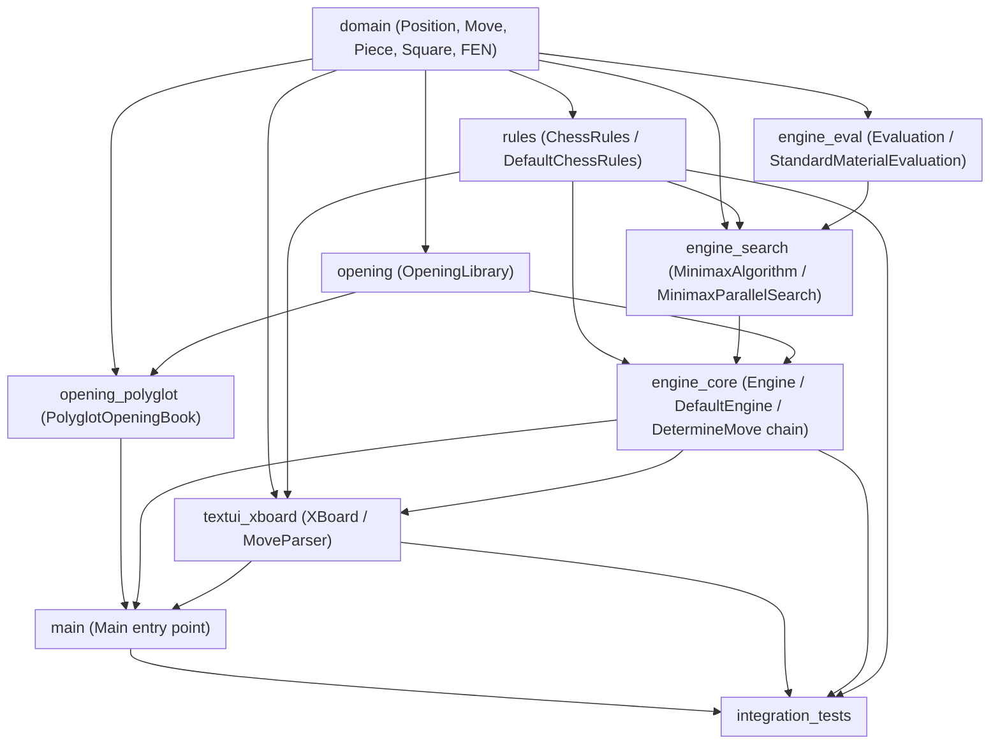
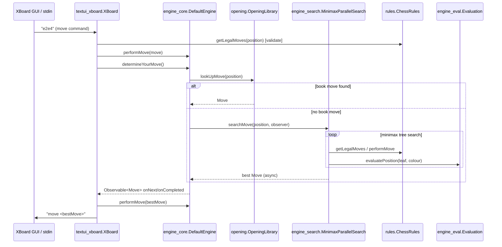
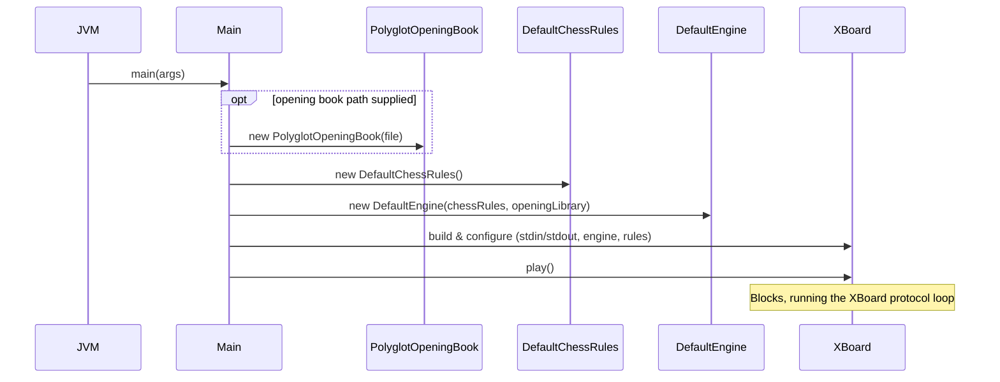

# dokchess-en-withcom

## Purpose

`dokchess-en-withcom` is a **Java chess engine** implementation named DokChess. It provides a complete, playable chess program built from cleanly separated layers:

- An immutable **domain model** for board state, pieces, squares, and moves (with FEN support).
- A **rules engine** that generates legal moves and detects check/checkmate/stalemate.
- A **search and evaluation** subsystem (parallel minimax with material evaluation) that determines the engine's move.
- An **opening book** integration (Polyglot format) to short-circuit search in known openings.
- A **text UI** implementing the XBoard/WinBoard chess engine communication protocol, so the engine can be driven by any XBoard-compatible GUI.
- A **main entry point** that wires all of the above together into a runnable application.
- **Integration tests** validating the whole system end-to-end (full games and protocol sessions).

The design follows a strict layered/hexagonal dependency direction: the `domain` module has zero dependencies, `rules` depends only on `domain`, `engine_*` modules depend on `domain`/`rules`, `opening*` depends on `domain`/`opening`, and the `textui_xboard`/`main` modules compose everything at the top, keeping each layer independently testable and replaceable.

## End-to-End Architecture

### Module Dependency Graph

### Runtime Flow: Determining and Playing a Move

### Application Bootstrap

## Core Modules Documentation

| Module | Description | Reference |
|---|---|---|
| **domain** | Immutable core chess vocabulary: `Square`, `Piece`, `Move`, `Position`, plus FEN conversion. Foundation for all other modules. | [domain.md](domain.md) (sub-modules: [domain_model](domain_model.md), [domain_fen](domain_fen.md)) |
| **rules** | Implements the Laws of Chess: legal move generation per piece type, castling, check/checkmate/stalemate detection via `ChessRules`/`DefaultChessRules`. | [rules.md](rules.md) (sub-modules: [rules_core](rules_core.md), [rules_movement_framework](rules_movement_framework.md), [rules_piece_moves](rules_piece_moves.md)) |
| **engine_core** | Orchestrates move determination via a Chain-of-Responsibility (`DetermineMove`): opening book lookup (`FromLibrary`) falling back to search (`FromSearch`). Defines the public `Engine`/`DefaultEngine` API. | [engine_core.md](engine_core.md) |
| **engine_eval** | Static position evaluation contract (`Evaluation`) and default material-counting implementation (`StandardMaterialEvaluation`), consumed at search leaf nodes. | [engine_eval.md](engine_eval.md) |
| **engine_search** | Minimax search algorithms: synchronous `MinimaxAlgorithm` and parallel, asynchronous `MinimaxParallelSearch` with `RatedMove` and cancellation support. | [engine_search.md](engine_search.md) (sub-modules: [engine_search_minimax](engine_search_minimax.md), [engine_search_parallel](engine_search_parallel.md)) |
| **opening** | Defines the `OpeningLibrary` port used to short-circuit search with known book moves. | [opening.md](opening.md) |
| **opening_polyglot** | Concrete `OpeningLibrary` implementation reading standard Polyglot `.bin` opening books, including Zobrist hashing and move decoding. | [opening_polyglot.md](opening_polyglot.md) (sub-modules: [opening_polyglot_format](opening_polyglot_format.md), [opening_polyglot_book](opening_polyglot_book.md)) |
| **textui_xboard** | Implements the XBoard/WinBoard text protocol (`XBoard`, `MoveParser`), bridging a GUI/terminal to the `Engine` and `ChessRules` abstractions. | [textui_xboard.md](textui_xboard.md) |
| **main** | Application composition root (`Main`) that wires rules, engine, opening book, and XBoard together and launches the protocol loop. | [main.md](main.md) |
| **integration_tests** | End-to-end tests: a full engine-vs-naive-opponent game (`EngineVsRandomIntegTest`) and an XBoard protocol session test (`XBoardIntegTest`). | [integration_tests.md](integration_tests.md) |