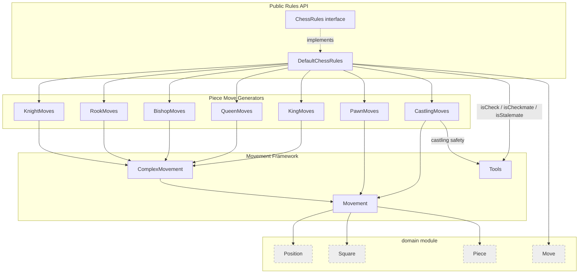
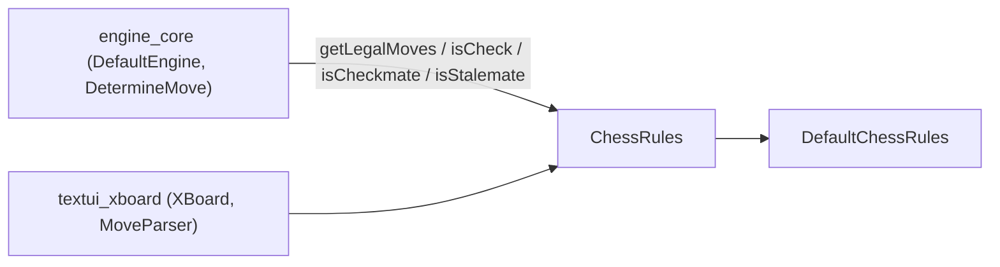
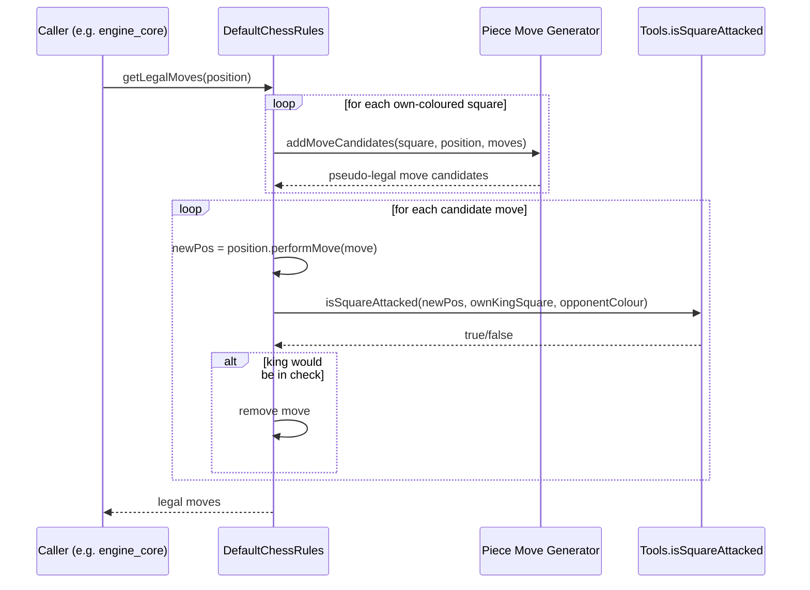

# Rules Module

## Purpose

The `rules` module implements the **Laws of Chess** for the dokchess engine. It is responsible for:

- Generating the legal moves available in a given [`Position`](domain_model.md) for the side to move.
- Detecting check, checkmate, and stalemate.
- Providing the canonical starting position of a game.

The module is deliberately kept independent of any search, evaluation, or UI concerns. It operates purely on the
immutable domain types defined in the [`domain`](domain.md) module (`Position`, `Move`, `Square`, `Piece`, `Colour`,
`PieceType`, `CastlingType`) and exposes a single public entry point, the `ChessRules` interface, with
`DefaultChessRules` as the standard implementation. Consumers such as the [`engine_core`](engine_core.md) module
(e.g. `DefaultEngine`, `DetermineMove`) and the [`textui_xboard`](textui_xboard.md) module rely on this interface to
drive gameplay without needing to know how individual pieces move or how attacks are detected.

## Architecture Overview

The module is organized into three cooperating layers:

1. **Public Rules API** – the `ChessRules` interface and its `DefaultChessRules` implementation, which orchestrate
   move generation and game-state queries.
2. **Movement Framework** – abstract base classes (`Movement`, `ComplexMovement`) and the `Tools` utility class,
   which provide shared building blocks (ray-tracing, single-step reachability, attack detection) used by every
   piece-specific move generator.
3. **Piece Move Generators** – one class per piece type/movement rule (`KnightMoves`, `RookMoves`, `BishopMoves`,
   `QueenMoves`, `KingMoves`, `PawnMoves`, `CastlingMoves`) that compute pseudo-legal move candidates for a piece on
   a given square.

### Consumers of this module

See [`engine_core`](engine_core.md) for how legal moves feed into search (`engine_search`) and
[`textui_xboard`](textui_xboard.md) for how a UI protocol consumes rules to validate and apply moves.

## Sub-modules

| Sub-module | Description |
|---|---|
| [rules_core](rules_core.md) | The `ChessRules` public contract and `DefaultChessRules`, which coordinates all piece move generators, filters out moves that leave the mover's own king in check, and answers check/checkmate/stalemate/starting-position queries. |
| [rules_movement_framework](rules_movement_framework.md) | Shared abstractions `Movement` and `ComplexMovement` for computing move candidates, plus the `Tools` utility that determines whether a square is attacked by a given colour (used for check detection and castling safety). |
| [rules_piece_moves](rules_piece_moves.md) | Concrete move generators for each piece type and for castling: `KnightMoves`, `RookMoves`, `BishopMoves`, `QueenMoves`, `KingMoves`, `PawnMoves`, `CastlingMoves`. |

## Move Generation Flow

The following sequence illustrates how `DefaultChessRules.getLegalMoves` produces the legal move list for a
position:

Check, checkmate, and stalemate are derived from the same building blocks:

- `isCheck(position, colour)` locates the king and asks `Tools.isSquareAttacked`.
- `isCheckmate(position)` returns true when the side to move is in check and `getLegalMoves` is empty.
- `isStalemate(position)` returns true when `getLegalMoves` is empty but the side to move is **not** in check.

## Related Modules

- [`domain`](domain.md) — immutable board/position representation consumed by every class in this module.
- [`engine_core`](engine_core.md) — uses `ChessRules` to enumerate legal moves and to evaluate terminal game states
  during search.
- [`textui_xboard`](textui_xboard.md) — uses `ChessRules` to validate user/opponent moves in the xboard protocol.
