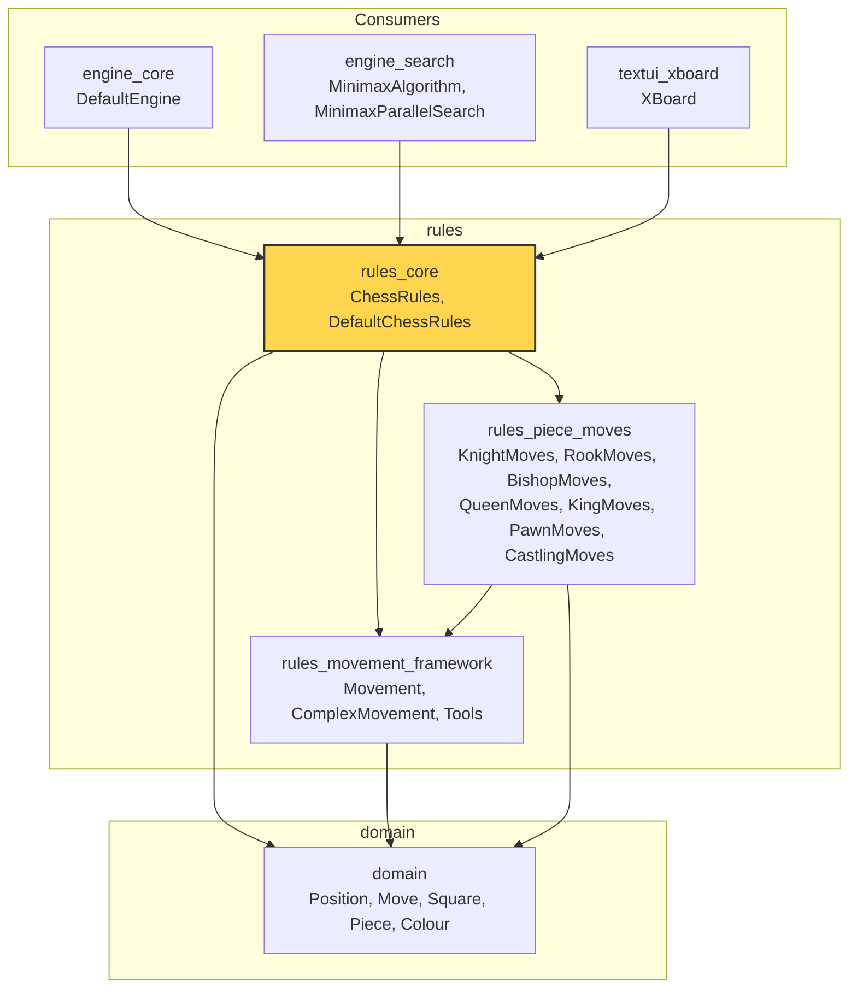
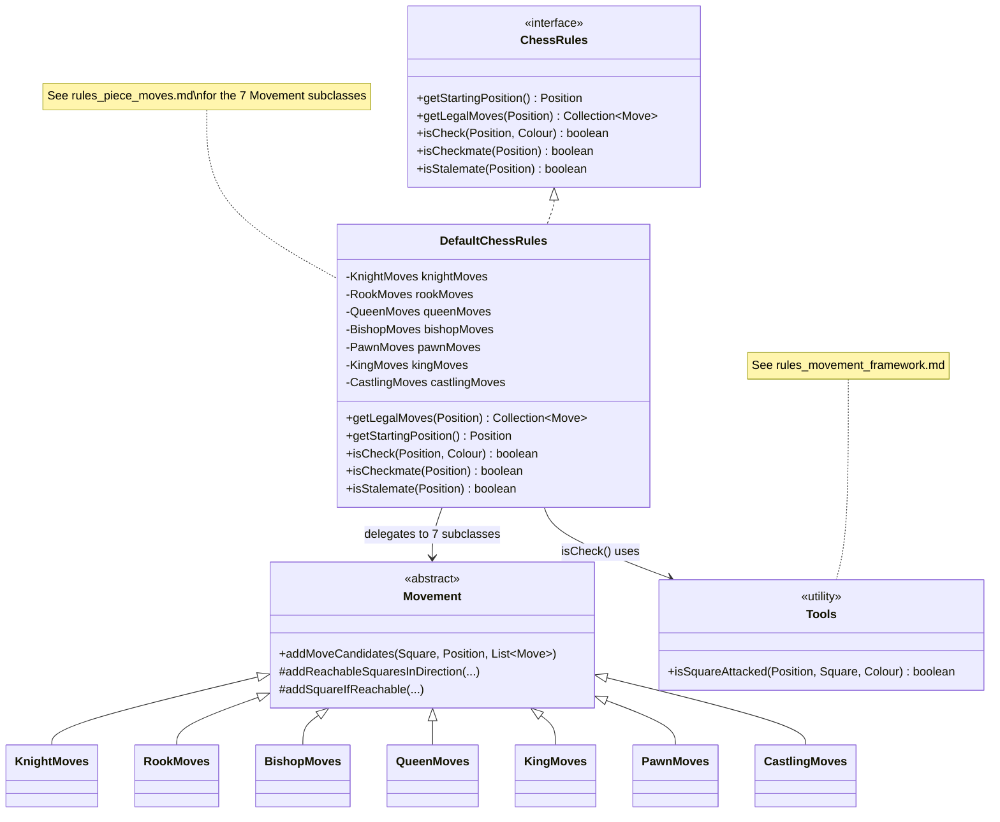
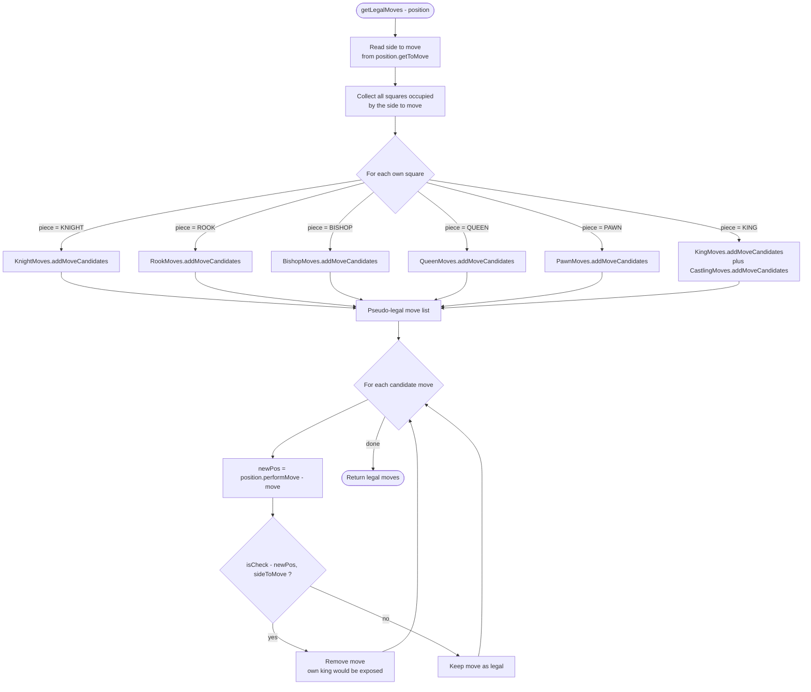
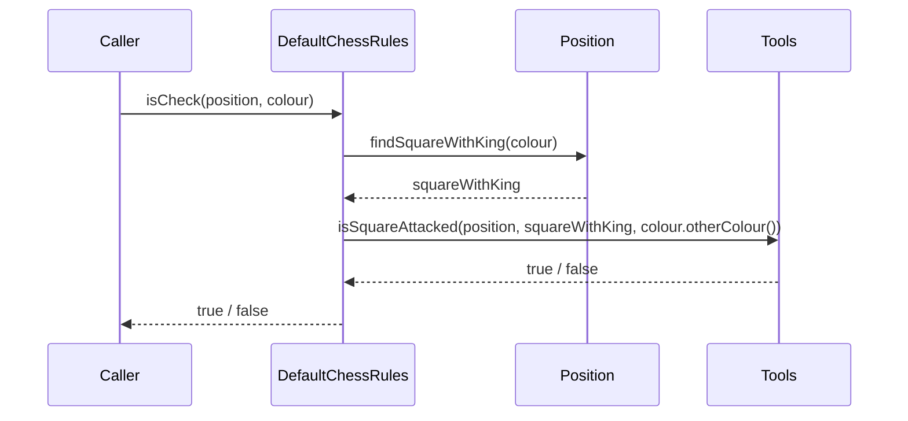
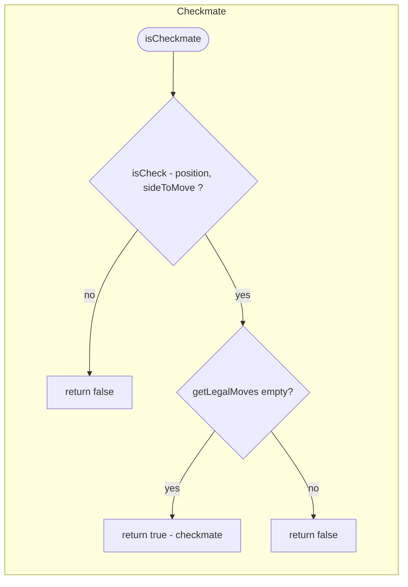
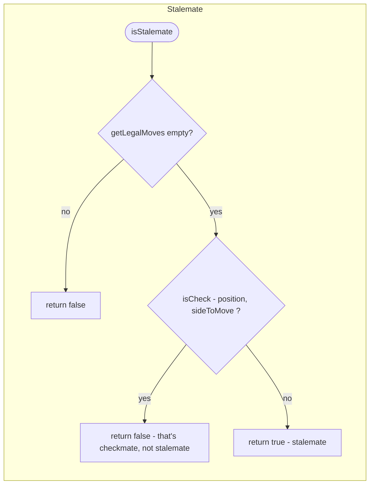
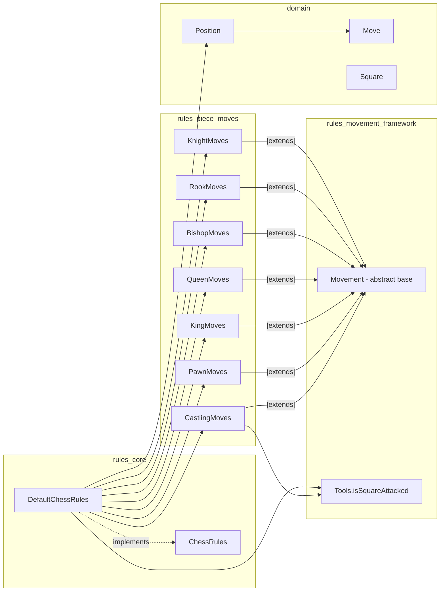

# rules_core

## Introduction

`rules_core` is the top-level rules API of the dokchess project. It defines **what a legal game of
chess looks like** — the starting position, the set of legal moves for any given position, and the
detection of check, checkmate, and stalemate. The module consists of two Java types:

| Component | Kind | Responsibility |
|---|---|---|
| [`ChessRules`](../src/main/java/org/dokchess/rules/ChessRules.java) | interface | Public contract describing "the laws of chess" |
| [`DefaultChessRules`](../src/main/java/org/dokchess/rules/DefaultChessRules.java) | class | Standard implementation of `ChessRules` |

`rules_core` is the single entry point that the rest of the system (engine, opening book, text UI)
uses to interact with chess rules. It hides all the piece-specific movement logic and attack
detection behind a small, stable interface, delegating the heavy lifting to two sibling modules:

* [`rules_movement_framework`](rules_movement_framework.md) — shared building blocks used to compute
  candidate moves and to detect square attacks (`Movement`, `ComplexMovement`, `Tools`).
* [`rules_piece_moves`](rules_piece_moves.md) — per-piece move generators (`KnightMoves`, `RookMoves`,
  `BishopMoves`, `QueenMoves`, `KingMoves`, `PawnMoves`, `CastlingMoves`).

It operates on the chess board model defined in [`domain`](domain.md) (`Position`, `Move`, `Square`,
`Piece`, `Colour`) and is consumed primarily by [`engine_core`](engine_core.md) and
[`engine_search`](engine_search.md), as well as by [`textui_xboard`](textui_xboard.md).

---

## 1. Purpose and Core Functionality

`rules_core` answers four fundamental questions about a chess game state, exposed through the
`ChessRules` interface:

1. **What is the starting position?** — `getStartingPosition()`
2. **What moves are legal from here?** — `getLegalMoves(Position)`
3. **Is a king currently in check?** — `isCheck(Position, Colour)`
4. **Has the game ended in checkmate or stalemate?** — `isCheckmate(Position)` / `isStalemate(Position)`

The default implementation, `DefaultChessRules`, computes legal moves in two phases:

1. **Pseudo-legal move generation** — for every square occupied by the side to move, generate all
   moves a piece of that type could geometrically make (ignoring whether the move would leave the
   king in check). This step is delegated to the piece-specific `Movement` subclasses from
   [`rules_piece_moves`](rules_piece_moves.md).
2. **Legality filtering** — for each pseudo-legal move, the resulting position is checked: if the
   mover's own king would be in check afterwards, the move is discarded. This uses `isCheck`, which
   in turn uses the attack-detection routine `Tools.isSquareAttacked` from
   [`rules_movement_framework`](rules_movement_framework.md).

Checkmate and stalemate are both derived from `getLegalMoves`:

* **Checkmate** = side to move is in check **and** has no legal moves.
* **Stalemate** = side to move has no legal moves **and** is **not** in check.

---

## 2. Architecture

### 2.1 Module Position in the System

### 2.2 Class Diagram

---

## 3. Data Flow: `getLegalMoves(Position)`

`getLegalMoves` is the central operation of `DefaultChessRules`. It combines **generation** with
**filtering** in a single pass.

Key implementation details:

* Move generation is dispatched purely on `PieceType` via a `switch` statement; each case delegates
  to a dedicated `Movement` subclass instance held as a field of `DefaultChessRules`.
* The King is special-cased: both normal king steps (`KingMoves`) and castling
  (`CastlingMoves`) are generated for the king's square.
* Legality filtering is done generically for **all** piece types by simulating the move
  (`Position.performMove`) and testing whether the mover's own king is left in check
  (`isCheck`). This single mechanism transparently also invalidates castling moves that would
  leave the king in check post-move, and pinned-piece moves that expose the king — no piece-specific
  "is this move safe" logic is needed anywhere else. (Castling *through* an attacked square is
  already excluded by `CastlingMoves` itself — see [`rules_piece_moves`](rules_piece_moves.md).)

---

## 4. Process Flows

### 4.1 `isCheck(Position, Colour)`

`isCheck` reduces to a single question: "is the king's square attacked by the opposing colour?".
This is answered entirely by `Tools.isSquareAttacked`
(see [`rules_movement_framework`](rules_movement_framework.md)), which scans rays and knight/king/pawn
offsets from the target square outward — the inverse perspective of normal move generation.

### 4.2 `isCheckmate(Position)` and `isStalemate(Position)`

Both predicates are thin, side-effect-free wrappers around `getLegalMoves` and `isCheck`; no
additional state or caching is used. Because `getLegalMoves` is O(number of own pieces × moves per
piece × 1 simulated move each), calling `isCheckmate`/`isStalemate` on every position visited during
search can be relatively expensive — this cost is a factor in why
[`engine_search`](engine_search.md) limits search depth and parallelizes across root moves.

---

## 5. Component Interaction Across Modules

This layering keeps `rules_core` free of any board-scanning or geometry code: it only orchestrates
*which* generator to call and *whether* the resulting move is safe. All geometric logic (rays,
knight offsets, sliding pieces, attack detection) lives in
[`rules_movement_framework`](rules_movement_framework.md) and
[`rules_piece_moves`](rules_piece_moves.md).

---

## 6. Usage by the Rest of the System

`ChessRules` is injected wherever chess semantics are needed, rather than being looked up statically.
This makes it trivial to substitute alternative rule sets (e.g. variants) in tests or future
extensions.

```mermaid
graph TD
    Main[Main] --> Engine[DefaultEngine]
    Engine -->|constructor param: ChessRules| DCR2[new DefaultChessRules&#40;&#41;]
    Engine --> Minimax[MinimaxParallelSearch]
    Minimax -->|setChessRules| DCR2
    Minimax --> Alg[MinimaxAlgorithm]
    Alg -->|rules.getLegalMoves&#40;position&#41;| DCR2
    Alg -->|rules.isCheckmate / isStalemate| DCR2

    XBoard[XBoard] -->|rules.getLegalMoves| DCR2
    XBoard -->|rules.isCheckmate / isStalemate| DCR2
```

Representative call sites:

* **[`engine_core`](engine_core.md)** — `DefaultEngine` is constructed with a `ChessRules`
  instance (typically `new DefaultChessRules()`) and passes it down into the search pipeline.
* **[`engine_search`](engine_search.md)** — `MinimaxAlgorithm` and `MinimaxParallelSearch` call
  `getLegalMoves` at every node of the search tree, and use `isCheckmate` / `isStalemate` to detect
  terminal positions and assign appropriate evaluation scores (see
  [`engine_eval`](engine_eval.md) for scoring).
* **[`textui_xboard`](textui_xboard.md)** — `XBoard` uses `ChessRules` to validate user/opponent
  moves and to detect and announce end-of-game conditions over the xboard protocol.
* **Integration tests** — `EngineVsRandomIntegTest` and `XBoardIntegTest` exercise `DefaultChessRules`
  indirectly through full games, verifying that legal-move generation, check detection, and
  game-termination logic behave correctly end-to-end.

---

## 7. Design Notes

* **Immutability-friendly**: `DefaultChessRules` never mutates a `Position`; `Position.performMove`
  returns a new `Position` (domain model is effectively immutable — see [`domain`](domain.md)). This
  makes the "simulate-then-check" legality filter in `getLegalMoves` safe and simple, at the cost of
  allocating a new `Position` per candidate move.
* **Single source of truth for legality**: rather than having each `Movement` subclass reason about
  check, `DefaultChessRules` applies one uniform post-filter (`isCheck` after `performMove`) to every
  candidate move. This correctly handles pins, discovered checks, and castling-into-check with no
  piece-specific special casing beyond what `CastlingMoves` already does (squares must be empty and
  not attacked *before* the move is simulated).
* **Statelessness**: `DefaultChessRules` holds only reusable, stateless `Movement` helper instances as
  fields; it carries no game state of its own. Multiple threads may safely share one
  `DefaultChessRules` instance as long as they only pass independent `Position` objects (this is
  exploited by [`engine_search`](engine_search.md)'s parallel root-move evaluation).
