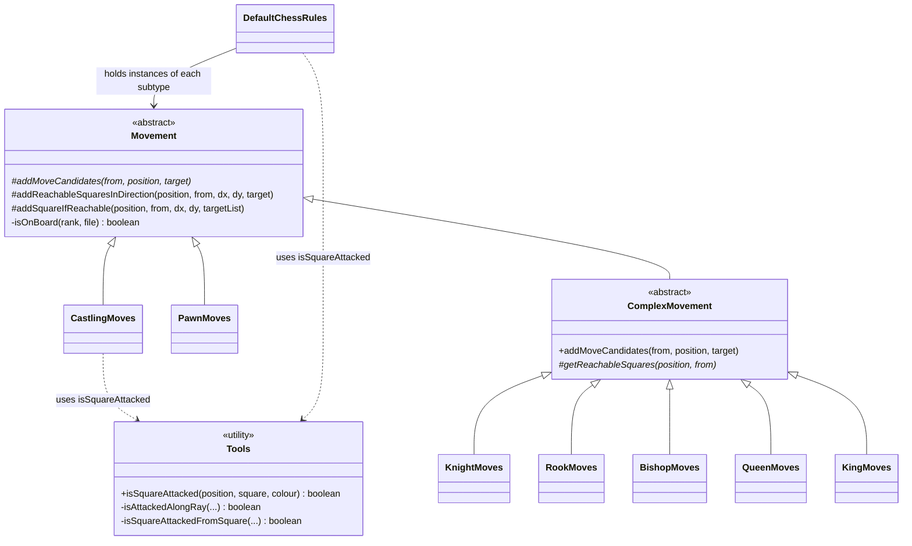
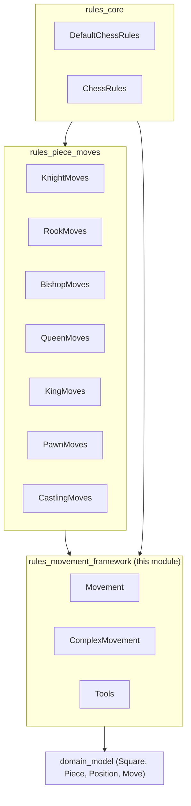
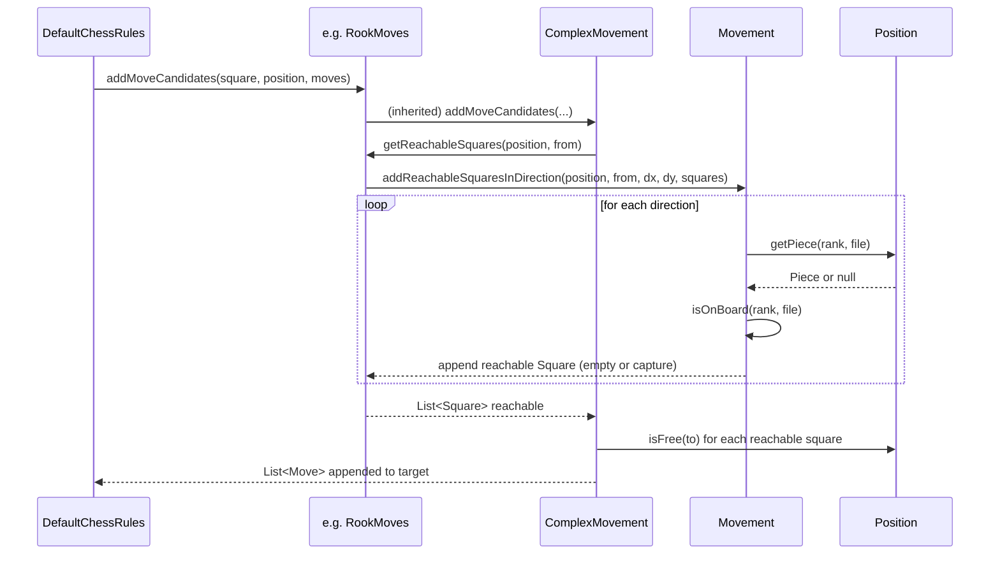
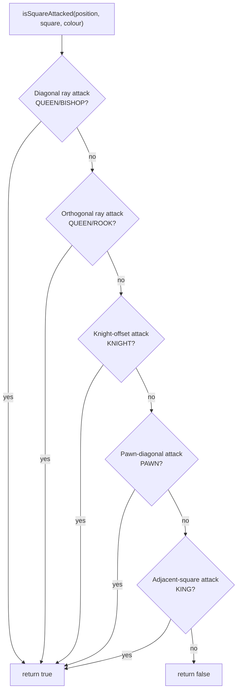
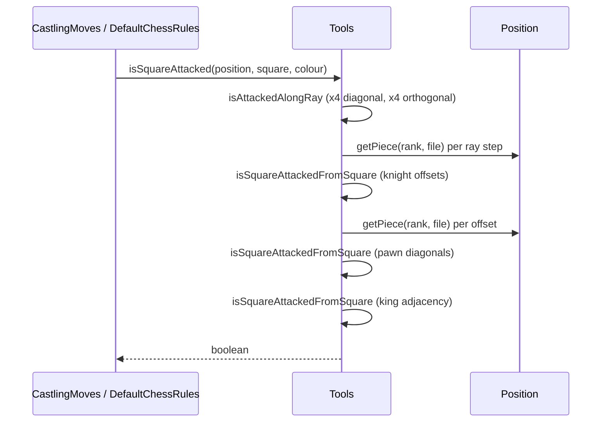

# Rules Movement Framework

## Introduction

The **Rules Movement Framework** is the internal engineering layer of the `org.dokchess.rules` package that provides
the shared building blocks used to compute chess piece movement and to detect square attacks. It does **not**
implement the movement of any specific piece type itself; instead it defines the abstract contracts
(`Movement`, `ComplexMovement`) and the geometric/attack-detection utilities (`Tools`) that every concrete piece-move
implementation (knight, rook, bishop, queen, king, pawn, castling — see [rules_piece_moves.md](rules_piece_moves.md))
builds upon. The framework is consumed by [`DefaultChessRules`](rules_core.md), the top-level rules engine that
orchestrates legal move generation, check/checkmate/stalemate detection for the whole game.

This document explains the framework's purpose, its class relationships, the algorithms encapsulated in `Tools`, and
how data flows from a request for "legal moves" down to individual square-reachability calculations.

---

## 1. Purpose & Responsibilities

| Responsibility | Component |
|---|---|
| Define the common contract every piece-movement type must fulfil (`addMoveCandidates`) | `Movement` |
| Provide reusable geometric helpers for sliding (rook/bishop/queen-like) and single-step (knight/king/pawn-like) movement | `Movement` |
| Provide a template implementation for movement types whose candidate destination squares can be computed independently of move-specific metadata (captures, promotions, en passant) | `ComplexMovement` |
| Provide attack detection (“is square X attacked by colour Y?”), used for check detection and castling legality | `Tools` |

The framework deliberately keeps board-coordinate validation, sliding-ray traversal, and attack scanning **in one
place** so that every piece-move implementation and the rules engine's check-detection logic share identical,
well-tested geometry code rather than duplicating it per piece type.

All types in this module operate on the domain model — see [domain_model.md](domain_model.md) for
`Square`, `Piece`, `Position`, and `Move`.

---

## 2. Component Overview

### 2.1 `Movement` (abstract, package-private)

The root abstraction for all piece-movement logic.

- **`addMoveCandidates(Square from, Position position, List<Move> target)`** — abstract method that every concrete
  movement type (knight, rook, bishop, queen, king, pawn, castling) must implement. It appends `Move` objects
  representing pseudo-legal candidate moves for the piece located at `from`. "Pseudo-legal" because these candidates
  are not yet filtered for leaving one's own king in check — that filtering happens later, in `DefaultChessRules`.

- **`addReachableSquaresInDirection(...)`** — walks from a square in a straight-line direction `(dx, dy)`
  (rank/file deltas) until it runs off the board or hits a piece. Empty squares are added to `target`; if an
  opponent's piece is hit, that square is added as a capture and the walk stops; if a friendly piece is hit, the walk
  stops without adding that square. This is the core primitive for **sliding pieces** (rook, bishop, queen).

- **`addSquareIfReachable(...)`** — checks a single square one step away from `from` in direction `(dx, dy)`. If it's
  on the board and either empty or occupied by an opponent piece, it is added to the target list. This is the core
  primitive for **single-step pieces** (knight, king, and pawn captures).

- **`isOnBoard(rank, file)`** (private) — bounds check (`0..7` for both rank and file), used by both public helpers
  above.

### 2.2 `ComplexMovement` (abstract, public)

A template-method specialization of `Movement` for pieces whose candidate destination squares can be computed purely
from geometry, without needing move-specific metadata such as promotion or en passant (i.e., everything except pawns
and castling).

```java
abstract class Movement {
    abstract void addMoveCandidates(Square from, Position position, List<Move> target);
    // ... geometric helpers
}

abstract class ComplexMovement extends Movement {
    @Override
    void addMoveCandidates(Square from, Position position, List<Move> target) {
        Piece ownPiece = position.getPiece(from);
        List<Square> reachable = getReachableSquares(position, from);
        for (Square to : reachable) {
            target.add(new Move(ownPiece, from, to, !position.isFree(to)));
        }
    }
    protected abstract List<Square> getReachableSquares(Position position, Square from);
}
```

It implements `addMoveCandidates` once and delegates the piece-specific geometry to the abstract
`getReachableSquares(Position, Square)`. Each concrete subclass (in [rules_piece_moves.md](rules_piece_moves.md))
only needs to compute *which squares* are reachable; `ComplexMovement` takes care of converting that into `Move`
objects, automatically flagging a move as a capture when the destination square is not free.

Subclasses of `ComplexMovement`: `KnightMoves`, `RookMoves`, `BishopMoves`, `QueenMoves`, `KingMoves`.

Direct subclasses of `Movement` (not `ComplexMovement`), because they need move metadata beyond simple
reachability: `PawnMoves` (promotion, en passant, two-square advance) and `CastlingMoves` (special king move
with side-effects on rook and castling rights).

### 2.3 `Tools` (final, package-private utility class)

A stateless utility class providing **attack detection** — the ability to determine whether a given square is
attacked by any piece of a given colour, regardless of what currently occupies that square. This is essential for:

- **Check detection**: is the king's square attacked by the opponent?
- **Castling legality**: are the king's start, transit, and destination squares free of attack?

Key method:

```java
public static boolean isSquareAttacked(Position position, Square square, Colour colour)
```

It checks, in turn:

1. **Diagonal rays** (4 directions) for an attacking `QUEEN` or `BISHOP`.
2. **Orthogonal rays** (4 directions) for an attacking `QUEEN` or `ROOK`.
3. **Knight-shaped offsets** (8 positions) for an attacking `KNIGHT`.
4. **Pawn capture offsets** (2 diagonal squares, direction depends on `colour`) for an attacking `PAWN`.
5. **Adjacent squares** (8 positions) for an attacking `KING`.

Internally it uses two private helpers that mirror the primitives in `Movement` but are attack-oriented rather than
move-generation-oriented:

- `isAttackedAlongRay(...)` — walks a ray (like `addReachableSquaresInDirection`) and returns true if the *first*
  piece encountered belongs to `colour` and its type is in the given `Set<PieceType>` (either `{QUEEN, BISHOP}` or
  `{QUEEN, ROOK}`).
- `isSquareAttackedFromSquare(...)` — checks a single neighbouring square (like `addSquareIfReachable`, but without
  worrying about occupancy of the origin) for a piece of a specific `colour` and exact `PieceType` — used for knight,
  king, and pawn attacks, which are not sliding attacks.

`Tools` is used directly by `CastlingMoves` (to verify the king does not pass through or land on an attacked square)
and by `DefaultChessRules.isCheck(...)` (see [rules_core.md](rules_core.md)).

---

## 3. Architecture & Relationships



*Concrete piece classes (`KnightMoves`, `RookMoves`, `BishopMoves`, `QueenMoves`, `KingMoves`, `PawnMoves`,
`CastlingMoves`) live in the sibling module [rules_piece_moves.md](rules_piece_moves.md). `DefaultChessRules`
lives in [rules_core.md](rules_core.md).*

### Module dependency view



The framework sits between the [domain model](domain_model.md) (pure data: board, squares, pieces, moves) and the
piece-specific movement rules; it has **no** dependency on [rules_core.md](rules_core.md) or higher layers such as
[engine_core.md](engine_core.md) — dependency flows strictly downward.

---

## 4. Data Flow: Legal Move Generation

The framework's primitives are invoked, piece-type by piece-type, whenever `DefaultChessRules.getLegalMoves(Position)`
is called (see [rules_core.md](rules_core.md) for the full orchestration, including the post-generation
check-filtering step).



For **pawns** and **castling**, `addMoveCandidates` is implemented directly (bypassing `ComplexMovement`) because
these movement types require additional metadata (promotion piece, en passant flag, or castling-specific legality
checks) that a simple list of reachable squares cannot express.

---

## 5. Data Flow: Attack Detection (`Tools.isSquareAttacked`)

Attack detection is used both for **check detection** (is the side-to-move's king attacked after a candidate move?)
and for **castling legality** (are the squares the king passes through under attack?).





### How `CastlingMoves` and `DefaultChessRules` use `Tools`

- `CastlingMoves.noneOfSquaresAreAttacked(position, attackingColour, squares...)` calls `Tools.isSquareAttacked` for
  each of the king's start/transit/destination squares to ensure castling does not move the king through or into
  check.
- `DefaultChessRules.isCheck(position, colour)` (in [rules_core.md](rules_core.md)) locates the king of `colour` via
  `position.findSquareWithKing(colour)` and calls `Tools.isSquareAttacked(position, kingSquare, colour.otherColour())`
  to determine if it is in check. This same method is reused after every pseudo-legal candidate move to filter out
  moves that would leave the mover's own king in check.

---

## 6. Design Notes

- **Package visibility**: `Movement` and `Tools` are package-private, confining the low-level geometry helpers to the
  `org.dokchess.rules` package. Only `ComplexMovement` is `public`, since concrete piece-move classes that need to
  extend it may conceptually live elsewhere, though in practice all subclasses currently reside in the same package
  (see [rules_piece_moves.md](rules_piece_moves.md)).
- **No mutation of `Position`**: All helpers are read-only with respect to `Position`; actual move application
  (`Position.performMove`) happens outside this framework, in `DefaultChessRules`.
- **Symmetry between move-generation and attack-detection helpers**: `addReachableSquaresInDirection` /
  `isAttackedAlongRay` and `addSquareIfReachable` / `isSquareAttackedFromSquare` are deliberately parallel in
  structure — one produces reachable destination squares for a piece to move to, the other tests whether a square is
  reached by an attacking piece. Keeping this symmetry makes it straightforward to reason about correctness (a
  sliding piece that can reach square X can also attack square X, and vice versa).
- **Pseudo-legal vs. legal moves**: Everything produced within this framework (and by the piece-move classes built on
  top of it) is *pseudo-legal* — it respects piece movement geometry and capture/blocking rules, but does not check
  whether the move leaves the mover's own king in check. That final legality filter is applied one layer up, in
  `DefaultChessRules.getLegalMoves` (see [rules_core.md](rules_core.md)).

---

## 7. Related Documentation

- [domain_model.md](domain_model.md) — `Square`, `Piece`, `Position`, `Move` data types consumed by this framework.
- [rules_piece_moves.md](rules_piece_moves.md) — concrete piece movement implementations
  (`KnightMoves`, `RookMoves`, `BishopMoves`, `QueenMoves`, `KingMoves`, `PawnMoves`, `CastlingMoves`) built on top of
  this framework.
- [rules_core.md](rules_core.md) — `ChessRules` interface and `DefaultChessRules` implementation, which orchestrates
  this framework to compute legal moves and detect check/checkmate/stalemate.
- [engine_core.md](engine_core.md) — the engine layer that consumes `ChessRules` to decide on moves to play.
