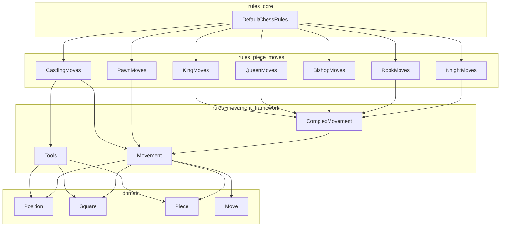
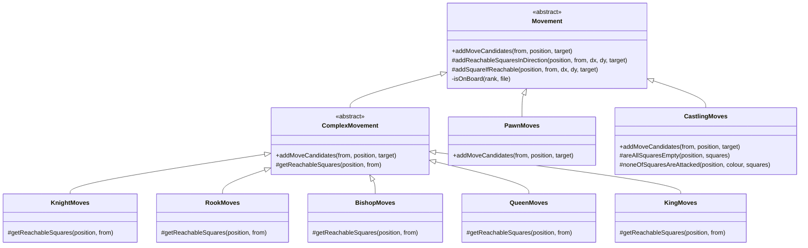
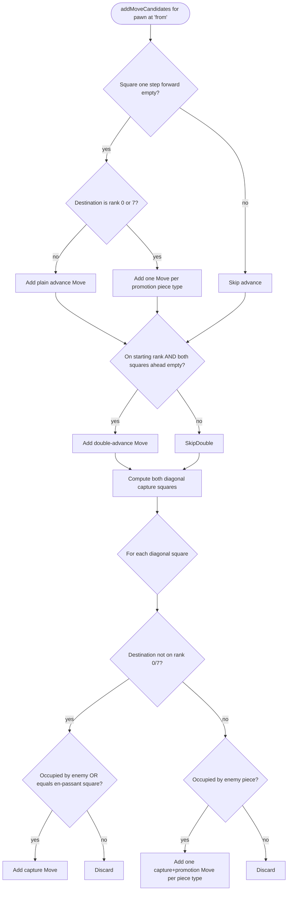
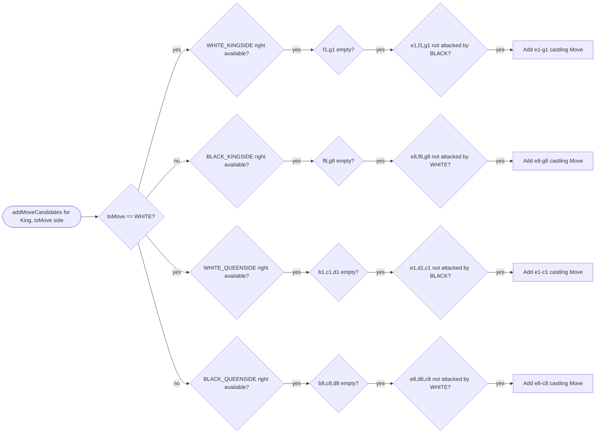
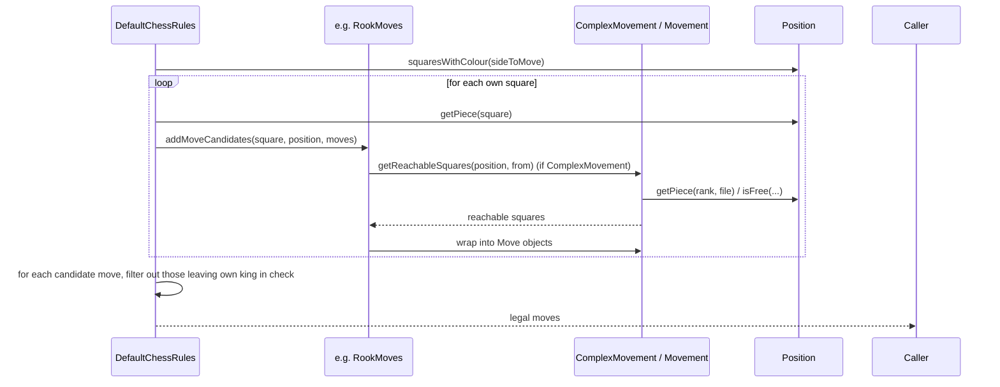

# Rules Piece Moves Module

## Introduction

The **rules_piece_moves** module implements the concrete move-generation logic for every
piece type in chess: knight, rook, bishop, queen, king (single-step moves), pawn (advance,
double-advance, capture, en passant, promotion), and castling. Each piece type gets its own
small, focused class that knows only the *geometric* movement rules for that piece — it does
not know anything about check detection, legality filtering, or the overall game loop. Those
higher-level concerns are handled by [`rules_core`](rules_core.md), which orchestrates all the
classes in this module to produce the final list of legal moves.

This module is a direct consumer of the [`rules_movement_framework`](rules_movement_framework.md)
module (the `Movement`/`ComplexMovement` base classes and the `Tools` attack-detection utility)
and of the [`domain`](domain.md) module's model classes (`Position`, `Square`, `Piece`, `Move`).

All classes in this module are package-private (`class XxxMoves` with no modifier, except
`CastlingMoves` which is also package-private) — they are implementation details of the
`org.dokchess.rules` package and are only exposed to the outside world through
[`ChessRules`/`DefaultChessRules`](rules_core.md).

---

## Module Purpose

For each square containing a piece belonging to the side to move, `DefaultChessRules` (from
`rules_core`) delegates to the matching class in this module to enumerate *move candidates* —
moves that are geometrically possible, ignoring whether they would leave the moving side's own
king in check. That final legality filter (self-check exclusion) is applied afterwards by
`DefaultChessRules`, not by the classes documented here.

The classes in this module are grouped into two families based on how they are implemented:

1. **Simple/jump & sliding movers** — `KnightMoves`, `RookMoves`, `BishopMoves`, `QueenMoves`,
   `KingMoves`. These extend `ComplexMovement` (from `rules_movement_framework`) and only need to
   report the set of squares reachable from a given origin; move construction (including capture
   flagging) is handled generically by the base class.
2. **Special-case movers** — `PawnMoves`, `CastlingMoves`. These extend `Movement` directly and
   override `addMoveCandidates` themselves because pawn moves (double advance, en passant,
   promotion) and castling (rook/king coupling, empty-path and safety checks) cannot be expressed
   as a simple "set of reachable squares."

---

## Component Overview

| Class | Piece | Base class | Movement pattern |
|---|---|---|---|
| `KnightMoves` | Knight | `ComplexMovement` | 8 fixed L-shaped jumps |
| `RookMoves` | Rook | `ComplexMovement` | Sliding along 4 orthogonal directions |
| `BishopMoves` | Bishop | `ComplexMovement` | Sliding along 4 diagonal directions |
| `QueenMoves` | Queen | `ComplexMovement` | Sliding along all 8 directions (rook + bishop combined) |
| `KingMoves` | King | `ComplexMovement` | 8 fixed one-square steps (castling excluded) |
| `PawnMoves` | Pawn | `Movement` | Single/double advance, diagonal captures, en passant, promotion |
| `CastlingMoves` | King (castling) | `Movement` | Special king move coupled with rook, gated by rights/emptiness/safety |

---

## Architecture

See [`domain`](domain.md) for `Position`, `Square`, `Piece`, `Move`, and
[`rules_movement_framework`](rules_movement_framework.md) for `Movement`, `ComplexMovement`,
and `Tools`.

---

## Class Design

### `ComplexMovement`-based movers (Knight, Rook, Bishop, Queen, King)

These classes only implement `getReachableSquares(Position, Square)`. The generic
`ComplexMovement.addMoveCandidates` (defined in `rules_movement_framework`) then wraps each
reachable square into a `Move`, automatically detecting captures via `Position.isFree(to)`.

#### Movement geometry per piece

| Piece | Helper used | Directions/offsets |
|---|---|---|
| Knight | `addSquareIfReachable` (8 calls) | (±2,±1) and (±1,±2) — all 8 L-shapes |
| Rook | `addReachableSquaresInDirection` (4 calls) | (0,±1), (±1,0) — orthogonal slides |
| Bishop | `addReachableSquaresInDirection` (4 calls) | (±1,±1) — diagonal slides |
| Queen | `addReachableSquaresInDirection` (8 calls) | union of rook + bishop directions |
| King | `addSquareIfReachable` (8 calls) | all 8 adjacent squares |

`addSquareIfReachable` and `addReachableSquaresInDirection` (defined in `Movement`, part of
`rules_movement_framework`) both automatically:
- stay within the 8×8 board,
- stop before/at squares occupied by a friendly piece,
- include a square occupied by an enemy piece exactly once (as a capture) and stop sliding
  further in that direction.

### `PawnMoves`

Pawns are the most irregular piece and are implemented as a direct `Movement` subclass with
custom logic in `addMoveCandidates`:

1. **Single advance** — one square forward (`delta1`, dependent on `Colour`) into an empty
   square; if the destination rank is the last rank (0 or 7), a `Move` is created for each
   possible promotion piece type (`QUEEN`, `ROOK`, `BISHOP`, `KNIGHT`) instead of a single plain
   move.
2. **Double advance** — only from each side's starting rank (rank 6 for White, rank 1 for
   Black), and only if both the intermediate and destination squares are empty.
3. **Captures** — diagonal moves (`delta1`, ±1 file) are only added if the destination square
   contains an enemy piece, or equals `Position.getEnPassantSquare()` (en passant capture).
   Captures landing on the last rank likewise generate one `Move` per promotion piece type.

Key `Move` flags produced (see [`domain.Move`](domain.md)):
- Plain advance → `Move(piece, from, to)`
- Promotion (no capture) → `Move(piece, from, to, promotionPieceType)`
- Capture (no promotion, incl. en passant) → `Move(piece, from, to, true)`
- Capture with promotion → `Move(piece, from, to, true, promotionPieceType)`

Note that en passant captures are represented as ordinary capture moves whose `to` square is
empty at generation time; `Position.performMove` (in `domain`) is responsible for removing the
actually-captured pawn based on `enPassantSquare` bookkeeping.

### `CastlingMoves`

Generates the special king-moves-two-squares castling move (kingside `O-O` or queenside
`O-O-O`) for the side to move, subject to three independent conditions, all of which must hold:

1. **Rights** — `Position.getCastlingsAvailable()` still contains the relevant
   `CastlingType` (rights are revoked permanently once the king or the relevant rook has moved,
   tracked by `Position.performMove`).
2. **Emptiness** — all squares between king and rook must be empty
   (`areAllSquaresEmpty`).
3. **Safety** — the king's current square, the square it passes through, and its destination
   square must not be attacked by the opponent (`noneOfSquaresAreAttacked`, which delegates to
   `Tools.isSquareAttacked` from `rules_movement_framework`). Note that this does **not** check
   the rook's start/landing squares for attack — only the emptiness rule applies to those.

The resulting `Move` always carries a fixed `WHITE_KING`/`BLACK_KING` `Piece` constant (rather
than fetching the piece from the board), moving directly from `e1`/`e8` to `g1`/`g8` (kingside)
or `c1`/`c8` (queenside). `Move.isCastling()` recognizes such moves by detecting a king moving
two files; `Position.performMove` (in `domain`) is responsible for also relocating the rook and
updating castling rights when such a move is applied — `CastlingMoves` itself does not move the
rook, it only decides whether the king-move is legal to *offer* as a candidate.

---

## Data Flow: From Position to Move Candidates

The classes documented here are only responsible for the **candidate generation** step; the
self-check filtering loop (`isCheck` via `Tools.isSquareAttacked`) is implemented in
`DefaultChessRules`, documented in [`rules_core`](rules_core.md).

---

## Relationship to Other Modules

- **[`domain`](domain.md)** — Supplies the data model consumed and produced by every class in
  this module: `Position` (board state, side to move, castling rights, en passant square),
  `Square`, `Piece`, and `Move`. None of the classes here mutate a `Position`; `Position` is
  treated as immutable and mutation happens only via `Position.performMove`, which is invoked by
  `DefaultChessRules` (in `rules_core`) after candidate generation, not by this module.
- **[`rules_movement_framework`](rules_movement_framework.md)** — Supplies the shared building
  blocks: the `Movement` abstract base class (single-step and sliding square enumeration
  helpers), the `ComplexMovement` template class used by five of the seven classes here, and
  `Tools.isSquareAttacked`, used by `CastlingMoves` to verify king safety.
- **[`rules_core`](rules_core.md)** — The sole consumer of this module. `DefaultChessRules`
  instantiates one instance of each piece-move class, dispatches to the correct one based on
  `PieceType`, aggregates all candidates, and then filters out moves that would leave the mover's
  own king in check (using `Tools.isSquareAttacked` again, via its `isCheck` method).
- **[`engine_core`](engine_core.md) / [`engine_search`](engine_search.md)** — Indirectly rely on
  this module's output: the search algorithms call `ChessRules.getLegalMoves`, which is backed by
  the classes documented here, to expand the game tree.
- **[`textui_xboard`](textui_xboard.md)** — Indirectly relies on this module through
  `ChessRules.getLegalMoves` to validate user/engine moves and detect check/checkmate/stalemate
  conditions during an interactive game session.

---

## Design Notes & Invariants

- **Statelessness** — All classes in this module are stateless (no instance fields hold
  per-call data); a single instance of each is safely reused across many positions, as done by
  `DefaultChessRules`, which keeps one field per piece-move class.
- **No self-check filtering here** — None of these classes check whether a candidate move
  leaves the moving side's own king in check. That is intentionally left to `DefaultChessRules`
  so that this module stays focused purely on each piece's geometric movement rules.
- **Rook movement during castling is not this module's concern** — `CastlingMoves` only decides
  *if* castling can be offered as a move; the actual repositioning of the rook and update of
  castling rights happen in `Position.performMove` (`domain` module).
- **En passant bookkeeping** — `PawnMoves` only recognizes an en passant capture opportunity via
  `Position.getEnPassantSquare()`; it does not remove the captured pawn — that also happens in
  `Position.performMove`.
- **Capture detection reuses `ComplexMovement`** — for Knight/Rook/Bishop/Queen/King, whether a
  generated move is flagged as a capture is decided generically by `ComplexMovement` via
  `Position.isFree(to)`, not by each subclass individually.
