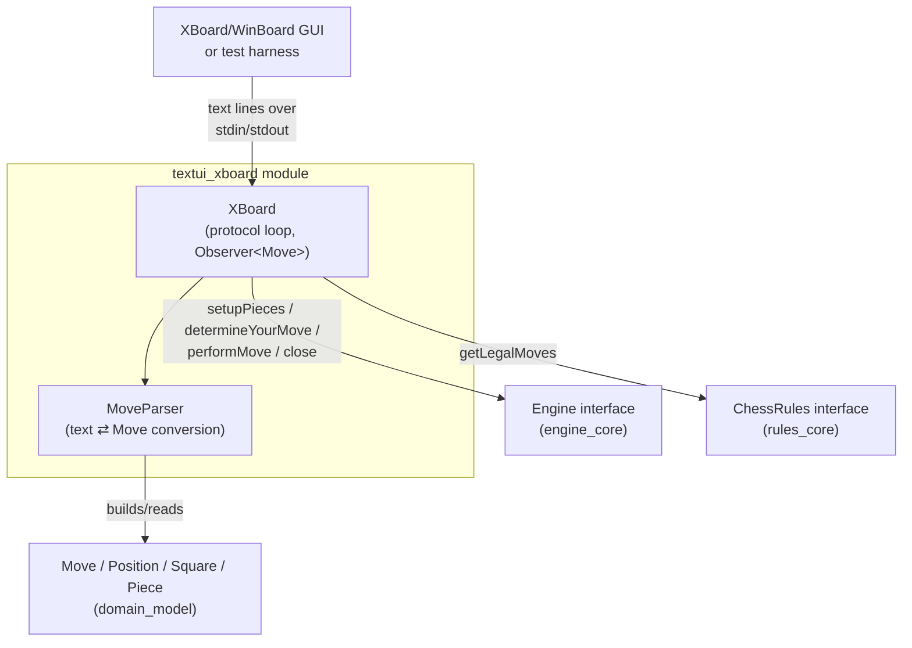
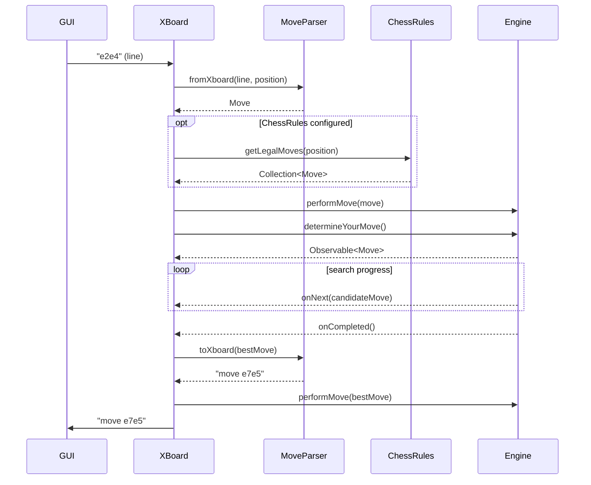
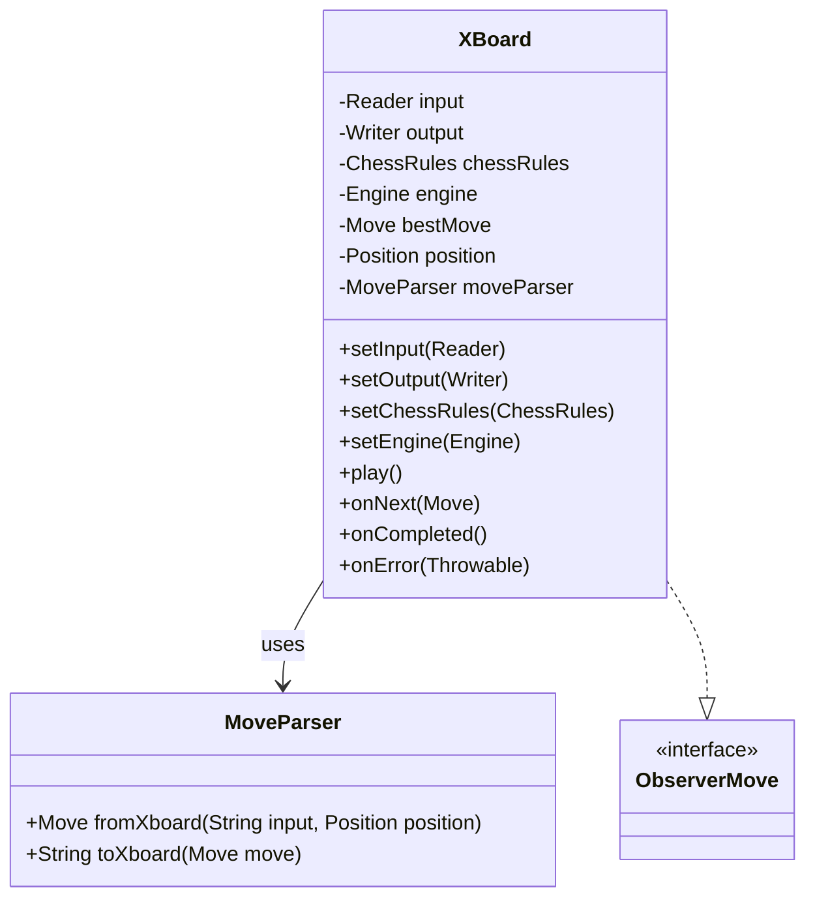
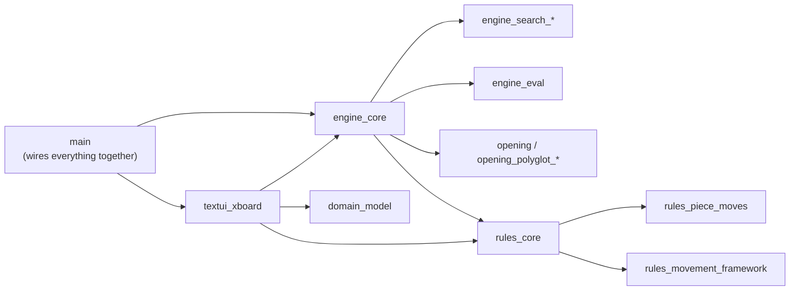

# textui_xboard Module

## 1. Purpose

The `textui_xboard` module is the **text-based user interface** of dokchess that
implements the classic [XBoard / WinBoard "Chess Engine Communication
Protocol"](https://www.gnu.org/software/xboard/engine-intf.html). It allows any
XBoard-compatible GUI (or a simple pipe/terminal in tests) to drive a dokchess
[`Engine`](engine_core.md) by exchanging plain-text lines over standard
input/output (or any other `Reader`/`Writer` pair).

The module is intentionally small and has exactly two classes:

| Class | Responsibility |
|---|---|
| [`XBoard`](#xboard) | The protocol adapter/loop: reads commands, drives the engine, writes responses. |
| [`MoveParser`](#moveparser) | Pure text ⇄ domain conversion of chess moves in XBoard's coordinate notation. |

It sits at the top of the application, translating between the **outside
world** (GUI process talking XBoard protocol) and the **inside world**
(dokchess [`Position`](domain_model.md) / [`Move`](domain_model.md) domain
objects and the [`Engine`](engine_core.md) abstraction).

## 2. Architecture Overview

The module depends on:

* [`domain_model`](domain_model.md) — for `Move`, `Position`, `Square`, `Piece`,
  `PieceType` used to represent and parse moves and board state.
* [`engine_core`](engine_core.md) — for the `Engine` interface that is driven
  by the `XBoard` loop (`setupPieces`, `determineYourMove`,
  `performMove`, `close`).
* [`rules_core`](rules_core.md) — for the optional `ChessRules` interface used
  to validate that a move received from the GUI is actually legal before it
  is forwarded to the engine.

It does **not** depend on [`opening`](opening.md)/[`opening_polyglot`](opening_polyglot_book.md)
or [`engine_search`](engine_search_minimax.md) directly — those are wired
together by the top-level [`main`](main.md) module, which constructs a
concrete `Engine` (e.g. `DefaultEngine`) and hands it to `XBoard`.

## 3. Component Details

### XBoard

`XBoard` (`org.dokchess.textui.xboard.XBoard`) is the central class of the
module. It implements `rx.Observer<Move>` so that it can subscribe to the
`Observable<Move>` returned by `Engine.determineYourMove()` and react to
intermediate/final move announcements.

**Configuration (dependency injection via setters)**

| Setter | Purpose |
|---|---|
| `setInput(Reader)` | Source of protocol commands (wrapped internally in a `BufferedReader`). Typically `System.in`; tests can pass a `StringReader`. |
| `setOutput(Writer)` | Sink for protocol responses. Typically `System.out`; tests can pass a `StringWriter`. |
| `setChessRules(ChessRules)` | Optional. If set, incoming opponent moves are validated against `getLegalMoves`; illegal moves are rejected with `Illegal move: <line>`. |
| `setEngine(Engine)` | Required. The engine instance that computes moves and holds/updates its own internal game state. |

**Main loop — `play()`**

`play()` runs a blocking read/dispatch loop until `quit` is received or the
input stream ends (EOF). Supported commands:

| Command received | Behaviour |
|---|---|
| `quit` / EOF | Stops the loop and calls `engine.close()`. |
| `xboard` | Acknowledges with an empty line. |
| `protover 2` | Replies `feature done=1` (no advanced features are negotiated). |
| `new` | Resets to a fresh `Position` and calls `engine.setupPieces(position)`. |
| `go` | Subscribes to `engine.determineYourMove()`; the engine computes dokchess's move asynchronously. |
| `<coord-move>` (e.g. `e2e4`, `e7e8q`) | Parsed via `MoveParser.fromXboard`. If `ChessRules` is configured, checked for legality. Then applied to the engine (`performMove`) and to the local `position`, and the engine is asked to compute its reply (`go`-like behaviour). |
| anything else | Replies `Error (unknown command): <line>`. |

**Reacting to engine output (`Observer<Move>`)**

* `onNext(Move move)` — an improved move was found during search; it is
  logged as a comment line (`# better move found: ...`) and stored as the
  current best move candidate.
* `onCompleted()` — search finished; the stored best move is sent to the GUI
  via `MoveParser.toXboard`, applied to the engine (`performMove`) and to the
  local `position`.
* `onError(Throwable)` — reported to the GUI as `tellusererror <message>`.

### MoveParser

`MoveParser` (`org.dokchess.textui.xboard.MoveParser`) is a small, stateless
utility class responsible for converting between XBoard's plain-text
coordinate notation and dokchess's `Move` domain object.

* **`fromXboard(String input, Position position)`** — parses strings matching
  `[a-h][1-8][a-h][1-8][qrnb]?` (e.g. `e2e4`, `e7e8q`) into a `Move`. It
  consults the supplied `Position` to:
  * look up the moving `Piece` at the origin square,
  * detect whether the destination square is occupied (→ capture flag),
  * detect pawn promotion (pawn reaching rank 0/7) and decode the promotion
    letter into a `PieceType`.
  Returns `null` if the string does not match the expected pattern (the
  caller, `XBoard`, treats this as "unknown command").

* **`toXboard(Move move)`** — formats a `Move` back into the wire format,
  prefixed with `move ` (e.g. `move e7e8q`), lower-casing the promotion piece
  letter as required by the protocol.

## 4. How this module fits into the system

The [`main`](main.md) module (application entry point) is responsible for
constructing a concrete `ChessRules` (e.g. `DefaultChessRules`) and `Engine`
(e.g. `DefaultEngine`, wired with an opening book and a search algorithm),
and injecting them into an `XBoard` instance whose input/output are attached
to the process's standard streams (or, in tests, to in-memory
readers/writers — see `XBoardIntegTest` in
[`integration_tests`](integration_tests.md)).

Because `XBoard` depends only on the `Engine` and `ChessRules`
**interfaces**, it is fully decoupled from the concrete search algorithm
([`engine_search_minimax`](engine_search_minimax.md),
[`engine_search_parallel`](engine_search_parallel.md)), evaluation function
([`engine_eval`](engine_eval.md)) or opening book implementation
([`opening_polyglot_book`](opening_polyglot_book.md)) in use — any conforming
implementation can be substituted without touching this module.

## 5. Sub-modules

This module consists of only two tightly coupled classes in a single package
and does not warrant further sub-module decomposition; both classes are
documented together above.
