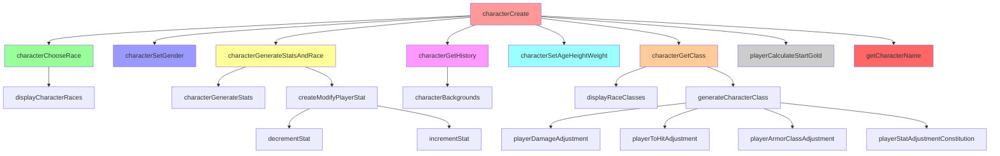
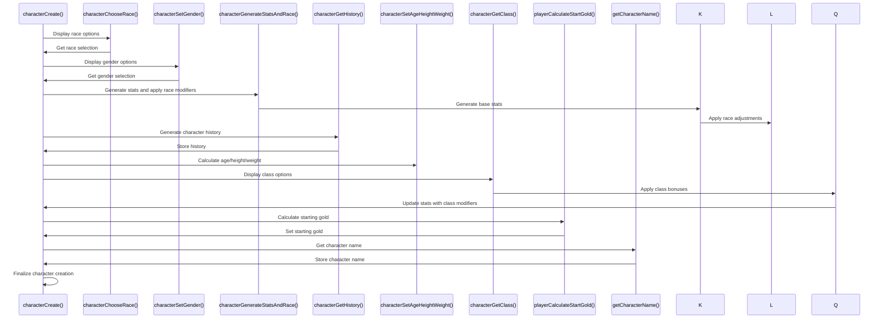

# Character C++ Module Documentation

## Introduction

The `character_cpp` module is responsible for creating and initializing player characters in the game. It handles the generation of character statistics, selection of race and class, determination of character history, and calculation of starting gold. This module works closely with the game's core systems to ensure proper character creation according to game rules and mechanics.

## Module Overview

This module contains functions for:
- Generating random character statistics
- Handling race selection and racial adjustments
- Managing character history generation
- Processing gender selection
- Calculating age, height, and weight
- Selecting character class and applying class bonuses
- Determining starting gold amount
- Displaying character information during creation

## Architecture and Component Relationships

## Data Flow and Process Flow

## Key Functions and Their Purpose

### Character Creation Process

The main function `characterCreate()` orchestrates the entire character creation process:

1. **Race Selection**: `characterChooseRace()` displays available races and handles user input
2. **Gender Selection**: `characterSetGender()` allows player to choose gender
3. **Stat Generation**: `characterGenerateStatsAndRace()` creates base stats and applies racial modifiers
4. **History Generation**: `characterGetHistory()` builds character background story
5. **Physical Attributes**: `characterSetAgeHeightWeight()` calculates age, height, and weight
6. **Class Selection**: `characterGetClass()` lets player choose a class and applies bonuses
7. **Starting Gold**: `playerCalculateStartGold()` determines initial gold amount
8. **Finalization**: `getCharacterName()` gets the character's name

### Stat Generation and Modification

The module implements sophisticated stat generation with the following functions:

- `characterGenerateStats()`: Generates 18 dice rolls and creates 6 ability scores
- `createModifyPlayerStat()`: Applies racial adjustments to stats
- `incrementStat()` and `decrementStat()`: Handle stat modifications with complex logic

### Race and Class Integration

The module integrates with external data structures:
- `character_races[]`: Array of race definitions with stat modifiers
- `classes[]`: Array of class definitions with bonuses
- `character_backgrounds[]`: Data for generating character histories

## Dependencies

This module depends on several other modules and systems:

- [headers.h](headers.md): Contains global includes and definitions
- [player.h](player.md): Player-related functions and data structures
- [random.h](random.md): Random number generation utilities
- [input.h](input.md): Input handling functions
- [display.h](display.md): Screen display functions
- [config.h](config.md): Configuration settings

## External Data Structures

The module relies on these external data structures:

- `character_races[]`: Defines available races with stat adjustments
- `character_backgrounds[]`: Contains historical background generation data
- `classes[]`: Defines available classes with bonuses and restrictions

## Implementation Details

### Stat Generation Algorithm

The stat generation uses a weighted dice rolling system where:
- 18 dice are rolled with increasing difficulty (3, 4, 5 dice)
- Total must be between 43 and 53
- Each ability score is calculated from three dice values

### Racial Adjustments

Each race provides specific stat adjustments through:
- `str_adjustment`, `int_adjustment`, etc.
- Base attributes like `search_chance_base`, `base_to_hit`, etc.

### Class Bonuses

Classes provide bonuses to:
- Ability scores
- Hit points
- Combat abilities
- Saving throws
- Experience factors

### History Generation

Character history is generated through a chain-based system:
- Uses background charts with probability rolls
- Applies bonuses to social class
- Formats text into readable lines

## System Integration Points

This module interfaces with:
- Game initialization system
- Player data management
- Display subsystem for UI elements
- Input handling for user choices
- Random number generator for stats and history

## Error Handling and Validation

The module includes validation for:
- User input ranges (race/class selection)
- Stat boundaries (minimum/maximum values)
- History text formatting
- Character name validation

## Performance Considerations

The module is designed for:
- Efficient random number generation
- Minimal memory allocation
- Fast stat calculations
- Responsive user interface during character creation

## Future Extensibility

The modular design allows for:
- Easy addition of new races
- Simple integration of new classes
- Flexible history generation system
- Customizable stat modification rules
