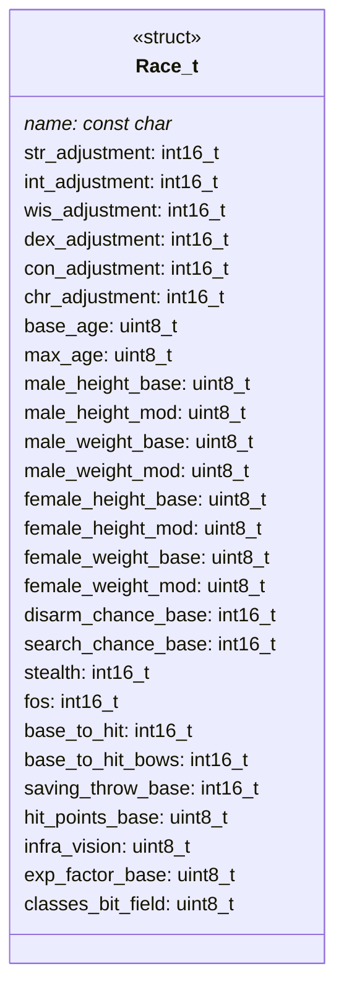
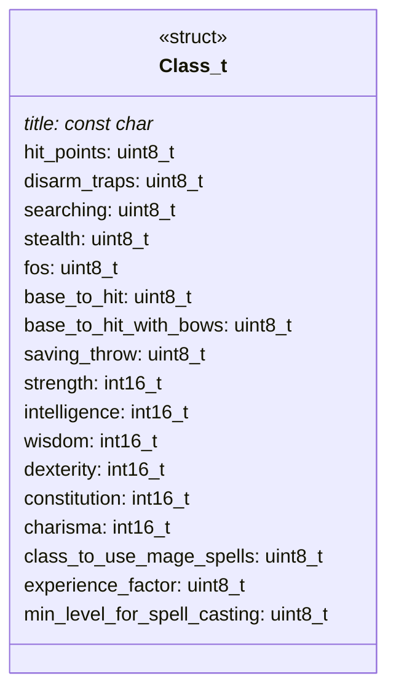
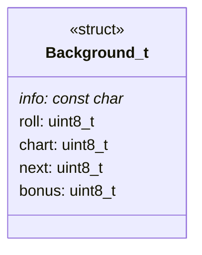
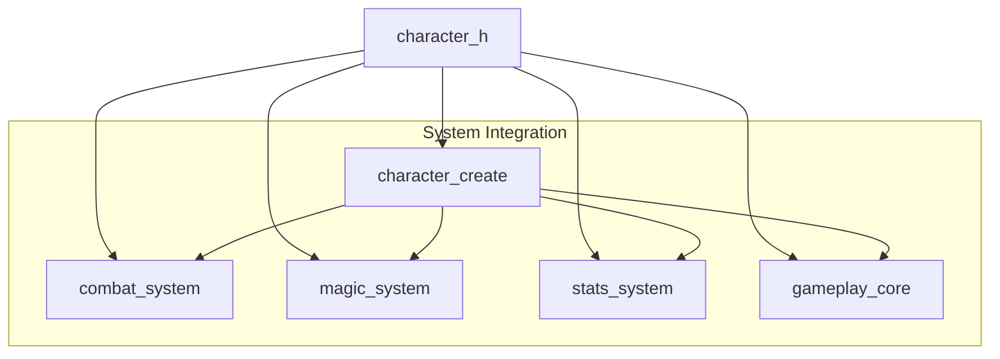
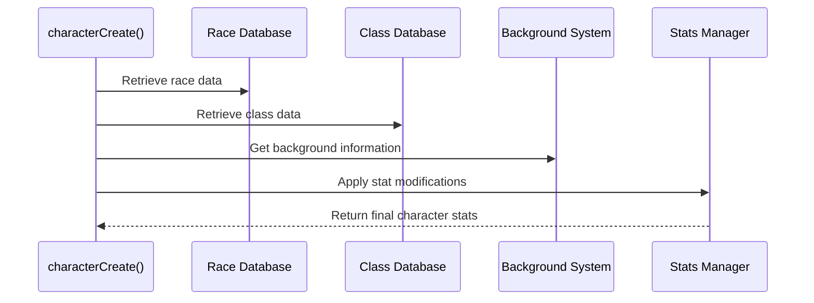

# Character Handling Module Documentation

## Introduction

The `character_h` module provides the foundational data structures and functions for character management in the game system. This module defines the core character attributes, race characteristics, class specifications, and background information that are essential for character creation and gameplay mechanics. It serves as a critical component that interfaces with various subsystems including combat, magic, and character progression systems.

## Core Data Structures

### Race Structure (Race_t)
The `Race_t` structure defines all racial characteristics that affect character stats and abilities:

### Class Structure (Class_t)
The `Class_t` structure contains class-specific attributes and modifiers:

### Background Structure (Background_t)
The `Background_t` structure handles character background information used in character generation:

## Module Architecture

The character_h module integrates with several other system components:

## Functionality Overview

### Character Creation Function
The primary function in this module is `characterCreate()`, which initializes character parameters based on race, class, and background selections. This function coordinates with other modules to ensure proper character initialization.

## Data Flow

## Component Interactions

The character_h module interacts with several other modules:

1. **Stats Management** ([stats.md](stats.md)): Processes racial and class stat adjustments
2. **Combat System** ([combat.md](combat.md)): Uses base to hit values and saving throws
3. **Magic System** ([magic.md](magic.md)): Accesses spell casting requirements and experience factors
4. **Gameplay Core** ([gameplay.md](gameplay.md)): Integrates with main game loop and character progression

## Implementation Details

The module uses fixed-size integer types to ensure consistent memory usage across different platforms. All string pointers are declared as `const char*` to prevent accidental modification of static strings.

## Dependencies

This module depends on:
- Standard C library headers for basic data types
- Memory management functions for dynamic allocation if needed
- Game state management for accessing current character data

## Usage Patterns

The typical usage pattern involves:
1. Loading race, class, and background data from configuration files
2. Calling `characterCreate()` to initialize a new character
3. Using the returned character data in gameplay calculations
4. Updating character statistics during gameplay events

## Related Modules

For complete character management, see:
- [stats.md](stats.md) - Statistical processing and calculation
- [combat.md](combat.md) - Combat-related character attributes
- [magic.md](magic.md) - Spellcasting and magical abilities
- [gameplay.md](gameplay.md) - Core gameplay integration

## Performance Considerations

The module is designed for minimal overhead with fixed-size structures that allow efficient memory access. All operations should be fast enough for real-time gameplay without significant performance impact.

## Future Extensibility

The modular design allows for easy extension of character attributes while maintaining backward compatibility with existing character data structures. New fields can be added to the structures without breaking existing functionality.
