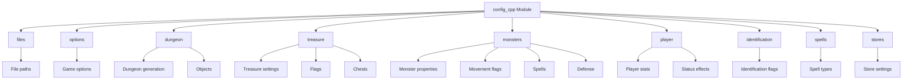

# config_cpp Module Documentation

## Introduction

The `config_cpp` module serves as the central configuration repository for the game, defining constants and settings that control various aspects of gameplay behavior, dungeon generation parameters, monster properties, player characteristics, and other system-wide configurations. This module provides a structured approach to managing game constants through organized namespaces, making it easier to maintain and modify game behavior without scattered magic numbers throughout the codebase.

## Architecture Overview



## Detailed Component Documentation

### Files Namespace (`config::files`)
This namespace contains all file path constants used by the game for loading various text files and data.

```mermaid
graph LR
    subgraph Files
        A[splash_screen] -->|"data/splash.txt"|
        B[welcome_screen] -->|"data/welcome.txt"|
        C[license] -->|"LICENSE"|
        D[versions_history] -->|"data/versions.txt"|
        E[help] -->|"data/help.txt"|
        F[help_wizard] -->|"data/help_wizard.txt"|
        G[help_roguelike] -->|"data/rl_help.txt"|
        H[help_roguelike_wizard] -->|"data/rl_help_wizard.txt"|
        I[death_tomb] -->|"data/death_tomb.txt"|
        J[death_royal] -->|"data/death_royal.txt"|
        K[scores] -->|"scores.dat"|
        L[save_game] -->|"game.sav"|
    end
```

### Options Namespace (`config::options`)
Contains boolean flags that control various game behaviors and user interface options.

```mermaid
graph LR
    subgraph Options
        A[display_counts] -->|bool|
        B[find_bound] -->|bool|
        C[run_cut_corners] -->|bool|
        D[run_examine_corners] -->|bool|
        E[run_ignore_doors] -->|bool|
        F[run_print_self] -->|bool|
        G[highlight_seams] -->|bool|
        H[prompt_to_pickup] -->|bool|
        I[use_roguelike_keys] -->|bool|
        J[show_inventory_weights] -->|bool|
        K[error_beep_sound] -->|bool|
    end
```

### Dungeon Namespace (`config::dungeon`)
Controls dungeon generation parameters and object definitions.

```mermaid
graph LR
    subgraph Dungeon
        A[DUN_RANDOM_DIR] -->|uint8_t|
        B[DUN_DIR_CHANGE] -->|uint8_t|
        C[DUN_TUNNELING] -->|uint8_t|
        D[DUN_ROOMS_MEAN] -->|uint8_t|
        E[DUN_ROOM_DOORS] -->|uint8_t|
        F[DUN_TUNNEL_DOORS] -->|uint8_t|
        G[DUN_STREAMER_DENSITY] -->|uint8_t|
        H[DUN_STREAMER_WIDTH] -->|uint8_t|
        I[DUN_MAGMA_STREAMER] -->|uint8_t|
        J[DUN_MAGMA_TREASURE] -->|uint8_t|
        K[DUN_QUARTZ_STREAMER] -->|uint8_t|
        L[DUN_QUARTZ_TREASURE] -->|uint8_t|
        M[DUN_UNUSUAL_ROOMS] -->|uint16_t|

        subgraph Objects
            N[OBJ_OPEN_DOOR] -->|uint16_t|
            O[OBJ_CLOSED_DOOR] -->|uint16_t|
            P[OBJ_SECRET_DOOR] -->|uint16_t|
            Q[OBJ_UP_STAIR] -->|uint16_t|
            R[OBJ_DOWN_STAIR] -->|uint16_t|
            S[OBJ_STORE_DOOR] -->|uint16_t|
            T[OBJ_TRAP_LIST] -->|uint16_t|
            U[OBJ_RUBBLE] -->|uint16_t|
            V[OBJ_MUSH] -->|uint16_t|
            W[OBJ_SCARE_MON] -->|uint16_t|
            X[OBJ_GOLD_LIST] -->|uint16_t|
            Y[OBJ_NOTHING] -->|uint16_t|
            Z[OBJ_RUINED_CHEST] -->|uint16_t|
            AA[OBJ_WIZARD] -->|uint16_t|

            AB[MAX_GOLD_TYPES] -->|uint8_t|
            AC[MAX_TRAPS] -->|uint8_t|
            AD[LEVEL_OBJECTS_PER_ROOM] -->|uint8_t|
            AE[LEVEL_OBJECTS_PER_CORRIDOR] -->|uint8_t|
            AF[LEVEL_TOTAL_GOLD_AND_GEMS] -->|uint8_t|
        end
    end
```

### Treasure Namespace (`config::treasure`)
Defines treasure generation rules and item properties.

```mermaid
graph LR
    subgraph Treasure
        A[MIN_TREASURE_LIST_ID] -->|uint8_t|
        B[TREASURE_CHANCE_OF_GREAT_ITEM] -->|uint8_t|
        C[LEVEL_STD_OBJECT_ADJUST] -->|uint8_t|
        D[LEVEL_MIN_OBJECT_STD] -->|uint8_t|
        E[LEVEL_TOWN_OBJECTS] -->|uint8_t|
        F[OBJECT_BASE_MAGIC] -->|uint8_t|
        G[OBJECT_MAX_BASE_MAGIC] -->|uint8_t|
        H[OBJECT_CHANCE_SPECIAL] -->|uint8_t|
        I[OBJECT_CHANCE_CURSED] -->|uint8_t|
        J[OBJECT_LAMP_MAX_CAPACITY] -->|uint16_t|
        K[OBJECT_BOLTS_MAX_RANGE] -->|uint8_t|
        L[OBJECTS_RUNE_PROTECTION] -->|uint16_t|

        subgraph Flags
            M[TR_STATS] -->|uint32_t|
            N[TR_STR] -->|uint32_t|
            O[TR_INT] -->|uint32_t|
            P[TR_WIS] -->|uint32_t|
            Q[TR_DEX] -->|uint32_t|
            R[TR_CON] -->|uint32_t|
            S[TR_CHR] -->|uint32_t|
            T[TR_SEARCH] -->|uint32_t|
            U[TR_SLOW_DIGEST] -->|uint32_t|
            V[TR_STEALTH] -->|uint32_t|
            W[TR_AGGRAVATE] -->|uint32_t|
            X[TR_TELEPORT] -->|uint32_t|
            Y[TR_REGEN] -->|uint32_t|
            Z[TR_SPEED] -->|uint32_t|
            AA[TR_EGO_WEAPON] -->|uint32_t|
            AB[TR_SLAY_DRAGON] -->|uint32_t|
            AC[TR_SLAY_ANIMAL] -->|uint32_t|
            AD[TR_SLAY_EVIL] -->|uint32_t|
            AE[TR_SLAY_UNDEAD] -->|uint32_t|
            AF[FROST_BRAND] -->|uint32_t|
            AG[FLAME_TONGUE] -->|uint32_t|
            AH[TR_RES_FIRE] -->|uint32_t|
            AI[TR_RES_ACID] -->|uint32_t|
            AJ[TR_RES_COLD] -->|uint32_t|
            AK[TR_SUST_STAT] -->|uint32_t|
            AL[TR_FREE_ACT] -->|uint32_t|
            AM[TR_SEE_INVIS] -->|uint32_t|
            AN[TR_RES_LIGHT] -->|uint32_t|
            AO[TR_FFALL] -->|uint32_t|
            AP[TR_BLIND] -->|uint32_t|
            AQ[TR_TIMID] -->|uint32_t|
            AR[TR_TUNNEL] -->|uint32_t|
            AS[TR_INFRA] -->|uint32_t|
            AT[TR_CURSED] -->|uint32_t|
        end

        subgraph Chests
            AU[CH_LOCKED] -->|uint32_t|
            AV[CH_TRAPPED] -->|uint32_t|
            AW[CH_LOSE_STR] -->|uint32_t|
            AX[CH_POISON] -->|uint32_t|
            AY[CH_PARALYSED] -->|uint32_t|
            AZ[CH_EXPLODE] -->|uint32_t|
            BA[CH_SUMMON] -->|uint32_t|
        end
    end
```

### Monsters Namespace (`config::monsters`)
Controls monster behavior, spawning, and combat properties.

```mermaid
graph LR
    subgraph Monsters
        A[MON_CHANCE_OF_NEW] -->|uint8_t|
        B[MON_MAX_SIGHT] -->|uint8_t|
        C[MON_MAX_SPELL_CAST_DISTANCE] -->|uint8_t|
        D[MON_MAX_MULTIPLY_PER_LEVEL] -->|uint8_t|
        E[MON_MULTIPLY_ADJUST] -->|uint8_t|
        F[MON_CHANCE_OF_NASTY] -->|uint8_t|
        G[MON_MIN_PER_LEVEL] -->|uint8_t|
        H[MON_MIN_TOWNSFOLK_DAY] -->|uint8_t|
        I[MON_MIN_TOWNSFOLK_NIGHT] -->|uint8_t|
        J[MON_ENDGAME_MONSTERS] -->|uint8_t|
        K[MON_ENDGAME_LEVEL] -->|uint8_t|
        L[MON_SUMMONED_LEVEL_ADJUST] -->|uint8_t|
        M[MON_PLAYER_EXP_DRAINED_PER_HIT] -->|uint8_t|
        N[MON_MIN_INDEX_ID] -->|uint8_t|
        O[SCARE_MONSTER] -->|uint8_t|

        subgraph Move
            P[CM_ALL_MV_FLAGS] -->|uint32_t|
            Q[CM_ATTACK_ONLY] -->|uint32_t|
            R[CM_MOVE_NORMAL] -->|uint32_t|
            S[CM_ONLY_MAGIC] -->|uint32_t|
            T[CM_RANDOM_MOVE] -->|uint32_t|
            U[CM_20_RANDOM] -->|uint32_t|
            V[CM_40_RANDOM] -->|uint32_t|
            W[CM_75_RANDOM] -->|uint32_t|
            X[CM_SPECIAL] -->|uint32_t|
            Y[CM_INVISIBLE] -->|uint32_t|
            Z[CM_OPEN_DOOR] -->|uint32_t|
            AA[CM_PHASE] -->|uint32_t|
            AB[CM_EATS_OTHER] -->|uint32_t|
            AC[CM_PICKS_UP] -->|uint32_t|
            AD[CM_MULTIPLY] -->|uint32_t|
            AE[CM_SMALL_OBJ] -->|uint32_t|
            AF[CM_CARRY_OBJ] -->|uint32_t|
            AG[CM_CARRY_GOLD] -->|uint32_t|
            AH[CM_TREASURE] -->|uint32_t|
            AI[CM_TR_SHIFT] -->|uint32_t|
            AJ[CM_60_RANDOM] -->|uint32_t|
            AK[CM_90_RANDOM] -->|uint32_t|
            AL[CM_1D2_OBJ] -->|uint32_t|
            AM[CM_2D2_OBJ] -->|uint32_t|
            AN[CM_4D2_OBJ] -->|uint32_t|
            AO[CM_WIN] -->|uint32_t|
        end

        subgraph Spells
            AP[CS_FREQ] -->|uint32_t|
            AQ[CS_SPELLS] -->|uint32_t|
            AR[CS_TEL_SHORT] -->|uint32_t|
            AS[CS_TEL_LONG] -->|uint32_t|
            AT[CS_TEL_TO] -->|uint32_t|
            AU[CS_LGHT_WND] -->|uint32_t|
            AV[CS_SER_WND] -->|uint32_t|
            AW[CS_HOLD_PER] -->|uint32_t|
            AX[CS_BLIND] -->|uint32_t|
            AY[CS_CONFUSE] -->|uint32_t|
            AZ[CS_FEAR] -->|uint32_t|
            BA[CS_SUMMON_MON] -->|uint32_t|
            BB[CS_SUMMON_UND] -->|uint32_t|
            BC[CS_SLOW_PER] -->|uint32_t|
            BD[CS_DRAIN_MANA] -->|uint32_t|
            BE[CS_BREATHE] -->|uint32_t|
            BF[CS_BR_LIGHT] -->|uint32_t|
            BG[CS_BR_GAS] -->|uint32_t|
            BH[CS_BR_ACID] -->|uint32_t|
            BI[CS_BR_FROST] -->|uint32_t|
            BJ[CS_BR_FIRE] -->|uint32_t|
        end

        subgraph Defense
            BK[CD_DRAGON] -->|uint16_t|
            BL[CD_ANIMAL] -->|uint16_t|
            BM[CD_EVIL] -->|uint16_t|
            BN[CD_UNDEAD] -->|uint16_t|
            BO[CD_WEAKNESS] -->|uint16_t|
            BP[CD_FROST] -->|uint16_t|
            BQ[CD_FIRE] -->|uint16_t|
            BR[CD_POISON] -->|uint16_t|
            BS[CD_ACID] -->|uint16_t|
            BT[CD_LIGHT] -->|uint16_t|
            BU[CD_STONE] -->|uint16_t|
            BV[CD_NO_SLEEP] -->|uint16_t|
            BW[CD_INFRA] -->|uint16_t|
            BX[CD_MAX_HP] -->|uint16_t|
        end
    end
```

### Player Namespace (`config::player`)
Defines player character attributes, status effects, and gameplay mechanics.

```mermaid
graph LR
    subgraph Player
        A[PLAYER_MAX_EXP] -->|int32_t|
        B[PLAYER_USE_DEVICE_DIFFICULTY] -->|uint8_t|
        C[PLAYER_FOOD_FULL] -->|uint16_t|
        D[PLAYER_FOOD_MAX] -->|uint16_t|
        E[PLAYER_FOOD_FAINT] -->|uint16_t|
        F[PLAYER_FOOD_WEAK] -->|uint16_t|
        G[PLAYER_FOOD_ALERT] -->|uint16_t|
        H[PLAYER_REGEN_FAINT] -->|uint8_t|
        I[PLAYER_REGEN_WEAK] -->|uint8_t|
        J[PLAYER_REGEN_NORMAL] -->|uint8_t|
        K[PLAYER_REGEN_HPBASE] -->|uint16_t|
        L[PLAYER_REGEN_MNBASE] -->|uint16_t|
        M[PLAYER_WEIGHT_CAP] -->|uint8_t|

        subgraph Status
            N[PY_HUNGRY] -->|uint32_t|
            O[PY_WEAK] -->|uint32_t|
            P[PY_BLIND] -->|uint32_t|
            Q[PY_CONFUSED] -->|uint32_t|
            R[PY_FEAR] -->|uint32_t|
            S[PY_POISONED] -->|uint32_t|
            T[PY_FAST] -->|uint32_t|
            U[PY_SLOW] -->|uint32_t|
            V[PY_SEARCH] -->|uint32_t|
            W[PY_REST] -->|uint32_t|
            X[PY_STUDY] -->|uint32_t|
            Y[PY_INVULN] -->|uint32_t|
            Z[PY_HERO] -->|uint32_t|
            AA[PY_SHERO] -->|uint32_t|
            AB[PY_BLESSED] -->|uint32_t|
            AC[PY_DET_INV] -->|uint32_t|
            AD[PY_TIM_INFRA] -->|uint32_t|
            AE[PY_SPEED] -->|uint32_t|
            AF[PY_STR_WGT] -->|uint32_t|
            AG[PY_PARALYSED] -->|uint32_t|
            AH[PY_REPEAT] -->|uint32_t|
            AI[PY_ARMOR] -->|uint32_t|
            AJ[PY_STATS] -->|uint32_t|
            AK[PY_STR] -->|uint32_t|
            AL[PY_INT] -->|uint32_t|
            AM[PY_WIS] -->|uint32_t|
            AN[PY_DEX] -->|uint32_t|
            AO[PY_CON] -->|uint32_t|
            AP[PY_CHR] -->|uint32_t|
            AQ[PY_HP] -->|uint32_t|
            AR[PY_MANA] -->|uint32_t|
        end
    end
```

### Identification Namespace (`config::identification`)
Controls item identification and knowledge tracking systems.

```mermaid
graph LR
    subgraph Identification
        A[OD_TRIED] -->|uint8_t|
        B[OD_KNOWN1] -->|uint8_t|
        C[ID_MAGIK] -->|uint8_t|
        D[ID_DAMD] -->|uint8_t|
        E[ID_EMPTY] -->|uint8_t|
        F[ID_KNOWN2] -->|uint8_t|
        G[ID_STORE_BOUGHT] -->|uint8_t|
        H[ID_SHOW_HIT_DAM] -->|uint8_t|
        I[ID_NO_SHOW_P1] -->|uint8_t|
        J[ID_SHOW_P1] -->|uint8_t|
    end
```

### Spells Namespace (`config::spells`)
Defines spell-related constants and classifications.

```mermaid
graph LR
    subgraph Spells
        A[SPELL_TYPE_NONE] -->|uint8_t|
        B[SPELL_TYPE_MAGE] -->|uint8_t|
        C[SPELL_TYPE_PRIEST] -->|uint8_t|
        D[NAME_OFFSET_SPELLS] -->|uint8_t|
        E[NAME_OFFSET_PRAYERS] -->|uint8_t|
    end
```

### Stores Namespace (`config::stores`)
Controls store-related game mechanics and inventory management.

```mermaid
graph LR
    subgraph Stores
        A[STORE_MAX_AUTO_BUY_ITEMS] -->|uint8_t|
        B[STORE_MIN_AUTO_SELL_ITEMS] -->|uint8_t|
        C[STORE_STOCK_TURN_AROUND] -->|uint8_t|
    end
```

## Integration and Dependencies

The `config_cpp` module is designed to be included by other modules throughout the game system. It provides constants that are referenced by:

- [game_logic](game_logic.md) - For dungeon generation and monster behavior
- [player_system](player_system.md) - For player statistics and status effects
- [inventory_system](inventory_system.md) - For item identification and treasure rules
- [combat_system](combat_system.md) - For monster and player combat properties
- [ui_system](ui_system.md) - For game options and UI behavior

## Usage Guidelines

1. **Namespace Organization**: All constants are grouped into logical namespaces to prevent naming conflicts and improve readability
2. **Type Safety**: Use appropriate integer types (uint8_t, uint16_t, etc.) to ensure consistent memory usage
3. **Consistent Naming**: Follow established naming conventions for clarity and maintainability
4. **Documentation**: Each constant should have clear comments explaining its purpose and usage

## Maintenance Considerations

When modifying this module:
1. Ensure backward compatibility where possible
2. Update related documentation in dependent modules
3. Test thoroughly to verify that changes don't break existing functionality
4. Consider performance implications of large constant changes
5. Maintain consistency with existing naming and organizational patterns

This module serves as a single source of truth for game configuration values, making it essential for maintaining consistent gameplay behavior across all system components.
