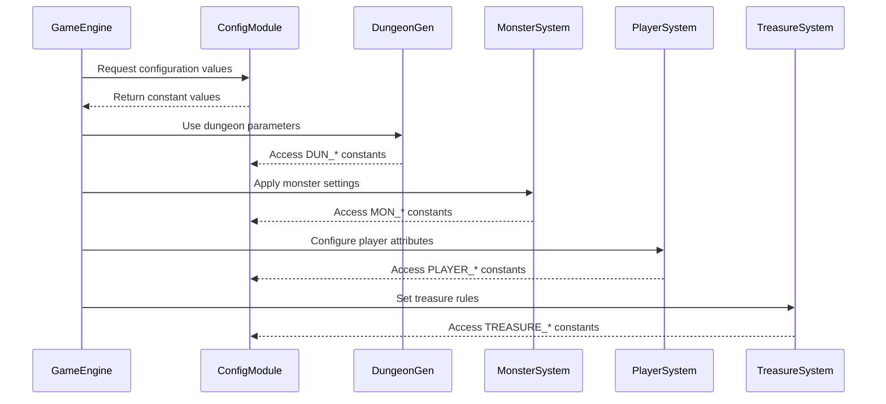

# config_h Module Documentation

## Brief Introduction

The `config_h` module serves as the central configuration repository for the game system, defining constants and parameters that control various aspects of gameplay behavior, dungeon generation, monster properties, player attributes, and more. This module provides a structured approach to managing game configuration values through namespaces and constants, ensuring consistency across different parts of the application.

## Module Architecture


## Component Interactions

### Configuration Data Flow



## Integration Points

This module integrates with several other system components:

- **[dungeon_gen](dungeon_gen.md)** - Uses dungeon generation constants for room creation and tunneling algorithms
- **[monster_system](monster_system.md)** - Relies on monster behavior and combat parameters
- **[player_system](player_system.md)** - Provides player attribute and status definitions
- **[treasure_system](treasure_system.md)** - Accesses treasure distribution and object properties
- **[ui_system](ui_system.md)** - Uses file path constants for UI elements like splash screens and help files

## Key Design Principles

1. **Namespace Organization**: Constants are grouped logically within namespaces to improve maintainability
2. **Type Safety**: All constants use appropriate integer types (uint8_t, uint16_t) for memory efficiency
3. **Readability**: Meaningful constant names provide clear semantic meaning
4. **Centralized Management**: All game configuration values are defined in one location for easy modification

## Usage Examples

The configuration constants are typically accessed directly by other modules:

```cpp
// Example usage in dungeon generation
if (dungeon_param == config::dungeon::DUN_RANDOM_DIR) {
    // Handle random direction logic
}

// Example usage in monster behavior
if (monster_flags & config::monsters::move::CM_INVISIBLE) {
    // Process invisible monster behavior
}
```

## Dependencies

This module has no external dependencies but is referenced by multiple other modules including:
- [dungeon_gen](dungeon_gen.md)
- [monster_system](monster_system.md)
- [player_system](player_system.md)
- [treasure_system](treasure_system.md)
- [ui_system](ui_system.md)

## Maintenance Notes

When modifying configuration values:
1. Ensure type compatibility with existing code
2. Update related documentation if constants have semantic changes
3. Verify that dependent systems still function correctly
4. Consider impact on game balance and difficulty levels
