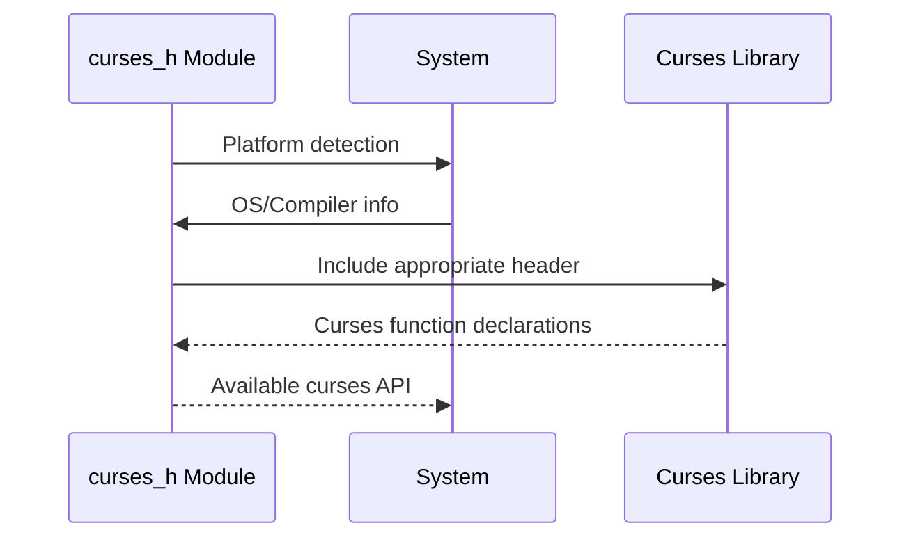

# curses_h Module Documentation

## Brief Introduction

The `curses_h` module provides platform-specific header file inclusion for terminal-based user interfaces. This module handles the complexity of including the appropriate curses library headers across different operating systems and compilers, ensuring consistent access to terminal control functions regardless of the underlying system.

## Detailed Documentation

This module serves as a cross-platform abstraction layer for including curses-related header files. It automatically detects the target platform and includes the correct curses implementation header based on system characteristics.

### Architecture Overview

```mermaid
graph TD
    A[curses_h Module] --> B{Platform Detection}
    B --> C[Windows (_WIN32)]
    B --> D[NetBSD (__NetBSD__)]
    B --> E[Other Systems]
    
    C --> F[MSVC Compiler]
    C --> G[Non-MSVC Compiler]
    
    F --> H[#include <curses.h>]
    G --> I[#include <ncurses/ncurses.h>]
    
    D --> J[#include <curses.h>]
    E --> K[#include <ncurses.h>]
    
    H --> L[Curses API Headers]
    I --> L
    J --> L
    K --> L
```

### Component Relationships

The `curses_h` module acts as a conditional include wrapper that routes to the appropriate curses implementation:

- **Windows Systems**: Uses either native Windows curses or ncurses depending on compiler type
- **NetBSD Systems**: Uses standard curses implementation  
- **Other Systems**: Uses ncurses library

### System Integration

This module integrates with the broader system by providing a unified interface for curses functionality. It works alongside other modules that require terminal manipulation capabilities such as:

- [terminal_interface](terminal_interface.md) - For terminal input/output operations
- [ui_components](ui_components.md) - For user interface rendering
- [input_handling](input_handling.md) - For keyboard and mouse event processing

### Data Flow



### Process Flow

The module follows a simple conditional compilation process:

1. **Platform Detection**: Checks for `_WIN32`, `__NetBSD__`, or other platforms
2. **Compiler Detection** (Windows only): Differentiates between MSVC and other compilers
3. **Header Inclusion**: Includes the appropriate curses header based on detection results
4. **API Exposure**: Makes curses functions available to dependent modules

### Dependencies

This module depends on:
- System-specific curses libraries (ncurses, Windows curses)
- Compiler-specific headers and definitions
- Operating system runtime environment

### Usage Considerations

When using this module, developers should be aware that:
- The actual curses implementation varies by platform
- Function signatures and behavior may differ slightly between implementations
- All curses-related functionality should be accessed through this module to ensure portability
- The module should be included before any other curses-dependent headers

### Configuration Options

The module supports multiple configuration paths:
- Windows with MSVC compiler: Uses native Windows curses
- Windows with non-MSVC: Uses ncurses from `ncurses/ncurses.h`
- NetBSD: Uses standard curses implementation
- Other Unix-like systems: Uses standard ncurses library

This design ensures maximum compatibility while maintaining performance characteristics specific to each platform.
