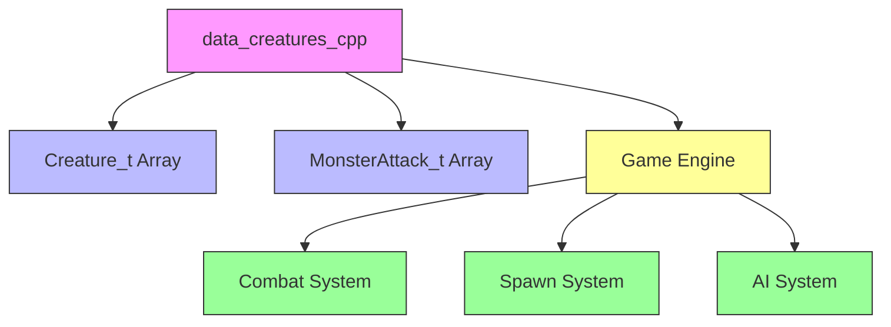
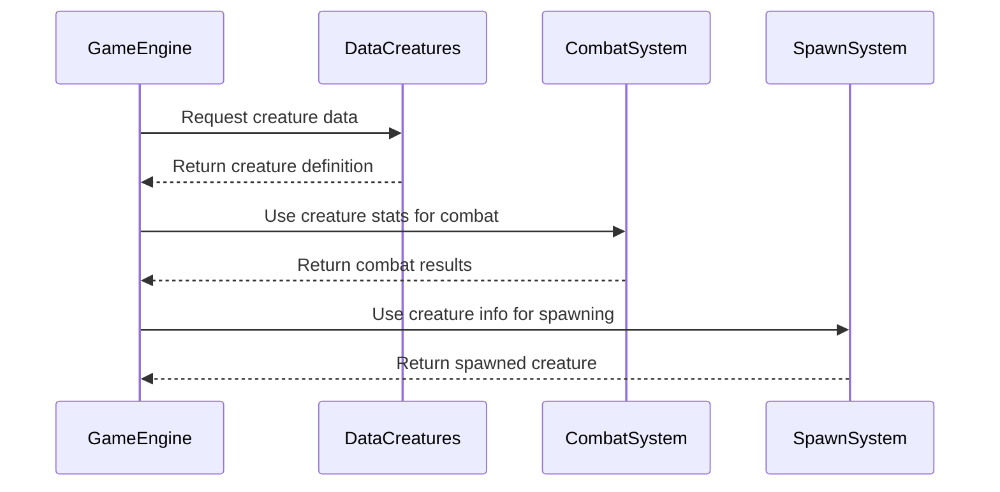

# data_creatures_cpp Module Documentation

## Introduction

The `data_creatures_cpp` module serves as the primary data repository for creature definitions within the game system. This module contains the fundamental creature data structures and initialization arrays that define all monsters, creatures, and entities that populate the game world. It provides the core creature database that is referenced throughout the game engine for combat, spawning, and gameplay mechanics.

## Module Overview

This module implements the core creature data structures and initializes the global creature list array that contains all creature definitions in the game. The module is responsible for maintaining the static creature database that powers the game's monster system.

### Key Components

- **Creature_t Array**: Main storage for all creature definitions
- **MonsterAttack_t Array**: Attack pattern definitions for creatures
- **Global Data Structures**: Static arrays accessible throughout the system

## Architecture and Relationships



## Data Structures

### Creature_t Structure

The `Creature_t` structure defines the properties of each creature in the game:

```cpp
struct Creature_t {
    char name[32];              // Creature name
    uint32_t flags;             // Behavior and status flags
    uint32_t special_flags;     // Special abilities and conditions
    uint16_t sprite_id;         // Visual representation ID
    int8_t level;               // Creature level
    int16_t hp;                 // Hit points
    int8_t armor_class;         // Defense rating
    int16_t strength;           // Physical strength
    int8_t intelligence;        // Mental capacity
    char symbol;                // Display character
    int16_t damage_range[2];    // Damage range (min, max)
    int16_t color[4];           // Color attributes
    int8_t type;                // Creature type classification
};
```

### MonsterAttack_t Structure

The `MonsterAttack_t` structure defines attack patterns and behaviors:

```cpp
struct MonsterAttack_t {
    int8_t attack_type;         // Type of attack
    int8_t attack_power;        // Power level of attack
    int16_t damage_range[2];    // Damage range for this attack
};
```

## Data Flow and Usage



## Component Interactions

### Core Data Initialization

The module initializes two critical global arrays:

1. **creatures_list**: Contains all creature definitions with their properties
2. **monster_attacks**: Defines attack patterns and behaviors

These arrays are accessed by various subsystems including:
- Combat system for battle calculations
- Spawn system for entity creation
- AI system for behavior decisions
- Rendering system for visual display

### Data Dependencies

The `data_creatures_cpp` module depends on:
- [headers.h](headers.md) - Provides necessary type definitions and constants
- [game_engine](game_engine.md) - Core game logic that uses creature data
- [combat_system](combat_system.md) - Uses creature stats for battles
- [spawn_system](spawn_system.md) - Uses creature definitions for generation

## Implementation Details

### Global Variables

```cpp
Creature_t creatures_list[MON_MAX_CREATURES];
MonsterAttack_t monster_attacks[MON_ATTACK_TYPES];
```

### Constants Used

The module references several key constants defined elsewhere:
- `MON_MAX_CREATURES`: Maximum number of creatures in the database
- `MON_ATTACK_TYPES`: Number of attack types available

### Data Organization

The creature data is organized hierarchically:
1. **Basic Properties**: Name, sprite, symbol, type
2. **Statistical Data**: HP, armor, strength, intelligence
3. **Behavioral Flags**: Special abilities and status conditions
4. **Visual Attributes**: Color codes and display characteristics
5. **Combat Information**: Damage ranges and attack patterns

## Integration Points

### External Systems Using This Data

1. **Combat System**: Accesses creature stats for battle calculations
2. **Spawn System**: Uses creature definitions for entity generation
3. **Save/Load System**: Serializes creature states
4. **AI System**: Makes decisions based on creature properties
5. **User Interface**: Displays creature information to players

### Data Access Patterns

The module follows these access patterns:
- **Read-only access** for most systems
- **Index-based lookup** using creature IDs
- **Range-based iteration** for processing creature groups
- **Conditional filtering** based on creature types or levels

## Performance Considerations

### Memory Layout

The module uses contiguous memory allocation for optimal cache performance:
- Creatures stored in single large array
- Fixed-size structures for predictable memory usage
- Sequential access patterns for better cache locality

### Access Optimization

- Direct index-based access for creature retrieval
- Pre-computed attack patterns for fast lookup
- Minimal dynamic allocation required

## Maintenance Notes

### Adding New Creatures

To add new creatures:
1. Add entry to `creatures_list` array
2. Ensure proper initialization of all fields
3. Update `MON_MAX_CREATURES` if needed
4. Consider attack patterns in `monster_attacks`

### Updating Existing Creatures

When modifying existing creatures:
1. Maintain field order consistency
2. Preserve backward compatibility where possible
3. Update related documentation
4. Test all dependent systems

## References

- [headers.h](headers.md) - Required header definitions
- [game_engine](game_engine.md) - Core game integration
- [combat_system](combat_system.md) - Combat mechanics implementation
- [spawn_system](spawn_system.md) - Entity spawning logic
- [monster_types](monster_types.md) - Creature type classifications

This module forms the foundation of the game's creature system and must be maintained carefully to ensure consistent gameplay behavior across all systems that depend on it.
