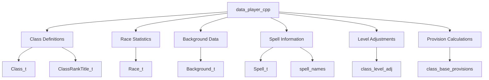
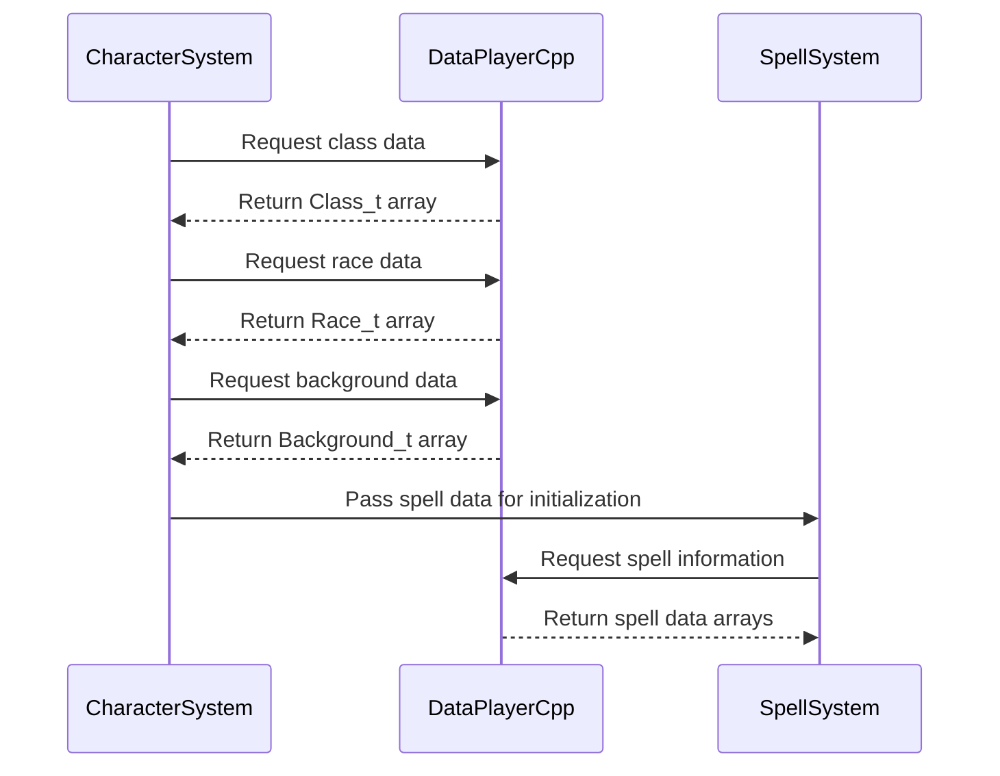

# data_player_cpp Module Documentation

## Overview

The `data_player_cpp` module serves as the core data repository for player-related information in the game system. This module contains essential static data structures that define character classes, races, backgrounds, and related attributes that govern player character creation and gameplay mechanics.

## Module Purpose

This module provides fundamental data definitions that support character generation, progression, and gameplay balance. It contains:

- Class definitions with stat modifiers and spell capabilities
- Race statistics and racial traits
- Background information for character storytelling
- Spell data and progression tables
- Class-specific level adjustments
- Provision calculations for different character types

## Architecture and Component Relationships

## Core Data Structures

### Class Definitions (`classes`, `class_rank_titles`)

The module defines six primary character classes with their associated attributes:

- **Warrior**: High physical stats, combat-focused
- **Mage**: Magical abilities, lower physical defense
- **Priest**: Healing and divine magic capabilities
- **Rogue**: Stealth and skill-based abilities
- **Ranger**: Nature-based skills and ranged combat
- **Paladin**: Balanced warrior-priest hybrid

Each class includes:
- Stat modifiers for various attributes
- Spell type classifications
- Base provisions and equipment values

### Race Statistics (`character_races`)

Eight distinct races with unique characteristics:

- Human: Balanced baseline stats
- Half-Elf: Mixed heritage with enhanced abilities
- Elf: Enhanced dexterity and magic capabilities
- Halfling: Small size with agility advantages
- Gnome: Intelligence and magical aptitude
- Dwarf: Strong constitution and mining skills
- Half-Orc: Combat prowess with reduced magic
- Half-Troll: Exceptional physical strength

Each race defines:
- Attribute bonuses/penalties
- Physical characteristics
- Special abilities and limitations

### Background Information (`character_backgrounds`)

Comprehensive background data for character storytelling, including:
- Family lineage and social status
- Cultural origins and heritage
- Character personality traits
- Physical descriptions and distinguishing features

### Spell Data (`magic_spells`, `spell_names`)

Spell progression systems organized by class:
- Mage spells with increasing power levels
- Priest spells focused on healing and protection
- Rogue spells emphasizing stealth and utility
- Ranger spells utilizing nature magic
- Paladin spells combining combat and healing

### Level Adjustments (`class_level_adj`)

Class-specific level adjustment multipliers that affect:
- Experience point requirements
- Stat progression rates
- Skill development curves

### Provision Calculations (`class_base_provisions`)

Base resource requirements for different character types:
- Food consumption rates
- Equipment costs
- Survival needs

## Integration with System Components

This module integrates with several other system components:

- [game_engine](game_engine.md): Provides core game loop and state management
- [character_system](character_system.md): Handles character creation and management
- [combat_system](combat_system.md): Uses class and race data for combat calculations
- [spell_system](spell_system.md): Accesses spell data for magical abilities
- [inventory_system](inventory_system.md): Utilizes provision data for resource management

## Data Flow and Usage Patterns

## Implementation Details

The module uses fixed-size arrays to ensure predictable memory usage and performance. All data is defined as static constants to prevent modification during runtime, maintaining game balance and consistency.

Key implementation considerations:
- Arrays use predefined maximum sizes to ensure compatibility
- Data structures follow consistent naming conventions
- Multi-dimensional arrays organize related data efficiently
- Constants are used for magic numbers throughout the data definitions

## Dependencies

This module has no external dependencies beyond standard C++ headers. It relies on configuration constants defined in the `config` namespace for spell type definitions.

## Maintenance Notes

When modifying this module:
1. Ensure all array sizes remain consistent with defined constants
2. Maintain backward compatibility with existing data structures
3. Verify spell progression and class balance after changes
4. Update any dependent systems that reference these data structures

## Related Modules

- [character_system](character_system.md): Primary consumer of player data
- [spell_system](spell_system.md): Uses spell data for magical abilities
- [combat_system](combat_system.md): Applies race and class data in combat scenarios
- [game_engine](game_engine.md): Integrates player data into game state management
