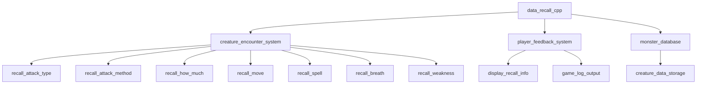

# data_recall_cpp Module Documentation

## Brief Introduction

The `data_recall_cpp` module serves as a data repository for creature recall descriptions in the game engine. This module contains predefined arrays of strings that describe various aspects of creature behaviors, attacks, spells, and weaknesses. These descriptions are used throughout the game to provide players with detailed information about monsters they encounter, enhancing the gaming experience through descriptive feedback.

## Module Overview

This module provides string constants that represent different aspects of creature behavior and abilities. The data is organized into several categories:

- Attack types and methods
- Damage intensity descriptions
- Movement capabilities
- Spell effects
- Breath weapon types
- Weaknesses

These arrays are designed to be referenced by other game systems that handle creature encounters and player feedback mechanisms.

## Architecture and Component Relationships

## Data Structure Details

### Attack Type Descriptions
The `recall_description_attack_type` array contains 25 different attack types that creatures can perform. These include both physical and magical attacks such as "attack", "weaken", "confuse", and "shoot flames".

### Attack Method Descriptions
The `recall_description_attack_method` array defines 20 different ways creatures can execute their attacks, ranging from basic actions like "hit" and "bite" to more complex behaviors like "gaze" and "slime you".

### Damage Intensity Descriptions
The `recall_description_how_much` array provides descriptors for how much damage or effect a creature's action has, including terms like "a bit", "quite", "very", and "extremely".

### Movement Capabilities
The `recall_description_move` array lists 6 different movement-related abilities creatures might possess, such as "move invisibly", "open doors", and "breed explosively".

### Spell Effect Descriptions
The `recall_description_spell` array contains 15 spell effects that creatures can cast, including teleportation, damage infliction, status effects, summoning, and mana draining.

### Breath Weapon Types
The `recall_description_breath` array defines 5 different breath weapon types: "lightning", "poison gases", "acid", "frost", and "fire".

### Weakness Descriptions
The `recall_description_weakness` array specifies 6 different creature weaknesses: "frost", "fire", "poison", "acid", "bright light", and "rock remover".

## Integration Points

This module integrates with several other systems in the game architecture:

- **Creature Encounter System**: Uses these descriptions when players encounter monsters to provide detailed information about their abilities
- **Player Feedback System**: Displays recall information to players during gameplay
- **Monster Database**: Serves as a reference for creature behavior definitions

## Usage Examples

The arrays in this module are typically accessed by other components through index-based lookups. For example, when a creature performs an attack, the system might select a random index from the attack type array to display a description to the player.

## Related Modules

For more information about how this data is used, see:
- [creature_encounter_system.md](creature_encounter_system.md)
- [player_feedback_system.md](player_feedback_system.md)
- [monster_database.md](monster_database.md)

## Implementation Notes

All data in this module is stored as constant character arrays, making them immutable after compilation. This design choice ensures data integrity and prevents accidental modification during runtime. The arrays are indexed sequentially, allowing for simple random selection or specific lookup operations.

The module follows a consistent naming convention where each array name clearly indicates its purpose and content category, making it easy for developers to understand and use the data appropriately.
