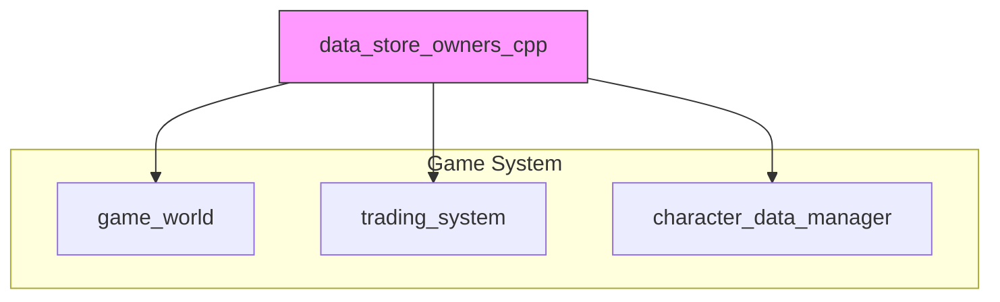
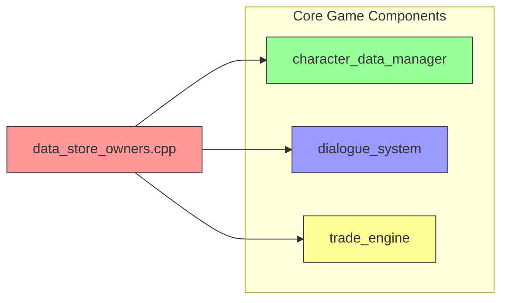
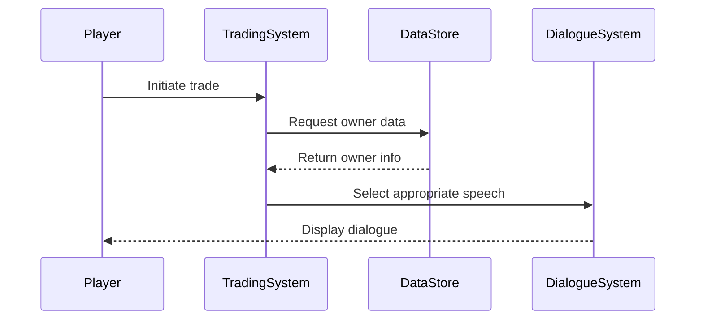

# data_store_owners_cpp Module Documentation

## Brief Introduction

The `data_store_owners_cpp` module serves as a data repository containing information about various store owners in the game world. This module provides essential character data including names, races, professions, and associated speech strings used during trading interactions. It forms part of the core game data management system and interfaces with the [game_world](game_world.md) and [trading_system](trading_system.md) modules to provide realistic NPC interactions.

## Module Architecture



## Core Data Structures

### Owner_t Structure
The primary data structure stores comprehensive information about each store owner:

```cpp
struct Owner_t {
    char name[50];           // Full name with race and profession
    int gold;                // Starting gold amount
    int x, y;                // Position coordinates
    int level;               // Character level
    int race;                // Race identifier
    int profession;          // Profession identifier
};
```

### Speech Arrays
The module contains multiple arrays of speech strings used during different phases of trading interactions:

- **speech_sale_accepted**: Responses when a sale is accepted
- **speech_selling_haggle_final**: Final haggling offers for selling items
- **speech_selling_haggle**: Haggling responses when selling items
- **speech_buying_haggle_final**: Final haggling offers for buying items
- **speech_buying_haggle**: Haggling responses when buying items
- **speech_insulted_haggling_done**: Responses when haggling becomes abusive
- **speech_get_out_of_my_store**: Responses when players are asked to leave
- **speech_haggling_try_again**: Responses to inadequate haggling attempts
- **speech_sorry**: Responses to misunderstood player input

## Component Relationships



## Data Flow



## Integration Points

### With Game World
The data stored in this module directly feeds into the [game_world](game_world.md) module, providing the foundation for NPC behavior and positioning within the virtual environment.

### With Trading System
The [trading_system](trading_system.md) module relies heavily on this data for:
- NPC character attributes
- Trading dialogue generation
- Haggling mechanics implementation

### With Character Management
The [character_data_manager](character_data_manager.md) uses this module to maintain consistent character data across different game states and sessions.

## Implementation Details

### Data Initialization
The module initializes 18 distinct store owners with varying characteristics including:
- Different races (Human, Dwarf, Elf, Gnome, etc.)
- Various professions (General Store, Armory, Weaponsmith, etc.)
- Diverse starting gold amounts
- Unique position coordinates
- Different levels and attributes

### Speech System Integration
All speech arrays are designed to work with placeholder tokens (%A1, %A2) that are replaced dynamically during gameplay by the [dialogue_system](dialogue_system.md) to create context-sensitive conversations.

## Usage Patterns

### Runtime Access
The module provides read-only access to owner data through global arrays that are accessed by:
1. [trading_system](trading_system.md) for character-specific interactions
2. [dialogue_system](dialogue_system.md) for conversation generation
3. [character_data_manager](character_data_manager.md) for persistent storage

### Data Consistency
All data is initialized at compile time and remains static during gameplay, ensuring consistency across different game sessions while maintaining performance characteristics.

## Dependencies

This module depends on:
- [headers.h](headers.md) - Common header definitions
- [game_world](game_world.md) - World state management
- [trading_system](trading_system.md) - Trading mechanics
- [dialogue_system](dialogue_system.md) - Conversation handling

## Maintenance Considerations

When modifying this module:
1. Ensure all speech string arrays maintain proper indexing
2. Verify that new owners follow the same data structure format
3. Maintain consistency with [character_data_manager](character_data_manager.md) regarding data types
4. Test integration with [trading_system](trading_system.md) and [dialogue_system](dialogue_system.md)

## Related Modules

- [game_world](game_world.md) - World initialization and management
- [trading_system](trading_system.md) - Trading mechanics implementation
- [dialogue_system](dialogue_system.md) - NPC conversation handling
- [character_data_manager](character_data_manager.md) - Character data persistence
