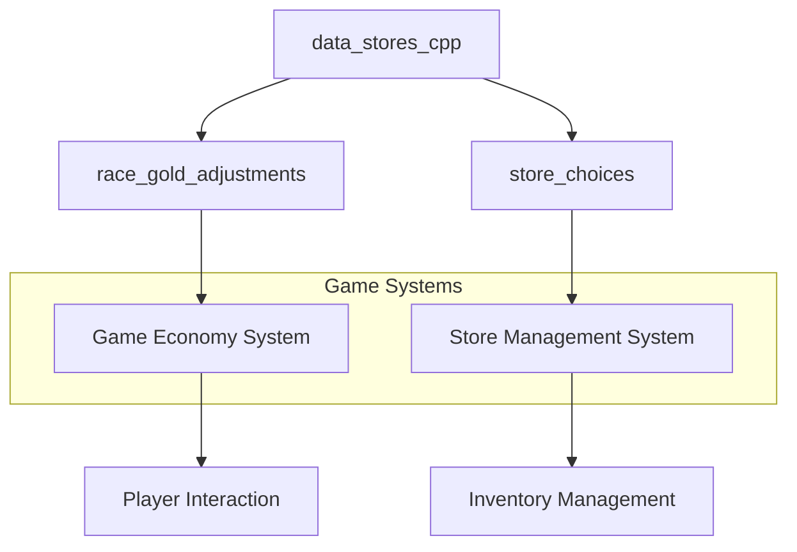
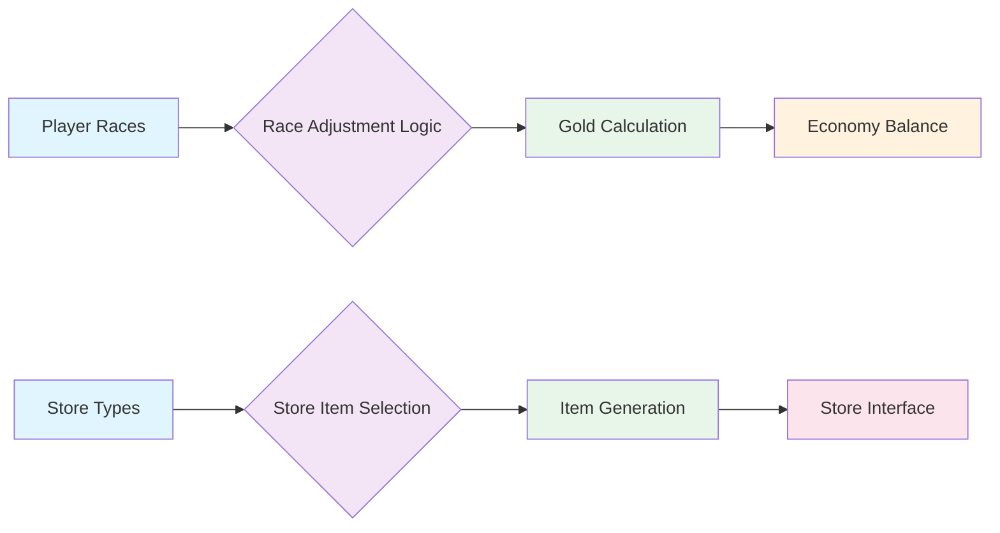

# data_stores_cpp Module Documentation

## Brief Introduction

The `data_stores_cpp` module contains essential data structures and constants used for managing game store configurations and race-based gold adjustments. This module provides the foundational data needed for game economy systems, particularly around store inventory management and racial modifiers that affect gameplay balance.

## Detailed Documentation

This module defines two primary data structures that serve different purposes in the game's economic and store systems:

### Race Gold Adjustments

The `race_gold_adjustments` array defines how gold values are modified based on player race interactions. This 2D array uses a matrix approach where each row represents a source race and each column represents a target race, with values indicating percentage adjustments to gold amounts.

### Store Choices Configuration

The `store_choices` array defines the item selection patterns for different stores in the game world. Each store has its own configuration specifying which items should appear in various slots, creating distinct shopping experiences across different vendors.

## Architecture and Component Relationships

## Data Flow and Usage Patterns

## Integration Points

This module serves as a data provider for several core systems:

- **Economy System**: Uses `race_gold_adjustments` for calculating adjusted gold values during transactions
- **Store Management**: Provides `store_choices` for generating appropriate inventory for each store type
- **Player Character System**: May reference race data for character-specific modifications

## Dependencies

This module depends on:
- [headers.h](headers.h.md) - Contains necessary includes and definitions
- [player_system](player_system.md) - For race-related data structures
- [economy_system](economy_system.md) - For gold calculation logic

## Implementation Details

The data structures are defined as static arrays to ensure they remain constant throughout the application lifecycle. The arrays use fixed sizes to maintain memory efficiency and predictable access patterns.

### Race Gold Adjustments Format
- Dimensions: 8x8 (PLAYER_MAX_RACES × PLAYER_MAX_RACES)
- Values represent percentage multipliers (100 = 100%, 115 = 115%)
- Used primarily for balancing trade interactions between different races

### Store Choices Format
- Dimensions: MAX_STORES × STORE_MAX_ITEM_TYPES
- Each entry represents an item ID that should be displayed at that position
- Allows for varied store inventories while maintaining consistent structure

## Performance Considerations

Since these are static arrays with fixed sizes, memory allocation occurs at compile time. Access patterns are O(1) for both data structures, making them highly efficient for frequent lookups during gameplay operations.

## Future Extensibility

The current implementation uses fixed-size arrays that could be extended to support dynamic loading of store configurations or race adjustment tables from external data files, allowing for easier content updates without recompilation.
